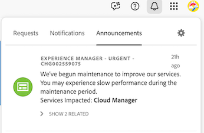
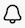
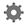

# Experience Cloud通知の概要

Adobe Workfrontの通知は、Adobeの一元化された通知システムであるExperience Cloud Notificationsに移行します。 この通知システムは、あらゆるデジタルエクスペリエンス製品で利用されています。

2026年2月頃から、現在のWorkfrontのメールとアプリ内通知がExperience Cloud Notificationsに移行されます。 この仕事は段階的に終わるでしょう。 移行を開始する前に、Workfront チームから組織に通知されます。

この移行後、ユーザーはAdobe Workfrontやその他のAdobe DX アプリケーションのすべての通知に1か所でアクセスできるため、情報を入手し、設定を管理する方法を簡素化できます。

## アドビがこの変更を行う理由

Workfrontは、Adobeのデジタルエクスペリエンス製品群の一部です。 Experience Cloudへの移行には、次のような利点があります。

* 統合された通知エクスペリエンス：Adobe DX ソリューション全体で機能するインターフェイスをひとつ体験できるようになりました。
* 常に情報を提供する：通知を一ヶ所に集約することで、通知が届かないリスクを低減します。
* 整理されたインターフェイス：1つの通知アイコンがあれば、混乱が軽減され、通知セクション間を行き来する必要がなくなります。
* 将来に備えた基盤：これにより、Adobeのツール全体で、現在および将来のイノベーションの両方を考慮できるようになります。

## 現状

* 上部ヘッダーのWorkfront通知アイコンが、通知アイコンに置き換わりました。
* 新しいExperience Cloudのお知らせパネルとすべての通知ページから、お客様の個人用のお知らせ設定にアクセスできるようになりました。 以前は、これらはユーザープロファイルでアクセスされていました。
* 新しいフィルタリングおよび配信オプションが利用可能です。
* メール通知の件名のカスタマイズは使用できなくなります。

## 現状を把握できます

* 移行の最初の段階ではアプリ内通知が届き、後でメール通知が届きます。

* Workfrontでは、引き続き作業項目に基づいて通知をトリガーします。

* Workfrontのデータと権限は変更されません。

## Experience Cloudでの新しい通知の表示

1. Workfrontの右上隅にある&#x200B;**通知** アイコン をクリックします。

1. 開いた&#x200B;**Experience Cloud Notifications** パネルで、**Notifications**&#x200B;を選択します。 通知のリストが表示され、最新の通知がリストの上部に表示されます。

1. 通知をクリックして&#x200B;*読み取り*&#x200B;としてマークし、最近の通知リストから削除します。

1. （オプション）すべての通知を既読としてマークするには、パネルの下部にある「**すべてを既読としてマーク**」をクリックします。

1. （オプション）アカウントのすべての通知を表示するには、パネルの下部にある「**すべて表示**」をクリックし、**すべての通知** ページを開きます。

1. パネルの外側をクリックして閉じます。

## Workfrontのお知らせ設定の編集

>[!NOTE]
>
>個人通知の設定にアクセスできない場合は、管理者にお問い合わせください。

1. Workfrontの右上隅にある&#x200B;**通知** アイコン をクリックします。

1. **Experience Cloud** パネルの右上隅にある&#x200B;**Settings** アイコン をクリックします。

1. **通知** セクションで、**Workfront** タイルの矢印アイコン をクリックします。

1. **次のカテゴリについて通知する** セクションで、**メンション**&#x200B;と&#x200B;**リクエスト**&#x200B;の両方について受信する通知のタイプを選択します。
   * **メンション**：誰かがコメントであなたにタグ付けしたときに通知を受け取ります。
   * **要求**: オブジェクトの承認またはアクセス権の付与の要求が送信されたときに通知を受け取ります。

1. （オプション）特定のタイプの通知の受信を停止するには、現在選択されているタイプごとにボックスの選択を解除します。 変更内容は自動的に保存されます。

## よくある質問

+++既存の通知は失われますか？

いいえ。 過去の通知はWorkfrontで引き続きアクセスできますが、移行が完了すると、新しい通知がExperience Cloud経由で送信されます。
+++

+++ ユーザーは何かする必要がありますか？

最初はそうではありません。 Workfront管理者はまず設定を確認し、Experience Cloudへの移行後に新しい通知アイコンが表示されます。 そこから、個人の通知にアクセスする方法を学ぶ必要があります。
+++

+++Experience Cloudに移行する準備が整っていない場合は？

移行のスケジュールを変更する必要がある場合は、アカウントチームまたはカスタマーサポートにお問い合わせください。 ただし、すべてのお客様は新しい通知エクスペリエンスに移行する必要があるため、より早い導入をお勧めします。
+++

+++これはWorkfrontの統合または自動処理に影響しますか？

いいえ。 既存のすべての統合と自動化は、引き続き通常どおりに機能します。
+++
