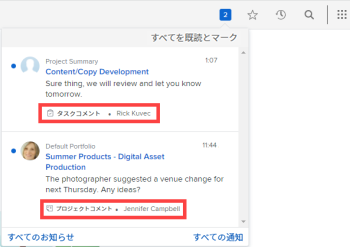

# アプリ内通知の概要

この記事では、受信できるアプリ内通知の一覧を示します。 アプリ内通知では、次の 2 種類の情報が常にわかります。お知らせ通知と作業項目の通知。 これらは、Web アプリケーションとモバイルアプリケーションの両方から使用できます。

これらの通知を表示および管理する方法については、 [アプリ内通知の表示と管理](../../workfront-basics/using-notifications/view-and-manage-in-app-notifications.md).

* [[!UICONTROL お知らせ] 通知](#announcement-notifications)
* [[!UICONTROL 作業項目] 通知](#work-item-notifications)

## [!UICONTROL お知らせ] 通知

お知らせは、次の 2 つの方法のいずれかで提供されます。

* [!DNL Workfront] が [!UICONTROL お知らせ] 組織のページ [!DNL Workfront] 管理者
* A [!DNL Workfront] 管理者が [!UICONTROL お知らせ] ページ

どちらの場合も、管理者またはユーザーが番号付きアイコンをクリックしたとき  右上隅に [!DNL Workfront] 通知のリストを開くには、メッセージの件名行にメガフォンのアイコンが表示されます  「[!UICONTROL お知らせ].&quot;

![[!UICONTROL お知らせ] 通知](assets/notification-list-announcement-350x271.png)

詳しくは、 [!UICONTROL お知らせ] ページ： [アプリ内通知の表示と管理](../../workfront-basics/using-notifications/view-and-manage-in-app-notifications.md).

## [!UICONTROL 作業項目] 通知

番号付きアイコンをクリックしたとき  右上隅に [!DNL Workfront] 通知のリストを開くには、作業項目メッセージの件名行に、何に関するかを示すアイコンと簡単な説明が表示されます。 アイコンと説明のタイプを次に示します。

>[!NOTE]
>
>作業アクティビティのアプリ内通知は、 [!DNL Workfront]. 詳しくは、 [[!DNL Adobe Workfront] 通知](../../workfront-basics/using-notifications/wf-notifications.md).

* [[!UICONTROL 承認]](#approvals)
* [[!UICONTROL リクエスト]](#requests)
* [[!UICONTROL 割り当て]](#assignments)
* [[!UICONTROL コメント]](#comments)
* [[!UICONTROL 更新]](#updates)
* [[!UICONTROL 日付変更]](#date-changes)
* [[!UICONTROL 共有]](#share)
* [[!UICONTROL その他]](#other)

### [!UICONTROL 承認]

*  [!UICONTROL プロジェクトに承認が必要です] - [送信者の名前]
*  [!UICONTROL タスクに承認が必要です] - [送信者の名前]
*  [!UICONTROL 問題には承認が必要です] - [送信者の名前]
*  [!UICONTROL ドキュメントには承認が必要です] - [送信者の名前]
*  [!UICONTROL 配達確認には承認が必要です] - [送信者の名前]
*  [!UICONTROL タイムシートに承認が必要です] - [送信者の名前]

   <!--
  <li data-mc-conditions="QuicksilverOrClassic.Draft mode,QuicksilverOrClassic.Quicksilver">  You need to approve a portfolio</li>
  -->

* [オブジェクト名] [!UICONTROL は、アクセスの承認を必要とします] - [送信者の名前]

   オブジェクトは、   プロジェクト  タスク  問題   ドキュメント、レポート、ダッシュボード、  ポートフォリオ  プログラム、またはカレンダー。

*  [!UICONTROL タイムシートが承認されました] - [承認者の名前]
*  [!UICONTROL タイムシートが却下されました] - [承認者の名前]
*  [!UICONTROL タイムシートが再開されました] - [開封者の名前]
*  [!UICONTROL タイムシートコメント] - [コメンターの名前]
*  [!UICONTROL ドキュメントの承認が完了しました] - [送信者の名前]
*  [!UICONTROL 承認されたドキュメント] - [送信者の名前]
*  [!UICONTROL 変更を含む承認済みドキュメント] - [送信者の名前]
*  [!UICONTROL 却下されたドキュメント] - [送信者の名前]
*  [!UICONTROL ドキュメントの承認リクエストがキャンセルされました] - [送信者の名前]

### [!UICONTROL リクエスト]

*  [ユーザーアイコン] [!UICONTROL ドキュメントをアップロードするように求められました] - [請求者の名前]
*  [!UICONTROL ドキュメントのアップロード要求が満たされました] - [フルフィラー名]
*  [!UICONTROL コメントをリクエスト]  — 送信者名
*  [!UICONTROL ドキュメントのアップロード要求がキャンセルされました] - [送信者の名前]
* [オブジェクト名] [!UICONTROL リクエストされたアクセス] - [送信者の名前]

   オブジェクトは、   プロジェクト  タスク  問題   ドキュメント、レポート、ダッシュボード、  ポートフォリオ  プログラム、またはカレンダー。

### [!UICONTROL 割り当て]

*  [!UICONTROL 自分に割り当てられたタスク] - [譲渡人名]
*  [!UICONTROL 自分に割り当てられた問題] - [譲渡人名]
*  [!UICONTROL 割り当てられた問題] [チーム名] - [譲渡人名]
*  [!UICONTROL タスクの割り当て先] [チーム名] - [譲渡人名]

   * 割り当て通知は、プロジェクトのステータスが「 [!UICONTROL 現在] ( または、 [!UICONTROL 現在 )].
   * リクエスターとレビュー担当者が作業を割り当てられることを意図していません。 したがって、タスクやタスクに割り当てられた場合は通知されません。
   * 自分自身または所属するチームに作業を割り当てた場合、通知は受け取りません。

### [!UICONTROL コメント]

*  [オブジェクト名] [!UICONTROL コメント] - [コメンターの名前]

   オブジェクトは、   プロジェクト  タスク  問題   ドキュメント、レポート、ダッシュボード、  ポートフォリオ  プログラム、またはカレンダー。

* [オブジェクト名] [!UICONTROL 更新] - [更新者の名前]

   オブジェクトは、   プロジェクト  タスク  問題   ドキュメント、レポート、ダッシュボード、  ポートフォリオ  プログラム、またはカレンダー。

* [オブジェクト名] [!UICONTROL 更新] - [更新者の名前]

   オブジェクトは、   プロジェクト  タスク  問題   ドキュメント、レポート、ダッシュボード、  ポートフォリオ  プログラム、またはカレンダー。

*  [!UICONTROL コメントを「いいね！」しました] - [リカー名]
*  [!UICONTROL タイムシートコメント] - [コメンターの名前]
* [!UICONTROL コメント] - [コメンターの名前]
*  [!UICONTROL コメント]  — コメント名
*  [!UICONTROL タイムシートコメント]  — コメント名

### [!UICONTROL 更新]

*  [!UICONTROL コメントでタグ付け] - [タガーの名前]
*  [!UICONTROL チームにコメントでタグ付け] - [タガーの名前]
*  [!UICONTROL チームにコメントでタグ付け] - [タガーの名前]

### [!UICONTROL 日付変更]

*  [!UICONTROL 問題の期限が変更されました] - [両替商の名前]
*  [!UICONTROL タスクの期限が変更されました] - [両替商の名前]
*  [!UICONTROL 発行コミット日が変更されました] - [両替商の名前]
*  [!UICONTROL タスクのコミット日が変更されました] - [両替商の名前]

### [!UICONTROL 共有]

*  [!UICONTROL 自分と共有されたドキュメント] - [共有者の名前]
*  [!UICONTROL ドキュメントの共有先] [チーム名] - [共有者の名前]
*  [!UICONTROL 自分と共有された配達確認] - [共有者の名前]

### [!UICONTROL その他]

*  [!UICONTROL 注意が必要なエラー]
*  [!UICONTROL お知らせ] - [Workfront管理者名]
