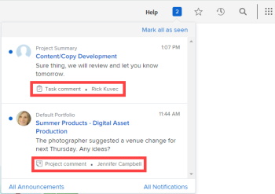

# アプリ内通知の概要

この記事では、受信できるアプリ内通知の一覧を記載します。 アプリ内通知では、お知らせ通知と作業アイテム通知の 2 種類の情報について常に知らせます。 Web アプリケーションとモバイルアプリケーションの両方から使用できます。

これらの通知を表示および管理する方法について詳しくは、[アプリ内通知の表示と管理](../../workfront-basics/using-notifications/view-and-manage-in-app-notifications.md)を参照してください。

* [[!UICONTROL お知らせ]通知](#announcement-notifications)
* [[!UICONTROL 作業アイテム]の通知](#work-item-notifications)

## [!UICONTROL お知らせ]通知

お知らせは、次の 2 つの方法のいずれかで提供されます。

* [!DNL Workfront] は組織の [!DNL Workfront] 管理者の[!UICONTROL お知らせ]ページにメッセージを送信します。
* [!DNL Workfront] 管理者は、[!UICONTROL お知らせ]ページからユーザーにメッセージを送信します

いずれの場合も、管理者またはユーザーが[!DNL Workfront]の右上隅にある番号付きアイコン をクリックして通知リストを開くと、メッセージの件名にメガホンアイコン と「[!UICONTROL 通知]」という単語が表示されます。

![[!UICONTROL お知らせ]通知](assets/notification-list-announcement-350x271.png)

[!UICONTROL お知らせ]ページについて詳しくは、[アプリ内通知の表示と管理](../../workfront-basics/using-notifications/view-and-manage-in-app-notifications.md)を参照してください。

## [!UICONTROL 作業アイテム]通知

[!DNL Workfront]の右上隅にある番号付きアイコン をクリックして通知リストを開くと、作業項目メッセージの件名にアイコンと簡単な説明が表示され、何に関する情報を識別できます。 アイコンと説明のタイプを次に示します。

>[!NOTE]
>
>作業アクティビティのアプリ内通知は、[!DNL Workfront] ではメール通知とのつながりはありません。 詳しくは、[[!DNL Adobe Workfront] 通知](../../workfront-basics/using-notifications/wf-notifications.md)を参照してください。

* [[!UICONTROL 承認]](#approvals)
* [[!UICONTROL リクエスト]](#requests)
* [[!UICONTROL 割り当て]](#assignments)
* [[!UICONTROL コメント]](#comments)
* [[!UICONTROL アップデート]](#updates)
* [[!UICONTROL 日付変更]](#date-changes)
* [[!UICONTROL 共有]](#share)
* [[!UICONTROL その他]](#other)

### [!UICONTROL 承認]

*  [!UICONTROL &#x200B; プロジェクトには承認が必要] - [送信者の名前]
*  [!UICONTROL &#x200B; タスクには承認が必要です] - [送信者の名前]
*  [!UICONTROL 問題には承認が必要] - [送信者の名前]
*  [!UICONTROL 文書には承認が必要] - [送信者の名前]が必要です
*  [!UICONTROL &#x200B; プルーフには承認が必要] - [送信者の名前]
*  [!UICONTROL &#x200B; タイムシートには承認が必要] - [送信者の名前]

  <!--
  <li data-mc-conditions="QuicksilverOrClassic.Draft mode,QuicksilverOrClassic.Quicksilver">  You need to approve a portfolio</li>
  -->

* [オブジェクト名] [!UICONTROL &#x200B; にアクセスの承認が必要です] - [送信者の名前]

  オブジェクトには、 プロジェクト、 タスク、問題、 ドキュメント、レポート、ダッシュボード、 ポートフォリオ、 プログラム、またはカレンダーを指定できます。

*  [!UICONTROL &#x200B; タイムシート承認済み] - [承認者の名前]
*  [!UICONTROL &#x200B; タイムシートが拒否されました] - [承認者の名前]
*  [!UICONTROL &#x200B; タイムシートが再開されました] - [開封者の名前]
*  [!UICONTROL &#x200B; タイムシートコメント &#x200B;] - [ コメンターの名前]
*  [!UICONTROL 文書の承認完了] - [送信者の名前]
*  [!UICONTROL 文書が承認] - [送信者の名前]
*  [!UICONTROL 変更を伴って承認されたドキュメント &#x200B;] - [送信者の名前]
*  [!UICONTROL 文書が拒否されました] - [送信者の名前]
*  [!UICONTROL 文書の承認要求がキャンセルされました] - [送信者の名前]

### [!UICONTROL リクエスト]

*  [ ユーザーアイコン ] [!UICONTROL &#x200B; ドキュメントのアップロードを依頼] - [依頼者の名前]
*  [!UICONTROL &#x200B; ドキュメントのアップロード要求が完了しました] - [fulfillerの名前]
*  [!UICONTROL &#x200B; コメントを依頼] – 送信者名
*  [!UICONTROL 文書のアップロード要求がキャンセルされました] - [送信者の名前]
* [オブジェクト名] [!UICONTROL &#x200B; のアクセスが要求されました] - [送信者の名前]

  オブジェクトには、 プロジェクト、 タスク、問題、 ドキュメント、レポート、ダッシュボード、 ポートフォリオ、 プログラム、またはカレンダーを指定できます。

### [!UICONTROL 割り当て]

*  [!UICONTROL 自分に割り当てられたタスク &#x200B;] - [担当者の名前]
*  [!UICONTROL 問題が割り当てられました] - [担当者の名前]
*  [!UICONTROL 問題が]に割り当てられました[ チーム名] - [担当者の名前]
*  [!UICONTROL 自分に割り当てられたタスク &#x200B;] [ チーム名] - [割り当て者の名前]

   * 割り当て通知は、プロジェクトのステータスが[!UICONTROL 現在] （または[!UICONTROL 現在]と同等のカスタムステータス）に設定されている場合にのみ送信されます。
   * 依頼者とレビュアーに作業が割り当てられることを目的としたものではありません。 したがって、タスクやタスクに割り当てられた場合は通知されません。
   * 自分自身または所属するチームに作業を割り当てた場合、通知は受け取りません。

### [!UICONTROL コメント]

*  [ オブジェクト名] [!UICONTROL &#x200B; コメント &#x200B;] - [ コメント担当者の名前]

  オブジェクトには、 プロジェクト、 タスク、問題、 ドキュメント、レポート、ダッシュボード、 ポートフォリオ、 プログラム、またはカレンダーを指定できます。

* [オブジェクト名]／[!UICONTROL アップデート] - [アップデート実行者の名前]

  オブジェクトには、 プロジェクト、 タスク、問題、 ドキュメント、レポート、ダッシュボード、 ポートフォリオ、 プログラム、またはカレンダーを指定できます。

* [オブジェクト名]／[!UICONTROL アップデート] - [アップデート実行者の名前]

  オブジェクトには、 プロジェクト、 タスク、問題、 ドキュメント、レポート、ダッシュボード、 ポートフォリオ、 プログラム、またはカレンダーを指定できます。

*  [!UICONTROL あなたのコメントが気に入りました] - [ リッカーの名前]
*  [!UICONTROL &#x200B; タイムシートコメント &#x200B;] - [ コメンターの名前]
* [!UICONTROL コメント] - [コメントした人の名前]
*  [!UICONTROL &#x200B; コメント &#x200B;] - コメンター名
*  [!UICONTROL &#x200B; タイムシートコメント &#x200B;] - コメンター名

### [!UICONTROL アップデート]

*  [!UICONTROL &#x200B; コメントであなたにタグ付け] - [ タグ付け者の名前]
*  [!UICONTROL &#x200B; コメントでチームにタグ付け] - [ タグ付け担当者の名前]
*  [!UICONTROL &#x200B; コメントでチームにタグ付け] - [ タグ付け担当者の名前]

### [!UICONTROL 日付変更]

*  [!UICONTROL 問題の期日が変更されました] - [変更者の名前]
*  [!UICONTROL 期限が変更されました] - [変更者の名前]
*  [!UICONTROL 問題のコミット日が変更されました] - [変更者の名前]
*  [!UICONTROL &#x200B; タスクのコミット日が変更されました] - [変更者の名前]

### [!UICONTROL 共有]

*  [!UICONTROL 共有されたドキュメント &#x200B;] - [共有者の名前]
*  [!UICONTROL &#x200B; ドキュメントが]と共有されました[ チーム名] - [共有者の名前]
*  [!UICONTROL &#x200B; プルーフがあなたと共有] - [共有者の名前]

### [!UICONTROL その他]

*  [!UICONTROL &#x200B; エラーには注意が必要です]
*  [!UICONTROL お知らせ] - [Workfront管理者の名前]
