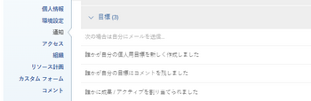

# 通知：目標

イベントに関する電子メール通知を [!DNL Adobe Workfront Goals] 」と入力します。 ユーザーが [!UICONTROL プラン] ライセンスを使用して、他のユーザーに対して有効にすることもできます。 詳しくは、 [[!DNL Adobe Workfront] 通知](../../workfront-basics/using-notifications/wf-notifications.md).

## アクセス要件

<!--

(NOTE: because there are conditions for who sees this, I added this from the How To articles/ template although this is not a How To. But I like the format, so I thought keeping it consistent might help users. We may decide to update this when we have access and prereq for overview-type articles)

-->

以下が必要です。

<table style="table-layout:auto"> 
 <col> 
 <col> 
 <tbody> 
  <tr> 
   <td role="rowheader"><strong>[!DNL Adobe Workfront plan*]</strong></td> 
   <td> 
[!UICONTROL Pro] 以降
 </td> 
  </tr> 
  <tr> 
   <td role="rowheader"><strong>[!DNL Adobe Workfront] ライセンス*</strong></td> 
   <td> 
[!UICONTROL リクエスト ] 以降
 </td> 
  </tr> 
  <tr> 
   <td role="rowheader"><strong>製品</strong></td> 
   <td>[!DNL Workfront Goals] 
詳しくは、 [!DNL Workfront Goals]を参照してください。 <a href="../../workfront-goals/goal-management/wf-goals-overview.md" class="MCXref xref">[!DNL Adobe Workfront Goals] 概要</a>.
 </td> 
  </tr> 
  <tr> 
   <td role="rowheader"><strong>アクセスレベル設定*</strong></td> 
   <td> 
[!UICONTROL 表示 ] での [!DNL Goals] またはそれ以降
 
注意：まだアクセス権がない場合は、 [!DNL Workfront] 管理者（アクセスレベルに追加の制限を設定している場合） を参照してください。 [!DNL Workfront] 管理者がアクセスレベルを変更できる場合は、 <a href="../../administration-and-setup/add-users/configure-and-grant-access/create-modify-access-levels.md" class="MCXref xref">カスタムアクセスレベルの作成または変更</a>.
 </td> 
  </tr> <!--
   <tr data-mc-conditions="QuicksilverOrClassic.Draft mode"> 
    <td role="rowheader">Object permissions</td> 
    <td> 
[Insert permissions needed]
 
For information on requesting additional access, see <a href="../../workfront-basics/grant-and-request-access-to-objects/request-access.md" class="MCXref xref">Request access to objects </a>.
 </td> 
   </tr>
  --> 
 </tbody> 
</table>

&#42;ご利用のプラン、ライセンスの種類、アクセス権を確認するには、 [!DNL Workfront] 管理者。

## 前提条件

次の場合に [!DNL Goals] 通知は、更新される際に、次の条件を満たす必要があります。

* 以下を含むレイアウトテンプレート： [!DNL Goals] 領域 [!UICONTROL メインメニュー].
* 新しい [!DNL Adobe Workfront] エクスペリエンス。

  <!--
  <MadCap:conditionalText data-mc-conditions="QuicksilverOrClassic.Draft mode">
  (NOTE: we need this here because you can see these notifications from Classic)
  </MadCap:conditionalText>
  -->

## [!DNL Goals] 通知 [!UICONTROL ユーザープロファイル] 領域

次の表に示す通知は、で発生しているイベントに関する警告です。 [!DNL Workfront Goals]例えば、目標、結果、アクティビティを割り当てている人や、所有する目標、結果、アクティビティを更新している人などです。 受信する通知の設定について詳しくは、 [独自の電子メール通知を変更する](../../workfront-basics/using-notifications/activate-or-deactivate-your-own-event-notifications.md).

>[!NOTE]
>
>次の即時通知： [!DNL Goals] は、デフォルトでは無効です。 毎日の通知を有効または無効にすることはできません。また、このカテゴリのイベントに関する日々のダイジェスト電子メールを受信することもできません。 以下に対する個々のインスタント通知を有効または無効にできます： [!DNL Goals] カテゴリ。

関連トピック [イベント通知](../../workfront-basics/using-notifications/event-notifications.md).

<table style="table-layout:auto"> 
 <col> 
 <col> 
 <tbody> 
  <tr> 
   <td><strong>通知</strong></td> 
   <td> 
<strong>含まれるフィールド</strong> 
 
<strong>*インスタント通知のみ</strong>
 </td> 
  </tr> 
  <tr> 
   <td><strong>誰かに成果 / アクティブを割り当てられました</strong></td> 
   <td> 
結果またはアクティビティを割り当てた人の名前
 
結果またはアクティビティの目標の期間
 
結果またはアクティビティの名前
 
The <strong>[!UICONTROL Web アプリで開く ]</strong> ボタンをクリックして [!UICONTROL 目標の詳細 ] パネルを開きます。
 
The <strong>[!UICONTROL 通知設定の変更 ]</strong> ボタンをクリックします。
 </td> 
  </tr> 
  <tr> 
   <td><strong>誰かが自分の個人用目標を新しく作成しました</strong> </td> 
   <td> 
目標を割り当てた人の名前
 
目標の期間
 
目標の名前
 
The <strong>[!UICONTROL Web アプリで開く ]</strong> ボタンをクリックして [!UICONTROL 目標の詳細 ] パネルを開きます。
 
The <strong>[!UICONTROL 通知設定の変更 ]</strong> ボタンをクリックします。
 </td> 
  </tr> 
  <tr> 
   <td><strong>誰かが自分の目標にコメントを残しました</strong></td> 
   <td> 
コメントを残した人の名前
 
目標の期間 
 
目標の名前
 
コメントのテキスト
 
The <strong>[!UICONTROL Web アプリで開く ]</strong> ボタンをクリックして [!UICONTROL 目標の詳細 ] パネルを開きます。
 
The <strong>[!UICONTROL 通知設定の変更 ]</strong> ボタンをクリックします。
 </td> 
  </tr> 
  <tr> 
   <td><strong>誰かが目標に関する自分のコメントを気に入りました</strong></td> 
   <td> 
コメントに「いいね！」した人の名前
 
目標の期間 
 
目標の名前
 
コメントのテキスト 
 
The <strong>[!UICONTROL Web アプリで開く ]</strong> ボタンをクリックして [!UICONTROL 目標の詳細 ] パネルを開きます。
 
The <strong>[!UICONTROL 通知設定の変更 ]</strong> ボタンをクリックします。
 </td> 
  </tr> 
  <tr> 
   <td><strong>誰かが自分の目標更新を評価しました</strong></td> 
   <td> 
目標に対して行ったコメントに誰かが気に入ったとき、または目標に関する結果やアクティビティの進行状況を更新したときに、電子メールが送信されます。 
 
更新を「いいね！」した人の名前
 
目標の期間 
 
目標の名前
 
The <strong>[!UICONTROL Web アプリで開く ]</strong> ボタンをクリックして [!UICONTROL 目標の詳細 ] パネルを開きます。
 
The <strong>[!UICONTROL 通知設定の変更 ]</strong> ボタンをクリックします。
 </td> 
  </tr> 
 </tbody> 
</table>

<!--
NOTE FOR NAME OF GOAL IN LAST TABLE CELL: check this. Is this true? Didn't triggger when this was written; add anything else? Maybe the type of the update is mentioned?!
-->
