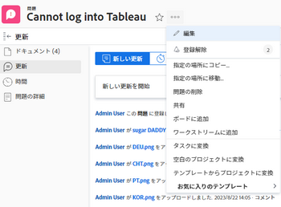
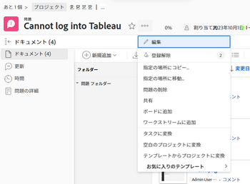
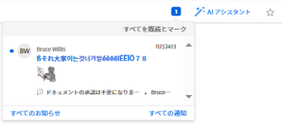
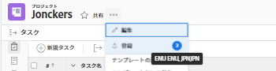

# の項目を購読 [!DNL Adobe Workfront]

[!UICONTROL Adobe Workfront] は、自分が割り当てられている項目または自分が所有している項目に関する通知を送信します。 自分に割り当てられていないが、作業に影響を与える可能性のあるアイテムについてのコミュニケーションをフォローする場合は、それらのアイテムを購読できます。

また、管理者や同業者は、自分が所有する項目の「ステータスを更新」に登録することで、自分の仕事を更新し続けることができます [!UICONTROL 管理] および [!UICONTROL 共有] 権限。

現在、次の項目を購読できます。

* 問題
* タスク
* プロジェクト

問題、タスクまたはプロジェクトを購読すると、誰かがコメントを投稿したときにアプリ内通知が届きます。 有効にした機能に応じて、購読した項目に関する電子メールおよびモバイルアプリのプッシュ通知を受け取る場合もあります。

>[!NOTE]
>
>購読したアイテムに関する他のイベントについては、通知を受け取りません。 誰かがその項目にコメントを投稿したときにのみ通知されます。

購読の操作について詳しくは、 [購読の操作について](#about-working-with-subscriptions).

## アクセス要件

この記事の手順を実行するには、次のアクセス権が必要です。

<table style="table-layout:auto"> 
 <col> 
 </col> 
 <col> 
 </col> 
 <tbody> 
  <tr> 
   <td role="rowheader"><strong>[!UICONTROL Adobe Workfront] プラン*</strong></td> 
   <td> 
任意
 </td> 
  </tr> 
  <tr> 
   <td role="rowheader"><strong>[!DNL Adobe Workfront] ライセンス*</strong></td> 
   <td> 
[!UICONTROL リクエスト ] 以降
 </td> 
  </tr> 
  <tr> 
   <td role="rowheader"><strong>アクセスレベル設定*</strong></td> 
   <td> 
次の場合、 [!DNL Workfront] 管理者が有効になっています <strong>[!UICONTROL 会話に含まれている更新のみを表示します ]</strong> アクセスレベルでは、 [!DNL Workfront].
 
注意：まだアクセス権がない場合は、[!UICONTROL Workfront] 管理者に、アクセスレベルに追加の制限が設定されているかどうかを問い合わせてください。 [!UICONTROL Workfront] 管理者がアクセスレベルを変更する方法について詳しくは、 <a href="../../administration-and-setup/add-users/configure-and-grant-access/create-modify-access-levels.md" class="MCXref xref">カスタムアクセスレベルの作成または変更</a>.
 </td> 
  </tr> 
  <tr> 
   <td role="rowheader"><strong>オブジェクトの権限</strong></td> 
   <td> 
[!UICONTROL 表示 ] プロジェクト、タスクまたは問題（購読）へのアクセス権以上
 
プロジェクト、タスクまたは問題に対する [!UICONTROL Manage] アクセス権と [!UICONTROL Share] 権限（他のユーザーを購読する場合）
 </td> 
  </tr> 
 </tbody> 
</table>

ご利用のプラン、ライセンスの種類、アクセス権を確認するには、 [!DNL Workfront] 管理者。

## 項目を購読

項目を購読するプロセスは、すべての項目で同じです。

例えば、問題を購読するには、次のようにします。

1. 購読する問題に移動します。

   >[!TIP]
   >
   >プロジェクトを購読するには、次のいずれかの操作を実行します。
   >
   >* 購読するプロジェクトに移動し、 **[!UICONTROL その他]** アイコン  をプロジェクト名の右側に追加し、 **[!UICONTROL 購読]**.
   >* プロジェクトリストまたはレポートに移動して、プロジェクトを選択し、 **[!UICONTROL その他]** アイコン  リストの上部で、「 **[!UICONTROL 購読]**. これは、プロジェクトのリストでのみ使用できます。

1. クリック **[!UICONTROL その他]** を選択し、次に **[!UICONTROL 購読]**.

   

   ベルにチェックマークが表示され、その横の番号が更新され、購読したユーザーの数に追加されます。

   問題を購読しました。 イシューを購読したイシューのステータスを更新します。

   誰かが問題に対してコメントをするたびに、アプリ内通知が届きます。 有効にした機能に応じて、電子メール通知やモバイルアプリのプッシュ通知を受け取る場合もあります。

   購読電子メールについて詳しくは、 [独自の電子メール通知を変更する](../../workfront-basics/using-notifications/activate-or-deactivate-your-own-event-notifications.md).

## 項目の購読解除

次のアイテムの購読を簡単に解除できます： [!DNL Workfront]. 次の項目の購読を解除するプロセス： [!DNL Workfront] は、すべての項目で同一です。

例えば、問題を購読解除するには、次のようにします。

1. 配信停止にする問題に移動します。

   >[!TIP]
   >
   >プロジェクトを購読解除するには、次のいずれかの操作を実行します。
   >
   >* 購読解除元のプロジェクトに移動し、 **[!UICONTROL その他]** アイコン  をプロジェクト名の右側に追加し、 **[!UICONTROL 配信停止]**.
   >* プロジェクトリストまたはレポートに移動して、プロジェクトを選択し、 **[!UICONTROL その他]** アイコン  リストの上部で、「 **[!UICONTROL 配信停止]**. これは、プロジェクトのリストでのみ使用できます。

1. クリック **[!UICONTROL その他]** を選択し、次に **[!UICONTROL 配信停止]**.

   

1. 購読している項目を購読解除するには、 [!UICONTROL 配信停止] 購読メール内のリンク。

   項目の購読を解除すると、その問題に対してコメントをする際に通知が届かなくなります。

   問題の購読を解除した項目レコードの「ステータスを更新」。

## 購読者の管理

管理および共有権限を持つプロジェクト、タスクおよび問題に対する購読者を管理できます。

* [別のユーザーを項目に購読登録する](#subscribe-another-user-to-an-item)
* [別の人物をアイテムから購読解除する](#unsubscribe-another-person-from-an-item)

すべての購読者に割り当てられます [!UICONTROL 表示] 購読項目に対する権限。 新しい購読者が既にその項目に対する権限を持っている場合、その権限はそのまま維持されます。

### 別のユーザーを項目に購読登録する

1. 別のユーザーを購読する項目に移動します。

   >[!TIP]
   >
   >別のユーザーをプロジェクトに購読登録するには、次のいずれかの操作を実行します。
   >
   >* 他のユーザーを購読登録するプロジェクトに移動します。または
   >   
   >* プロジェクトリストまたはレポートに移動し、プロジェクトを選択します。

1. クリック **[!UICONTROL その他]** .
1. 横の数値の吹き出しをクリックします。 **[!UICONTROL 購読]** リンク。
1. 表示されるボックスに、ユーザーの名前を **[!UICONTROL 他のユーザーを購読]** 」ボックスを選択し、表示されたオプションからユーザーを選択します。

1. （オプション）購読者をさらに追加するには、手順 4 を繰り返します。
1. 「**[!UICONTROL 保存]**」をクリックします。

購読者には購読の通知は送信されませんが、購読に関するエントリがその項目のシステム更新に追加されます。

が [!UICONTROL 更新] 項目の「 」タブで、購読者がアプリ内通知を受け取ります。 Workfront管理者が有効にした機能に応じて、購読者は、その項目に関する電子メールおよびモバイル通知を受け取る場合もあります。

### 別の人物をアイテムから購読解除する

1. 別のユーザーの購読を解除する項目に移動します。

   >[!TIP]
   >
   >別のユーザーのプロジェクトを購読解除するには、次のいずれかの操作を実行します。
   >
   >* 他のユーザーの購読を解除するプロジェクトに移動します。または
   >   
   >* プロジェクトリストまたはレポートに移動し、プロジェクトを選択します。

1. クリック **[!UICONTROL その他]** .
1. 横の数値の吹き出しをクリックします。 **[!UICONTROL 購読]** または **[!UICONTROL 配信停止]** リンク。
1. 次の日： **[!UICONTROL 購読者]** 表示されるページで、購読解除するユーザーの名前の横にある「X」をクリックします。

   または

   ユーザーの名前を **[!UICONTROL リスト内の担当者を検索]** 」ボックスに移動し、ユーザー名の右にある「X」をクリックします。

1. 「**[!UICONTROL 保存]**」をクリックします。

   ユーザーは、そのアイテムの購読解除を通知されませんが、購読に関するエントリがそのアイテムのシステム更新に追加されます。

## アプリ内通知の受信

購読している項目に対するコメントを投稿した直後に、アプリ内通知が届きます。

詳しくは、 [アプリ内通知の表示と管理](../../workfront-basics/using-notifications/view-and-manage-in-app-notifications.md).

## 購読メールを受信

機能に応じて、 [!UICONTROL Workfront] 管理者が有効にしている場合、購読した項目に対して誰かがコメントをするたびに、アプリ内通知に加えて購読メールを受け取ることができます。

電子メールの設定または無効化について詳しくは、 [システムの全員に対するイベント通知を設定する](../../administration-and-setup/manage-workfront/emails/configure-event-notifications-for-everyone-in-the-system.md).

>[!NOTE]
>
>購読メールをオフにしても、購読した項目に対して誰かがコメントをするたびに、アプリ内通知が引き続き届きます。

## 項目を購読しているユーザーのリスト

項目の購読者を確認するには、次の手順に従います。

1. 購読者を表示する項目に移動します。

   項目に購読者がいる場合は、購読者の数がベルの横に表示されます。 この数にマウスポインターを置くと、その項目を購読しているユーザーのリストが表示されます。 最初の 25 人の購読者がアルファベット順に表示されます。

   

   また、購読者のリストを表示するには、 [!UICONTROL 購読者] フィールドに、購読項目のレポートまたは表示の列を入力します。 詳しくは、 [用語集 [!DNL Adobe Workfront] 用語](../../workfront-basics/navigate-workfront/workfront-navigation/workfront-terminology-glossary.md).

## 購読の操作について

サブスクリプションを扱う際は、次の点に注意してください。

* The [!DNL Workfront] 管理者は、ユーザーが購読できるか、登録できないかを制御できません。

  次を持つすべてのユーザー [!UICONTROL 表示] 任意のタスク、イシューまたはプロジェクトに対する権限を持つユーザーは、それらを購読できます。

* 購読は、日別のダイジェスト電子メールに対して設定できません。
* タスク、イシュー、またはプロジェクトを購読し、担当者、プライマリ連絡先、またはプロジェクト所有者でもある場合は、購読した項目に対して誰かがコメントを入れたときに、購読メールのみが届きます。

  項目の 1 つにコメントを付けたときにトリガーが送信される電子メール通知の詳細については、 [Adobe Workfront通知](../../workfront-basics/using-notifications/wf-notifications.md).

* 項目を購読してコメントを作成した場合、そのコメントに自分の名前を含めない限り、そのコメントに関する購読メールは送信されません。
* 項目に対してコメントを行うユーザーがコメントをロックしてコメントを非公開にし、そのユーザーと同じ会社に属していない場合、そのコメントに関する通知は受け取りません。 コメントを非公開にする方法について詳しくは、 [作業項目に更新を追加する](../../workfront-basics/updating-work-items-and-viewing-updates/update-work.md#add) のセクション [作業を更新](../../workfront-basics/updating-work-items-and-viewing-updates/update-work.md).

* 配信登録用のレポートを作成することはできません。 監査は、項目を購読または購読解除したときに、その項目ごとに「ステータスを更新」に記録されます。
* 子オブジェクトに対して行われたコメントでは、親オブジェクトのトリガー登録通知は送信されません。 プロジェクトを購読する場合、そのプロジェクトに対するコメントの通知のみを受け取ります。 各子を購読しない限り、プロジェクトに関連付けられた子項目（タスクやイシュー）に対するコメントの通知は受け取りません。 オブジェクトの関係の詳細については、 [オブジェクトの相互依存性と階層](../../workfront-basics/navigate-workfront/workfront-navigation/understand-objects.md#understanding-interdependency-and-hierarchy-of-objects) のセクション [でのオブジェクトについて [!DNL Adobe Workfront]](../../workfront-basics/navigate-workfront/workfront-navigation/understand-objects.md).
