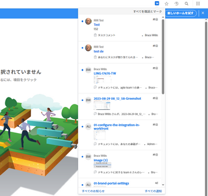
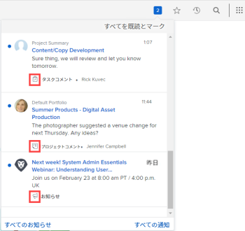
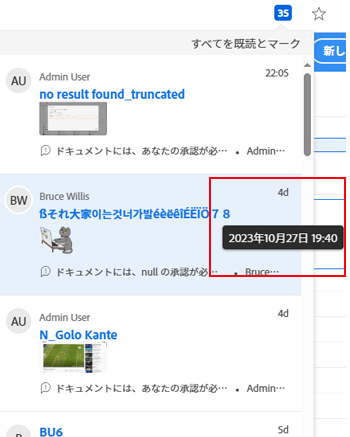
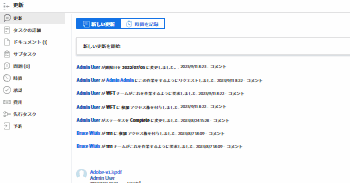
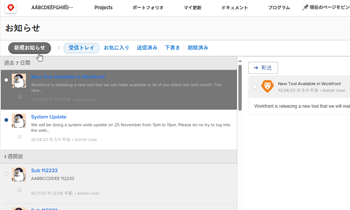
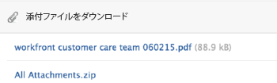

# アプリ内通知の表示と管理

アプリ内通知では、次の 2 種類の情報が常にわかります。お知らせ通知と作業項目の通知。 これらは、Web アプリケーションとモバイルアプリケーションの両方から使用できます。

受け取る作業項目とお知らせの通知のリストについては、 [アプリ内通知の概要](../../workfront-basics/using-notifications/in-app-notifications-overview.md).

>[!NOTE]
>
>* 作業アクティビティのアプリ内通知は、 [!DNL Workfront]. 詳しくは、 [[!DNL Adobe Workfront] 通知](../../workfront-basics/using-notifications/wf-notifications.md)
>* アプリ内通知はカスタマイズできません。
>

## アクセス要件

この記事の手順を実行するには、次のアクセス権が必要です。

<table style="table-layout:auto"> 
 <col> 
 </col> 
 <col> 
 </col> 
 <tbody> 
  <tr> 
   <td role="rowheader"><strong>[!DNL Adobe Workfront] 計画*</strong></td> 
   <td> 
任意
 </td> 
  </tr> 
  <tr> 
   <td role="rowheader"><strong>[!DNL Adobe Workfront] ライセンス*</strong></td> 
   <td> 
[!UICONTROL リクエスト ] 以降
 </td> 
  </tr> 
 </tbody> 
</table>

保有するプランやライセンスの種類を確認するには、 [!DNL Workfront] 管理者。

## 通知を表示

の右上隅にある番号付きアイコン [!DNL Workfront] は、まだ確認していない通知の数を表示します。

>[!NOTE]
>
>Web アプリケーションとモバイルアプリケーションの両方から、すべてのアプリ内通知を表示できます。 これらの通知の一部のみが、モバイルアプリケーションでプッシュ通知として送信されます。 モバイルアプリでの通知について詳しくは、 [[!DNL Adobe Workfront] iOS](../../workfront-basics/mobile-apps/using-the-workfront-mobile-app/workfront-for-ios.md) または [[!DNL Adobe Workfront] Android の場合](../../workfront-basics/mobile-apps/using-the-workfront-mobile-app/workfront-for-android.md).

1. 番号付きアイコンをクリックします。  右上隅に [!DNL Workfront] 通知のリストを開きます。

   最新の未読通知が番号付きアイコンの下に表示され、一番上に最新の未読通知が表示されます。

   

   スクロール可能なリストには、最大 80 件の通知が表示されます。 詳細については、 **[!UICONTROL すべての通知]** をクリックすると、最大 100 件の通知が表示されます。 通知は、30 日後に自動的に削除されます。

   各通知の下部に、 [!UICONTROL 通知タイプ] と対応する識別アイコンが表示されます。 これらは、 [!DNL Workfront] アクション項目がある場合は、以下の項目が表示され、警告が表示されます。

   * お知らせの通知は、 [!UICONTROL お知らせ] アイコン 

   * その他すべての通知は、関連付けられている作業項目のタイプを示すアイコンで示されます。

      
青い点の右側のアイコンには、次のいずれかが表示されます。

   * 情報を入力した人のプロフィール写真 ( 通常、 [!DNL Workfront] 作業中のオブジェクト。
   * この [!DNL Workfront] ロゴ（通知がシステムのお知らせの場合）

1. （オプション）通知を受け取った日付を表示する場合は、通知の右上隅にある日または時間のインジケーターにマウスを移動します。

   

1. 表示する通知をクリックします。

   * クリックした通知が作業項目に関するものである場合、 [!DNL Workfront] オブジェクトが開き、 **[!UICONTROL 更新]** タブをクリックします。 以下が可能です。 **[!UICONTROL 新しい更新領域を開始]** または **[!UICONTROL 返信を入力]**.

      

   * クリックする通知がお知らせ用の場合 、 **[!UICONTROL お知らせ]** ページが表示され、お知らせの一覧が表示されます。 クリックしたお知らせが左側で選択され、メッセージが右側に表示されます。

      

1. （オプション）通知メッセージに含まれている添付ファイルをダウンロードするか、すべての添付ファイルを ZIP ファイルとしてダウンロードします。

   

## 通知を確認する

通知を表示した後で、通知を確認して、 [!UICONTROL 通知] リストに登録するか、後で返信するように残します。

の [!UICONTROL 通知] ページで、現在の通知とクリアされた通知を表示できます。 クリアした通知を [!UICONTROL 通知] リスト。

* [通知を確認する](#acknowledge-notifications)
* [確認済み通知の表示](#view-acknowledged-notifications)

### 通知を確認する

番号付きアイコンをクリックして通知リストを開いても、すべての通知を読んだことを自動的には認識しません。

通知を確認し、「通知」リストからクリアするには、次の手順に従います。

1. 番号付きアイコンをクリックします。  右上隅に [!DNL Workfront] 通知のリストを開きます。
1. 次のいずれかの操作を行います。

   * 通知の左上隅にある青い点をクリックします。
   * 通知が（お知らせではなく）作業項目に対する通知の場合は、通知をクリックしてその項目に移動します。
   * 通知がお知らせ用の場合は、通知をクリックして **[!UICONTROL お知らせ]** ページ。
   * クリック **[!UICONTROL すべての通知]** 通知のリストの右下隅で **[!UICONTROL 通知]** ページ、「 **[!UICONTROL すべてを表示済みとしてマーク]** Workfrontの右上隅にある

### 確認済み通知の表示

既に確認済みの通知を表示するには、次の手順を実行します。

1. 番号付きアイコンをクリックします。  右上隅に [!DNL Workfront] 通知のリストを開きます。
1. クリック **[!UICONTROL すべての通知]** をクリックします。
1. の **[!UICONTROL 通知]** 表示されたページで、下にスクロールして過去の通知を表示します。
1. （オプション）確認応答通知を通知のリストに戻すには、通知の横にある青い円をクリックします。

## お知らせ通知の削除

作業項目の通知は削除できません。 [!DNL Workfront] 30 日後にすべての通知（既読か未読かに関わらず）を削除します。

ただし、お知らせ通知は削除できます。 また、削除後 30 日以内に削除したお知らせにアクセスすることもできます。 [!DNL Workfront] では、お知らせは自動的には削除されません。

* [お知らせの削除](#delete-an-announcement)
* [最近削除したお知らせにアクセスして復元します](#access-and-restore-an-announcement-you-deleted-recently)

### お知らせの削除

1. 番号付きアイコンをクリックします。  右上隅に [!DNL Workfront] 通知のリストを開きます。
1. クリック **[!UICONTROL お知らせ]** または **[!UICONTROL すべてのお知らせの表示]**.

1. の **[!DNL Announcements]** 表示されるページで、左側のリストから削除するお知らせをクリックし、 **[!UICONTROL 削除]** をクリックします。

### 最近削除したお知らせにアクセスして復元します

過去 30 日以内に削除した通知にアクセスできます。

1. 番号付きアイコンをクリックします。  右上隅に [!DNL Workfront] 通知のリストを開きます。
1. クリック **[!UICONTROL お知らせ]** または **[!UICONTROL すべてのお知らせの表示]**.

1. 内 **[!UICONTROL お知らせ]** 表示されたページで、「 **[!UICONTROL 削除済み]**.

1. 表示するメッセージをクリックします。
1. （オプション）お知らせを復元する場合は、 **[!UICONTROL インボックスに移動]** 発表の本文の上と右に
