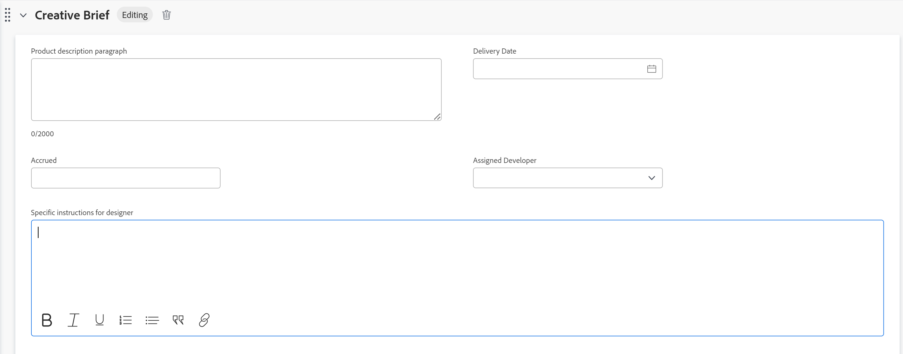

# カスタムフォームフィールドの情報を編集する

フォームをオブジェクトに添付した後に、カスタムフォームの情報を編集できます。カスタムフォームをオブジェクトに追加する方法について詳しくは、[オブジェクトにカスタムフォームを追加する](../../workfront-basics/work-with-custom-forms/add-a-custom-form-to-an-object.md)を参照してください。

## アクセス要件

以下が必要です。

<table style="table-layout:auto"> 
 <col> 
 <col> 
 <tbody> 
  <tr> 
   <td role="rowheader"> 
Adobe Workfront プラン*
 </td> 
   <td>チームまたはそれ以上</td> 
  </tr> 
  <tr> 
   <td role="rowheader"> 
Adobe Workfront ライセンス*
 </td> 
   <td> 
リクエスト以上
 </td> 
  </tr> 
  <tr data-mc-conditions=""> 
   <td role="rowheader">アクセスレベル*</td> 
   <td> 
カスタムフォームを編集するオブジェクトへのアクセスを編集します
 
メモ：まだアクセス権がない場合は、アクセスレベルに追加の制限が設定されていないかどうか Workfront 管理者にお問い合わせください。Workfront 管理者がアクセスレベルを変更する方法について詳しくは、<a href="../../administration-and-setup/add-users/configure-and-grant-access/create-modify-access-levels.md" class="MCXref xref">カスタムアクセスレベルの作成または変更</a>を参照してください。
 </td> 
  </tr> 
  <tr data-mc-conditions=""> 
   <td role="rowheader"> 
オブジェクト権限
 </td> 
   <td> 
    <ul> 
     <li> 
カスタムフォームを編集するオブジェクトに対する参加以上の権限
 </li> 
     <li>編集するフィールドに対する権限を表示します。カスタムフィールドの共有権限について詳しくは、<a href="../../administration-and-setup/customize-workfront/create-manage-custom-forms/configure-sharing-for-a-custom-field.md" class="MCXref xref">カスタムフィールドとウィジェットの共有を設定する</a>を参照してください。</li> 
     <li> 
編集するフィールドが配置されているフォーム上のセクションに対する権限を編集
 </li> 
    </ul> 
オブジェクトの追加アクセス権のリクエストについて詳しくは、<a href="../../workfront-basics/grant-and-request-access-to-objects/request-access.md" class="MCXref xref">オブジェクトへのアクセスのリクエスト</a>を参照してください。
 </td> 
  </tr> 
 </tbody> 
</table>

&#42;保有するプラン、ライセンスタイプ、アクセス権を確認するには、Workfront 管理者に問い合わせてください。

## 前提条件

* Workfront 管理者またはカスタムフォームへの管理者アクセス権を持つプランユーザーは、環境内でカスタムフォームを作成する必要があります。詳しくは、[カスタムフォームの作成または編集](../../administration-and-setup/customize-workfront/create-manage-custom-forms/create-or-edit-a-custom-form.md)を参照してください。
* オブジェクトには、カスタムフォームを添付する必要があります。

  カスタムフォームをオブジェクトに追加する方法について詳しくは、[オブジェクトにカスタムフォームを追加する](../../workfront-basics/work-with-custom-forms/add-a-custom-form-to-an-object.md)を参照してください。

## カスタムフォームの情報を編集

オブジェクトに添付されたカスタムフォームに関する情報の編集は、すべてのオブジェクトで同じです。カスタムフォームを持つことのできるオブジェクトについて詳しくは、[カスタムフォームの概要](../../administration-and-setup/customize-workfront/create-manage-custom-forms/custom-forms-overview.md)を参照してください。

1. カスタムフォームの情報を編集するオブジェクトに移動します。
1. 左パネルで「**`<Object type>`詳細**」をクリックします。

   例えば、プロジェクトのカスタムフォームに関する情報を編集する場合は、「**プロジェクト詳細**」をクリックします。

1. カスタムフォームまでスクロールします。オブジェクトにカスタムフォームが添付されている場合、フォームの名前は「詳細」セクションの領域として表示されます。
1. 必要に応じて、カスタムフォームの名前の左側にある矢印  をクリックし展開します。
1. ページの右上隅にある編集アイコン  をクリックします。
1. アクセス権のある任意のフィールドに情報を入力します。

   

   または

   フォームに情報がまだ入力されていない場合は、アクセス権がある任意のフィールドで「**追加+**」をクリックし、情報の入力を開始します。

   

   オブジェクトに複数のカスタムフォームが添付されている場合は、各フォームに対してこれを実行できます。

   作業中のフィールドのタイプに応じて、次の点に注意してください。

   * ラジオボタンフィールドに選択できるオプションは 1 つだけです。
   * フォーム作成者がフィールドをどのように設定したかに応じて、チェックボックスフィールドで 1 つまたは複数のオプションを選択できます。
   * フォーム作成者がフィールドをどのように設定したかに応じて、複数選択ドロップダウンフィールドで 1 つまたは複数のオプションを選択できます。
   * テキストフィールド（太字、斜体、下線）の書式を設定できるのは、フォームを作成したユーザーが「書式設定」フィールドタイプのテキストフィールドとして設定した場合のみです。1 行のテキストフィールドと段落テキストフィールドは書式設定できません。
   * 日付フィールドタイプで時刻を更新できるのは、フォームを作成したユーザーがフィールドの作成時に時刻を含めている場合だけです。

   すべてのフィールドタイプについては、[カスタムフォームの作成または編集](../../administration-and-setup/customize-workfront/create-manage-custom-forms/create-or-edit-a-custom-form.md)を参照してください。

1. 「**変更を保存**」をクリックします。

   >[!IMPORTANT]
   >
   >フォームを保存する前に、フォーム上のすべての必須フィールドに入力する必要があります。 必須フィールドの名前の後にアスタリスクが付きます。
   >
   >

   オブジェクト内の計算カスタムフィールドで参照される別のオブジェクト内のデータを変更した場合、その変更はオブジェクトに自動的には反映されません。オブジェクト内のすべての計算カスタムフィールドを手動で更新する方法については、[オブジェクトのすべての計算カスタムフィールドを再計算する方法](#recalculate-all-calculated-custom-fields-for-an-object)を参照してください。

   ページ上の依存フィールドが変更されると、カスタムフォーム上の計算フィールドはリアルタイムで動的に再計算されます。 新しい計算フィールドの値は、フォームを保存せずに表示できますが、変更を保存するまで、実際にはフォームとオブジェクトに適用されません。 これは、デフォルトフォームおよびカスタムフォームの計算フィールドに当てはまります。

   また、オブジェクトをリスト内の他のオブジェクトと共に一括編集する際に、そのオブジェクトの計算カスタムフィールドをすべて手動で更新することもできます。手順については、この記事の[オブジェクトの編集時にリスト内の複数のオブジェクトの計算カスタムフィールドをすべて再計算する方法](#recalculate-all-calculated-custom-fields-for-multiple-objects-in-a-list-when-editing-the-objects)を参照してください。

## オブジェクトのすべての計算カスタムフィールドを再計算する方法  {#recalculate-all-calculated-custom-fields-for-an-object}

1. 再計算するカスタムフィールドがあるオブジェクトのメインページに移動します。
1. オブジェクト名の右にある&#x200B;**その他**&#x200B;メニュー  をクリックし、「**式の再計算**」をクリックします。

   これにより、当該オブジェクトのフォーム上のすべてのカスタムフィールドが再計算されます。

## オブジェクトの編集時にリスト内の複数のオブジェクトの計算カスタムフィールドをすべて再計算する方法 {#recalculate-all-calculated-custom-fields-for-multiple-objects-in-a-list-when-editing-the-objects}

<!--

(NOTE: this will need to be edited when the bulk edit for objects update in NW)

-->

複数のオブジェクトのカスタムフィールドをリストまたはレポートから一括編集することで、手動で再計算することができます。

1. 計算フィールドがあるカスタムフォームを含んだオブジェクトのリストに移動します。
1. 更新する計算カスタムフィールドがあるオブジェクトを選択します。
1. **編集アイコン**&#x200B;をクリックします。
1. 左側のメニューで「**カスタムフォーム**」をクリックし、「**カスタム式の再計算**」を選択します。
1. 「**変更を****保存**」をクリックします。

   選択したすべてのオブジェクトのすべてのカスタムフィールドが計算されます。

>[!TIP]
>
>プロジェクトの複雑さによっては、最適なパフォーマンスを確保するために計算カスタムフィールドを一括で再計算する場合は、多数のプロジェクトを選択しないことをお勧めします。プロジェクトが複雑すぎる原因として考えられるものとしては、複数の依存関係や割り当てまたは多数のカスタムフィールドなどがあります。
>
>プロジェクトのリストからカスタム式を一括して再計算するには、次の手順に従います。
>
>1. プロジェクトリストまたはレポートに移動し、1 つまたは複数のプロジェクトを選択します。
>1. **その他**&#x200B;メニュー  をクリックし、「**カスタム式の再計算**」をクリックします。
>
>
>
>選択したすべてのプロジェクトのすべてのカスタムフィールドが計算されます。
