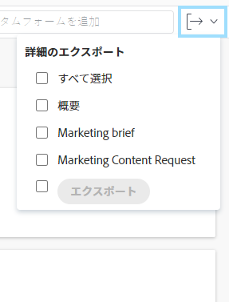

# カスタムフォームとオブジェクトの詳細の書き出し

オブジェクトの「詳細」セクションから概要とカスタムフォーム情報を PDF ファイルに書き出すことができます。その後、PDF を印刷または他のユーザーと共有できます。

この機能は、次のオブジェクトでサポートされています。

* プロジェクト
* タスク
* イシュー
* ポートフォリオ
* プログラム

<!--
* Billing records
 
After you open a billing record on a project, you can use the Details area to attach a custom form to the record and fill it out. You can also export billing record information from the Details area.
 </li>
  -->

>[!NOTE]
>
>Workfront 管理者またはグループ管理者がレイアウトテンプレートを使用して削除した「詳細」セクションのフィールドは表示されません。

## アクセス要件

以下が必要です。

<table style="table-layout:auto"> 
 <col> 
 <col> 
 <tbody> 
  <tr> 
   <td role="rowheader"> 
Adobe Workfront プラン*
 </td> 
   <td>任意</td> 
  </tr> 
  <tr> 
   <td role="rowheader"> 
Adobe Workfront ライセンス*
 </td> 
   <td> 
イシューの場合はリクエスト以上
 
プロジェクトとタスクのレビューまたはそれ以上の権限
 </td> 
  </tr> 
  <tr data-mc-conditions=""> 
   <td role="rowheader"><strong>アクセスレベル設定*</strong> </td> 
   <td> 
プロジェクト、タスクおよびイシューの表示またはそれ以上の権限
 
メモ：まだアクセス権がない場合は、アクセスレベルに追加の制限が設定されていないかどうか Workfront 管理者にお問い合わせください。Workfront 管理者がアクセスレベルを変更する方法について詳しくは、<a href="../../administration-and-setup/add-users/configure-and-grant-access/create-modify-access-levels.md" class="MCXref xref">カスタムアクセスレベルの作成または変更</a>を参照してください。
 </td> 
  </tr> 
  <tr data-mc-conditions=""> 
   <td role="rowheader"> 
オブジェクト権限
 </td> 
   <td> 
フォームを書き出すプロジェクト、タスクまたはイシューの表示またはそれ以上の権限
 
追加のアクセス権のリクエストについて詳しくは、<a href="../../workfront-basics/grant-and-request-access-to-objects/request-access.md" class="MCXref xref">オブジェクトへのアクセス権のリクエスト</a>を参照してください。
 </td> 
  </tr> 
 </tbody> 
</table>

&#42;保有するプラン、ライセンスタイプ、アクセス権を確認するには、Workfront 管理者に問い合わせてください。

## 前提条件

開始する前に、以下のものがすべて必要です。

1. 書き出し元の特定のオブジェクト用に作成されたカスタムフォーム
1. オブジェクトに添付されたカスタムフォーム

   または

   カスタムフォームを添付しフォーム上の情報を編集するための適切なアクセス権

カスタムフォームの作成については、[カスタムフォームの作成または編集](../../administration-and-setup/customize-workfront/create-manage-custom-forms/create-or-edit-a-custom-form.md)を参照してください。

オブジェクトへのフォームの添付については、[オブジェクトへのカスタムフォームの追加](../../workfront-basics/work-with-custom-forms/add-a-custom-form-to-an-object.md)を参照してください。

## 「詳細」セクションの情報を書き出し

オブジェクトの「詳細」セクションからの情報の書き出しは、サポートされているどのオブジェクトでも同じです。

1. 少なくとも表示権限のあるプロジェクト、タスク、ポートフォリオ、プログラムまたはイシューに移動します。
1. 左パネルで&#x200B;**「詳細」項目**（「**タスクの詳細**」など）をクリックします。
1. （オプション）オブジェクトにカスタムフォームが添付されていない場合は、「**カスタムフォームを追加**」フィールドにカスタムフォームの名前を入力していき、目的の名前がリストに表示されたらクリックします。

   最大 10 個のフォームを追加できます。

1. （オプション）「詳細」セクションの情報を更新したあと、「**変更を保存**」をクリックします。
1. 右上隅の&#x200B;**書き出し**&#x200B;ドロップダウンメニューをクリックし、「**概要**」または書き出すフォームを選択して、「**書き出し**」をクリックします。

   概要エリアとすべてのカスタムフォームを書き出す場合は、「**すべて選択**」を選択することもできます。

   

   >[!TIP]
   >
   >次のシナリオが存在する可能性があります。
   >
   >   
   >   
   >   * グループ管理者または Workfront 管理者が概要エリアのすべてのフィールドを選択解除し、オブジェクトにカスタムフォームが添付されている場合は、「概要」セクションが表示されません。
   >   * グループ管理者または Workfront 管理者が概要エリアのすべてのフィールドを選択解除し、オブジェクトにカスタムフォームが添付されていない場合は、「書き出し」ドロップダウンメニューが表示されません。
   >   * オブジェクトにカスタムフォームが添付されていない場合は、概要エリアのみを書き出すことができます。
   >   * ロジックの裏で動作しフォームに表示されないカスタムフィールドは、書き出されません。カスタムフォームへのロジックの追加については、[カスタムフォームへの表示ロジックとスキップロジックの追加](../../administration-and-setup/customize-workfront/create-manage-custom-forms/display-or-skip-logic-custom-form.md)を参照してください。
   >   
   >

   PDF ファイルが生成され、お使いのコンピューターにダウンロードされます。この PDF ファイルには、次の情報が含まれています。

   * フォームが添付されているオブジェクトの名前
   * PDF を書き出したユーザーの名前
   * PDF が生成された日時
   * 書き出されたフォームの名前
   * フォームに入力されたフィールドの情報
