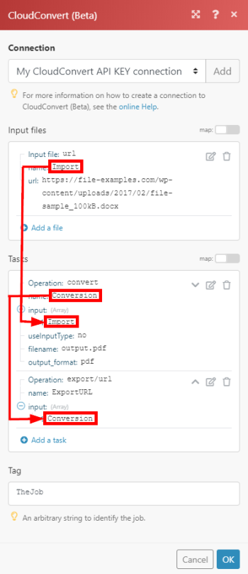

# [!DNL CloudConvert] モジュール

Adobe Workfront Fusion のシナリオでは、CloudConvert を使用するワークフローを自動化し、それを複数のサードパーティのアプリケーションやサービスに接続できます。[!DNL CloudConvert] モジュールを使用すると、[!DNL CloudConvert] アカウントで業務、タスクを監視および管理し、ファイルを読み出しおよび書き出すことができます。

<table style="table-layout:auto">
 <col> 
 <col> 
 <tbody> 
  <tr> 
   <td role="rowheader">[!DNL Adobe Workfront] プラン*</td>
  <td> 
[!UICONTROL Pro] 以降
 </td>
  </tr> 
  <tr data-mc-conditions=""> 
   <td role="rowheader">[!DNL Adobe Workfront] ライセンス*</td>
   <td> 
[!UICONTROL Plan]、[!UICONTROL Work]
 </td> 
  </tr> 
  <tr> 
   <td role="rowheader">[!DNL Adobe Workfront Fusion] ライセンス**</td> 
   <td>
   
現在のライセンス要件：[!DNL Workfront Fusion]ライセンス要件なし。

   
または

   
従来のライセンス要件：[!UICONTROL [!DNL Workfront Fusion] for Work Automation and Integration] 

   </td> 
  </tr> 
  <tr> 
   <td role="rowheader">製品</td> 
   <td>
   
現在の製品要件：[!UICONTROL Select] または [!UICONTROL Prime] [!DNL Adobe Workfront] プランをご利用の場合、この記事で説明している機能を使用するには、[!DNL Adobe Workfront Fusion] と [!DNL Adobe Workfront] を、組織で購入する必要があります。[!DNL Workfront Fusion] は、[!UICONTROL Ultimate] [!DNL Workfront] プランに含まれています。

   
または

   
従来の製品要件：この記事で説明している機能を使用するには、[!DNL Adobe Workfront Fusion] と [!DNL Adobe Workfront] を組織で購入する必要があります。

   </td> 
  </tr> 
 </tbody> 
</table>

## [!DNL CloudConvert] を [!DNL Workfront Fusion] に接続 {#connect-cloudconvert-to-workfront-fusion}

[!DNL CloudConvert] アカウントを [!DNL Workfront Fusion] に接続するには、[!DNL CloudConvert] アカウントから API キーを取得する必要があります。

1. [!DNL CloudConvert] のアカウントにログインし、[!UICONTROL ダッシュボード]を開きます。
1. **[!UICONTROL 認証]／「[!UICONTROL API キー]**」セクションを開きます。
1. 「**[!UICONTROL API キーを新規作成]**」をクリックします。
1. API キーの名前を入力し、使用するスコープを有効にして、さらに「**[!UICONTROL 作成]**」をクリックします。
1. 提供されたトークンをコピーし、安全な場所に保存します。
1. [!DNL Workfront Fusion] で、シナリオの作成を開始し、[!DNL CloudConvert] モジュールの&#x200B;**[!UICONTROL 接続を作成]**&#x200B;ダイアログを開きます。

   手順については [ [!DNL Adobe Workfront Fusion]](../../workfront-fusion/scenarios/create-a-scenario.md) でシナリオを作成を参照してください。

1. 手順 5 で保存したトークンを入力し、続いて「**[!UICONTROL 続行]**」をクリックして接続を確立します。

## [!DNL CloudConvert] モジュールとそのフィールド {#cloudconvert-modules-and-their-fields}

[!DNL CloudConvert] モジュールを設定する際、[!DNL Workfront Fusion] に以下のフィールドが表示されます。これらに加えて、アプリまたはサービスのアクセスレベルなどの要因に応じて、追加の [!DNL CloudConvert] フィールドが表示される場合があります。モジュール内の太字のタイトルは、必須フィールドを示します。

フィールドまたは関数の上にマップボタンが表示されている場合は、このボタンを使用すると、そのフィールドの変数や関数を設定できます。詳しくは、[ [!DNL Adobe Workfront Fusion]](../../workfront-fusion/mapping/map-information-between-modules.md) で 1 つのモジュールから別のモジュールに情報をマッピングを参照してください。

* [一般的なタスク](#common-tasks)
* [業務](#jobs)
* [タスク](#tasks)
* [その他](#other)

### 一般的なタスク

* [Web サイトをキャプチャ](#capture-a-website)
* [[!UICONTROL ファイルを変換]](#convert-a-file)
* [アーカイブを作成](#create-an-archive)
* [ファイルを結合](#merge-files)
* [ファイルを最適化](#optimize-a-file)

#### [!UICONTROL Web サイトをキャプチャ]

このアクションモジュールは、指定された web サイトをキャプチャし、PDF、JPG、または PNG 形式で保存します。

Web サイトの URL と、情報の保存場所などのその他の情報を指定します。

このモジュールは、ファイルの ID や関連するフィールドのほか、接続を介してアクセスされるカスタムフィールドおよび値を返します。この情報は、シナリオ内の後続のモジュールにマッピングできます。

<table style="table-layout:auto">
 <col> 
 <col> 
 <tbody> 
  <tr> 
   <td role="rowheader">[!UICONTROL Connection]</td> 
   <td> 
[!DNL CloudConvert] アカウントを [!DNL Workfront Fusion] に接続する方法については、この記事の<a href="#connect-cloudconvert-to-workfront-fusion" class="MCXref xref">[!DNL CloudConvert] を [!DNL Workfront Fusion]</a> に接続を参照してください。
 </td> 
  </tr> 
  <tr> 
   <td role="rowheader">[!UICONTROL URL]</td> 
   <td>キャプチャする web サイトの URL を入力します。 </td> 
  </tr> 
  <tr> 
   <td role="rowheader">[!UICONTROL Output Format] </td> 
   <td>キャプチャした web サイトを、PNG 形式、JPG 形式、PDF 形式のいずれで保存するかを選択します。 </td> 
  </tr> 
  <tr> 
   <td role="rowheader">[!UICONTROL File Name] </td> 
   <td>ターゲット出力ファイルのファイル名（拡張子も含む）を入力します。</td> 
  </tr> 
  <tr> 
   <td role="rowheader">[!UICONTROL Headers] </td> 
   <td> 
（オプション）リクエストヘッダーを定義します。 
 
これは、例えば、指定した URL で認証が必要な場合に便利です。 
 </td> 
  </tr> 
  <tr> 
   <td role="rowheader"> 
[!UICONTROL Conversion and engine specific options] 
 </td> 
   <td>コンバージョンとエンジン固有のオプションを指定します。使用可能なオプションを表示するには、<a href="https://cloudconvert.com/api/v2/convert#convert-tasks">[!DNL CloudConvert] API</a> のドキュメントで <code>input_format</code> および <code>output_format</code> を参照してください。</td> 
  </tr> 
  <tr> 
   <td role="rowheader">[!UICONTROL Download a file] </td> 
   <td> 
モジュールの出力にファイルデータも含める場合は、このオプションを有効にします。
 </td> 
  </tr> 
 </tbody> 
</table>

#### [!UICONTROL ファイルを変換]

ファイルを選択した出力形式に変換します。

<table style="table-layout:auto">
 <col> 
 <col> 
 <tbody> 
  <tr> 
   <td role="rowheader">[!UICONTROL Connection]</td> 
   <td> 
[!DNL CloudConvert] アカウントを [!DNL Workfront Fusion] に接続する方法については、この記事の<a href="#connect-cloudconvert-to-workfront-fusion" class="MCXref xref">[!DNL CloudConvert] を [!DNL Workfront Fusion]</a> に接続を参照してください。
 </td> 
  </tr> 
  <tr> 
   <td role="rowheader">[!UICONTROL Input file]</td> 
   <td>ファイルのアップロードに [!DNL Workfront Fusion] を使用するか、ファイルのアップロード元の URL を指定するかを選択します。</td> 
  </tr> 
  <tr> 
   <td role="rowheader">[!UICONTROL Upload a file]</td> 
   <td> 
以前のモジュールで使用したソースファイルを選択するか、ソースファイルの名前とデータをマッピングします。
 </td> 
  </tr> 
  <tr> 
   <td role="rowheader">[!UICONTROL Import a File from URL]</td> 
   <td> 
    <ul> 
     <li> 
<strong>[!UICONTROL URL]</strong> 
 
変換するファイルの URL を入力します。
 </li> 
     <li> 
<strong>[!UICONTROL Headers]</strong>
 
リクエストヘッダーを定義します（オプション）。これは、例えば、指定した URL で認証が必要な場合に便利です。
 </li> 
    </ul> </td> 
  </tr> 
  <tr> 
   <td role="rowheader">[!UICONTROL Format]</td> 
   <td>変換するファイルの入力形式を指定するかどうかを選択します。指定しなかった場合、入力ファイルの拡張子が入力形式として使用されます。</td> 
  </tr> 
  <tr data-mc-conditions=""> 
   <td role="rowheader">[!DNL Input Format]</td> 
   <td>ファイルの現在の形式を選択します。</td> 
  </tr> 
  <tr data-mc-conditions=""> 
   <td role="rowheader">[!UICONTROL Output Format]</td> 
   <td>ファイルの変換先のファイル形式を選択します。</td> 
  </tr> 
  <tr data-mc-conditions=""> 
   <td role="rowheader">[!UICONTROL File Name]</td> 
   <td>ターゲット出力ファイルのファイル名（拡張子を含む）を選択します。</td> 
  </tr> 
  <tr data-mc-conditions=""> 
   <td role="rowheader"> 
[!UICONTROL Conversion and engine specific options] 
 </td> 
   <td>コンバージョンとエンジン固有のオプションを指定します。使用可能なオプションを表示するには、<a href="https://cloudconvert.com/api/v2/convert#convert-tasks">[!DNL CloudConvert] API</a> のドキュメントで <code>input_format</code> および <code>output_format</code> を参照してください。</td> 
  </tr> 
  <tr data-mc-conditions=""> 
   <td role="rowheader">[!UICONTROL Download a file] </td> 
   <td> 
モジュールの出力にファイルデータも含める場合は、このオプションを有効にします。
 </td> 
  </tr> 
 </tbody> 
</table>

#### [!UICONTROL アーカイブを作成]

ZIP、RAR、7Z、TAR、TAR.GZ または TAR.BZ2 アーカイブに 1 つまたは複数のファイルを追加できます。

<table style="table-layout:auto"> 
 <col> 
 <col> 
 <tbody> 
  <tr> 
   <td role="rowheader">[!UICONTROL Connection]</td> 
   <td> 
[!DNL CloudConvert] アカウントを [!DNL Workfront Fusion] に接続する方法については、この記事の<a href="#connect-cloudconvert-to-workfront-fusion" class="MCXref xref">[!DNL CloudConvert] を [!DNL Workfront Fusion]</a> に接続を参照してください。
 </td> 
  </tr> 
  <tr> 
   <td role="rowheader"> 
[!UICONTROL Input Files]
 </td> 
   <td> 
アーカイブに追加するファイルを指定します。
 </td> 
  </tr> 
  <tr> 
   <td role="rowheader">[!UICONTROL Upload a File]</td> 
   <td> 
以前のモジュールで使用したソースファイルを選択するか、ソースファイルの名前とデータをマッピングします。
 </td> 
  </tr> 
  <tr> 
   <td role="rowheader"> 
[!UICONTROL Import a file from URL]
 </td> 
   <td> 
<strong>[!UICONTROL URL]</strong> 
 
アーカイブするファイルの URL を入力します。
 
<strong>[!UICONTROL Headers]</strong> 
 
リクエストヘッダーを定義します（オプション）。これは、例えば、指定した URL で認証が必要な場合に便利です。
 </td> 
  </tr> 
  <tr> 
   <td role="rowheader">[!UICONTROL Output Format]</td> 
   <td> 
 アーカイブ済みファイルの対象の形式を選択します。
 </td> 
  </tr> 
  <tr> 
   <td role="rowheader">[!UICONTROL File name]</td> 
   <td> 
 対象の出力ファイルのファイル名（拡張子を含む）を入力します。
 </td> 
  </tr> 
  <tr> 
   <td role="rowheader">[!UICONTROL Conversion and engine specific options] </td> 
   <td> 
コンバージョンとエンジン固有のオプションを指定します。使用可能なオプションを表示するには、<a href="https://cloudconvert.com/api/v2/convert#convert-tasks">[!DNL CloudConvert] API</a> のドキュメントで <code>input_format</code> および <code>output_format</code> を参照してください。
 </td> 
  </tr> 
  <tr> 
   <td role="rowheader">[!UICONTROL Download a File]</td> 
   <td> 
モジュールの出力にファイルデータも含める場合は、このオプションを有効にします。
 </td> 
  </tr> 
 </tbody> 
</table>

#### [!UICONTROL ファイルを結合]

2 つ以上のファイルを 1 つの PDF に結合します。入力ファイルが PDF 以外の場合、入力ファイルは自動的に PDF に変換されます。

<table style="table-layout:auto">
 <col> 
 <col> 
 <tbody> 
  <tr> 
   <td role="rowheader">[!UICONTROL Connection]</td> 
   <td> 
[!DNL CloudConvert] アカウントを [!DNL Workfront Fusion] に接続する手順については、この記事の<a href="#connect-cloudconvert-to-workfront-fusion" class="MCXref xref">[!DNL CloudConvert] を [!DNL Workfront Fusion]</a> に接続を参照してください。
 </td> 
  </tr> 
  <tr> 
   <td role="rowheader"> 
[!UICONTROL Input Files]
 </td> 
   <td> 
結合するファイルを指定します。
 </td> 
  </tr> 
  <tr> 
   <td role="rowheader">[!UICONTROL Upload a File]</td> 
   <td> 
以前のモジュールで使用したソースファイルを選択するか、ソースファイルの名前とデータをマッピングします。
 </td> 
  </tr> 
  <tr> 
   <td role="rowheader"> 
[!UICONTROL Import a file from URL]
 </td> 
   <td> 
<strong>[!UICONTROL URL]</strong> 
 
アーカイブするファイルの URL を入力します。
 
<strong>[!UICONTROL Headers]</strong> 
 
リクエストヘッダーを定義します（オプション）。これは、例えば、指定した URL で認証が必要な場合に便利です。
 </td> 
  </tr> 
  <tr> 
   <td role="rowheader">[!UICONTROL Output Format]</td> 
   <td> 
 マージされたファイルの対象の形式を選択します。
 </td> 
  </tr> 
  <tr> 
   <td role="rowheader">[!UICONTROL File name]</td> 
   <td> 
 対象の出力ファイルのファイル名（拡張子を含む）を入力します。
 </td> 
  </tr> 
  <tr> 
   <td role="rowheader">[!UICONTROL Conversion and engine specific options] </td> 
   <td> 
コンバージョンとエンジン固有のオプションを指定します。使用可能なオプションを表示するには、<code>input_format</code> と <code>output_format</code> に関する <a href="https://cloudconvert.com/api/v2/convert#convert-tasks">[!DNL CloudConvert] API</a> ドキュメントを参照してください。
 </td> 
  </tr> 
  <tr> 
   <td role="rowheader">[!UICONTROL Download a File]</td> 
   <td> 
モジュールの出力にファイルデータも含める場合は、このオプションを有効にします。
 </td> 
  </tr> 
 </tbody> 
</table>

#### [!UICONTROL ファイルの最適化]

このアクションモジュールは、ファイルを PDF、PNG、または JPG 形式で最適化および圧縮します。

ファイルと、最適化および保存のためのパラメーターを指定します。

このモジュールは、ファイルの ID や関連するフィールドのほか、接続を介してアクセスされるカスタムフィールドおよび値を返します。この情報は、シナリオ内の後続のモジュールにマッピングできます。

このモジュールを設定する際には、次のフィールドが表示されます。

<table style="table-layout:auto">
 <col> 
 <col> 
 <tbody> 
  <tr> 
   <td role="rowheader">[!UICONTROL Connection]</td> 
   <td> 
[!DNL CloudConvert] アカウントを [!DNL Workfront Fusion] に接続する手順については、この記事の「<a href="#connect-cloudconvert-to-workfront-fusion" class="MCXref xref">[!DNL CloudConvert] を [!DNL Workfront Fusion]</a> に接続」を参照してください。
 </td> 
  </tr> 
  <tr> 
   <td role="rowheader">[!UICONTROL Input File]</td> 
   <td>Workfront Fusion を使用してファイルをアップロードするか、ファイルのアップロード元の URL を指定するかを選択します。</td> 
  </tr> 
  <tr> 
   <td role="rowheader"> 
[!UICONTROL Upload a File]
 </td> 
   <td> 
以前のモジュールで使用したソースファイルを選択するか、ソースファイルの名前とデータをマッピングします。
 </td> 
  </tr> 
  <tr> 
   <td role="rowheader">[!UICONTROL Import a file from URL] </td> 
   <td> 
    <ul> 
     <li><strong>[!UICONTROL URL]</strong>：変換するファイルの URL を入力します。</li> 
     <li><strong>[!UICONTROL Headers]</strong>：（オプション）リクエストヘッダーを定義します。これは、例えば、指定した URL で認証が必要な場合に便利です。</li> 
    </ul> </td> 
  </tr> 
  <tr> 
   <td role="rowheader">[!UICONTROL Optimization for] </td> 
   <td> 
特定のターゲットニーズに合わせた最適化プロファイルを選択します。
 
    <ul> 
     <li> 
<strong>[!UICONTROL Web]</strong>：Web の最適化（デフォルト）
 
      <ul> 
       <li>Web の冗長データと不要データの削除</li> 
       <li>画像をダウンサンプリング、クリップし、インテリジェントに圧縮</li> 
       <li>フォントの結合とサブセット化</li> 
       <li>カラーを RGB に変換</li> 
      </ul> </li> 
    </ul> 
    <ul> 
     <li> 
<strong>[!UICONTROL Print]</strong>：印刷の最適化
 
      <ul> 
       <li> 
印刷用の冗長データと不要データの削除
 </li> 
       <li> 
画像をダウンサンプリング、クリップし、インテリジェントに圧縮
 </li> 
       <li> 
フォントの結合とサブセット化
 </li> 
       <li> 
カラーを CMYK に変換
 </li> 
      </ul> </li> 
     <li> 
<strong>[!UICONTROL Archive]</strong>：アーカイブ目的の最適化
 
      <ul> 
       <li> 
アーカイブ用の冗長データと不要データの削除
 </li> 
       <li> 
画像をインテリジェントに圧縮
 </li> 
       <li> 
フォントの結合とサブセット化
 </li> 
      </ul> </li> 
     <li> 
<strong>[!UICONTROL Scanned images]</strong>：スキャンされた画像の最適化
 
      <ul> 
       <li> 
主にラスター画像で構成される PDF に最適化されたプロファイル
 </li> 
       <li> 
画質を大幅に低下させずに画像の圧縮
 </li> 
      </ul> </li> 
     <li> 
<strong>[!UICONTROL maximal size reduction]</strong>：最大限のサイズ削減のための最適化
 
      <ul> 
       <li> 
可能な限り最大の圧縮の使用
 </li> 
       <li> 
画質が低下する可能性があります
 </li> 
      </ul> </li> 
    </ul> </td> 
  </tr> 
  <tr> 
   <td role="rowheader">[!UICONTROL Input format] </td> 
   <td>最適化する入力ファイルの形式を選択します。 </td> 
  </tr> 
  <tr> 
   <td role="rowheader">[!UICONTROL File name]</td> 
   <td> 
ターゲット出力ファイルのファイル名（拡張子も含む）を入力します。
 </td> 
  </tr> 
  <tr> 
   <td role="rowheader">[!UICONTROL Conversion and engine specific options]</td> 
   <td> 
コンバージョンとエンジン固有のオプションを指定します。使用可能なオプションを表示するには、<code>input_format</code> と <code>output_format</code> に関する <a href="https://cloudconvert.com/api/v2/convert#convert-tasks">[!DNL CloudConvert] API</a> ドキュメントを参照してください。
 </td> 
  </tr> 
  <tr> 
   <td role="rowheader">[!UICONTROL Download a file]</td> 
   <td> 
モジュールの出力にファイルデータも含める場合は、このオプションを有効にします。
 </td> 
  </tr> 
 </tbody> 
</table>

### ジョブ

* [[!UICONTROL ジョブの作成（詳細）]](#create-a-job-advanced)
* [[!UICONTROL 新しいジョブイベント]](#new-job-event)
* [[!UICONTROL ジョブのリスト表示]](#list-jobs)
* [[!UICONTROL ジョブの取得]](#get-a-job)
* [[!UICONTROL ジョブの削除]](#delete-a-job)

#### [!UICONTROL ジョブの作成（詳細）]

このモジュールではジョブを作成します。ジョブは、「[!UICONTROL 名前]」フィールドで識別され、「[!UICONTROL 入力]」フィールドを使用して相互にリンクされる 1 つまたは複数のタスクです。

<table style="table-layout:auto">
 <col> 
 <col> 
 <tbody> 
  <tr> 
   <td role="rowheader">[!UICONTROL Connection]</td> 
   <td> 
[!DNL CloudConvert] アカウントを [!DNL Workfront Fusion] に接続する手順について詳しくは、この記事にある「<a href="#connect-cloudconvert-to-workfront-fusion" class="MCXref xref">[!DNL CloudConvert] を [!DNL Workfront Fusion]</a> に接続」を参照してください。
 </td> 
  </tr> 
  <tr> 
   <td role="rowheader">[!UICONTROL Input Files]</td> 
   <td> 
[!DNL Workfront Fusion] を使用してファイルをアップロードするか、ファイルのアップロード元の URL を指定するかを選択します。
 </td> 
  </tr> 
  <tr> 
   <td role="rowheader">[!UICONTROL Upload a File]</td> 
   <td> 
以前のモジュールで使用したソースファイルを選択するか、ソースファイルの名前とデータをマッピングします。
 </td> 
  </tr> 
  <tr> 
   <td role="rowheader"> 
[!UICONTROL Import a File from URL]
 </td> 
   <td> 
    <ul> 
     <li><strong>[!UICONTROL URL]</strong>：処理するファイルの URL を入力します。</li> 
     <li><strong>[!UICONTROL Headers]</strong>：（オプション）リクエストヘッダーを定義します。これは、例えば、指定した URL で認証が必要な場合に便利です。</li> 
    </ul> </td> 
  </tr> 
  <tr> 
   <td role="rowheader"> 
[!UICONTROL Tasks]
 </td> 
   <td> 
ジョブ内で実行されるタスクを追加します。
 
操作フィールドの説明は、対応するセクションで参照してください。
 
    <ul> 
     <li><a href="#convert-a-file" class="MCXref xref">[!UICONTROL Convert a file]</a> </li> 
     <li><a href="#capture-a-website" class="MCXref xref">[!UICONTROL Capture a Website]</a> </li> 
     <li><a href="#optimize-a-file" class="MCXref xref">[!UICONTROL Optimize a File]</a> </li> 
     <li><a href="#create-an-archive" class="MCXref xref">[!UICONTROL Create an Archive]</a> </li> 
     <li><a href="#merge-files" class="MCXref xref">[!UICONTROL Merge Files]</a> </li> 
    </ul> 
    <ul> 
     <li> 
<strong>[!UICONTROL Execute a Command]</strong> 
 
コマンドの実行について詳しくは、<a href="https://cloudconvert.com/api/v2/command#command-tasks">[!DNL CloudConvert] API ドキュメント</a>を参照してください。
 </li> 
     <li> 
<strong>[!UICONTROL Export a File to Temporary URL]</strong> 
 
 タスク名と入力タスク名を指定します（例：変換）。
 </li> 
    </ul> </td> 
  </tr> 
  <tr> 
   <td role="rowheader">[!UICONTROL Tag] </td> 
   <td> 
タグを入力します。タグは、業務を識別する任意の文字列です。これらは効果がなく、業務と ID の関連付けに使用できます。
 </td> 
  </tr> 
 </tbody> 
</table>

#### [!UICONTROL 業務を削除]

このモジュールは、すべてのタスクとデータを含む業務を削除します。

>[!NOTE]
>
>業務は、終了から 24 時間後に自動的に削除されます。

<table style="table-layout:auto">
 <col> 
 <col> 
 <tbody> 
  <tr> 
   <td role="rowheader">[!UICONTROL Connection]</td> 
   <td> 
[!DNL CloudConvert] アカウントを [!DNL Workfront Fusion] に接続する手順については、この記事の <a href="#connect-cloudconvert-to-workfront-fusion" class="MCXref xref">[!DNL CloudConvert] を [!DNL Workfront Fusion]</a> に接続を参照してください。
 </td> 
  </tr> 
  <tr> 
   <td role="rowheader">[!UICONTROL Job ID]</td> 
   <td> 
削除する業務の ID を入力またはマッピングします。
 </td> 
  </tr> 
 </tbody> 
</table>

#### [!UICONTROL 業務を取得]

このモジュールは、業務の詳細を取得します。

<table style="table-layout:auto">
 <col> 
 <col> 
 <tbody> 
  <tr> 
   <td role="rowheader">[!UICONTROL Connection]</td> 
   <td> 
[!DNL CloudConvert] アカウントを [!DNL Workfront Fusion] に接続する手順については、この記事の <a href="#connect-cloudconvert-to-workfront-fusion" class="MCXref xref">[!DNL CloudConvert] を [!DNL Workfront Fusion]</a> に接続を参照してください。
 </td> 
  </tr> 
  <tr> 
   <td role="rowheader">[!UICONTROL Job ID]</td> 
   <td> 
詳細を取得する業務の ID を入力またはマッピングします。
 </td> 
  </tr> 
 </tbody> 
</table>

#### [!UICONTROL 業務をリスト]

このモジュールは、アカウントで実行されたすべての業務を取得します。

<table style="table-layout:auto">
 <col> 
 <col> 
 <tbody> 
  <tr> 
   <td role="rowheader">[!UICONTROL Connection]</td> 
   <td> 
[!DNL CloudConvert] アカウントを [!DNL Workfront Fusion] に接続する手順については、この記事の <a href="#connect-cloudconvert-to-workfront-fusion" class="MCXref xref">[!DNL CloudConvert] を [!DNL Workfront Fusion]</a> に接続を参照してください。
 </td> 
  </tr> 
  <tr> 
   <td role="rowheader">[!UICONTROL Status] </td> 
   <td> 
返された業務をフィルタリングする業務ステータスを選択します。
 </td> 
  </tr> 
  <tr> 
   <td role="rowheader">[!UICONTROL Limit] </td> 
   <td> 
1 回の実行サイクルで返される Workfront Fusion 2.0 の業務数を設定します。
 </td> 
  </tr> 
 </tbody> 
</table>

#### [!UICONTROL 新しい業務イベント]

アカウントまたはタスク内の業務が作成、終了、失敗したときにトリガーされます。

>[!NOTE]
>
>* [!UICONTROL 業務の作成（詳細）]モジュールで作成した業務は、*複数の*&#x200B;タスクで構成されています。
>* [!UICONTROL 新しい業務イベント]のトリガーは、*個人*&#x200B;のタスクが作成されたか、完了したか、失敗ときも起動します。
>

<table style="table-layout:auto">
 <col> 
 <col> 
 <tbody> 
  <tr> 
   <td role="rowheader">[!UICONTROL Webhhook name]</td> 
   <td>Web フック名を入力します。 </td> 
  </tr> 
  <tr> 
   <td role="rowheader">[!UICONTROL Connection]</td> 
   <td> 
[!DNL CloudConvert] アカウントを [!DNL Workfront Fusion] に接続する手順については、この記事の <a href="#connect-cloudconvert-to-workfront-fusion" class="MCXref xref">[!DNL CloudConvert] を [!DNL Workfront Fusion]</a> に接続を参照してください。
 </td> 
  </tr> 
  <tr> 
   <td role="rowheader">[!UICONTROL Output Format] </td> 
   <td>キャプチャした web サイトを、PNG 形式、JPG 形式、PDF 形式のいずれで保存するかを選択します。 </td> 
  </tr> 
  <tr> 
   <td role="rowheader">[!UICONTROL Event]</td> 
   <td>業務またはタスクの作成時、完了時、失敗時にモジュールをトリガーするかどうかを選択します。</td> 
  </tr> 
 </tbody> 
</table>

>[!NOTE]
>
>* 配列アグリゲーターを使用する場合（変換するファイルが異なる形式で多数ある場合）、タスクを追加]ダイアログにある&#x200B;**[!UICONTROL 入力形式がわかりません]**&#x200B;のオプションを[!UICONTROL 使用します。それ以外の場合は、エラーが返されます。
>* 業務内のタスクをリンクしています（名前／入力、名前／入力、…）：
>
>  >

### タスク

* [[!UICONTROL タスクを取得]](#get-a-task)
* [[!UICONTROL ファイルをダウンロード]](#download-a-file)
* [[!UICONTROL タスクのリスト]](#list-tasks)
* [[!UICONTROL タスクを再試行]](#retry-a-task)
* [[!UICONTROL タスクをキャンセル]](#cancel-a-task)
* [[!UICONTROL タスクを削除]](#delete-a-task)

#### [!UICONTROL タスクをキャンセル]

このモジュールは、ステータスが「待機中」または「処理中」のタスクをキャンセルします。

<table style="table-layout:auto">
 <col> 
 <col> 
 <tbody> 
  <tr> 
   <td role="rowheader">[!UICONTROL Connection]</td> 
   <td> 
[!DNL CloudConvert] アカウントを [!DNL Workfront Fusion] に接続する手順については、この記事の <a href="#connect-cloudconvert-to-workfront-fusion" class="MCXref xref">[!DNL CloudConvert] を [!DNL Workfront Fusion]</a> に接続を参照してください。
 </td> 
  </tr> 
  <tr> 
   <td role="rowheader">[!UICONTROL Task ID]</td> 
   <td> 
 キャンセルするタスクの ID を入力またはマッピングします。
 </td> 
  </tr> 
 </tbody> 
</table>

#### [!UICONTROL タスクを削除]

すべてのデータを含むタスクを削除します。

>[!NOTE]
>
>タスクは、終了してから 24 時間後に自動的に削除されます。

<table style="table-layout:auto"> 
 <col> 
 <col> 
 <tbody> 
  <tr> 
   <td role="rowheader">[!UICONTROL Connection]</td> 
   <td> 
[!DNL CloudConvert] アカウントを [!DNL Workfront Fusion] に接続する手順については、この記事の <a href="#connect-cloudconvert-to-workfront-fusion" class="MCXref xref">[!DNL CloudConvert] を [!DNL Workfront Fusion]</a> に接続を参照してください。
 </td> 
  </tr> 
  <tr> 
   <td role="rowheader">[!UICONTROL Task ID]</td> 
   <td> 
 削除するタスクの ID を入力（マップ）します。
 </td> 
  </tr> 
 </tbody> 
</table>

#### [!UICONTROL ファイルをダウンロード]

このモジュールは、指定されたタスクからファイル名とファイルデータを取得します。

<table style="table-layout:auto">
 <col> 
 <col> 
 <tbody> 
  <tr> 
   <td role="rowheader">[!UICONTROL Connection]</td> 
   <td> 
[!DNL CloudConvert] アカウントを [!DNL Workfront Fusion] に接続する手順については、この記事の <a href="#connect-cloudconvert-to-workfront-fusion" class="MCXref xref">[!DNL CloudConvert] を [!DNL Workfront Fusion]</a> に接続を参照してください。
 </td> 
  </tr> 
  <tr> 
   <td role="rowheader">[!UICONTROL Task ID]</td> 
   <td> 
 ファイルのダウンロード元のタスクの ID を入力またはマッピングします。
 </td> 
  </tr> 
 </tbody> 
</table>

#### [!UICONTROL タスクを取得]

このモジュールは、タスクの詳細を取得します。

<table style="table-layout:auto">
 <col> 
 <col> 
 <tbody> 
  <tr> 
   <td role="rowheader">[!UICONTROL Connection]</td> 
   <td> 
[!DNL CloudConvert] アカウントを [!DNL Workfront Fusion] に接続する手順については、この記事にある <a href="#connect-cloudconvert-to-workfront-fusion" class="MCXref xref">[!DNL CloudConvert] を [!DNL Workfront Fusion]</a> に接続を参照してください。
 </td> 
  </tr> 
  <tr> 
   <td role="rowheader">[!UICONTROL Task ID]</td> 
   <td> 
詳細を取得するタスクの ID を入力またはマッピングします。
 </td> 
  </tr> 
 </tbody> 
</table>

#### [!UICONTROL タスクをリスト]

このモジュールは、フィルター設定に基づいて、アカウント内のすべてのタスクを取得します。

<table style="table-layout:auto">
 <col> 
 <col> 
 <tbody> 
  <tr> 
   <td role="rowheader">[!UICONTROL Connection]</td> 
   <td> 
[!DNL CloudConvert] アカウントを [!DNL Workfront Fusion] に接続する手順については、この記事の <a href="#connect-cloudconvert-to-workfront-fusion" class="MCXref xref">[!DNL CloudConvert] を [!DNL Workfront Fusion]</a> に接続を参照してください。
 </td> 
  </tr> 
  <tr> 
   <td role="rowheader">[!UICONTROL Status] </td> 
   <td> 
返されたタスクをフィルタリングするタスクステータスを選択します。
 </td> 
  </tr> 
  <tr> 
   <td role="rowheader">[!UICONTROL Job ID] </td> 
   <td> 
指定した業務内のタスクのみを返すように、業務 ID を入力またはマッピングします。
 </td> 
  </tr> 
  <tr> 
   <td role="rowheader">[!UICONTROL Operation] </td> 
   <td> 
指定した操作を含むタスクのみを返す操作のタイプを入力します。 
 
メモ：[!UICONTROL List Possible Operations] モジュールを使用して操作を取得してください。
 </td> 
  </tr> 
  <tr> 
   <td role="rowheader">[!UICONTROL Limit] </td> 
   <td> 
各シナリオの実行サイクル中に、モジュールが返すレコードの最大数を入力またはマッピングします。
 </td> 
  </tr> 
 </tbody> 
</table>

#### [!UICONTROL タスクを再試行]

このモジュールは、別のタスクの設定（ペイロード）に基づいて、タスクを新規作成します。

<table style="table-layout:auto">
 <col> 
 <col> 
 <tbody> 
  <tr> 
   <td role="rowheader">[!UICONTROL Connection]</td> 
   <td> 
[!DNL CloudConvert] アカウントを [!DNL Workfront Fusion] に接続する手順については、この記事にある <a href="#connect-cloudconvert-to-workfront-fusion" class="MCXref xref">[!DNL CloudConvert] を [!DNL Workfront Fusion]</a> に接続を参照してください。
 </td> 
  </tr> 
  <tr> 
   <td role="rowheader">[!UICONTROL Task ID]</td> 
   <td> 
 タスクを新規作成するタスク ID を入力またはマッピングします。
 </td> 
  </tr> 
 </tbody> 
</table>

### その他

* [[!UICONTROL ユーザー情報を取得]](#get-my-info)
* [[!UICONTROL API 呼び出しを実行]](#make-an-api-call)

#### [!UICONTROL ユーザー情報を取得]

現在のユーザーに関する認証済みアカウントの詳細を取得します。

<table style="table-layout:auto">
 <col> 
 <col> 
 <tbody> 
  <tr> 
   <td role="rowheader">[!UICONTROL Connection]</td> 
   <td> 
[!DNL CloudConvert] アカウントを [!DNL Workfront Fusion] に接続する手順については、この記事にある <a href="#connect-cloudconvert-to-workfront-fusion" class="MCXref xref">[!DNL CloudConvert] を [!DNL Workfront Fusion]</a> に接続を参照してください。
 </td> 
  </tr> 
 </tbody> 
</table>

#### [!UICONTROL API 呼び出しを実行]

カスタム API 呼び出しを実行できます。

<table style="table-layout:auto"> 
 <col> 
 <col> 
 <tbody> 
  <tr> 
   <td role="rowheader">[!UICONTROL Connection]</td> 
   <td> 
[Fusion App] アカウントを Workfront Fusion に接続する手順については、<a href="../../workfront-fusion/connections/connect-to-fusion-general.md" class="MCXref xref" data-mc-variable-override="">Adobe Workfront Fusion への接続の作成 - 基本手順</a>を参照してください。
 </td> 
  </tr> 
  <tr> 
   <td role="rowheader">[!UICONTROL URL]</td> 
   <td> 
<code>https://api.cloudconvert.com/</code> への相対パスを入力します。例： <code>/v2/tasks</code>
 
使用可能なエンドポイントのリストについては、<a href="https://cloudconvert.com/api/v2">[!DNL CloudConvert] API v2 ドキュメント </a> を参照してください。
 </td> 
  </tr> 
  <tr> 
   <td role="rowheader">[!UICONTROL Method]</td> 
   td&gt; 
API 呼び出しの設定に必要な HTTP リクエストメソッドを選択します。詳しくは、<a href="../../workfront-fusion/modules/http-request-methods.md" class="MCXref xref" data-mc-variable-override="">[!DNL Adobe Workfront Fusion]</a>での HTTP リクエストメソッドを参照してください。
 </td> 
  </tr> 
  <tr> 
   <td role="rowheader">[!UICONTROL Headers]</td> 
   <td> 
リクエストのヘッダーを標準 JSON オブジェクトの形式で追加します。
 
例： <code>{"Content-type":"application/json"}</code>
 
Workfront Fusion 2.0 により、認証ヘッダーが追加されます。
 </td> 
  </tr> 
  <tr> 
   <td role="rowheader">[!UICONTROL Query String]</td> 
   <td> 
API 呼び出しのクエリを標準 JSON オブジェクトの形式で追加します。
 
例： <code>{"name":"something-urgent"}</code>
 </td> 
  </tr> 
  <tr> 
   <td role="rowheader">[!UICONTROL Body]</td> 
   <td> 
標準の JSON オブジェクトの形式で API 呼び出しの本文コンテンツを追加します。JSON で、<code>if</code> などの条件ステートメントを使用する場合、条件ステートメントの外側に引用符を置きます。
 </td> 
  </tr> 
 </tbody> 
</table>

**例：**&#x200B;タスクをリスト

次の API 呼び出しは、CloudFront アカウントからすべてのタスクを返します。

URL：`/v2/tasks`

メソッド：`GET`

一致した検索結果は、[!UICONTROL バンドル]／[!UICONTROL 本文]／[!UICONTROL データ]下のモジュールの出力に表示されます。

この例では、次の 6 つのタスクが返されました。

## トラブルシューティング {#troubleshooting}

起こりうるエラーとその解決策については、次の表を参照してください。

<table style="table-layout:auto">
 <col> 
 <col> 
 <thead> 
  <tr> 
   <th> 
エラー
 </th> 
   <th>次のステップ</th> 
  </tr> 
 </thead> 
 <tbody> 
  <tr> 
   <td role="rowheader"> 
[!UICONTROL The output file size exceeds the limit allowed for your scenario.] 
 </td> 
   <td> 
ファイルサイズの制限を参照してください。
 </td> 
  </tr> 
  <tr> 
   <td role="rowheader"> 
[!UICONTROL You have exceeded the maximum conversion time.] 
 </td> 
   <td> 
無料の [!DNL CloudConvert] プランでは、1 日あたり 25 分のコンバージョンが提供されます。利用量が無料プランの制限を超える場合は、（プリペイド）パッケージやサブスクリプションに切り替えることができます。
 </td> 
  </tr> 
  <tr> 
   <td role="rowheader"> 
[!UICONTROL Failed to read frame size: Could not seek to 1508. �/output/JLIADSA00137P0.mp3: Invalid argument.] 
 </td> 
   <td> 
このエラーは、例えば、ファイルを MP3 から WAV に変換する場合に発生します。正しいファイルだけでなく、ファイルへの参照も見つかるので、正しい地域を選択していることを確認してください。
 </td> 
  </tr> 
  <tr> 
   <td role="rowheader"> 
[!UICONTROL RuntimeError:] 
 
[!UICONTROL Maximum number of repeats exceeded.] 
 </td> 
   <td> 
該当する [!DNL CloudConvert] のジョブを [!DNL CloudConvert] ダッシュボードのジョブリストで見つけ、ジョブの期間を確認します。
 
  
 
[!DNL CloudConvert]／[!UICONTROL Convert a File] モジュールのタイムアウトが 3 分に設定されています。ジョブの期間が 3 分を超える（おそらくは [!DNL CloudConvert] サービスの一時的な過負荷によるもの）場合、モジュールは上記のエラーを返します。
 
この場合、次のいずれかのオプションを検討します。
 
    <ul> 
     <li>シナリオ設定で <strong>[!UICONTROL Allow storing of Incomplete Executions]</strong> オプションを有効にして、不完全な実行を保存しておき、後で手動で解決できるようにします。オプションで、[!UICONTROL Break] ディレクティブと一緒にエラー処理ルートを [!DNL CloudConvert] モジュールにアタッチし、不完全な実行を自動的に解決することも可能です。</li> 
     <li>[!DNL CloudConvert]／[!UICONTROL Convert a file] モジュールで <strong>[!UICONTROL Download a file] option</strong> オプションを無効にします。この場合、モジュールは変換結果を待ちません。変換結果を取得するには、新しいシナリオを作成し、[!DNL CloudConvert]／[!UICONTROL New Job Event] トリガーを使用します。</li> 
    </ul> </td> 
  </tr> 
 </tbody> 
</table>

## [!DNL CloudConvert] コネクタのワークフローの例

>[!INFO]
>
>**例：**&#x200B;ビデオを MOV 形式から MP4 形式に変換
>
>1. [https://cloudconvert.com/video-converter](https://>cloudconvert.com/video-converter)に移動します。
>1. 「**[!UICONTROL ファイルを選択]**」をクリックして、サンプルの MOV ファイルを選択します。
>1. 「**[!UICONTROL 変換先]**」の横にあるドロップダウンをクリックし、「**[!UICONTROL MP4]**」を選択します。
>
>1. **[!UICONTROL レンチ]**&#x200B;アイコンをクリックします。
>1. 必要に応じて、MP4 圧縮設定を指定します。
>1. 「**[!UICONTROL 変換]**」をクリックします。
>1. 変換処理が完了したら、「**[!UICONTROL ダウンロード]**」をクリックします。
>1. 変換後のビデオを確認します。
>1. 手順 5 の最適な変換設定が見つかるまで、手順 1 ～ 8 を繰り返します。
>1. [https://cloudconvert.com/api/v2/convert#convert-tasks](https://cloudconvert.com/api/v2/convert#convert-tasks)に移動します。
>1. 「**[!UICONTROL input_format]**」フィールドで「**[!UICONTROL mov]**」を選択します。
>
>1. 「**[!UICONTROL output_format]**」フィールドで「**[!UICONTROL mp4]**」を選択します。
>
>1. video_codec、crf など、使用可能なすべてのパラメーターのリストが。表示されます。
>1. Workfront Fusion 2.0 で、シナリオに **[!UICONTROL CloudConvert]**／**[!UICONTROL ファイルを変換]**&#x200B;モジュールを挿入します。
>
>1. モジュールの設定を開きます。
>1. 以下のようにモジュールを設定します。
>
>   
>
>1. 必ず、「コンバージョンとエンジン固有のオプション」フィールドのすべての設定を含めてください。手順 5 の各設定で、手順 13 の対応するパラメーターとそれに対応する値を探します。
