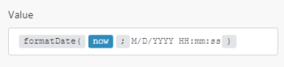

# [!DNL Google Sheets] モジュール

[!DNL Adobe Workfront Fusion] のシナリオでは、[!DNL Google Sheets] を使用するワークフローを自動化したり、複数のサードパーティアプリケーションやサービスに接続したりできます。

[!DNL Google Sheets] アカウントを [!DNL Workfront Fusion] に接続する方法については、[ [!DNL Adobe Workfront Fusion]  への接続の作成 - 基本手順](../../workfront-fusion/connections/connect-to-fusion-general.md)を参照してください。

## アクセス要件

この記事で説明している機能を使用するには、次のアクセス権が必要です。

<table style="table-layout:auto"> 
 <col> 
 <col> 
 <tbody> 
  <tr> 
   <td role="rowheader">[!DNL Adobe Workfront] プラン*</td>
  <td> 
[!UICONTROL Pro] 以降
 </td>
  </tr> 
  <tr data-mc-conditions=""> 
   <td role="rowheader">[!DNL Adobe Workfront] ライセンス*</td>
   <td> 
[!UICONTROL Plan]、[!UICONTROL Work]
 </td> 
  </tr> 
  <tr> 
   <td role="rowheader">[!DNL Adobe Workfront Fusion] ライセンス**</td> 
   <td>
   
現在のライセンス要件：[!DNL Workfront Fusion] ライセンスは必要ありません。

   
または

   
従来のライセンス要件：[!UICONTROL [!DNL Workfront Fusion] for Work Automation and Integration] 

   </td> 
  </tr> 
  <tr> 
   <td role="rowheader">製品</td> 
   <td>
   
現在の製品要件：[!UICONTROL Select] または [!UICONTROL Prime] [!DNL Adobe Workfront] プランがある場合、この記事で説明する機能を使用するには [!DNL Adobe Workfront Fusion] と [!DNL Adobe Workfront] を組織で購入する必要があります。[!DNL Workfront Fusion] は、[!UICONTROL Ultimate] [!DNL Workfront] プランに含まれています。

   
または

   
レガシー製品要件：この記事で説明する機能を使用するには、組織で [!DNL Adobe Workfront Fusion] と [!DNL Adobe Workfront] を購入する必要があります。

   </td> 
  </tr> 
 </tbody> 
</table>

ご利用のプラン、ライセンスタイプまたはアクセス権を確認するには、[!DNL Workfront] 管理者にお問い合わせください。

[!DNL Adobe Workfront Fusion] ライセンスについて詳しくは、[[!DNL Adobe Workfront Fusion]  ライセンス](../../workfront-fusion/get-started/license-automation-vs-integration.md)を参照してください。

## 前提条件

[!UICONTROL Google スプレッドシート]モジュールを使用するには、[!UICONTROL Google] アカウントが必要です。

## トリガー

### [!UICONTROL 行を監視]

スプレッドシートに新規追加されたすべての行から値を取得します。

このモジュールは、以前に入力されたことのない新しい行のみを取得します。このトリガーは、上書きされた行を処理しません。

>[!IMPORTANT]
>
>ワークシートに空白の行が含まれている場合、空白の行以降の行は処理されません。

<table style="table-layout:auto"> 
 <col> 
 <col> 
 <tbody> 
  <tr> 
   <td role="rowheader">[!UICONTROL Connection] </td> 
   <td> 
[!DNL Google Sheets] アカウントを [!DNL Workfront Fusion] に接続する手順については、<a href="../../workfront-fusion/scenarios/create-a-scenario.md" class="MCXref xref">[!DNL Adobe Workfront Fusion]</a> でのシナリオの作成の記事で、<a href="../../workfront-fusion/scenarios/create-a-scenario.md#connect" class="MCXref xref">モジュールのアプリまたは web サービスを [!DNL Workfront Fusion]</a> に接続を参照してください。
 </td> 
  </tr> 
  <tr> 
   <td role="rowheader">[!UICONTROL Spreadsheet] </td> 
   <td> 
監視するシートが含まれているスプレッドシートを選択します。
 </td> 
  </tr> 
  <tr> 
   <td role="rowheader">[!UICONTROL Sheet] </td> 
   <td> 
新しい行を監視するシートを選択します。
 </td> 
  </tr> 
  <tr> 
   <td role="rowheader">[!UICONTROL Table contains headers]</td> 
   <td> 
 スプレッドシートにヘッダー行を含めるかどうかを選択します。
 
    <ul> 
     <li> 
<strong>[!UICONTROL Yes]</strong> 
 
モジュールは、出力データとしてヘッダー行を取得しません。 
 
出力内の変数名は、ヘッダーによって呼び出されます。
 </li> 
     <li> 
<strong>[!UICONTROL No]</strong> 
 
また、このモジュールは、最初のテーブル行を取得します。
 
出力内の変数名は、A、B、C、D などと呼ばれます。
 </li> 
    </ul> </td> 
  </tr> 
  <tr> 
   <td role="rowheader">[!UICONTROL Row with headers] </td> 
   <td> 
ヘッダー行の範囲を入力します。例：<code>A1:F1</code>
 </td> 
  </tr> 
  <tr> 
   <td role="rowheader">[!UICONTROL First table row]</td> 
   <td> 
テーブルの最初の行の範囲を入力します。例：<code>A1:F1</code>
 </td> 
  </tr> 
  <tr> 
   <td role="rowheader"> 
[!UICONTROL Value render option]
 </td> 
   <td> 
[!UICONTROL Formatted value]
 
値はセルの書式設定に従って計算され、返信で書式設定されます。書式設定は、リクエスト元のユーザーのロケールではなく、スプレッドシートのロケールに基づいて行われます。例えば、<code>A1</code> が <code>1.23</code>、<code>A2</code> が <code>=A1</code> で通貨の形式に設定されている場合、<code>A2</code> は <code>"$1.23"</code> を返します。
 
[!UICONTROL Unformatted value]
 
値は計算されますが、返信では書式設定されません。例えば、<code>A1</code> が <code>1.23</code>、<code>A2</code> が <code>=A1</code> で通貨の形式に設定されている場合、<code>A2</code> は数値 <code>"1.23"</code> を返します。
 
[!UICONTROL Formula]
 
値は計算されません。返信には数式が含まれます。例えば、<code>A1</code> が <code>1.23</code>、<code>A2</code> が <code>=A1</code> で通貨の形式に設定されている場合、<code>A2</code> は <code>"=A1"</code> を返します。
 </td> 
  </tr> 
  <tr> 
   <td role="rowheader"> 
[!UICONTROL Date and time render option]
 </td> 
   <td> 
[!UICONTROL Serial number]
 
日付、時刻、日時、期間の各フィールドを、Lotus 1-2-3 によって一般化された「シリアル番号」形式で倍精度に出力するように指示します。値の整数部分（小数点の左側）は、1899年12月30日からの日数を数えます。小数部分（小数点の右側）は、時間を日の端数として数えます。例えば、1900年1月1日の正午は、1899年12月30日の 2 日後で、正午は半日後なので 0.5 なので 2.5 になります。1900年2 月1日午後 3 時は 33.625 となります。1900 年が閏年ではないことが正しく処理されます。
 
[!UICONTROL Formatted string]
 
日付、時間、日時、期間の各フィールドを指定された数値形式（スプレッドシートのロケールに依存）で文字列として出力するように指示します。
 </td> 
  </tr> 
  <tr> 
   <td role="rowheader">[!UICONTROL Limit] </td> 
   <td> 
[!DNL Workfront Fusion] が 1 回の実行サイクルで処理する結果の最大数を設定します。
 </td> 
  </tr> 
 </tbody> 
</table>

## アクション

* [[!UICONTROL 行追加]](#add-a-row)
* [[!UICONTROL 行を更新]](#update-a-row)
* [[!UICONTROL 行をクリア]](#clear-a-row)
* [[!UICONTROL 行を削除]](#delete-a-row)
* [[!UICONTROL セルを取得]](#get-a-cell)
* [[!UICONTROL セルを更新]](#update-a-cell)
* [[!UICONTROL セルをクリア]](#clear-a-cell)
* [[!UICONTROL シートを追加]](#add-a-sheet)
* [[!UICONTROL スプレッドシートを作成]](#create-a-spreadsheet)
* [[!UICONTROL シートを削除]](#delete-a-sheet)
* [[!UICONTROL API 呼び出し]](#make-an-api-call)

### [!UICONTROL 行を追加]

このモジュールは、シートに行を追加します。

[!DNL Google Sheets]モジュールを設定すると、[!DNL Workfront Fusion] に以下のフィールドが表示されます。これらに加えて、アプリまたはサービスのアクセスレベルなどの要因に応じて、追加の [!DNL Google Sheets] フィールドが表示される場合があります。モジュール内の太字のタイトルは、必須フィールドを示します。

フィールドまたは関数の上にマップボタンが表示されている場合は、このボタンを使用すると、そのフィールドの変数や関数を設定できます。詳しくは、[ [!DNL Adobe Workfront Fusion]](../../workfront-fusion/mapping/map-information-between-modules.md) のモジュール間での情報のマッピングを参照してください。

<table style="table-layout:auto"> 
 <col> 
 <col> 
 <tbody> 
  <tr> 
   <td>[!UICONTROL Connection] </td> 
   <td> 
[!DNL Google Sheets] アカウントを [!DNL Workfront Fusion] に接続する手順については、<a href="../../workfront-fusion/scenarios/create-a-scenario.md" class="MCXref xref">[!DNL Adobe Workfront Fusion]</a> でのシナリオの作成の記事で、<a href="../../workfront-fusion/scenarios/create-a-scenario.md#connect" class="MCXref xref">モジュールのアプリまたは web サービスを [!DNL Workfront Fusion]</a> に接続を参照してください。
 </td> 
  </tr> 
  <tr> 
   <td>[!UICONTROL Mode]</td> 
   <td> 
スプレッドシートとシートを手動で選択するか、マッピングを行うかを選択します。
 
メモ：手動マッピングは、新しいスプレッドシートが [!DNL Workfront Fusion] シナリオで作成され、新しく作成されたスプレッドシートにデータをシナリオ内で直接追加する場合などに役立ちます。
 </td> 
  </tr> 
  <tr> 
   <td>[!UICONTROL Spreadsheet] </td> 
   <td> 
[!DNL Google] スプレッドシートを選択します。
 </td> 
  </tr> 
  <tr> 
   <td>[!UICONTROL Sheet] </td> 
   <td> 
行を追加するシートを選択します。
 </td> 
  </tr> 
  <tr> 
   <td>[!UICONTROL Column Range]</td> 
   <td>使用する列の範囲を選択します。</td> 
  </tr> 
  <tr> 
   <td>[!UICONTROL Table contains headers]</td> 
   <td> 
 スプレッドシートにヘッダー行を含めるかどうかを選択します。
 
    <ul> 
     <li> 
<strong>[!UICONTROL Yes]</strong> 
 
モジュールは、出力データとしてヘッダー行を取得しません。 
 
出力内の変数名は、ヘッダーによって呼び出されます。
 </li> 
     <li> 
<strong>[!UICONTROL No]</strong> 
 
また、このモジュールは、最初のテーブル行を取得します。
 
出力内の変数名は、A、B、C、D などと呼ばれます。
 </li> 
    </ul> </td> 
  </tr> 
  <tr> 
   <td>[!UICONTROL Values] </td> 
   <td> 
追加する行の目的のセルを入力またはマッピングします。
 </td> 
  </tr> 
  <tr> 
   <td>[!UICONTROL Value input option]</td> 
   <td> 
    <ul> 
     <li> 
<strong>[!UICONTROL User entered]</strong>
 
値は、ユーザーが UI に入力したかのように解析されます。数値は数値のまま保持されますが、文字列の場合は [!DNL Google Sheets] UI を経由してセルにテキストを入力する時に適用されるルールと同じルールに従って数値、日付、もしくは他の形式に変換される可能性があります。
 </li> 
     <li> 
<strong>[!UICONTROL Raw]</strong> 
 
 ユーザーが入力した値は解析されず、そのまま保存されます。 
 </li> 
    </ul> </td> 
  </tr> 
  <tr> 
   <td>[!UICONTROL Insert data option]</td> 
   <td> 
新しいデータが入力されるときの既存のデータの変更方法を指定します。 
 
    <ul> 
     <li> 
<strong>[!UICONTROL Insert rows]</strong>
 
行が新しいデータ用に挿入されます。
 </li> 
     <li> 
<strong>[!UICONTROL Overwrite]</strong> 
 
新しいデータは、書き込まれたエリアの既存のデータを上書きします。シートの末尾にデータを追加すると、新しい行または列が挿入され、データを書き込むことができます。
 </li> 
    </ul> </td> 
  </tr> 
 </tbody> 
</table>

### [!UICONTROL 行の更新]

このモジュールでは、選択した行のセルの内容を変更できます。

<table style="table-layout:auto"> 
 <col> 
 <col> 
 <tbody> 
  <tr> 
   <td>[!UICONTROL Connection] </td> 
   <td> 
[!DNL Google Sheets] アカウントを [!DNL Workfront Fusion] に接続する手順については、<a href="../../workfront-fusion/scenarios/create-a-scenario.md" class="MCXref xref">[!DNL Adobe Workfront Fusion]</a> でのシナリオの作成の記事で、<a href="../../workfront-fusion/scenarios/create-a-scenario.md#connect" class="MCXref xref">モジュールのアプリまたは web サービスを [!DNL Workfront Fusion]</a> に接続を参照してください。
 </td> 
  </tr> 
  <tr> 
   <td>[!UICONTROL Mode]</td> 
   <td> 
スプレッドシートとシートを手動で選択するか、マッピングを行うかを選択します。
 
メモ：手動マッピングは、新しいスプレッドシートが [!UICONTROL Workfront Fusion] シナリオで作成され、新しく作成されたスプレッドシートにデータをシナリオ内で直接追加する場合などに役立ちます。
 </td> 
  </tr> 
  <tr> 
   <td>[!UICONTROL Spreadsheet] </td> 
   <td> 
[!DNL Google] スプレッドシートを選択します。
 </td> 
  </tr> 
  <tr> 
   <td>[!UICONTROL Sheet] </td> 
   <td> 
行を更新するシートを選択します。
 </td> 
  </tr> 
  <tr> 
   <td>[!UICONTROL Row number]</td> 
   <td> 
 更新する行の数を入力します。
 </td> 
  </tr> 
  <tr> 
   <td>[!UICONTROL Table contains headers]</td> 
   <td> 
 スプレッドシートにヘッダー行を含めるかどうかを選択します。
 
    <ul> 
     <li> 
<strong>[!UICONTROL Yes]</strong> 
 
モジュールは、出力データとしてヘッダー行を取得しません。 
 
出力内の変数名は、ヘッダーによって呼び出されます。
 </li> 
     <li> 
<strong>[!UICONTROL No]</strong> 
 
また、このモジュールは、最初のテーブル行を取得します。
 
出力内の変数名は、A、B、C、D などと呼ばれます。
 </li> 
    </ul> </td> 
  </tr> 
  <tr> 
   <td>[!UICONTROL Values] </td> 
   <td> 
変更（更新）する行の目的のセルに値を入力またはマッピングします。
 </td> 
  </tr> 
  <tr> 
   <td>[!UICONTROL Value input option]</td> 
   <td> 
    <ul> 
     <li> 
<strong>[!UICONTROL User entered]</strong>
 
値は、ユーザーが UI に入力したかのように解析されます。数値は数値のまま保持されますが、文字列の場合は [!DNL Google Sheets] UI を経由してセルにテキストを入力する時に適用されるルールと同じルールに従って数値、日付、もしくは他の形式に変換される可能性があります。
 </li> 
     <li> 
<strong>[!UICONTROL Raw]</strong> 
 
 ユーザーが入力した値は解析されず、そのまま保存されます。 
 </li> 
    </ul> </td> 
  </tr> 
 </tbody> 
</table>

### [!UICONTROL 行のクリア]

指定した行から値を削除します。

<table style="table-layout:auto"> 
 <col> 
 <col> 
 <tbody> 
  <tr> 
   <td>[!UICONTROL Connection] </td> 
   <td> 
[!DNL Google Sheets] アカウントを [!DNL Workfront Fusion] に接続する手順については、<a href="../../workfront-fusion/scenarios/create-a-scenario.md" class="MCXref xref">[!DNL Adobe Workfront Fusion]</a> でのシナリオの作成の記事で、<a href="../../workfront-fusion/scenarios/create-a-scenario.md#connect" class="MCXref xref">モジュールのアプリまたは web サービスを [!DNL Workfront Fusion]</a> に接続を参照してください。
 </td> 
  </tr> 
  <tr> 
   <td>[!UICONTROL Spreadsheet] </td> 
   <td> 
行をクリアするシートを含む [!DNL Google] スプレッドシートを選択します。
 </td> 
  </tr> 
  <tr> 
   <td>[!UICONTROL Sheet] </td> 
   <td> 
 データをクリアするシートを選択します。
 </td> 
  </tr> 
  <tr> 
   <td>[!UICONTROL Row number]</td> 
   <td> 
データをクリアする行の数を入力します。例：<code> 23</code>
 </td> 
  </tr> 
 </tbody> 
</table>

### [!UICONTROL 行を削除]

指定した行を削除します。

<table style="table-layout:auto"> 
 <col> 
 <col> 
 <tbody> 
  <tr> 
   <td>[!UICONTROL Connection] </td> 
   <td> 
[!DNL Google Sheets] アカウントを [!DNL Workfront Fusion] に接続する手順については、<a href="../../workfront-fusion/scenarios/create-a-scenario.md" class="MCXref xref">[!DNL Adobe Workfront Fusion]</a> でのシナリオの作成の記事で、<a href="../../workfront-fusion/scenarios/create-a-scenario.md#connect" class="MCXref xref">モジュールのアプリまたは web サービスを [!DNL Workfront Fusion]</a> に接続を参照してください。
 </td> 
  </tr> 
  <tr> 
   <td>[!UICONTROL Spreadsheet] </td> 
   <td> 
行をクリアするシートを含む Google スプレッドシートを選択します。
 </td> 
  </tr> 
  <tr> 
   <td>スプレッドシート </td> 
   <td> 
行を削除するシートを選択します。
 </td> 
  </tr> 
  <tr> 
   <td>行番号</td> 
   <td> 
削除する行の数を入力します。例： <code>23</code>
 </td> 
  </tr> 
 </tbody> 
</table>

### [!UICONTROL セルを取得]

選択したセルから値を取得します。

<table style="table-layout:auto"> 
 <col> 
 <col> 
 <tbody> 
  <tr> 
   <td>[!UICONTROL Connection] </td> 
   <td> 
[!DNL Google Sheets] アカウントを [!DNL Workfront Fusion] に接続する手順については、<a href="../../workfront-fusion/scenarios/create-a-scenario.md" class="MCXref xref">[!DNL Adobe Workfront Fusion]</a> でのシナリオの作成の記事で、<a href="../../workfront-fusion/scenarios/create-a-scenario.md#connect" class="MCXref xref">モジュールのアプリまたは web サービスを [!DNL Workfront Fusion]</a> に接続を参照してください。
 </td> 
  </tr> 
  <tr> 
   <td>[!UICONTROL Spreadsheet] </td> 
   <td> 
[!DNL Google] スプレッドシートを選択します。
 </td> 
  </tr> 
  <tr> 
   <td>[!UICONTROL Sheet] </td> 
   <td> 
データを取得するセルを含むシートを選択します。
 </td> 
  </tr> 
  <tr> 
   <td>[!UICONTROL Cell] </td> 
   <td> 
データの取得元のセルの ID を入力します。例： <code>A6</code>
 </td> 
  </tr> 
  <tr> 
   <td>[!UICONTROL Value render option]</td> 
   <td> 
[!UICONTROL Formatted value]
 
値はセルの書式設定に従って計算され、返信で書式設定されます。書式設定は、リクエスト元のユーザーのロケールではなく、スプレッドシートのロケールに基づいて行われます。例えば、<code>A1</code> が <code>1.23</code>、<code>A2</code> が <code>=A1</code> で通貨の形式に設定されている場合、<code>A2</code> は <code>"$1.23"</code> を返します。
 
[!DNL Unformatted value]
 
値は計算されますが、返信では書式設定されません。例えば、<code>A1</code> が <code>1.23</code>、<code>A2</code> が <code>=A1</code> で通貨の形式に設定されている場合、<code>A2</code> は数値 <code>"1.23"</code> を返します。
 
[!DNL Formula]
 
値は計算されません。返信には数式が含まれます。例えば、<code>A1</code> が <code>1.23</code>、<code>A2</code> が <code>=A1</code> で通貨の形式に設定されている場合、<code>A2</code> は <code>"=A1"</code> を返します。
 </td> 
  </tr> 
  <tr> 
   <td>[!DNL Date and time render option]</td> 
   <td> 
[!DNL Serial number]
 
日付、時刻、日時、期間の各フィールドを、Lotus 1-2-3 によって一般化された「シリアル番号」形式で倍精度に出力するように指示します。値の整数部分（小数点の左側）は、1899年12月30日からの日数を数えます。小数部分（小数点の右側）は、時間を日の端数として数えます。例えば、1900年1月1日の正午は、1899年12月30日の 2 日後で、正午は半日後なので 0.5 なので 2.5 になります。1900年2 月1日午後 3 時は 33.625 となります。1900 年が閏年ではないことが正しく処理されます。
 
[!DNL Formatted string]
 
日付、時間、日時、期間の各フィールドを指定された数値形式（スプレッドシートのロケールに依存）で文字列として出力するように指示します。
 </td> 
  </tr> 
 </tbody> 
</table>

### [!UICONTROL セルを更新]

<table style="table-layout:auto"> 
 <col> 
 <col> 
 <tbody> 
  <tr> 
   <td>[!UICONTROL Connection] </td> 
   <td> 
[!DNL Google Sheets] アカウントを [!DNL Workfront Fusion] に接続する手順については、<a href="../../workfront-fusion/scenarios/create-a-scenario.md" class="MCXref xref">[!DNL Adobe Workfront Fusion]</a> でのシナリオの作成の記事で、<a href="../../workfront-fusion/scenarios/create-a-scenario.md#connect" class="MCXref xref">モジュールのアプリまたは web サービスを [!DNL Workfront Fusion]</a> に接続を参照してください。
 </td> 
  </tr> 
  <tr> 
   <td>[!UICONTROL Spreadsheet] </td> 
   <td> 
[!DNL Google] スプレッドシートを選択します。
 </td> 
  </tr> 
  <tr> 
   <td>[!UICONTROL Cell] </td> 
   <td> 
更新するセルの ID を入力します。例： <code>A5</code>
 </td> 
  </tr> 
  <tr> 
   <td>[!UICONTROL Value]</td> 
   <td> 
セルの新しい値を入力します。
 </td> 
  </tr> 
  <tr> 
   <td>[!UICONTROL Value input option]</td> 
   <td> 
    <ul> 
     <li> 
<strong>[!UICONTROL User entered]</strong>
 
値は、ユーザーが UI に入力したかのように解析されます。数値は数値のまま保持されますが、文字列の場合は [!DNL Google Sheets] UI を経由してセルにテキストを入力する時に適用されるルールと同じルールに従って数値、日付、もしくは他の形式に変換される可能性があります。
 </li> 
     <li> 
<strong>[!UICONTROL Raw]</strong> 
 
 ユーザーが入力した値は解析されず、そのまま保存されます。 
 </li> 
    </ul> </td> 
  </tr> 
 </tbody> 
</table>

### [!UICONTROL セルのクリア]

指定したセルから値を削除します。

<table style="table-layout:auto"> 
 <col> 
 <col> 
 <tbody> 
  <tr> 
   <td>[!UICONTROL Connection] </td> 
   <td> 
[!DNL Google Sheets] アカウントを [!DNL Workfront Fusion] に接続する手順については、<a href="../../workfront-fusion/scenarios/create-a-scenario.md" class="MCXref xref">[!DNL Adobe Workfront Fusion]</a> でのシナリオの作成の記事で、<a href="../../workfront-fusion/scenarios/create-a-scenario.md#connect" class="MCXref xref">モジュールのアプリまたは web サービスを [!DNL Workfront Fusion]</a> に接続を参照してください。
 </td> 
  </tr> 
  <tr> 
   <td>[!UICONTROL Spreadsheet] </td> 
   <td> 
セルをクリアするシートを含む Google スプレッドシートを選択します。
 </td> 
  </tr> 
  <tr> 
   <td>[!UICONTROL Sheet] </td> 
   <td> 
セルをクリアするシートを選択します。
 </td> 
  </tr> 
  <tr> 
   <td>[!UICONTROL Cell] </td> 
   <td> 
クリアするセルの ID を入力します。例：<code>A5</code>
 </td> 
  </tr> 
 </tbody> 
</table>

### [!UICONTROL シートを追加]

選択したスプレッドシートにシートを新規作成します。

<table style="table-layout:auto"> 
 <col> 
 <col> 
 <tbody> 
  <tr> 
   <td>[!UICONTROL Connection] </td> 
   <td> 
[!DNL Google Sheets] アカウントを [!DNL Workfront Fusion] に接続する手順については、<a href="../../workfront-fusion/scenarios/create-a-scenario.md" class="MCXref xref">[!DNL Adobe Workfront Fusion]</a> でのシナリオの作成の記事で、<a href="../../workfront-fusion/scenarios/create-a-scenario.md#connect" class="MCXref xref">モジュールのアプリまたは web サービスを [!DNL Workfront Fusion]</a> に接続を参照してください。
 </td> 
  </tr> 
  <tr> 
   <td>[!UICONTROL Spreadsheet] </td> 
   <td> 
シートを追加する Google スプレッドシートを選択します。
 </td> 
  </tr> 
  <tr> 
   <td>[!UICONTROL Properties]</td> 
   <td> 
    <ul> 
     <li> 
[!UICONTROL Title]
 
新しいシートの名前を入力します。
 </li> 
     <li> 
[!UICONTROL Index]
 
シートの位置を入力します。既定値は 0（シートを最初の場所に配置）です
 </li> 
    </ul> </td> 
  </tr> 
 </tbody> 
</table>

### [!UICONTROL スプレッドシートの作成]

<table style="table-layout:auto"> 
 <col> 
 <col> 
 <tbody> 
  <tr> 
   <td>[!UICONTROL Connection] </td> 
   <td> 
[!DNL Google Sheets] アカウントを [!DNL Workfront Fusion] に接続する手順については、<a href="../../workfront-fusion/scenarios/create-a-scenario.md" class="MCXref xref">[!DNL Adobe Workfront Fusion]</a> でのシナリオの作成の記事で、<a href="../../workfront-fusion/scenarios/create-a-scenario.md#connect" class="MCXref xref">モジュールのアプリまたは web サービスを [!DNL Workfront Fusion]</a> に接続を参照してください。
 </td> 
  </tr> 
  <tr> 
   <td>[!UICONTROL Title] </td> 
   <td> 
新しいスプレッドシートの名前を入力します。
 </td> 
  </tr> 
  <tr> 
   <td>[!UICONTROL Locale]</td> 
   <td> 
スプレッドシートのロケールを次のいずれかの形式で入力します。
 
    <ul> 
     <li>ISO 639-1 言語コード（例： <code>en</code></li> 
     <li>ISO 639-2 言語コード（例：<code>haw</code>（639-1 コードが存在しない場合）</li> 
     <li>ISO 言語コードと国コードの組み合わせ（例： <code>en_US</code></li> 
    </ul> </td> 
  </tr> 
  <tr> 
   <td>[!UICONTROL Recalculation interval]</td> 
   <td> 
揮発性関数が再計算されるまでの待機時間：
 
[!UICONTROL On change]
 
揮発性関数は、変更のたびに更新されます。
 
[!UICONTROL On change and every minute]
 
揮発性関数は、変化のたびおよび 1 分ごとに更新されます。
 
[!UICONTROL On change and hourly]
 
揮発性関数は、変更のたびおよび 1 時間ごとに更新されます。
 </td> 
  </tr> 
  <tr> 
   <td>[!UICONTROL Time zone]</td> 
   <td> 
 スプレッドシートのタイムゾーンを選択します。
 </td> 
  </tr> 
  <tr> 
   <td>[!UICONTROL Number format]</td> 
   <td> 
スプレッドシート内のすべてのセルのデフォルトの形式を選択します。
 
<strong>[!UICONTROL Text]</strong>：テキストの書式設定。例： <code>1000. 12</code>
 
<strong>[!UICONTROL Number]</strong>：数値の書式設定。例： <code>1,000.12</code>
 
<strong>[!UICONTROL Percent]</strong>：割合の書式設定。例： <code>10. 12%</code>
 
<strong>[!UICONTROL Currency]</strong>：通貨の書式設定。例： <code>$1,000.12</code>
 
<strong>[!UICONTROL Date]</strong>：日付の書式設定。例： <code>9/26/2008</code>
 
<strong>[!UICONTROL Time]</strong>：時間の形式設定。例： <code>3:59:00 PM</code>
 
<strong>[!UICONTROL Date time]</strong>：日付と時刻の書式設定。例：<code>9/26/08 15:59:00</code> 
 
<strong>[!UICONTROL Scientific]</strong>指数の書式設定。例： <code>1. 01E+03</code>
 </td> 
  </tr> 
  <tr> 
   <td>[!UICONTROL Sheets] </td> 
   <td> 
<strong>[!UICONTROL Add]</strong> をクリックして、スプレッドシートにシートを追加します。各シートに、シートとシートのインデックスのタイトルを入力またはマッピングします。インデックス 0 は最初のシートを表します。
 </td> 
  </tr> 
 </tbody> 
</table>

### [!UICONTROL シートを削除]

特定のシートを削除します。

<table style="table-layout:auto"> 
 <col> 
 <col> 
 <tbody> 
  <tr> 
   <td>[!UICONTROL Connection] </td> 
   <td> 
[!DNL Google Sheets] アカウントを [!DNL Workfront Fusion] に接続する手順については、<a href="../../workfront-fusion/scenarios/create-a-scenario.md" class="MCXref xref">[!DNL Adobe Workfront Fusion]</a> でシナリオを作成するの記事で、<a href="../../workfront-fusion/scenarios/create-a-scenario.md#connect" class="MCXref xref">モジュールのアプリまたは web サービスを [!DNL Workfront Fusion]</a> に接続を参照してください。
 </td> 
  </tr> 
  <tr> 
   <td>[!UICONTROL Spreadsheet] </td> 
   <td> 
[!DNL Google] スプレッドシートを選択します。
 </td> 
  </tr> 
  <tr> 
   <td>[!UICONTROL Sheet] </td> 
   <td> 
削除するシートを選択します。
 </td> 
  </tr> 
 </tbody> 
</table>

### [!UICONTROL API 呼び出し]

このアクションモジュールでは、カスタム API 呼び出しを実行できます。

<table style="table-layout:auto"> 
 <col> 
 <col> 
 <tbody> 
  <tr> 
   <td role="rowheader">[!UICONTROL Connection]</td> 
   <td> 
[Fusion App] アカウントを [!DNL Workfront Fusion] に接続する方法については、<a href="../../workfront-fusion/connections/connect-to-fusion-general.md" class="MCXref xref">接続の作成[!DNL Adobe Workfront Fusion] - 基本手順</a>を参照してください。
 </td> 
  </tr> 
  <tr> 
   <td role="rowheader"> 
[!UICONTROL URL]
 </td> 
   <td><code>https://sheets.googleapis.com/v4/</code> への相対パスを入力します。</td> 
  </tr> 
  <tr> 
   <td role="rowheader"> 
[!UICONTROL Method]
 </td> 
   <td> 
API 呼び出しの設定に必要な HTTP リクエストメソッドを選択します。詳しくは、<a href="../../workfront-fusion/modules/http-request-methods.md" class="MCXref xref">[!DNL Adobe Workfront Fusion]</a> での HTTP リクエスト方法を参照してください。
 </td> 
  </tr> 
  <tr> 
   <td role="rowheader">[!UICONTROL Headers]</td> 
   <td> 
例えば <code>{"Content-type":"application/json"}</code> のように、標準の JSON オブジェクトの形式でリクエストのヘッダーを追加します。[!DNL Workfront Fusion] は認証ヘッダーを追加します。
 </td> 
  </tr> 
  <tr> 
   <td role="rowheader">[!UICONTROL Query String]</td> 
   <td> 
 API 呼び出しのクエリを標準 JSON オブジェクトの形式で追加します。
 </td> 
  </tr> 
  <tr> 
   <td role="rowheader">[!UICONTROL Body]</td> 
   <td> 
標準の JSON オブジェクトの形式で、API 呼び出しの本文の内容を追加します。
 
メモ：   
<code>if</code> などの条件ステートメントを JSON で使用する場合は、条件ステートメントの外側に引用符を挿入します。
 
     
Example: </b>">  
      
  
 
     
 
 </td> 
  </tr> 
 </tbody> 
</table>

## 検索

* [[!UICONTROL 行を検索]](#search-rows)
* [[!UICONTROL 行を検索（詳細）]](#search-rows-advanced)
* [[!UICONTROL 範囲の値を取得]](#get-range-values)
* [[!UICONTROL シートをリスト]](#list-sheets)

### [!UICONTROL 行を検索]

フィルターオプションを使用して行を検索します。

<table style="table-layout:auto"> 
 <col data-mc-conditions=""> 
 <col data-mc-conditions=""> 
 <tbody> 
  <tr> 
   <td>[!UICONTROL Connection] </td> 
   <td> 
[Fusion App] アカウントを [!DNL Workfront Fusion] に接続する方法については、<a href="../../workfront-fusion/connections/connect-to-fusion-general.md" class="MCXref xref">接続の作成[!DNL Adobe Workfront Fusion] - 基本手順</a>を参照してください。
 </td> 
  </tr> 
  <tr> 
   <td>[!UICONTROL Spreadsheet] </td> 
   <td> 
[!DNL Google] スプレッドシートを選択します。
 </td> 
  </tr> 
  <tr> 
   <td>[!UICONTROL Sheet] </td> 
   <td> 
行を検索するシートを選択します。
 </td> 
  </tr> 
  <tr> 
   <td>[!UICONTROL Table contains headers]</td> 
   <td> 
 スプレッドシートにヘッダー行を含めるかどうかを選択します。[!UICONTROL Yes] オプションが選択されている場合、出力データと出力内の変数名がヘッダーによって呼び出されるので、モジュールはヘッダー行を取得しません。[!UICONTROL No] オプションが選択されている場合、モジュールはまた、出力内の最初のテーブル行と変数名を取得し、その後 A、B、C、D などと呼ばれます。
 </td> 
  </tr> 
  <tr> 
   <td>[!UICONTROL Column range]</td> 
   <td>操作する列の範囲を選択します。例： <code>A-F</code></td> 
  </tr> 
  <tr> 
   <td>[!UICONTROL Filter]</td> 
   <td> 
検索する行のフィルターを設定します。
 
フィルターについて詳しくは、<a href="../../workfront-fusion/scenarios/add-a-filter-to-a-scenario.md" class="MCXref xref">[!UICONTROL Adobe Workfront Fusion] のシナリオへのフィルターの追加</a>を参照してください。
 </td> 
  </tr> 
  <tr> 
   <td>[!UICONTROL Sort order]</td> 
   <td>昇順と降順のどちらで並べ替えるかを選択します。</td> 
  </tr> 
  <tr> 
   <td>[!UICONTROL Order by]</td> 
   <td>並べ替える列を選択します。</td> 
  </tr> 
  <tr> 
   <td>[!UICONTROL Value render option]</td> 
   <td> 
[!UICONTROL Formatted value]
 
値はセルの書式設定に従って計算され、返信で書式設定されます。書式設定は、リクエスト元のユーザーのロケールではなく、スプレッドシートのロケールに基づいて行われます。例えば、<code>A1</code> が <code>1.23</code>、<code>A2</code> が <code>=A1</code> で通貨の形式に設定されている場合、<code>A2</code> は <code>"$1.23"</code> を返します。
 
[!UICONTROL Unformatted value]
 
値は計算されますが、返信では書式設定されません。例えば、<code>A1</code> が <code>1.23</code>、<code>A2</code> が <code>=A1</code> で通貨の形式に設定されている場合、<code>A2</code> は数値 <code>"1.23"</code> を返します。
 
[!UICONTROL Formula]
 
値は計算されません。返信には数式が含まれます。例えば、<code>A1</code> が <code>1.23</code>、<code>A2</code> が <code>=A1</code> で通貨の形式に設定されている場合、<code>A2</code> は <code>"=A1"</code> を返します。
 </td> 
  </tr> 
  <tr> 
   <td>[!UICONTROL Date and time render option]</td> 
   <td> 
[!UICONTROL Serial number]
 
日付、時刻、日時、期間の各フィールドを、Lotus 1-2-3 によって一般化された「シリアル番号」形式で倍精度に出力するように指示します。値の整数部分（小数点の左側）は、1899年12月30日からの日数を数えます。小数部分（小数点の右側）は、時間を日の端数として数えます。例えば、1900年1月1日の正午は、1899年12月30日の 2 日後で、正午は半日後なので 0.5 なので 2.5 になります。1900年2 月1日午後 3 時は 33.625 となります。1900 年が閏年ではないことが正しく処理されます。
 
[!UICONTROL Formatted string]
 
日付、時間、日時、期間の各フィールドを指定された数値形式（スプレッドシートのロケールに依存）で文字列として出力するように指示します。
 </td> 
  </tr> 
  <tr> 
   <td>[!UICONTROL Maximum number of returned rows]</td> 
   <td>[!DNL Workfront Fusion] が 1 回の実行サイクルで返す行の最大数を設定します。</td> 
  </tr> 
 </tbody> 
</table>

### [!UICONTROL 行の検索（詳細）]

指定された条件に一致する結果を返します。

<table style="table-layout:auto"> 
 <col> 
 <col> 
 <tbody> 
  <tr> 
   <td>[!UICONTROL Connection] </td> 
   <td> 
[!DNL Google Sheets] アカウントを [!DNL Workfront Fusion] に接続する手順については、<a href="../../workfront-fusion/scenarios/create-a-scenario.md" class="MCXref xref">[!DNL Adobe Workfront Fusion]</a> でのシナリオの作成の記事で、<a href="../../workfront-fusion/scenarios/create-a-scenario.md#connect" class="MCXref xref">モジュールのアプリまたは web サービスを [!DNL Workfront Fusion]</a> に接続を参照してください。
 </td> 
  </tr> 
  <tr> 
   <td>[!UICONTROL Spreadsheet] </td> 
   <td> 
検索するシートを含む Google スプレッドシートを選択します。
 </td> 
  </tr> 
  <tr> 
   <td>[!UICONTROL Sheet] </td> 
   <td> 
検索する行を含むシートを選択します。
 </td> 
  </tr> 
  <tr> 
   <td>[!UICONTROL Query]</td> 
   <td> 
[!DNL Google Charts Query Language] を使用します。例： <code>select * where B = "John"</code>
 
[!DNL Google Charts Query Language] について詳しくは、[!DNL Google] ドキュメントの <a href="https://developers.google.com/chart/interactive/docs/querylanguage?hl=ja">クエリー関数リファレンス</a>を参照してください。
 </td> 
  </tr> 
 </tbody> 
</table>

### [!UICONTROL 範囲の値を取得]

<table style="table-layout:auto"> 
 <col> 
 <col> 
 <tbody> 
  <tr> 
   <td>[!UICONTROL Connection] </td> 
   <td> 
[!DNL Google Sheets] アカウントを [!DNL Workfront Fusion] に接続する手順については、<a href="../../workfront-fusion/scenarios/create-a-scenario.md" class="MCXref xref">[!DNL Adobe Workfront Fusion]</a> でのシナリオの作成の記事で、<a href="../../workfront-fusion/scenarios/create-a-scenario.md#connect" class="MCXref xref">モジュールのアプリまたは web サービスを [!DNL Workfront Fusion]</a> に接続を参照してください。
 </td> 
  </tr> 
  <tr> 
   <td>[!UICONTROL Spreadsheet] </td> 
   <td> 
[!DNL Google] スプレッドシートを選択します。
 </td> 
  </tr> 
  <tr> 
   <td>[!UICONTROL Sheet] </td> 
   <td> 
範囲の内容を取得するシートを選択します。
 </td> 
  </tr> 
  <tr> 
   <td>[!UICONTROL Range] </td> 
   <td> 
取得する範囲を入力します。例：<code>A1:D25</code>
 </td> 
  </tr> 
  <tr> 
   <td>[!UICONTROL Table contains headers]</td> 
   <td> 
シートにヘッダー行がある場合は、このチェックボックスをオンにする
 </td> 
  </tr> 
  <tr> 
   <td>[!UICONTROL Row with headers]</td> 
   <td>テーブルヘッダーの範囲を入力します。例：<code>A1:F1</code>このフィールドを空のままにした場合、[!DNL Workfront Fusion] では、指定した範囲の最初の行にヘッダーがあると仮定されます。</td> 
  </tr> 
  <tr> 
   <td>[!UICONTROL Value render option]</td> 
   <td> 
[!UICONTROL Formatted value]
 
値はセルの書式設定に従って計算され、返信で書式設定されます。書式設定は、リクエスト元のユーザーのロケールではなく、スプレッドシートのロケールに基づいて行われます。例えば、<code>A1</code> が <code>1.23</code>、<code>A2</code> が <code>=A1</code> で通貨の形式に設定されている場合、<code>A2</code> は <code>"$1.23"</code> を返します。
 
[!UICONTROL Unformatted value]
 
値は計算されますが、返信では書式設定されません。例えば、<code>A1</code> が <code>1.23</code>、<code>A2</code> が <code>=A1</code> で通貨の形式に設定されている場合、<code>A2</code> は数値 <code>"1.23"</code> を返します。
 
[!UICONTROL Formula]
 
値は計算されません。返信には数式が含まれます。例えば、<code>A1</code> が <code>1.23</code>、<code>A2</code> が <code>=A1</code> で通貨の形式に設定されている場合、<code>A2</code> は <code>"=A1"</code> を返します。
 </td> 
  </tr> 
  <tr> 
   <td>[!UICONTROL Date and time render option]</td> 
   <td> 
[!UICONTROL Serial number]
 
日付、時刻、日時、期間の各フィールドを、Lotus 1-2-3 によって一般化された「シリアル番号」形式で倍精度に出力するように指示します。値の整数部分（小数点の左側）は、1899年12月30日からの日数を数えます。小数部分（小数点の右側）は、時間を日の端数として数えます。例えば、1900年1月1日の正午は、1899年12月30日の 2 日後で、正午は半日後なので 0.5 なので 2.5 になります。1900年2 月1日午後 3 時は 33.625 となります。1900 年が閏年ではないことが正しく処理されます。
 
[!UICONTROL Formatted string]
 
日付、時間、日時、期間の各フィールドを指定された数値形式（スプレッドシートのロケールに依存）で文字列として出力するように指示します。
 </td> 
  </tr> 
 </tbody> 
</table>

### [!UICONTROL シートをリスト]

このモジュールは、スプレッドシート内のすべてのシートのリストを返します。

<table style="table-layout:auto"> 
 <col> 
 <col> 
 <tbody> 
  <tr> 
   <td>[!UICONTROL Connection] </td> 
   <td> 
[!DNL Google Sheets] アカウントを [!DNL Workfront Fusion] に接続する手順については、<a href="../../workfront-fusion/scenarios/create-a-scenario.md" class="MCXref xref">[!DNL Adobe Workfront Fusion]</a> でのシナリオの作成の記事で、<a href="../../workfront-fusion/scenarios/create-a-scenario.md#connect" class="MCXref xref">モジュールのアプリまたは web サービスを [!DNL Workfront Fusion]</a> に接続を参照してください。
 </td> 
  </tr> 
  <tr> 
   <td>[!UICONTROL Spreadsheet] </td> 
   <td> 
リストするシートが含まれている [!DNL Google] スプレッドシートを選択します。
 </td> 
  </tr> 
 </tbody> 
</table>

## 使用の制限

エラー `429: RESOURCE_EXHAUSTED` が発生した場合、API のレート制限を超えています。

[!DNL Google Sheets] API には、1 プロジェクトあたり 100 秒あたり 500 個のリクエストと、1 ユーザーあたり 100 秒あたり 100 個のリクエストという制限があります。読み取りと書き込みの制限は、別々に追跡されます。1 日の使用制限はありません。

詳しくは、[developers.google.com/sheets/api/limits](https://developers.google.com/sheets/api/limits) を参照してください。

## ヒントとテクニック

* [ [!DNL Google]  シートから空のセルを取得する方法](#how-to-get-empty-cells-from-a-google-sheet)
* [シートへのシナリオを実行するためのボタンの追加](#add-a-button-in-a-sheet-to-run-a-scenario)

### [!DNL Google Sheet] から空のセルを取得する方法 

[!UICONTROL 行の検索（詳細）] モジュールとこの式を使用して、空の列を取得します。
<pre>select * where E is null</pre>ここでは、「E」が列で、「is null」が条件です。[Google Query Lang]（https://developers.google.com/chart/interactive/docs/querylanguage）を使用して、より高度なクエリーを作成できます。

### シートへのシナリオを実行するためのボタンの追加

1. [!DNL Workfront Fusion] で、シナリオに **[!UICONTROL Web フック]**／**[!UICONTROL カスタム Web フック]**&#x200B;モジュール／トリガーを挿入し、構成します（[Web フック](../../workfront-fusion/apps-and-their-modules/webhooks-updated.md) を参照）。

1. Web フックの URL をコピーします。
1. シナリオを実行します。
1. Google Sheet のメインメニューバーから&#x200B;**[!UICONTROL 挿入]**／**[!UICONTROL 図面]**... を選択します。

1. [!UICONTROL 図面]ウィンドウで、ウィンドウの上部近くにある&#x200B;**[!UICONTROL テキストボックス]**&#x200B;アイコン  をクリックします。
1. ボタンをデザインし、右上隅にある「**[!UICONTROL 保存して閉じる]**」ボタンをクリックします。
1. ワークシートにボタンが配置されます。ボタンの右上隅にある 3 つの縦並びのドットをクリックします。
1. メニューから「**[!UICONTROL スクリプトを割り当て].**」を選択します。
1. スクリプト（関数）の名前（例：`runScenario`）を入力して、「**[!UICONTROL OK]**」をクリックします。
1. メインメニューバーから&#x200B;**[!UICONTROL ツール]**／**[!UICONTROL スクリプトエディター]**&#x200B;を選択します。

1. 次のコードを挿入します。

   * 関数の名前は、手順 9 で指定した名前に対応している必要があります。
   * この URL を、手順 2 でコピーした web フックの URL に置き換えます。

     <pre>function runScenario() {</pre><pre>UrlFetchApp.fetch("<webhook you copied>");</pre><pre>}</pre>

1. **[!UICONTROL Ctrl + S]** を押してスクリプトファイルを保存し、プロジェクト名を入力して「**[!UICONTROL OK]**」をクリックします。

1. [!DNL Google Sheets] に戻って、新しいボタンをクリックします。
1. スクリプトに必要な認証を付与します。
1. [!DNL Workfront Fusion] で、シナリオが正常に実行されたことを確認します。

## スプレッドシートでの日付の保存

日付の値を書式設定なしでスプレッドシートに保存した場合、ISO 8601 形式のテキストとしてスプレッドシートに表示されます。ただし、このテキストを理解しない日付に対応する [!DNL Google Sheets] 数式または関数（例：数式 `=A1+10`) を呼び出すと、次のエラーが表示されます。

[!DNL Google Sheets] が日付を理解できるようにするには、[[!UICONTROL formatDate] (date; format; [timezone])](../../workfront-fusion/functions/date-and-time-functions.md#formatda) 関数を使用して書式設定します。2 番目の引数として関数に渡される正しい形式は、スプレッドシートのロケール設定によって異なります。

正しい形式を判断するには、次の手順を実行します。

1. メインメニューバーから&#x200B;**[!UICONTROL ファイル]**／**[!UICONTROL スプレッドシート]**&#x200B;設定を選択して、ロケールを確認または設定します。

1. 適切なロケールを検証／設定したら、メイン メニューから&#x200B;**[!UICONTROL 形式]**／**[!UICONTROL 数値]**&#x200B;を選択して、対応する日付と時刻の形式を決定します。形式は、日付と時刻メニュー項目の横に表示されます。

1. [!UICONTROL formatDate()] 関数に渡す正しい形式を作成するには、 [!DNL Adobe Workfront Fusion]](../../workfront-fusion/functions/tokens-for-date-and-time-formatting.md) の日付と時刻の形式について [ トークンのリストを参照してください。

**例**：米国ロケールの `MM/DD/YYYY HH:mm:ss` 形式の使用：

## [!DNL Google Sheets] 関数の活用

ビルトイン関数がないが [!DNL Google Sheets] にある場合は、それを利用できます。詳しくは、 [!DNL Adobe Workfront Fusion]](../../workfront-fusion/functions/map-using-functions.md) での関数の使用による [[ マップ項目での  [!DNL Google Sheets]  関数](../../workfront-fusion/functions/map-using-functions.md#exploiti)の使用を参照してください。

## [!DNL Google Sheets] による数から日付への変更の阻止

[!DNL Google] ワークシートでは、テキストとして使用している数字の文字列が日付として解釈されている場合があります。例えば、テキストとして使用するために「1-2019」と入力すると、Google がこれを日付として解釈します。これを防ぐために、数値をプレーンテキストとして書式設定することができます。

1. [!DNL Google Sheets] で、数値を含む列またはセルをハイライト表示します。
1. **[!UICONTROL 形式]**／**[!UICONTROL 数字]**／**[!UICONTROL プレインテキスト]**&#x200B;をクリックします。

[!DNL Workfront Fusion] での別の回避策は、数値の前にアポストロフィ（&#39;）を入力することです（例：&#39;1-2019 または &#39;1/47）。[!DNL Workfront Fusion] からデータが送信された後、セルにはアポストロフィが表示されません。
