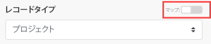

# [!UICONTROL HTTP]／[!UICONTROL リクエストの作成]モジュール

>[!NOTE]
>
>Adobe Workfront Fusion には、[!DNL Adobe Workfront] ライセンスに加えて [!DNL Adobe Workfront Fusion] ライセンスが必要です。

[!DNL Adobe Workfront Fusion] HTTP／[!UICONTROL リクエストモジュールの作成]は、HTTP リクエストを設定し、サーバーに送信できるユニバーサルモジュールです。受信した HTTP 応答は、出力バンドルに含まれます。

## アクセス要件

この記事で説明している機能を使用するには、次のアクセス権が必要です。

<table style="table-layout:auto"> 
 <col> 
 <col> 
 <tbody> 
  <tr> 
    <td role="rowheader">[!DNL Adobe Workfront] プラン*</td> 
   <td> 
[!UICONTROL Pro] 以降
 </td>
  </tr> 
  <tr data-mc-conditions=""> 
   <td role="rowheader">[!DNL Adobe Workfront] ライセンス*</td> 
   <td> 
[!UICONTROL Plan]、[!UICONTROL Work]
 </td> 
  </tr> 
  <tr> 
   <td role="rowheader">[!DNL Adobe Workfront Fusion] ライセンス**</td> 
   <td>
   
現在のライセンス要件：[!DNL Workfront Fusion] ライセンス要件がありません。

   
または

   
従来のライセンス要件：[!UICONTROL [!DNL Workfront Fusion] for Work Automation and Integration] 

   </td> 
  </tr> 
  <tr> 
   <td role="rowheader">製品</td> 
   <td>
   
現在の製品要件：[!UICONTROL Select] または [!UICONTROL Prime] [!DNL Adobe Workfront] プランをご利用の場合、この記事で説明されている機能を使用するには、組織が [!DNL Adobe Workfront] に加えて [!DNL Adobe Workfront Fusion] も購入する必要があります。[!DNL Workfront Fusion] は [!UICONTROL Ultimate] [!DNL Workfront] プランに含まれています。

   
または

   
従来の製品要件：この記事で説明されている機能を使用するには、組織が [!DNL Adobe Workfront] に加えて [!DNL Adobe Workfront Fusion] も購入する必要があります。

   </td> 
  </tr> 
 </tbody> 
</table>

ご利用のプラン、ライセンスタイプまたはアクセス権を確認するには、[!DNL Workfront] 管理者にお問い合わせください。

[!DNL Adobe Workfront Fusion] ライセンスについて詳しくは、[Adobe Workfront Fusion ライセンス](../../../workfront-fusion/get-started/license-automation-vs-integration.md)を参照してください。

## [!UICONTROL HTTP]／[!UICONTROL リクエストの作成]モジュールの設定

[!UICONTROL HTTP]／[!UICONTROL リクエストの作成]モジュールを設定すると、[!DNL Adobe Workfront Fusion] には以下のフィールドが表示されます。モジュール内の太字のタイトルは、必須フィールドを示します。

フィールドまたは関数の上にマップボタンが表示されている場合は、このボタンを使用すると、そのフィールドの変数や関数を設定できます。詳しくは、[ [!DNL Adobe Workfront Fusion]](../../../workfront-fusion/mapping/map-information-between-modules.md) でモジュールから別のモジュールに情報をマッピングを参照してください。

<table style="table-layout:auto"> 
 <col> 
 <col> 
 <tbody> 
  <tr> 
   <td role="rowheader">[!UICONTROL Evaluate all states as errors (except for 2xx and 3xx)] </td> 
   <td> 
エラー処理を設定するには、このオプションを使用します。
 
詳しくは、<a href="../../../workfront-fusion/errors/error-handling.md" class="MCXref xref">[!DNL Adobe Workfront Fusion]</a> でのエラー処理を参照してください。
 </td> 
  </tr> 
  <tr> 
   <td role="rowheader">[!UICONTROL URL] </td> 
   <td> 
API エンドポイント、ウェブサイトなど、リクエストの送信先 URL を入力します。
 </td> 
  </tr> 
  <tr> 
   <td role="rowheader"> 
[!UICONTROL Method]
 </td> 
   <td> 
API 呼び出しの設定に必要な HTTP リクエストメソッドを選択します。詳しくは、<a href="../../../workfront-fusion/modules/http-request-methods.md" class="MCXref xref">[!DNL Adobe Workfront Fusion]</a> での HTTP リクエストメソッドを参照してください。
 </td> 
  </tr> 
  <tr> 
   <td role="rowheader">[!UICONTROL Headers] </td> 
   <td> 
標準の JSON オブジェクトの形式でリクエストのヘッダーを追加します。例： <code>{"Content-type":"application/json"}</code>
 </td> 
  </tr> 
  <tr> 
   <td role="rowheader">[!UICONTROL Query String]</td> 
   <td> 
 目的のクエリのキーと値のペアを入力します。
 </td> 
  </tr> 
  <tr> 
   <td role="rowheader"> 
[!UICONTROL Body type]
 </td> 
   <td> 
HTTP 本文は、使用するヘッダーがある場合、そのヘッダーの直後に HTTP トランザクションメッセージで送信されるデータバイトです。
 
    <ul> 
     <li> 
<strong>[!UICONTROL Raw]</strong> 
 
Raw 本文タイプは、開発者向けドキュメントで送信するデータが指定されていない場合でも、通常、ほとんどの HTTP 本文リクエストに適しています。
 
データを解析する形式を [!UICONTROL Content type] フィールドに指定します。
 
選択したコンテンツタイプに関係なく、データは開発者ドキュメントで規定または必須されている形式で入力されます。
 </li> 
     <li> 
<strong>[!UICONTROL Application/x-www-form-urlencoded]</strong> 
 
この本文タイプは、<code>[!UICONTROL application/x-www-form-urlencoded]</code> を使用してデータを [!UICONTROL POST] します。
 
<code>application/x-www-form-urlencoded</code> の場合、サーバーに送信される HTTP メッセージの本文は基本的に 1 つのクエリ文字列になります。キーと値は、<code>&amp;</code> で区切られ、キーと値の間に <code>=</code> を持つキーと値のペアでエンコードされています。 
 
バイナリデータの場合は、代わりに <code>[!UICONTROL multipart/form-data]</code> を使用します。
 
      
Example: </b>">
       <b>例：</b> 
       
結果の HTTP リクエスト形式の例は、次のようになります。
 
       
<code>field1=value1&amp;field2=value2</code> 
 
      
 </li> 
     <li> 
<strong>[!UICONTROL Multipart/form-data]</strong> 
 
[!UICONTROL  Multipart/form-data] は、ファイルとデータの送信に使用される HTTP マルチパートリクエストです。通常、ファイルをサーバーにアップロードする際に使用されます。
 
リクエストで送信するフィールドを追加します。各フィールドには、キーと値のペアが含まれている必要があります。
 
      <ul> 
       <li> 
<strong>[!UICONTROL Text]</strong> 
 
リクエスト本文内で送信するキーと値を入力します。
 </li> 
       <li> 
<strong>[!UICONTROL File]</strong> 
 
キーを入力し、リクエスト本文で送信するソースファイルを指定します。
 
前のモジュールからアップロードするファイルをマッピングするか（[!UICONTROL HTTP]／&lbrack;[!UICONTROL Get a File] または [!UICONTROL Google Drive]／[!UICONTROL Download a File]）、またはファイル名とファイルデータを手動で入力します。
 </li> 
      </ul> </li> 
    </ul> </td> 
  </tr> 
  <tr> 
   <td role="rowheader"> 
[!UICONTROL Parse response]
 </td> 
   <td> 
このオプションを有効にすると、応答を自動的に解析し、JSON および XML 応答を変換するので、[!UICONTROL JSON]／[!UICONTROL Parse JSON] または [!UICONTROL XML]／[!UICONTROL Parse XML] モジュールを使用する必要がなくなります。
 
解析された JSON または XML コンテンツを使用する前に、モジュールを手動で 1 回実行して、モジュールが応答コンテンツを認識し、後続のモジュールにマッピングできるようにします。
 </td> 
  </tr> 
  <tr> 
   <td role="rowheader"> 
[!UICONTROL User name]
 </td> 
   <td> 
 基本認証を使用してリクエストを送信する場合は、ユーザー名を入力します。
 </td> 
  </tr> 
  <tr> 
   <td role="rowheader">[!UICONTROL Password] </td> 
   <td> 
基本認証を使用してリクエストを送信する場合は、パスワードを入力します。
 </td> 
  </tr> 
  <tr> 
   <td role="rowheader">[!UICONTROL Timeout] </td> 
   <td> 
リクエストのタイムアウトを秒単位で指定します（1～300）。デフォルトは 40 秒です。
 </td> 
  </tr> 
  <tr> 
   <td role="rowheader">[!UICONTROL Share cookies with other HTTP modules]</td> 
   <td> 
 このオプションを有効にすると、シナリオ内のすべての HTTP モジュールとサーバーから Cookie を共有できます。
 </td> 
  </tr> 
  <tr> 
   <td role="rowheader">[!UICONTROL Self-signed certificate]</td> 
   <td> 
 自己署名証明書を使用して TLS を使用する場合は、証明書をアップロードします。
 </td> 
  </tr> 
  <tr> 
   <td role="rowheader">[!UICONTROL Reject connections that are using unverified (self-signed) certificates] </td> 
   <td> 
このオプションを有効にすると、未検証の TLS 証明書を使用している接続を拒否できます。
 </td> 
  </tr> 
  <tr> 
   <td role="rowheader">[!UICONTROL Follow redirect]</td> 
   <td> 
 このオプションを有効にすると、3xx 応答で URL リダイレクトに従います。
 </td> 
  </tr> 
  <tr> 
   <td role="rowheader">[!UICONTROL Follow all redirects] </td> 
   <td> 
このオプションを有効にすると、すべての応答コードで URL リダイレクトに従います。
 </td> 
  </tr> 
  <tr> 
   <td role="rowheader"> 
[!UICONTROL Disable serialization of multiple same query string keys as arrays]
 </td> 
   <td> 
デフォルトでは、[!DNL Workfront Fusion] は、同じ URL クエリ文字列パラメーターキーの複数の値を配列として処理します。例えば、<code>www.test.com?foo=bar&amp;foo=baz</code> は <code>www.test.com?foo[0]=bar&amp;foo[1]=baz</code> に変換されます。このオプションをアクティブ化すると、この機能は無効になります。 
 </td> 
  </tr> 
  <tr> 
   <td role="rowheader">[!UICONTROL Request compressed content]</td> 
   <td> 
 このオプションを有効にすると、web サイトの圧縮バージョンを要求できます。
 
圧縮コンテンツをリクエストする <code>[!UICONTROL Accept-Encoding]</code> ヘッダーを追加します。
 </td> 
  </tr> 
  <tr> 
   <td role="rowheader">[!UICONTROL Use Mutual TLS]</td> 
   <td> 
このオプションを有効にすると、HTTP リクエストで相互 TLS を使用できます。
 
相互 TLS について詳しくは、<a href="../../../workfront-fusion/apps-and-their-modules/http-modules/use-mtls-in-http-modules.md" class="MCXref xref">[!DNL Adobe Workfront Fusion]</a> の HTTP モジュールでの相互 TLS の使用を参照してください。
 </td> 
  </tr> 
 </tbody> 
</table>

>[!INFO]
>
>**例：**&#x200B;この例では、JSON ペイロードを使用して [!UICONTROL POST] リクエストを送信するようにモジュールを設定する方法を示します。
>
>

>[!NOTE]
>
>[!UICONTROL JSON] が有効であることを確認するには、[https://jsonlint.com/](https://jsonlint.com/) など、利用可能なオンラインサービスのいずれかを使用できます。また、[!UICONTROL JSON]／[!UICONTROL JSON モジュールを作成]を使用して、JSON を動的に作成し、必要なエスケープをすべて処理することもできます。
>
>JSON の要素と式や項目を「[!UICONTROL コンテンツを要求]」フィールド内で直接混在させるのは、無効な JSON になる可能性があるため、推奨されていません。
