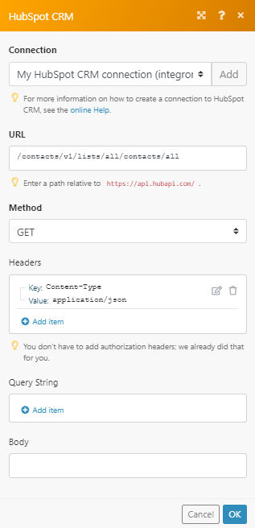

# [!DNL HubSpot CRM] モジュール

この [!DNL Adobe Workfront Fusion] [!DNL HubSpot CRM] モジュールを使用して、イベント、レコード、連絡先、エンゲージメント、ファイル、フォーム送信を監視したり、 [!DNL HubSpot CRM] アカウント

## アクセス要件

この記事の機能を使用するには、次のアクセス権が必要です。

<table style="table-layout:auto"> 
 <col> 
 <col> 
 <tbody> 
  <tr> 
   <td role="rowheader">[!DNL Adobe Workfront] 計画*</td>
  <td> 
[!UICONTROL Pro] 以降
 </td>
  </tr> 
  <tr data-mc-conditions=""> 
   <td role="rowheader">[!DNL Adobe Workfront] ライセンス*</td>
   <td> 
[!UICONTROL プラン ]、[!UICONTROL Work]
 </td> 
  </tr> 
  <tr> 
   <td role="rowheader">[!DNL Adobe Workfront Fusion] ライセンス**</td> 
   <td> 
[!UICONTROL [!DNL Workfront Fusion] [ 作業の自動化と統合 ] 
 </td> 
  </tr> 
  <tr> 
   <td role="rowheader">製品</td> 
   <td>組織で購入する必要があります [!DNL Adobe Workfront Fusion] 同様に [!DNL Adobe Workfront] を使用して、この記事で説明する機能を使用できます。</td> 
  </tr> 
 </tbody> 
</table>

ご利用のプラン、ライセンスの種類、アクセス権を確認するには、 [!DNL Workfront] 管理者。

詳しくは、 [!DNL Adobe Workfront Fusion] ライセンス， 「 [[!DNL Adobe Workfront Fusion] ライセンス](../../workfront-fusion/get-started/license-automation-vs-integration.md).

## 前提条件

使用する [!DNL HubSpot CRM] モジュールの場合、 [!DNL HubSpot CRM] アカウント

## 接続 [!DNL Adobe Workfront Fusion] から [!DNL HubSpot CRM]

接続方法 [!DNL HubSpot CRM] アカウント [!DNL Workfront Fusion]を参照してください。 [への接続の作成 [!DNL Adobe Workfront Fusion]  — 基本手順](../../workfront-fusion/connections/connect-to-fusion-general.md)

## [!DNL HubSpot CRM] モジュールとそのフィールド

設定時に [!DNL Hubspot CRM] モジュール [!DNL Workfront Fusion] 以下のフィールドが表示されます。 これらに加えて、 [!DNL Hubspot CRM] アプリまたはサービスのアクセスレベルなどの要因に応じて、フィールドが表示される場合があります。 モジュール内の太字のタイトルは、必須フィールドを示します。

フィールドまたは関数の上にマップボタンが表示されている場合は、このボタンを使用して、そのフィールドの変数や関数を設定できます。 詳しくは、 [のモジュール間で情報をマッピングする [!DNL Adobe Workfront Fusion]](../../workfront-fusion/mapping/map-information-between-modules.md).

* [CRM オブジェクト](#crm-objects)
* [レコード（契約、連絡先、会社）](#records-deals-contacts-and-companies)
* [連絡先](#contacts)
* [契約](#deals)
* [会社](#companies)
* [ファイル](#files)
* [チケット](#tickets)
* [API 呼び出しを実行する](#make-an-api-call)

### CRM オブジェクト

#### [!UICONTROL CRM オブジェクトの検索]

この検索モジュールは、カスタムプロパティまたはクエリで CRM オブジェクトを検索します。 製品や行項目を検索するには、必要なカスタムスコープで特別な接続を使用します。

<table style="table-layout:auto"> 
 <col> 
 <col> 
 <tbody> 
  <tr> 
   <td role="rowheader"> 
[!UICONTROL 接続 ]
 </td> 
   <td> 
接続方法 [!DNL HubSpot CRM] アカウント [!DNL Workfront Fusion]を参照してください。 <a href="../../workfront-fusion/connections/connect-to-fusion-general.md" class="MCXref xref" data-mc-variable-override="">への接続の作成 [!DNL Adobe Workfront Fusion]  — 基本手順</a>
 </td> 
  </tr> 
  <tr> 
   <td role="rowheader">[!UICONTROL 制限 ]</td> 
   <td>モジュールが 1 回の実行サイクルで返す最大項目数を入力またはマッピングします。</td> 
  </tr> 
  <tr> 
   <td role="rowheader">[!UICONTROL 検索するオブジェクトタイプ ]</td> 
   <td>検索する Hubspot CRM オブジェクトのタイプを選択します。</td> 
  </tr> 
  <tr> 
   <td role="rowheader">[!UICONTROL 出力プロパティ ]</td> 
   <td>モジュールの出力に表示するプロパティを選択します。 使用可能なフィールドは、選択したオブジェクトによって異なります。</td> 
  </tr> 
  <tr> 
   <td role="rowheader">[!UICONTROL フィルター条件 ] </td> 
   <td> 
検索のフィルター方法を選択します
 
    <ul> 
     <li> 
<strong>[!UICONTROL クエリ ]</strong> 
 
クエリを入力またはマッピング
 </li> 
     <li> 
<strong>[!UICONTROL プロパティ ]</strong> 
 
検索のグループまたはフィルターを入力します。
 </li> 
    </ul> </td> 
  </tr> 
  <tr> 
   <td role="rowheader">[!UICONTROL 並べ替え基準 ]</td> 
   <td> 
結果を並べ替える場合は、「 」をクリックします。 結果の並べ替えを選択すると、次のフィールドが表示されます。 
 
    <ul> 
     <li> 
<strong>[!UICONTROL プロパティ名 ]</strong> 
 
結果を並べ替えるプロパティを選択します
 </li> 
     <li> 
<strong>[!UICONTROL 方向 ]</strong> 
 
結果を昇順または降順のどちらで並べ替えるかを選択します。
 </li> 
    </ul> </td> 
  </tr> <!--
   <tr data-mc-conditions="QuicksilverOrClassic.Draft mode"> 
    <td role="rowheader">Start Offset</td> 
    <td>Enter or map the ID of the first item you want to retrieve details for. This module only returns up to 5000 results at a time. Setting a start offset allows you to retrieve items other than the first 5000. If the start offset is 5000, the module would return items 5000-9999.</td> 
   </tr>
  --> 
 </tbody> 
</table>

### レコード（契約、連絡先、会社）

* [[!UICONTROL レコードの作成（レガシー）]](#create-a-record-legacy)
* [[!UICONTROL レコードの取得]](#get-a-record)
* [[!UICONTROL レコードの更新]](#update-a-record)
* [[!UICONTROL レコードの削除]](#delete-a-record)
* [[!UICONTROL レコードプロパティの取得]](#get-a-record-property)
* [[!UICONTROL レコードを監視]](#watch-records)

#### [!UICONTROL レコードの作成（レガシー）]

このアクションモジュールは、連絡先、会社、または契約を作成します。

<table style="table-layout:auto"> 
 <col> 
 <col> 
 <tbody> 
  <tr> 
   <td role="rowheader"> 
[!UICONTROL 接続 ]
 </td> 
   <td> 
接続方法 [!DNL HubSpot CRM] アカウント [!DNL Workfront Fusion]を参照してください。 <a href="../../workfront-fusion/connections/connect-to-fusion-general.md" class="MCXref xref" data-mc-variable-override="">への接続の作成 [!DNL Adobe Workfront Fusion]  — 基本手順</a>
 </td> 
  </tr> 
  <tr> 
   <td role="rowheader">[!UICONTROL レコードタイプ ]</td> 
   <td> 
作成するレコードのタイプを選択
 </td> 
  </tr> 
  <tr> 
   <td role="rowheader">[!UICONTROL プロパティ ]</td> 
   <td>レコードに設定するプロパティを入力します。 使用できるフィールドは、作成するレコードのタイプによって異なります。</td> 
  </tr> 
 </tbody> 
</table>

#### [!UICONTROL レコードの取得]

このアクションモジュールは、連絡先、会社または契約の詳細を取得します。

<table style="table-layout:auto"> 
 <col> 
 <col> 
 <tbody> 
  <tr> 
   <td role="rowheader"> 
[!UICONTROL 接続 ]
 </td> 
   <td> 
接続方法 [!DNL HubSpot CRM] アカウント [!DNL Workfront Fusion]を参照してください。 <a href="../../workfront-fusion/connections/connect-to-fusion-general.md" class="MCXref xref" data-mc-variable-override="">への接続の作成 [!DNL Adobe Workfront Fusion]  — 基本手順</a>
 </td> 
  </tr> 
  <tr> 
   <td role="rowheader">[!UICONTROL レコードタイプ ]</td> 
   <td> 
レコードタイプを選択します。
 
    <ul> 
     <li>[!UICONTROL 連絡先 ]</li> 
     <li>[!UICONTROL 会社 ] </li> 
     <li>[!UICONTROL 契約 ]</li> 
    </ul> </td> 
  </tr> 
  <tr> 
   <td role="rowheader">[!UICONTROL 検索タイプ ]</td> 
   <td>連絡先を取得する場合は、ID で識別するか、電子メールアドレスで識別するかを選択します。</td> 
  </tr> 
  <tr> 
   <td role="rowheader">[!UICONTROL ID]</td> 
   <td>取得する連絡先、会社または取引の ID を入力します。 </td> 
  </tr> 
  <tr> 
   <td role="rowheader">[!UICONTROL 電子メール ]</td> 
   <td>詳細を取得する連絡先のメールアドレスを入力します。 </td> 
  </tr> 
 </tbody> 
</table>

#### [!UICONTROL レコードの更新]

このアクションモジュールは、連絡先、会社、または契約を更新します。

<table style="table-layout:auto"> 
 <col> 
 <col> 
 <tbody> 
  <tr> 
   <td role="rowheader"> 
[!UICONTROL 接続 ]
 </td> 
   <td> 
接続方法 [!DNL HubSpot CRM] アカウント [!DNL Workfront Fusion]を参照してください。 <a href="../../workfront-fusion/connections/connect-to-fusion-general.md" class="MCXref xref" data-mc-variable-override="">への接続の作成 [!DNL Adobe Workfront Fusion]  — 基本手順</a>
 </td> 
  </tr> 
  <tr> 
   <td role="rowheader">[!UICONTROL レコードタイプ ]</td> 
   <td>更新するレコードのタイプを選択します。</td> 
  </tr> 
  <tr> 
   <td role="rowheader">[!UICONTROL 検索タイプ ]</td> 
   <td> 
連絡先を取得する場合は、レコードを識別する方法を選択します。
 
    <ul> 
     <li> 
[!UICONTROL ID]
 </li> 
     <li> 
[!UICONTROL 電子メール ]
 </li> 
    </ul> </td> 
  </tr> 
  <tr> 
   <td role="rowheader">[!UICONTROL ID]</td> 
   <td>更新する連絡先、会社または契約の ID を入力します。 </td> 
  </tr> 
  <tr> 
   <td role="rowheader">[!UICONTROL 電子メール ]</td> 
   <td>詳細を更新する連絡先のメールアドレスを入力します。 </td> 
  </tr> 
  <tr> 
   <td role="rowheader">[!UICONTROL プロパティ ]</td> 
   <td>レコードに設定するプロパティを入力します。 使用できるフィールドは、作成するレコードのタイプによって異なります。</td> 
  </tr> 
 </tbody> 
</table>

#### [!UICONTROL レコードの削除]

このアクションモジュールは、連絡先、会社または契約を削除します。

<table style="table-layout:auto"> 
 <col> 
 <col> 
 <tbody> 
  <tr> 
   <td role="rowheader"> 
[!UICONTROL 接続 ]
 </td> 
   <td> 
接続方法 [!DNL HubSpot CRM] アカウント [!DNL Workfront Fusion]を参照してください。 <a href="../../workfront-fusion/connections/connect-to-fusion-general.md" class="MCXref xref" data-mc-variable-override="">への接続の作成 [!DNL Adobe Workfront Fusion]  — 基本手順</a>
 </td> 
  </tr> 
  <tr> 
   <td role="rowheader">[!UICONTROL レコードタイプ ]</td> 
   <td>削除するレコードのタイプを選択します。</td> 
  </tr> 
  <tr> 
   <td role="rowheader">[!UICONTROL ID]</td> 
   <td>削除する連絡先、会社または契約の ID を入力します。 </td> 
  </tr> 
 </tbody> 
</table>

#### [!UICONTROL レコードプロパティの取得]

このアクションモジュールは、（内部）名で特定のレコードプロパティのメタデータを取得します。

<table style="table-layout:auto"> 
 <col> 
 <col> 
 <tbody> 
  <tr> 
   <td role="rowheader"> 
[!UICONTROL 接続 ]
 </td> 
   <td> 
接続方法 [!DNL HubSpot CRM] アカウント [!DNL Workfront Fusion]を参照してください。 <a href="../../workfront-fusion/connections/connect-to-fusion-general.md" class="MCXref xref" data-mc-variable-override="">への接続の作成 [!DNL Adobe Workfront Fusion]  — 基本手順</a>
 </td> 
  </tr> 
  <tr> 
   <td role="rowheader">[!UICONTROL レコードタイプ ]</td> 
   <td>メタデータを取得するプロパティを持つレコードのタイプを選択します。</td> 
  </tr> 
  <tr> 
   <td role="rowheader">[!UICONTROL プロパティ名 ]</td> 
   <td>メタデータを取得するプロパティを選択します。</td> 
  </tr> 
  <tr> 
   <td role="rowheader">[!UICONTROL オプション ID]</td> 
   <td> 
 一部のプロパティには、ユーザーがプロパティ値として選択できる一連の使用可能なオプションがあります。 取得するプロパティ値を表すオプションの ID を入力します。
 </td> 
  </tr> 
 </tbody> 
</table>

#### [!UICONTROL レコードを監視]

このトリガーモジュールは、過去 30 日以内に連絡先、会社または契約が変更または作成された場合にシナリオを開始します。 出力できるレコードの数は 10,000 個に制限されます。

<table style="table-layout:auto"> 
 <col> 
 <col> 
 <tbody> 
  <tr> 
   <td role="rowheader"> 
[!UICONTROL 接続 ]
 </td> 
   <td> 
接続方法 [!DNL HubSpot CRM] アカウント [!DNL Workfront Fusion]を参照してください。 <a href="../../workfront-fusion/connections/connect-to-fusion-general.md" class="MCXref xref" data-mc-variable-override="">への接続の作成 [!DNL Adobe Workfront Fusion]  — 基本手順</a>
 </td> 
  </tr> 
  <tr> 
   <td role="rowheader">[!UICONTROL レコードタイプ ]</td> 
   <td>監視するプロパティを持つレコードのタイプを選択します。</td> 
  </tr> 
  <tr> 
   <td role="rowheader">[!UICONTROL 検索 ]</td> 
   <td>最近変更したレコードと最近作成したレコードのどちらを監視するかを選択します。</td> 
  </tr> 
  <tr> 
   <td role="rowheader">[!UICONTROL 出力プロパティ ]</td> 
   <td>モジュールの出力に含めるプロパティを選択します。</td> 
  </tr> 
  <tr> 
   <td role="rowheader">[!UICONTROL 制限 ]</td> 
   <td> 
各シナリオの実行サイクル中に、モジュールが返すレコードの最大数を入力またはマッピングします。
 </td> 
  </tr> 
 </tbody> 
</table>

### 連絡先

* [[!UICONTROL 連絡先の作成/更新（レガシー）]](#createupdate-a-contact-legacy)
* [[!UICONTROL 連絡先グループの作成/更新]](#createupdate-a-group-of-contacts)
* [[!UICONTROL リストに連絡先を追加]](#add-contacts-to-a-list)
* [[!UICONTROL リストから連絡先を削除]](#remove-a-contact-from-a-list)
* [[!UICONTROL 連絡先のマージ]](#merge-contacts)
* [[!UICONTROL 連絡先の検索]](#search-for-contacts)
* [[!UICONTROL 連絡先のリスト]](#list-contacts)
* [[!UICONTROL 会社の連絡先のリスト]](#list-contacts-of-a-company)

#### [!UICONTROL 連絡先の作成/更新（レガシー）]

ポータルに存在しない場合は連絡先を作成します。存在しない場合は最新のプロパティ値で更新します。

<table style="table-layout:auto"> 
 <col> 
 <col> 
 <tbody> 
  <tr> 
   <td role="rowheader"> 
[!UICONTROL 接続 ]
 </td> 
   <td> 
接続方法 [!DNL HubSpot CRM] アカウント [!DNL Workfront Fusion]を参照してください。 <a href="../../workfront-fusion/connections/connect-to-fusion-general.md" class="MCXref xref" data-mc-variable-override="">への接続の作成 [!DNL Adobe Workfront Fusion]  — 基本手順</a>
 </td> 
  </tr> 
  <tr> 
   <td role="rowheader">[!UICONTROL プロパティ ]</td> 
   <td>連絡先に設定または更新するプロパティを入力します。 </td> 
  </tr> 
 </tbody> 
</table>

#### [!UICONTROL 連絡先グループの作成/更新]

連絡先のグループを作成するか、既に存在する場合は更新します。 バッチサイズが 100 連絡先以下に制限されている場合は、パフォーマンスが最適です。 このエンドポイントを通じて行われた変更は非同期で処理されるので、連絡先レコードに変更が適用されるまで数分かかる場合があります。

<table style="table-layout:auto"> 
 <col> 
 <col> 
 <tbody> 
  <tr> 
   <td role="rowheader"> 
[!UICONTROL 接続 ]
 </td> 
   <td> 
接続方法 [!DNL HubSpot CRM] アカウント [!DNL Workfront Fusion]を参照してください。 <a href="../../workfront-fusion/connections/connect-to-fusion-general.md" class="MCXref xref" data-mc-variable-override="">への接続の作成 [!DNL Adobe Workfront Fusion]  — 基本手順</a>
 </td> 
  </tr> 
  <tr> 
   <td role="rowheader">[!UICONTROL 作成/更新する連絡先バッチ ] </td> 
   <td> 
連絡先のバッチを追加します。
 
クリック <strong>[!UICONTROL 項目を追加 ]</strong> 新しい連絡先を追加する場合。 表示されるウィンドウで、次の情報を入力またはマッピングします。
 
    <ul> 
     <li> 
<strong>[!UICONTROL 検索タイプ ]</strong> 
 
連絡先を識別する方法を選択します：
 
      <ul> 
       <li> 
[!UICONTROL ID]
 
作成または更新する連絡先の ID を入力します。 
 </li> 
       <li> 
[!UICONTROL 電子メール ]
 
作成または更新する連絡先の電子メールアドレスを入力します。 
 </li> 
      </ul> </li> 
     <li> 
<strong>[!UICONTROL プロパティ ]</strong> 
 
連絡先に設定または更新するプロパティを入力します。
 </li> 
    </ul> </td> 
  </tr> 
 </tbody> 
</table>

#### [!UICONTROL リストに連絡先を追加]

このモジュールは、システムで既に作成されている連絡先レコードを連絡先リストに追加します。

<table style="table-layout:auto"> 
 <col> 
 <col> 
 <tbody> 
  <tr> 
   <td role="rowheader"> 
[!UICONTROL 接続 ]
 </td> 
   <td> 
接続方法 [!DNL HubSpot CRM] アカウント [!DNL Workfront Fusion]を参照してください。 <a href="../../workfront-fusion/connections/connect-to-fusion-general.md" class="MCXref xref" data-mc-variable-override="">への接続の作成 [!DNL Adobe Workfront Fusion]  — 基本手順</a>
 </td> 
  </tr> 
  <tr> 
   <td role="rowheader">[!UICONTROL リスト ID] </td> 
   <td>連絡先を追加するリストの ID を選択します。 </td> 
  </tr> 
  <tr> 
   <td role="rowheader">[!UICONTROL ID/電子メール ] </td> 
   <td> 
リストに追加する連絡先を識別する方法を選択してください：
 
    <ul> 
     <li> 
[!UICONTROL ID]
 
リストに追加する連絡先の ID を追加します。
 </li> 
     <li> 
[!UICONTROL 電子メール ]
 
リストに追加する連絡先のメールアドレスを追加します。
 </li> 
    </ul> </td> 
  </tr> 
 </tbody> 
</table>

#### [!UICONTROL リストから連絡先を削除]

連絡先リストから連絡先を削除します。

>[!NOTE]
>
>動的リストから連絡先を手動で削除することはできません。

<table style="table-layout:auto"> 
 <col> 
 <col> 
 <tbody> 
  <tr> 
   <td role="rowheader"> 
[!UICONTROL 接続 ]
 </td> 
   <td> 
接続方法 [!DNL HubSpot CRM] アカウント [!DNL Workfront Fusion]を参照してください。 <a href="../../workfront-fusion/connections/connect-to-fusion-general.md" class="MCXref xref" data-mc-variable-override="">への接続の作成 [!DNL Adobe Workfront Fusion]  — 基本手順</a>
 </td> 
  </tr> 
  <tr> 
   <td role="rowheader">[!UICONTROL リスト ID] </td> 
   <td>連絡先を削除するリストの ID を選択します。 </td> 
  </tr> 
  <tr> 
   <td role="rowheader">[!UICONTROL 連絡先 ID] </td> 
   <td>リストから削除する連絡先の ID を入力します。 </td> 
  </tr> 
 </tbody> 
</table>

#### [!UICONTROL 連絡先のマージ]

<table style="table-layout:auto"> 
 <col> 
 <col> 
 <tbody> 
  <tr> 
   <td role="rowheader"> 
[!UICONTROL 接続 ]
 </td> 
   <td> 
接続方法 [!DNL HubSpot CRM] アカウント [!DNL Workfront Fusion]を参照してください。 <a href="../../workfront-fusion/connections/connect-to-fusion-general.md" class="MCXref xref" data-mc-variable-override="">への接続の作成 [!DNL Adobe Workfront Fusion]  — 基本手順</a>
 </td> 
  </tr> 
  <tr> 
   <td role="rowheader">[!UICONTROL ID 1] </td> 
   <td>マージするいずれかの連絡先の ID を入力します。 </td> 
  </tr> 
  <tr> 
   <td role="rowheader">[!UICONTROL ID 2] </td> 
   <td>マージする他の連絡先の ID を入力します。</td> 
  </tr> 
 </tbody> 
</table>

#### [!UICONTROL 連絡先の検索]

検索クエリを使用して連絡先のリストを取得します。

<table style="table-layout:auto"> 
 <col> 
 <col> 
 <tbody> 
  <tr> 
   <td role="rowheader"> 
[!UICONTROL 接続 ]
 </td> 
   <td> 
接続方法 [!DNL HubSpot CRM] アカウント [!DNL Workfront Fusion]を参照してください。 <a href="../../workfront-fusion/connections/connect-to-fusion-general.md" class="MCXref xref" data-mc-variable-override="">への接続の作成 [!DNL Adobe Workfront Fusion]  — 基本手順</a>
 </td> 
  </tr> 
  <tr> 
   <td role="rowheader">[!UICONTROL クエリ ]</td> 
   <td>検索クエリを入力します。</td> 
  </tr> 
  <tr> 
   <td role="rowheader">[!UICONTROL 制限 ] </td> 
   <td>連絡先の最大数を入力またはマッピング [!DNL Workfront Fusion] は、1 回のシナリオ実行サイクルで返されます。 </td> 
  </tr> 
 </tbody> 
</table>

#### [!UICONTROL 連絡先のリスト]

ポータルで作成されたすべての連絡先を返します。 出力できる連絡先は 5000 件までです。 前の連絡先または次の連絡先を一覧表示するには、 [!UICONTROL 詳細] パラメーターを使用して、リストをオフセットします。

<table style="table-layout:auto"> 
 <col> 
 <col> 
 <tbody> 
  <tr> 
   <td role="rowheader"> 
[!UICONTROL 接続 ]
 </td> 
   <td> 
接続方法 [!DNL HubSpot CRM] アカウント [!DNL Workfront Fusion]を参照してください。 <a href="../../workfront-fusion/connections/connect-to-fusion-general.md" class="MCXref xref" data-mc-variable-override="">への接続の作成 [!DNL Adobe Workfront Fusion]  — 基本手順</a>
 </td> 
  </tr> 
  <tr> 
   <td role="rowheader">[!UICONTROL 制限 ]</td> 
   <td>連絡先の最大数 [!DNL Workfront Fusion] は、1 回のシナリオ実行サイクルで返されます。 </td> 
  </tr> 
  <tr> 
   <td role="rowheader">[!UICONTROL 出力プロパティ ]</td> 
   <td>モジュールの出力に表示するプロパティを選択します。 </td> 
  </tr> <!--
   <tr data-mc-conditions="QuicksilverOrClassic.Draft mode"> 
    <td role="rowheader">Contact ID [start offset] </td> 
    <td>Enter or map the ID of the user that you want to start the list. For example, setting the Contact ID as the ID of the 101st contact will allow the module to list contacts 101-5100 rather than 1-5000. </td> 
   </tr>
  --> 
 </tbody> 
</table>

#### [!UICONTROL 会社の連絡先のリスト]

会社内の連絡先のリストを取得します。 出力できる連絡先は 5000 件までです。 前の連絡先または次の連絡先を一覧表示するには、 [!UICONTROL 詳細] パラメーターを使用して、リストをオフセットします。

<table style="table-layout:auto"> 
 <col> 
 <col> 
 <tbody> 
  <tr> 
   <td role="rowheader"> 
[!UICONTROL 接続 ]
 </td> 
   <td> 
接続方法 [!DNL HubSpot CRM] アカウント [!DNL Workfront Fusion]を参照してください。 <a href="../../workfront-fusion/connections/connect-to-fusion-general.md" class="MCXref xref" data-mc-variable-override="">への接続の作成 [!DNL Adobe Workfront Fusion]  — 基本手順</a>
 </td> 
  </tr> 
  <tr> 
   <td role="rowheader">[!UICONTROL ID]</td> 
   <td>連絡先のリストを作成する会社の ID を入力します。 </td> 
  </tr> 
  <tr> 
   <td role="rowheader">[!UICONTROL 制限 ]</td> 
   <td>連絡先の最大数 [!DNL Workfront Fusion] は、1 回のシナリオ実行サイクルで返されます。 </td> 
  </tr> <!--
   <tr data-mc-conditions="QuicksilverOrClassic.Draft mode"> 
    <td role="rowheader">Contact ID [start offset] </td> 
    <td>Enter or map the ID of the user that you want to start the list. For example, setting the Contact ID as the ID of the 101st contact will allow the module to list contacts 101-5100 rather than 1-5000. </td> 
   </tr>
  --> 
 </tbody> 
</table>

#### [!UICONTROL リストに追加された監視連絡先]

このトリガーモジュールは、新しい連絡先がリストに追加されると、シナリオを開始します。 これは、有料マーケティングアカウントを持つユーザーのみが利用できます。

<table style="table-layout:auto"> 
 <col> 
 <col> 
 <tbody> 
  <tr> 
   <td role="rowheader"> 
[!UICONTROL 接続 ]
 </td> 
   <td> 
接続方法 [!DNL HubSpot CRM] アカウント [!DNL Workfront Fusion]を参照してください。 <a href="../../workfront-fusion/connections/connect-to-fusion-general.md" class="MCXref xref" data-mc-variable-override="">への接続の作成 [!DNL Adobe Workfront Fusion]  — 基本手順</a>
 </td> 
  </tr> 
  <tr> 
   <td role="rowheader">[!UICONTROL リスト ID]</td> 
   <td>監視する連絡先が含まれるリストの ID を入力またはマッピングします。</td> 
  </tr> 
  <tr> 
   <td role="rowheader">[!UICONTROL 出力プロパティ ]</td> 
   <td>モジュールの出力に含めるプロパティを選択します。</td> 
  </tr> 
  <tr> 
   <td role="rowheader">[!UICONTROL 制限 ]</td> 
   <td> 
各シナリオの実行サイクル中に、モジュールが返すレコードの最大数を入力またはマッピングします。
 </td> 
  </tr> 
 </tbody> 
</table>

### 契約

* [[!UICONTROL 契約/チケットパイプラインのリスト]](#list-dealticket-pipelines)
* [[!UICONTROL 契約の CRM パイプラインの取得]](#get-a-deals-crm-pipeline)

#### [!UICONTROL 契約/チケットパイプラインのリスト]

指定されたポータルのすべての契約とチケットのパイプラインを返します。

<table style="table-layout:auto"> 
 <col> 
 <col> 
 <tbody> 
  <tr> 
   <td role="rowheader"> 
[!UICONTROL 接続 ]
 </td> 
   <td> 
接続方法 [!DNL HubSpot CRM] アカウント [!DNL Workfront Fusion]を参照してください。 <a href="../../workfront-fusion/connections/connect-to-fusion-general.md" class="MCXref xref" data-mc-variable-override="">への接続の作成 [!DNL Adobe Workfront Fusion]  — 基本手順</a>
 </td> 
  </tr> 
  <tr> 
   <td role="rowheader">[!UICONTROL オブジェクトタイプ ] </td> 
   <td>詳細またはチケットをリストするかどうかを選択します。</td> 
  </tr> 
 </tbody> 
</table>

#### [!UICONTROL 契約の CRM パイプラインの取得]

特定のディールパイプラインを返します。

<table style="table-layout:auto"> 
 <col> 
 <col> 
 <tbody> 
  <tr> 
   <td role="rowheader"> 
[!UICONTROL 接続 ]
 </td> 
   <td> 
接続方法 [!DNL HubSpot CRM] アカウント [!DNL Workfront Fusion]を参照してください。 <a href="../../workfront-fusion/connections/connect-to-fusion-general.md" class="MCXref xref" data-mc-variable-override="">への接続の作成 [!DNL Adobe Workfront Fusion]  — 基本手順</a>
 </td> 
  </tr> 
  <tr> 
   <td role="rowheader">[!UICONTROL Pipeline ID] </td> 
   <td>詳細を取得するパイプラインの ID を入力またはマッピングします。 </td> 
  </tr> 
  <tr> 
   <td role="rowheader">[!UICONTROL ステージ ID] </td> 
   <td>詳細を取得するステージの ID を入力またはマッピングします。 </td> 
  </tr> 
 </tbody> 
</table>

### 会社

#### [!UICONTROL ドメイン別に会社を検索]

ドメインプロパティとの完全一致に基づいて、会社のリストを取得します。

<table style="table-layout:auto"> 
 <col> 
 <col> 
 <tbody> 
  <tr> 
   <td role="rowheader"> 
[!UICONTROL 接続 ]
 </td> 
   <td> 
接続方法 [!DNL HubSpot CRM] アカウント [!DNL Workfront Fusion]を参照してください。 <a href="../../workfront-fusion/connections/connect-to-fusion-general.md" class="MCXref xref" data-mc-variable-override="">への接続の作成 [!DNL Adobe Workfront Fusion]  — 基本手順</a>
 </td> 
  </tr> 
  <tr> 
   <td role="rowheader">[!UICONTROL ドメイン ] </td> 
   <td>検索する会社のドメインを入力します。例： <code>[!DNL hubspot].com</code>. </td> 
  </tr> 
  <tr> 
   <td role="rowheader">[!UICONTROL 制限 ]</td> 
   <td>会社の最大数 [!DNL Workfront Fusion] は、1 回のシナリオ実行サイクルで返されます。 </td> 
  </tr> 
  <tr> 
   <td role="rowheader">[!UICONTROL 出力プロパティ ]</td> 
   <td>モジュールの出力に表示するプロパティを選択します。 </td> 
  </tr> 
 </tbody> 
</table>

### ファイル

* [[!UICONTROL フォルダーの作成]](#create-a-folder)
* [[!UICONTROL フォルダーの削除]](#delete-a-folder)
* [[!UICONTROL ファイルの移動]](#move-a-file)

#### [!UICONTROL フォルダーの作成]

このモジュールは、フォルダーを作成します。

<table style="table-layout:auto"> 
 <col> 
 <col> 
 <tbody> 
  <tr> 
   <td role="rowheader"> 
[!UICONTROL 接続 ]
 </td> 
   <td> 
接続方法 [!DNL HubSpot CRM] アカウント [!DNL Workfront Fusion]を参照してください。 <a href="../../workfront-fusion/connections/connect-to-fusion-general.md" class="MCXref xref" data-mc-variable-override="">への接続の作成 [!DNL Adobe Workfront Fusion]  — 基本手順</a>
 </td> 
  </tr> 
  <tr> 
   <td role="rowheader">[!UICONTROL フォルダー名 ] </td> 
   <td>新しいフォルダの名前を入力またはマップします。</td> 
  </tr> 
  <tr> 
   <td role="rowheader">[!UICONTROL 親フォルダー ID] </td> 
   <td>作成するフォルダーの親フォルダーの ID を選択します。 </td> 
  </tr> 
 </tbody> 
</table>

#### [!UICONTROL フォルダーの削除]

フォルダを削除済みとしてマークします。

<table style="table-layout:auto"> 
 <col> 
 <col> 
 <tbody> 
  <tr> 
   <td role="rowheader"> 
[!UICONTROL 接続 ]
 </td> 
   <td> 
接続方法 [!DNL HubSpot CRM] アカウント [!DNL Workfront Fusion]を参照してください。 <a href="../../workfront-fusion/connections/connect-to-fusion-general.md" class="MCXref xref" data-mc-variable-override="">への接続の作成 [!DNL Adobe Workfront Fusion]  — 基本手順</a>
 </td> 
  </tr> 
  <tr> 
   <td role="rowheader">[!UICONTROL ID]</td> 
   <td>削除するフォルダーの ID を入力します。</td> 
  </tr> 
 </tbody> 
</table>

#### [!UICONTROL ファイルの移動]

ファイルを別のフォルダに移動します。

<table style="table-layout:auto"> 
 <col> 
 <col> 
 <tbody> 
  <tr> 
   <td role="rowheader"> 
[!UICONTROL 接続 ]
 </td> 
   <td> 
接続方法 [!DNL HubSpot CRM] アカウント [!DNL Workfront Fusion]を参照してください。 <a href="../../workfront-fusion/connections/connect-to-fusion-general.md" class="MCXref xref" data-mc-variable-override="">への接続の作成 [!DNL Adobe Workfront Fusion]  — 基本手順</a>
 </td> 
  </tr> 
  <tr> 
   <td role="rowheader">[!UICONTROL ファイル ID] </td> 
   <td>移動するファイルの ID を入力またはマッピングします。 </td> 
  </tr> 
  <tr> 
   <td role="rowheader">[!UICONTROL フォルダー ID] </td> 
   <td>ファイルを移動するフォルダーの ID を選択します。 </td> 
  </tr> 
  <tr> 
   <td role="rowheader">[!UICONTROL 名前 ]</td> 
   <td>移動したファイルの名前を入力します。</td> 
  </tr> 
 </tbody> 
</table>

### チケット

#### [!UICONTROL チケットの削除]

ID で既存のチケットを削除します。

<table style="table-layout:auto"> 
 <col> 
 <col> 
 <tbody> 
  <tr> 
   <td role="rowheader"> 
[!UICONTROL 接続 ]
 </td> 
   <td> 
接続方法 [!DNL HubSpot CRM] アカウント [!DNL Workfront Fusion]を参照してください。 <a href="../../workfront-fusion/connections/connect-to-fusion-general.md" class="MCXref xref" data-mc-variable-override="">への接続の作成 [!DNL Adobe Workfront Fusion]  — 基本手順</a>
 </td> 
  </tr> 
  <tr> 
   <td role="rowheader">[!UICONTROL ID]</td> 
   <td>削除するチケットの ID を入力します。 </td> 
  </tr> 
 </tbody> 
</table>

### [!UICONTROL API 呼び出しを実行する]

カスタム API 呼び出しを実行できます。

<table style="table-layout:auto"> 
 <col> 
 <col> 
 <tbody> 
  <tr> 
   <td role="rowheader">[!UICONTROL 接続 ]</td> 
   <td> 
接続方法 [!DNL HubSpot CRM] アカウント [!DNL Workfront Fusion]を参照してください。 <a href="../../workfront-fusion/connections/connect-to-fusion-general.md" class="MCXref xref" data-mc-variable-override="">への接続の作成 [!DNL Adobe Workfront Fusion]  — 基本手順</a>
 </td> 
  </tr> 
  <tr> 
   <td role="rowheader"> 
[!UICONTROL URL]
 </td> 
   <td> 
https://api.hubapi.com/に対する相対パスを入力します。 例： /contacts/v1/lists/all/contacts/all
 
使用可能なエンドポイントの一覧については、 <a href="https://legacydocs.hubspot.com/docs/overview">[!DNL HubSpot] API ドキュメント</a>.
 </td> 
  </tr> 
  <tr> 
   <td role="rowheader"> 
[!UICONTROL メソッド ]
 </td> 
   <td> 
使用する HTTP メソッドを選択します。
 
[!UICONTROLGET]
 
エントリの情報を取得します。
 
[!UICONTROLPOST]
 
をクリックして新しいエントリを作成します。
 
[!UICONTROLPUT]
 
既存のエントリを更新または置き換える。
 
[!UICONTROLPATCH]
 
部分的にエントリを更新する場合。
 
[!UICONTROLDELETE]
 
エントリを削除します。
 </td> 
  </tr> 
  <tr> 
   <td role="rowheader">[!UICONTROL Headers]</td> 
   <td> 
 目的のリクエストヘッダーを入力します。 認証ヘッダーを追加する必要はありません。私たちは既にあなたのためにそれをしました。
 </td> 
  </tr> 
  <tr> 
   <td role="rowheader">[!UICONTROL クエリ文字列 ]</td> 
   <td> 
 リクエストクエリ文字列を入力します。
 </td> 
  </tr> 
  <tr> 
   <td role="rowheader">[!UICONTROL 本文 ]</td> 
   <td> 
標準の JSON オブジェクトの形式で API 呼び出しの本文の内容を追加します。 <code>if</code> JSON で、条件文の外側に引用符を置きます。
 </td> 
  </tr> 
 </tbody> 
</table>

>[!INFO]
>
>**例：** 次の API 呼び出しは、 [!DNL HubSpot] アカウント：
>
>**URL**: `/contacts/v1/lists/all/contacts/all`
>
>**メソッド**: `GET`
>
>
>
>検索結果は、モジュールの「出力」の「 [!UICONTROL バンドル] > [!UICONTROL 本文] > [!UICONTROL 連絡先].
>
>この例では、3 人の連絡先が返されました。
>
>

## 新しいアプリケーションを作成

1. にログインします。 [!DNL HubSpot] 開発者アカウント。
1. を選択します。 **[!UICONTROL アプリの作成]** オプション。
1. アプリ名を入力し、 [!UICONTROL 保存] ダイアログ。
1. ウェブフックに必要なスコープを選択します。

   たとえば、新しい連絡先が作成または削除されたときにモジュールをトリガーするための連絡先スコープを追加します。

   この [!UICONTROL 連絡先スコープ] は、連絡先、契約、企業イベントの Web フックを受け取るために必要な情報です。

   >[!IMPORTANT]
   >
   >次の項目に入力しない [!UICONTROL リダイレクト URL] フィールドに入力します。
