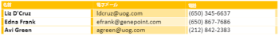

# [!DNL Microsoft Word Template]モジュール

[!DNL Adobe Workfront Fusion] のシナリオでは、[!DNL Microsoft Word Templates] を使用するワークフローを自動化したり、複数のサードパーティアプリケーションやサービスに接続したりできます。

シナリオの作成手順が必要な場合は、[ [!DNL Adobe Workfront Fusion]](../../workfront-fusion/scenarios/create-a-scenario.md) でのシナリオの作成を参照してください。

モジュールについて詳しくは、[ [!DNL Adobe Workfront Fusion]](../../workfront-fusion/modules/modules.md) のモジュールを参照してください。

## アクセス要件

この記事で説明している機能を使用するには、次のアクセス権が必要です。

<table style="table-layout:auto"> 
 <col> 
 <col> 
 <tbody> 
  <tr> 
   <td role="rowheader">[!DNL Adobe Workfront] プラン*</td>
  <td> <p>[!UICONTROL Pro] 以降</p> </td>
  </tr> 
  <tr data-mc-conditions=""> 
   <td role="rowheader">[!DNL Adobe Workfront] ライセンス*</td>
   <td> <p>[!UICONTROL Plan]、[!UICONTROL Work]</p> </td> 
  </tr> 
  <tr> 
   <td role="rowheader">[!DNL Adobe Workfront Fusion] ライセンス**</td> 
   <td> <p>[!UICONTROL [!DNL Workfront Fusion] for Work Automation and Integration] </p> </td> 
  </tr> 
  <tr> 
   <td role="rowheader">製品</td> 
   <td>この記事で説明されている機能を使用するには、組織で [!DNL Adobe Workfront Fusion] と [!DNL Adobe Workfront] を購入する必要があります。</td> 
  </tr> <!--
   <tr data-mc-conditions="QuicksilverOrClassic.Draft mode"> 
    <td role="rowheader">Access level configurations*</td> 
    <td> 
      <p data-mc-conditions="QuicksilverOrClassic.Draft mode">You must be a Workfront Fusion administrator for your organization.</p>
     --> <!--
      <p data-mc-conditions="QuicksilverOrClassic.Draft mode">You must be a Workfront Fusion administrator for your team.</p>
     --> </td> 
   </tr>
 </tbody> 
</table>

ご利用のプラン、ライセンスタイプまたはアクセス権を確認するには、[!DNL Workfront] 管理者にお問い合わせください。

[!DNL Adobe Workfront Fusion] ライセンスについて詳しくは、[[!DNL Adobe Workfront Fusion] ライセンス](../../workfront-fusion/get-started/license-automation-vs-integration.md)を参照してください。

## 前提条件

[!DNL Miscrosoft Word Templates]を [!DNL Adobe Workfront Fusion] で使用するには、[!DNL Office 365] アカウントが必要です。アカウントは www.office.com で作成できます。

## [!DNL Microsoft Word Templates]モジュールの使用

[!DNL Microsoft Word Template]モジュールを使用して、複数の web サービスのデータを [!DNL Microsoft Word] ドキュメントに結合できます。

例えば、次の [!DNL Microsoft Word] テンプレートを使用できます。


このドキュメントを作成するには：


## 値タグについて

[!DNL Microsoft Word] テンプレートは、データを結合または入力する場所と方法を決定する特別なタグがテキスト内にある通常の [!DNL Microsoft Word] ドキュメント（.docx ファイル）です。タグには次の 3 つのタイプがあります。

* [単純な値タグ](#simple-value-tag)
* [条件タグ](#condition-tag)
* [ループタグ](#loop-tag)

### 単純な値タグ {#simple-value-tag}

単純な値タグは、対応する値に置き換えられるだけです。タグの名前は「[!UICONTROL キー]」フィールドの値に対応し、二重の中括弧で囲まれます。例えば、


<pre>&lbrace;&lbrace;name&rbrace;&rbrace;</pre>


のように指定します。

**例**：「こんにちは、ピーターさん。」と書かれたドキュメントを作成するには、[!DNL Microsoft Word Template]モジュールを使用して、次のテンプレートを作成します。

<pre>&gt; こんにちは、&lbrace;&lbrace;name&rbrace;&rbrace;さん。</pre>

それには、次のようにモジュールを設定します。


### 条件タグ {#condition-tag}

条件タグを使用すると、特定の条件が満たされた場合にのみレンダリングされるテキストをラップするできます。テキストをラップするには、テキストを条件開始タグと条件終了タグで囲みます（例：データに電話番号が含まれているかどうかを条件とする場合の「hasPhone」）。次の例に示すように、開始タグ名の前にハッシュ記号 # が付き、終了タグ名の前にスラッシュ / が付きます。

**例**：入力データに電話番号が含まれているがメールアドレスが含まれていない場合に、顧客の電話番号を含んだドキュメントを生成するには、[!DNL Microsoft Word Template]モジュールを使用し、次のテンプレートを作成します。
<pre>&gt; &lbrace;&lbrace;#hasPhone&rbrace;&rbrace;Phone: &lbrace;&lbrace;phone&rbrace;&rbrace; &lbrace;&lbrace;/hasPhone&rbrace;&rbrace;</pre><pre>&gt; &lbrace;&lbrace;#hasEmail&rbrace;&rbrace;Email: &lbrace;&lbrace;email&rbrace;&rbrace; &lbrace;&lbrace;/hasEmail&rbrace;&rbrace;</pre>それには、次のようにモジュールを設定します。


このドキュメントでは、電話番号は次のように表示されます。
<pre>&gt; Phone: 4445551234</pre>

### ループタグ {#loop-tag}

ループタグ（セクションタグとも呼ばれます）を使用して、テキストのセクションを繰り返すことができます。開始ループタグと終了ループタグの間に配置して、テキストを折り返します。開始タグの名前の前にハッシュ記号 # が付き、終了タグの名前の前にスラッシュ / が付きます。

* [ドキュメントモジュールの入力を含むループタグ](#loop-tag-with-fill-out-a-document-module)
  <!-- [Loop tag with Fill a document with a batch of data module](#loop-tag-with-fill-a-document-with-a-batch-of-data-module)-->

#### ドキュメントモジュールの入力を含むループタグ {#loop-tag-with-fill-out-a-document-module}

**例**：顧客リスト内の各連絡先の名前と電話番号を記載したドキュメントを作成するには、[!DNL Microsoft Word Template] モジュールを作成し、次のテンプレートを作成します。

<pre>&gt; &lbrace;&lbrace;#contact&rbrace;&rbrace;</pre><pre>&gt;    &lbrace;&lbrace;name&rbrace;&rbrace;, &lbrace;&lbrace;phone&rbrace;&rbrace;</pre><pre>&gt; &lbrace;&lbrace;/contact&rbrace;&rbrace;</pre>

それには、次のようにモジュールを設定します。


このモジュールは、次のドキュメントを作成します。

```
> Jan Toman, 4445551234
> Eduard Salo, 4445552345
```

<!--

#### Loop tag with Fill a document with a batch of data module {#loop-tag-with-fill-a-document-with-a-batch-of-data-module}

**Example:** You can export Google contacts into a table that you create using loop tags.

The first module loads the template. The next module retrieves all contacts from the group you specify in [!DNL Google Contacts]. The aggregator module aggregates all values retrieved from Google Contacts and merges them into the template. And the last module saves the filled template to the desired location.


You could use this scenario with the following template:


To do this, you would set up the module as follows:


The module would create the following document:


-->

## [!DNL Microsoft Word Template] モジュール

これらのモジュールには接続は必要ありません。

* [ドキュメントに入力](#fill-out-a-document)
* [一連のデータをドキュメントに入力する](#fill-a-document-with-a-batch-of-data)

### [!UICONTROL ドキュメントに入力] {#fill-out-a-document}

この変換サービスモジュールでは、指定したデータをドキュメントに入力できます。単純な値のタグ、条件付きタグ、またはループタグで使用できます。

<table style="table-layout:auto"> 
 <col> 
 <col> 
 <tbody> 
  <tr> 
   <td role="rowheader">[!UICONTROL Start delimiter of the text being replaced]</td> 
   <td> <p>置き換えるテキストの先頭をマークする文字を入力します。 </p> <p class="example" data-mc-autonum="<b>Example: </b>"><span class="autonumber"><span><b>例：</b></span></span>次のようなテキストを置き換える場合、<code>[[</code> を入力します。 <code>[[replace_me]]</code></p> </td> 
  </tr> 
  <tr> 
   <td role="rowheader"> <p>[!UICONTROL End delimiter of the text being replaced]</p> </td> 
   <td> <p>置き換えるテキストの末尾をマークする文字を入力します。 </p> <p class="example" data-mc-autonum="<b>Example: </b>"><span class="autonumber"><span><b>例：</b></span></span>次のようなテキストを置き換える場合、<code>]]</code> を入力します。 <code>[[replace_me]]</code></p> </td> 
  </tr> 
  <tr> 
   <td role="rowheader">[!UICONTROL Source file]</td> 
   <td> <p> 前のモジュールからアップロードするファイルをマッピングします（例えば、HTTP／ファイルを取得または Dropbox／ファイルモジュールを取得）。または、データファイルを手動で入力します。</p> </td> 
  </tr> 
  <tr> 
   <td role="rowheader">[!UICONTROL Name of filled out file]</td> 
   <td>ターゲット出力ファイルのファイル名（拡張子も含む）を入力します。</td> 
  </tr> 
  <tr> 
   <td role="rowheader">[!UICONTROL Data source]</td> 
   <td> <p>使用するデータがフォームからのものか、生のデータ収集（未処理のコンピューターデータ）からのものかを指定するオプションを選択します。</p> </td> 
  </tr> 
  <tr> 
   <td role="rowheader">[!UICONTROL Values]</td> 
   <td> <p>これはコレクションの配列にする必要があります。次の場合に使用します。</p> 
    <ul> 
     <li>各コレクションは 1 つのデータエントリに対応し、1 つの項目を含む <code>entry</code></li> 
     <li>項目 <code>entry </code> は、<code>key </code> のコレクションを含み、および <code>value</code></li> 
     <li>項目 <code>key </code> には、タグの名前が含まれる</li> 
     <li>項目 <code>value </code> には、タグの値が含まれる</li> 
    </ul> 
    <p>エントリを追加するには、次の手順に従います。</p>
    <ol> 
     <li> 「<b>[!UICONTROL Add item]</b>」をクリックします。 </li> 
     <li>エントリの値のタイプを選択します。</li> 
     <li>名前と値を追加します。詳しくは、この記事で選択した値のタイプの例を参照してください。 
      <ul> 
       <li><a href="#simple-value-tag" class="MCXref xref">単純な値タグ</a></li> 
       <li><a href="#condition-tag" class="MCXref xref">条件タグ</a></li> 
       <li><a href="#loop-tag" class="MCXref xref">ループタグ</a></li> 
      </ul></li> 
    </ol> </td> 
  </tr> 
 </tbody> 
</table>

### [!UICONTROL 一連のデータをドキュメントに入力] {#fill-a-document-with-a-batch-of-data}

この集約モジュールは、データエントリが別々のバンドルとして提供される場合に役立ちます。このモジュールを使用すると、「値」フィールドに必要な構造を簡単に設定し、各値項目に項目をマッピングできます。ドキュメントの入力モジュールとは異なり、一連のデータを使用してドキュメントに入力モジュールの「値」フィールドでは、変数を含む 1 つのエントリのみを使用できます。

データエントリが配列として提供される場合にも、*イテレータ*&#x200B;モジュールを使用して配列の内容を一連のバンドルに変換することで、このモジュールを使用することもできます。

実際の値は、受信バンドルごとに作成され、入力されます。テンプレートは、すべての入力バンドルが処理された後に作成されます。

この集約モジュールは、特にリストやレポートを作成する場合に役立ちます。

<table style="table-layout:auto"> 
 <col> 
 <col> 
 <tbody> 
  <tr> 
   <td role="rowheader">[!UICONTROL Source Module]</td> 
   <td>テキストのソースとなるモジュールを選択します。</td> 
  </tr> 
  <tr> 
   <td role="rowheader">[!UICONTROL Start delimiter of the text being replaced]</td> 
   <td> <p>置き換えるテキストの先頭をマークする文字を入力します。 </p> <p class="example" data-mc-autonum="<b>Example: </b>"><span class="autonumber"><span><b>例：</b></span></span>次のようなテキストを置き換える場合、<code>[[</code> を入力します。 <code>[[replace_me]]</code></p> </td> 
  </tr> 
  <tr> 
   <td role="rowheader"> <p>[!UICONTROL End delimiter of the text being replaced]</p> </td> 
   <td> <p>置き換えるテキストの末尾をマークする文字を入力します。 </p> <p class="example" data-mc-autonum="<b>Example: </b>"><span class="autonumber"><span><b>例：</b></span></span>次のようなテキストを置き換える場合、<code>]]</code> を入力します。 <code>[[replace_me]]</code></p> </td> 
  </tr> 
  <tr> 
   <td role="rowheader">[!UICONTROL Group by]</td> 
   <td> マッピングされた項目を 1 つ以上含む式を定義します。集計データは、同じ式の値を持つグループの下で分割されます。各グループは、評価された式と集計テキストを付属したキーを含む個別のバンドルとして出力されます。これにより、キーを後続のモジュールのフィルターとして使用できます。</td> 
  </tr> 
  <tr> 
   <td role="rowheader">[!UICONTROL Stop processing after an empty aggregation]</td> 
   <td>集計にバンドルが含まれていない場合に処理を停止するには、このオプションを有効にします。</td> 
  </tr> 
  <tr> 
   <td role="rowheader">[!UICONTROL Source file]</td> 
   <td> <p> 前のモジュールからアップロードするファイルをマッピングします（例えば、HTTP／ファイルを取得または Dropbox／ファイルモジュールを取得）。または、データファイルを手動で入力します。</p> </td> 
  </tr> 
  <tr> 
   <td role="rowheader">[!UICONTROL Name of filled out file]</td> 
   <td>ターゲット出力ファイルのファイル名（拡張子も含む）を入力します。</td> 
  </tr> 
  <tr> 
   <td role="rowheader">[!UICONTROL Data source]</td> 
   <td> <p>使用するデータがフォームからのものか、生のデータ収集（未処理のコンピューターデータ）からのものかを指定するオプションを選択します。</p> </td> 
  </tr> 
  <tr> 
   <td role="rowheader">[!UICONTROL Values]</td> 
   <td> <p>これはコレクションの配列にする必要があります。次の場合に使用します。</p> 
    <ul> 
     <li>各コレクションは 1 つのデータエントリに対応し、1 つの項目を含む <code>entry</code></li> 
     <li>項目 <code>entry </code> は、<code>key </code> のコレクションを含み、および <code>value</code></li> 
     <li>項目 <code>key </code> には、タグの名前が含まれる</li> 
     <li>項目 <code>value </code> には、タグの値が含まれる</li> 
    </ul> 
    <p>エントリを追加するには、次の手順に従います。</p>
    <ol> 
     <li> 「<b>[!UICONTROL Add item]</b>」をクリックします。 </li> 
     <li>エントリの値のタイプを選択します。</li> 
     <li>名前と値を追加します。詳しくは、この記事で選択した値のタイプの例を参照してください。 
      <ul> 
       <li><a href="#simple-value-tag" class="MCXref xref">単純な値タグ</a></li> 
       <li><a href="#condition-tag" class="MCXref xref">条件タグ</a></li> 
       <li><a href="#loop-tag" class="MCXref xref">ループタグ</a></li> 
      </ul></li> 
    </ol> </td> 
  </tr> 
 </tbody> 
</table>
