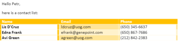

# [!DNL Microsoft Word Template] モジュール

内、 [!DNL Adobe Workfront Fusion] シナリオを使用して、 [!DNL Microsoft Word Templates]を使用して、複数のサードパーティのアプリケーションやサービスに接続できます。

シナリオの作成手順については、 [でのシナリオの作成 [!DNL Adobe Workfront Fusion]](../../workfront-fusion/scenarios/create-a-scenario.md).

モジュールについて詳しくは、 [のモジュール [!DNL Adobe Workfront Fusion]](../../workfront-fusion/modules/modules.md).

## アクセス要件

この記事の機能を使用するには、次のアクセス権が必要です。

<table style="table-layout:auto"> 
 <col> 
 <col> 
 <tbody> 
  <tr> 
   <td role="rowheader">[!DNL Adobe Workfront] 計画*</td>
  <td> <p>[!UICONTROL Pro] 以降</p> </td>
  </tr> 
  <tr data-mc-conditions=""> 
   <td role="rowheader">[!DNL Adobe Workfront] ライセンス*</td>
   <td> <p>[!UICONTROL プラン ]、[!UICONTROL Work]</p> </td> 
  </tr> 
  <tr> 
   <td role="rowheader">[!DNL Adobe Workfront Fusion] ライセンス**</td> 
   <td> <p>[!UICONTROL [!DNL Workfront Fusion] [ 作業の自動化と統合 ] </p> </td> 
  </tr> 
  <tr> 
   <td role="rowheader">製品</td> 
   <td>組織で購入する必要があります [!DNL Adobe Workfront Fusion] 同様に [!DNL Adobe Workfront] を使用して、この記事で説明する機能を使用できます。</td> 
  </tr> <!--
   <tr data-mc-conditions="QuicksilverOrClassic.Draft mode"> 
    <td role="rowheader">Access level configurations*</td> 
    <td> 
      <p data-mc-conditions="QuicksilverOrClassic.Draft mode">You must be a Workfront Fusion administrator for your organization.</p>
     --> <!--
      <p data-mc-conditions="QuicksilverOrClassic.Draft mode">You must be a Workfront Fusion administrator for your team.</p>
     --> </td> 
   </tr>
 </tbody> 
</table>

ご利用のプラン、ライセンスの種類、アクセス権を確認するには、 [!DNL Workfront] 管理者。

詳しくは、 [!DNL Adobe Workfront Fusion] ライセンス， 「 [[!DNL Adobe Workfront Fusion] ライセンス](../../workfront-fusion/get-started/license-automation-vs-integration.md).

## 前提条件

を使用するには [!DNL Miscrosoft Word Templates] 次を使用 [!DNL Adobe Workfront Fusion]を使用する場合、 [!DNL Office 365] アカウント。 作成はwww.office.comでおこなえます。

## 使用 [!DNL Microsoft Word Templates] モジュール

次の項目を使用できます。 [!DNL Microsoft Word Template] 複数の web サービスのデータを 1 つのに結合するモジュール [!DNL Microsoft Word] 文書。

例えば、次の [!DNL Microsoft Word] テンプレート：


このドキュメントを作成するには：



## 値タグについて

A [!DNL Microsoft Word] template は通常の [!DNL Microsoft Word] ドキュメント（.docx ファイル）のテキストに特殊なタグが付いており、データの結合場所と入力方法を指定します。 タグには次の 3 つのタイプがあります。

* [単純な値タグ](#simple-value-tag)
* [条件タグ](#condition-tag)
* [ループタグ](#loop-tag)

### 単純な値タグ {#simple-value-tag}

単純な値タグは、対応する値に置き換えられます。 タグの名前は、 [!UICONTROL キー] フィールドの値。二重中括弧の内側に配置されます。例：


<pre>{{name}}</pre>


。

**例：** 「こんにちは、ピーター！」と書いた文書を作成するには、 [!DNL Microsoft Word Template] モジュールを使用して、次のテンプレートを作成します。

<pre>&gt; こんにちは {{name}}!</pre>

これをおこなうには、次のようにモジュールを設定します。


### 条件タグ {#condition-tag}

条件タグを使用すると、特定の条件が満たされた場合にのみレンダリングされるテキストを折り返すことができます。 テキストを折り返すには、データに電話番号が含まれているかどうかの条件を示す場合は、「hasPhone」のように、開始条件タグと終了条件タグの間にテキストを配置します。 次の例に示すように、開始タグの名前の前にハッシュ記号#が付き、終了タグの名前の前にスラッシュ/が付きます。

**例：** 入力データに電話番号が含まれているが、電子メールアドレスが含まれていない場合に、顧客の電話番号を含むドキュメントを作成するには、 [!DNL Microsoft Word Template] モジュールを作成し、次のテンプレートを作成します。
<pre>&gt; {{#hasPhone}} 電話： {{phone}} {{/hasPhone}}</pre><pre>&gt; {{#hasEmail}}E メール： {{email}} {{/hasEmail}}</pre>これをおこなうには、次のようにモジュールを設定します。


このドキュメントでは、電話番号は次のように表示されます。
<pre>&gt; 電話： 4445551234</pre>

### ループタグ {#loop-tag}

ループタグ（セクションタグとも呼ばれます）を使用して、テキストのセクションを繰り返すことができます。 開始ループタグと終了ループタグの間に配置して、テキストを折り返します。 開始タグの名前の前にハッシュ記号#が付き、終了タグの名前の前にスラッシュ/が付きます。

* [ドキュメントモジュールの入力を含むループタグ](#loop-tag-with-fill-out-a-document-module)
  <!-- [Loop tag with Fill a document with a batch of data module](#loop-tag-with-fill-a-document-with-a-batch-of-data-module)-->

#### ドキュメントモジュールの入力を含むループタグ {#loop-tag-with-fill-out-a-document-module}

**例：** 顧客リスト内の各連絡先の名前と電話番号を記載したドキュメントを作成するには、 [!DNL Microsoft Word Template] モジュールを作成し、次のテンプレートを作成します。

<pre>&gt; {{#contact}}</pre><pre>&gt;     {{name}}, {{phone}}</pre><pre>&gt; {{/contact}}</pre>

これをおこなうには、次のようにモジュールを設定します。


このモジュールは、次のドキュメントを作成します。

```
> Jan Toman, 4445551234
> Eduard Salo, 4445552345
```

<!--

#### Loop tag with Fill a document with a batch of data module {#loop-tag-with-fill-a-document-with-a-batch-of-data-module}

**Example:** You can export Google contacts into a table that you create using loop tags.

The first module loads the template. The next module retrieves all contacts from the group you specify in [!DNL Google Contacts]. The aggregator module aggregates all values retrieved from Google Contacts and merges them into the template. And the last module saves the filled template to the desired location.


You could use this scenario with the following template:


To do this, you would set up the module as follows:


The module would create the following document:


-->

## [!DNL Microsoft Word Template] モジュール

これらのモジュールには接続は必要ありません。

* [ドキュメントの入力](#fill-out-a-document)
* [一連のデータをドキュメントに入力する](#fill-a-document-with-a-batch-of-data)

### [!UICONTROL ドキュメントの入力] {#fill-out-a-document}

この変換サービスモジュールでは、指定したデータをドキュメントに入力できます。 単純な値のタグ、条件付きタグまたはループタグで使用できます。

<table style="table-layout:auto"> 
 <col> 
 <col> 
 <tbody> 
  <tr> 
   <td role="rowheader">[!UICONTROL 置き換えるテキストの区切り文字を開始 ]</td> 
   <td> <p>置き換えるテキストの先頭をマークする文字を入力します。 </p> <p class="example" data-mc-autonum="<b>Example: </b>"><span class="autonumber"><span><b>例： </b></span></span>入力 <code>[[</code> 次のようなテキストを置き換える場合： <code>[[replace_me]]</code></p> </td> 
  </tr> 
  <tr> 
   <td role="rowheader"> <p>[!UICONTROL 置き換えるテキストの区切り文字を終了します ]</p> </td> 
   <td> <p>置き換えるテキストの末尾をマークする文字を入力します。 </p> <p class="example" data-mc-autonum="<b>Example: </b>"><span class="autonumber"><span><b>例： </b></span></span>入力 <code>]]</code> 次のようなテキストを置き換える場合： <code>[[replace_me]]</code></p> </td> 
  </tr> 
  <tr> 
   <td role="rowheader">[!UICONTROL ソースファイル ]</td> 
   <td> <p> 前のモジュールからアップロードするファイルをマッピングします ( 例えば、HTTP/ファイルの取得またはDropbox/ファイルモジュールの取得 )。 または、データファイルを手動で入力します。</p> </td> 
  </tr> 
  <tr> 
   <td role="rowheader">[!UICONTROL 入力されたファイルの名前 ]</td> 
   <td>ターゲット出力ファイルのファイル名（拡張子も含む）を入力します。</td> 
  </tr> 
  <tr> 
   <td role="rowheader">[!UICONTROL データソース ]</td> 
   <td> <p>使用するデータがフォームからのものか、生のデータ収集（未処理のコンピューターデータ）からのものかを指定するオプションを選択します。</p> </td> 
  </tr> 
  <tr> 
   <td role="rowheader">[!UICONTROL 値 ]</td> 
   <td> <p>これはコレクションの配列にする必要があります。次の場合に使用します。</p> 
    <ul> 
     <li>各コレクションは 1 つのデータエントリに対応し、1 つの項目を含みます <code>entry</code></li> 
     <li>項目 <code>entry </code>次のコレクションを含む <code>key </code>および <code>value</code></li> 
     <li>項目 <code>key </code>タグの名前が含まれます。</li> 
     <li>項目 <code>value </code>には、タグの値が含まれます。</li> 
    </ul> 
    <p>エントリを追加するには、次の手順に従います。</p>
    <ol> 
     <li> クリック <b>[!UICONTROL 項目を追加 ]</b>. </li> 
     <li>エントリの値のタイプを選択します。</li> 
     <li>名前と値を追加します。 詳細については、この記事で選択した値のタイプの例を参照してください。 
      <ul> 
       <li><a href="#simple-value-tag" class="MCXref xref">単純な値タグ</a></li> 
       <li><a href="#condition-tag" class="MCXref xref">条件タグ</a></li> 
       <li><a href="#loop-tag" class="MCXref xref">ループタグ</a></li> 
      </ul></li> 
    </ol> </td> 
  </tr> 
 </tbody> 
</table>

### [!UICONTROL 一連のデータをドキュメントに入力する] {#fill-a-document-with-a-batch-of-data}

この集約モジュールは、データエントリが別々のバンドルとして提供される場合に役立ちます。 このモジュールを使用すると、「値」フィールドに必要な構造を簡単に設定し、各値項目に項目をマッピングできます。 ドキュメントの入力モジュールとは異なり、一連のデータを使用してドキュメントに入力モジュールの「値」フィールドでは、変数を含む 1 つのエントリのみを使用できます。

また、このモジュールは、データエントリが配列として配列になっている場合、 *反復子* モジュールを使用して、配列のコンテンツを一連のバンドルに変換します。

実際の値は、受信バンドルごとに作成され、設定されます。 テンプレートは、すべての入力バンドルが処理された後に作成されます。

この集約モジュールは、特にリストやレポートを作成する場合に役立ちます。

<table style="table-layout:auto"> 
 <col> 
 <col> 
 <tbody> 
  <tr> 
   <td role="rowheader">[!UICONTROL ソースモジュール ]</td> 
   <td>テキストのソースとなるモジュールを選択します。</td> 
  </tr> 
  <tr> 
   <td role="rowheader">[!UICONTROL 置き換えるテキストの区切り文字を開始 ]</td> 
   <td> <p>置き換えるテキストの先頭をマークする文字を入力します。 </p> <p class="example" data-mc-autonum="<b>Example: </b>"><span class="autonumber"><span><b>例： </b></span></span>入力 <code>[[</code> 次のようなテキストを置き換える場合： <code>[[replace_me]]</code></p> </td> 
  </tr> 
  <tr> 
   <td role="rowheader"> <p>[!UICONTROL 置き換えるテキストの区切り文字を終了します ]</p> </td> 
   <td> <p>置き換えるテキストの末尾をマークする文字を入力します。 </p> <p class="example" data-mc-autonum="<b>Example: </b>"><span class="autonumber"><span><b>例： </b></span></span>入力 <code>]]</code> 次のようなテキストを置き換える場合： <code>[[replace_me]]</code></p> </td> 
  </tr> 
  <tr> 
   <td role="rowheader">[!UICONTROL Group by]</td> 
   <td> 1 つ以上のマッピングされた項目を含む式を定義します。 集計データは、同じ式の値を持つグループの下で分割されます。 各 Group は、評価された式と集計されたテキストを含むキーを含む個別のバンドルとして出力します。 これにより、キーを後続のモジュールのフィルターとして使用できます。</td> 
  </tr> 
  <tr> 
   <td role="rowheader">[!UICONTROL 空の集計後に処理を停止 ]</td> 
   <td>集計にバンドルが含まれていない場合に処理を停止するには、このオプションを有効にします。</td> 
  </tr> 
  <tr> 
   <td role="rowheader">[!UICONTROL ソースファイル ]</td> 
   <td> <p> 前のモジュールからアップロードするファイルをマッピングします ( 例えば、HTTP/ファイルの取得またはDropbox/ファイルモジュールの取得 )。 または、データファイルを手動で入力します。</p> </td> 
  </tr> 
  <tr> 
   <td role="rowheader">[!UICONTROL 入力されたファイルの名前 ]</td> 
   <td>ターゲット出力ファイルのファイル名（拡張子も含む）を入力します。</td> 
  </tr> 
  <tr> 
   <td role="rowheader">[!UICONTROL データソース ]</td> 
   <td> <p>使用するデータがフォームからのものか、生のデータ収集（未処理のコンピューターデータ）からのものかを指定するオプションを選択します。</p> </td> 
  </tr> 
  <tr> 
   <td role="rowheader">[!UICONTROL 値 ]</td> 
   <td> <p>これはコレクションの配列にする必要があります。次の場合に使用します。</p> 
    <ul> 
     <li>各コレクションは 1 つのデータエントリに対応し、1 つの項目を含みます <code>entry</code></li> 
     <li>項目 <code>entry </code>次のコレクションを含む <code>key </code>および <code>value</code></li> 
     <li>項目 <code>key </code>タグの名前が含まれます。</li> 
     <li>項目 <code>value </code>には、タグの値が含まれます。</li> 
    </ul> 
    <p>エントリを追加するには、次の手順に従います。</p>
    <ol> 
     <li> クリック <b>[!UICONTROL 項目を追加 ]</b>. </li> 
     <li>エントリの値のタイプを選択します。</li> 
     <li>名前と値を追加します。 詳細については、この記事で選択した値のタイプの例を参照してください。 
      <ul> 
       <li><a href="#simple-value-tag" class="MCXref xref">単純な値タグ</a></li> 
       <li><a href="#condition-tag" class="MCXref xref">条件タグ</a></li> 
       <li><a href="#loop-tag" class="MCXref xref">ループタグ</a></li> 
      </ul></li> 
    </ol> </td> 
  </tr> 
 </tbody> 
</table>
