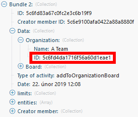

# [!UICONTROL Trello] モジュール

[!DNL Adobe Workfront Fusion] シナリオでは、[!UICONTROL Trello] を使用するワークフローを自動化したり、複数のサードパーティアプリケーションやサービスに接続したりすることができます。

シナリオの作成手順が必要な場合は、[ [!DNL Adobe Workfront Fusion]](../../workfront-fusion/scenarios/create-a-scenario.md) でのシナリオの作成を参照してください。

モジュールについて詳しくは、[ [!DNL Adobe Workfront Fusion]](../../workfront-fusion/modules/modules.md) のモジュールを参照してください。

## アクセス要件

この記事で説明している機能を使用するには、次のアクセス権が必要です。

<table style="table-layout:auto"> 
 <col> 
 <col> 
 <tbody> 
  <tr> 
   <td role="rowheader">[!DNL Adobe Workfront] プラン*</td>
  <td> 
[!UICONTROL Pro] 以降
 </td>
  </tr> 
  <tr data-mc-conditions=""> 
   <td role="rowheader">[!DNL Adobe Workfront] ライセンス*</td>
   <td> 
[!UICONTROL Plan]、[!UICONTROL Work]
 </td> 
  </tr> 
  <tr> 
   <td role="rowheader">[!DNL Adobe Workfront Fusion] ライセンス**</td> 
   <td>
   
現在のライセンス要件：[!DNL Workfront Fusion] ライセンスは必要ありません。

   
または

   
従来のライセンス要件：[!UICONTROL [!DNL Workfront Fusion] for Work Automation and Integration] 

   </td> 
  </tr> 
  <tr> 
   <td role="rowheader">製品</td> 
   <td>
   
現在の製品要件：[!UICONTROL Select] または [!UICONTROL Prime] [!DNL Adobe Workfront] プランがある場合、この記事で説明する機能を使用するには [!DNL Adobe Workfront Fusion] と [!DNL Adobe Workfront] を組織で購入する必要があります。[!DNL Workfront Fusion] は、[!UICONTROL Ultimate] [!DNL Workfront] プランに含まれています。

   
または

   
レガシー製品要件：この記事で説明する機能を使用するには、組織で [!DNL Adobe Workfront Fusion] と [!DNL Adobe Workfront] を購入する必要があります。

   </td> 
  </tr> 
 </tbody> 
</table>

ご利用のプラン、ライセンスタイプまたはアクセス権を確認するには、[!DNL Workfront] 管理者にお問い合わせください。

[!DNL Adobe Workfront Fusion] ライセンスについて詳しくは、[[!DNL Adobe Workfront Fusion]  ライセンス](../../workfront-fusion/get-started/license-automation-vs-integration.md)を参照してください。

## 前提条件

[!DNL Trello] モジュールを使用するには、[!UICONTROL Trello] アカウントが必要です。

## [!UICONTROL Trello] を [!DNL Workfront Fusion] に接続

[!UICONTROL Trello] アカウントを [!DNL Workfront Fusion] に接続する手順については、[ [!DNL Adobe Workfront Fusion]  への接続の作成 - 基本手順](../../workfront-fusion/connections/connect-to-fusion-general.md)を参照してください。

## [!UICONTROL Trello] モジュールとそのフィールド

[!UICONTROL Trello] モジュールを設定すると、[!DNL Workfront Fusion] には以下のフィールドが表示されます。これらとともに、アプリやサービスのアクセスレベルなどの要因に応じて、追加の「[!UICONTROL Trello]」フィールドが表示される場合があります。モジュール内の太字のタイトルは、必須フィールドを示します。

フィールドまたは関数の上にマップボタンが表示されている場合は、このボタンを使用すると、そのフィールドの変数や関数を設定できます。詳しくは、[ [!DNL Adobe Workfront Fusion]](../../workfront-fusion/mapping/map-information-between-modules.md) でモジュールから別のモジュールに情報をマッピングを参照してください。

* [ボード](#boards)
* [リスト](#lists)
* [カード](#cards)
* [メンバー](#members)
* [チェックリスト](#checklists)
* [ラベル](#labels)
* [コメント](#comments)

### ボード

+++ **[!UICONTROL ボードを監視]**

このトリガーモジュールは、新しいボードが追加されるとシナリオを開始します。

<table style="table-layout:auto"> 
 <col> 
 <col> 
 <tbody> 
  <tr> 
   <td role="rowheader">[!UICONTROL Connection] </td> 
   <td> 
[!UICONTROL Trello] アカウントを [!DNL Workfront Fusion] に接続する手順については、<a href="../../workfront-fusion/connections/connect-to-fusion-general.md" class="MCXref xref" data-mc-variable-override="">[!DNL Adobe Workfront Fusion] への接続の作成 - 基本手順</a>を参照してください。
 </td> 
  </tr> 
  <tr> 
   <td role="rowheader">[!UICONTROL Limit] </td> 
   <td> 
[!DNL Workfront Fusion] が 1 回の実行サイクルで返すボードの最大数。
 </td> 
  </tr> 
 </tbody> 
</table>

+++

+++ **[!UICONTROL ボードを作成]**

このアクションモジュールは、選択した設定で新しいボードを作成します。

<table style="table-layout:auto"> 
 <col> 
 <col> 
 <tbody> 
  <tr> 
   <td role="rowheader">[!UICONTROL Connection] </td> 
   <td> 
[!UICONTROL Trello] アカウントを [!DNL Workfront Fusion] に接続する手順については、<a href="../../workfront-fusion/connections/connect-to-fusion-general.md" class="MCXref xref" data-mc-variable-override="">[!DNL Adobe Workfront Fusion] への接続の作成 - 基本手順</a>を参照してください。
 </td> 
  </tr> 
  <tr> 
   <td role="rowheader">[!UICONTROL Name] </td> 
   <td> 
新しいボードの名前を入力またはマッピングします。
 </td> 
  </tr> 
  <tr> 
   <td role="rowheader">[!UICONTROL Description]</td> 
   <td> 
必要に応じて、ボードの説明を入力またはマッピングします。
 </td> 
  </tr> 
  <tr> 
   <td role="rowheader"> 
[!UICONTROL Organization ID]
 </td> 
   <td> 
組織の ID を入力またはマッピングします。Watch Activities モジュールなどの別のモジュールを使用して組織 ID を取得できます。
 
  
 </td> 
  </tr> 
  <tr> 
   <td role="rowheader"> 
[!UICONTROL Permission level]
 </td> 
   <td> 
ボードには、権限レベルごとに異なる投票ルールおよびコメントルールがあります。例えば、ボードが [!UICONTROL Private] で、投票ルールとコメントルールを [!UICONTROL All] として設定した場合、エラーが発生します。 
 
投票とコメントは、権限レベルごとに次のグループに制限されます。
 
    <ul> 
     <li><strong>[!UICONTROL Private]</strong>：
      --&gt;メンバー、メンバーおよびオブザーバー</li> 
     <li><strong>[!UICONTROL For organization]</strong>：
      --&gt;メンバー、メンバーおよびオブザーバー、組織のメンバー</li> 
     <li><strong>[!UICONTROL Public]</strong>：
      --&gt;メンバー、メンバーおよびオブザーバー、組織のメンバー、すべて</li> 
    </ul> </td> 
  </tr> 
  <tr> 
   <td role="rowheader"> 
[!UICONTROL Voting]
 </td> 
   <td> 
このボードで投票できるユーザーを、オプションを選択して指定します。権限レベルでの投票の制限については、「[!UICONTROL Permission level]」フィールドを参照してください。
 </td> 
  </tr> 
  <tr> 
   <td role="rowheader"> 
[!UICONTROL Comments]
 </td> 
   <td> 
このボードのカードにコメントできるユーザーを、オプションを選択して指定します。権限レベルでのコメントの制限については、「[!UICONTROL Permission level]」フィールドを参照してください。
 </td> 
  </tr> 
  <tr> 
   <td role="rowheader"> 
[!UICONTROL Invitations]
 </td> 
   <td> 
他のユーザーをこのボードに招待できるユーザーを選択します。
 </td> 
  </tr> 
  <tr> 
   <td role="rowheader"> 
[!UICONTROL Self-join]
 </td> 
   <td> 
チームメンバーが自分でボードに参加できるか、招待される必要があるかを選択します。
 </td> 
  </tr> 
  <tr> 
   <td role="rowheader"> 
[!UICONTROL Default labels]
 </td> 
   <td> 
新しいボードにデフォルトのラベルセットを使用するかどうかを選択します。
 </td> 
  </tr> 
  <tr> 
   <td role="rowheader"> 
[!UICONTROL Default lists]
 </td> 
   <td> 
デフォルトのリストセットをボードに追加するかを選択します（[!UICONTROL To Do]、[!UICONTROL Doing]、[!UICONTROL Done]）。
 </td> 
  </tr> 
  <tr> 
   <td role="rowheader"> 
[!UICONTROL Board source ID]
 </td> 
   <td> 
新しいボードにコピーするボードの ID を選択またはマッピングします。
 </td> 
  </tr> 
  <tr> 
   <td role="rowheader"> 
[!UICONTROL Card Covers]
 </td> 
   <td> 
ボードのカードカバーを有効にする場合は、「<strong>[!UICONTROL Yes]</strong>」を選択します。
 </td> 
  </tr> 
  <tr> 
   <td role="rowheader"> 
[!UICONTROL Background]
 </td> 
   <td> 
背景のカラーまたはカスタム背景を選択します。
 
メモ：カスタム背景は、[!UICONTROL Trello Gold and Business Class] のサブスクライバーのみが使用できます。
 </td> 
  </tr> 
  <tr> 
   <td role="rowheader"> 
[!UICONTROL Card aging]
 </td> 
   <td> 
カードの期間経過を表す 2 つのモードから選択します。 
 
    <ul> 
     <li><strong>[!UICONTROL Regular]</strong>：カードは期間が経過するにつれ、徐々に透明になります。 </li> 
     <li><strong>[!UICONTROL Pirate]</strong>：カードは期間が経過するにつれ、古びた海賊の地図のように、裂け、黄ばみ、ひび割れます。</li> 
    </ul> </td> 
  </tr> 
 </tbody> 
</table>

+++

+++ **[!UICONTROL ボードの編集]**

このアクションモジュールは、既存のボードの設定を編集します。

<table style="table-layout:auto"> 
 <col> 
 <col> 
 <tbody> 
  <tr> 
   <td role="rowheader">[!UICONTROL Connection] </td> 
   <td> 
[!UICONTROL Trello] アカウントを [!DNL Workfront Fusion] に接続する手順については、<a href="../../workfront-fusion/connections/connect-to-fusion-general.md" class="MCXref xref" data-mc-variable-override="">[!DNL Adobe Workfront Fusion] への接続の作成- 基本手順</a>を参照してください。
 </td> 
  </tr> 
  <tr> 
   <td role="rowheader"> 
[!UICONTROL Board ID]
 </td> 
   <td> 
モジュールで作成するボードの一意の [!UICONTROL Trello] ID を入力またはマッピングします。Watch Boards モジュールなどの別のモジュールを使用してボード ID を取得できます。
 
  
 </td> 
  </tr> 
  <tr> 
   <td role="rowheader">[!UICONTROL New name]</td> 
   <td> 
 ボードの新しい名前を入力またはマッピングします。
 </td> 
  </tr> 
  <tr> 
   <td role="rowheader">[!UICONTROL New description]</td> 
   <td> 
 必要に応じて、ボードの説明を入力またはマッピングします。
 </td> 
  </tr> 
  <tr> 
   <td role="rowheader"> 
[!UICONTROL Organization ID]
 </td> 
   <td> 
モジュールで編集するボードの一意の [!UICONTROL Trello] ID を入力またはマッピングします。[!DNL Watch Activities] モジュールなどの別のモジュールを使用してボード ID を取得できます。
 
  
 </td> 
  </tr> 
  <tr> 
   <td role="rowheader">[!UICONTROL Subscribe] </td> 
   <td> 
オプションを選択して、代理ユーザーがボードに登録しているかどうかを指定します。
 </td> 
  </tr> 
  <tr> 
   <td role="rowheader"> 
[!UICONTROL Permission level]
 </td> 
   <td> 
ボードには、権限レベルごとに異なる投票ルールおよびコメントルールがあります。例えば、ボードが [!UICONTROL Private] で、投票ルールとコメントルールを [!UICONTROL All] として設定した場合、エラーが発生します。 
 
投票とコメントは、権限レベルごとに次のグループに制限されます。
 
    <ul> 
     <li><strong>[!UICONTROL Private]</strong>：
      --&gt;メンバー、メンバーおよびオブザーバー</li> 
     <li><strong>[!UICONTROL For organization]</strong>：
      --&gt;メンバー、メンバーおよびオブザーバー、組織のメンバー</li> 
     <li><strong>[!UICONTROL Public]</strong>：
      --&gt;メンバー、メンバーおよびオブザーバー、組織のメンバー、全員</li> 
    </ul> </td> 
  </tr> 
  <tr> 
   <td role="rowheader"> 
[!UICONTROL Voting]
 </td> 
   <td> 
このボードで投票できるユーザーを、オプションを選択して指定します。権限レベルでの投票の制限については、「[!UICONTROL Permission level]」フィールドを参照してください。
 </td> 
  </tr> 
  <tr> 
   <td role="rowheader"> 
[!UICONTROL Comments]
 </td> 
   <td> 
このボードのカードにコメントできるユーザーを、オプションを選択して指定します。権限レベルでのコメントの制限については、「[!UICONTROL Permission level]」フィールドを参照してください。
 </td> 
  </tr> 
  <tr> 
   <td role="rowheader">[!UICONTROL Invitations] </td> 
   <td> 
このボードにユーザーを招待できる担当者を選択します。
 </td> 
  </tr> 
  <tr> 
   <td role="rowheader">[!UICONTROL Self-join]</td> 
   <td> 
 チームメンバーが自分でボードに参加できるか、招待される必要があるかを選択します。
 </td> 
  </tr> 
  <tr> 
   <td role="rowheader">[!UICONTROL Card covers]</td> 
   <td> 
 このボードにカードの表紙を表示するかどうかを選択します。
 </td> 
  </tr> 
  <tr> 
   <td role="rowheader">[!UICONTROL Background] </td> 
   <td> 
背景のカラーまたはカスタム背景を選択します。
 
メモ：カスタム背景は、[!UICONTROL Trello Gold and Business Class] のサブスクライバーのみが使用できます。
 </td> 
  </tr> 
  <tr> 
   <td role="rowheader">[!UICONTROL Background ID]</td> 
   <td> 
 [!UICONTROL Background] フィールドでカスタム背景の使用を選択した場合は、使用する背景の ID を入力またはマッピングします。
 </td> 
  </tr> 
  <tr> 
   <td role="rowheader"> 
[!UICONTROL Card aging]
 </td> 
   <td> 
カードの期間経過を表す 2 つのモードから選択します。 
 
    <ul> 
     <li><strong>[!UICONTROL Regular]</strong>：カードは期間が経過するにつれ、徐々に透明になります。 </li> 
     <li><strong>[!UICONTROL Pirate]</strong>：カードは期間が経過するにつれ、古びた海賊の地図のように、裂け、黄ばみ、ひび割れます。</li> 
    </ul> </td> 
  </tr> 
  <tr> 
   <td role="rowheader">[!UICONTROL Calendar feed enabled]</td> 
   <td> 
 カレンダーフィードを有効にするかどうかを選択します。
 </td> 
  </tr> 
  <tr> 
   <td role="rowheader">[!UICONTROL &lt;Color&gt; label name]</td> 
   <td> 
 目的のカラーラベルに名前を割り当てます。
 </td> 
  </tr> 
  <tr> 
   <td role="rowheader">[!UICONTROL Archive] </td> 
   <td> 
ボードをアーカイブする（閉じる）かどうかを示すオプションを選択します。 
 </td> 
  </tr> 
 </tbody> 
</table>

+++

+++ **[!UICONTROL ボードを取得]**

このアクションモジュールは、ボードの詳細を取得します。

<table style="table-layout:auto"> 
 <col> 
 <col> 
 <tbody> 
  <tr> 
   <td role="rowheader">[!UICONTROL Connection] </td> 
   <td> 
[!UICONTROL Trello] アカウントを [!DNL Workfront Fusion] に接続する手順については、<a href="../../workfront-fusion/connections/connect-to-fusion-general.md" class="MCXref xref" data-mc-variable-override="">[!DNL Adobe Workfront Fusion] への接続の作成 - 基本手順</a>を参照してください。
 </td> 
  </tr> 
  <tr> 
   <td role="rowheader"> 
[!UICONTROL Board ID]
 </td> 
   <td> 
情報を取得するボードの ID を入力またはマッピングします。
 </td> 
  </tr> 
 </tbody> 
</table>

+++

+++ **[!DNL Search for Boards]**

この検索モジュールは、指定したボードに関する情報を取得します。

<table style="table-layout:auto"> 
 <col> 
 <col> 
 <tbody> 
  <tr> 
   <td role="rowheader">[!UICONTROL Connection] </td> 
   <td> 
[!UICONTROL Trello] アカウントを [!DNL Workfront Fusion] に接続する手順については、<a href="../../workfront-fusion/connections/connect-to-fusion-general.md" class="MCXref xref" data-mc-variable-override="">[!DNL Adobe Workfront Fusion] への接続の作成 - 基本手順</a>を参照してください。
 </td> 
  </tr> 
  <tr> 
   <td role="rowheader">[!UICONTROL Query] </td> 
   <td> 
情報を取得するボードの名前（または名前の一部）を入力またはマッピングします。
 </td> 
  </tr> 
  <tr> 
   <td role="rowheader">[!UICONTROL Maximum number of returned boards]</td> 
   <td> 
 [!DNL Workfront Fusion] が 1 回の実行サイクルで返すボードの最大数を入力します。この値は、1000 以下にする必要があります。
  </td> 
  </tr> 
  <tr> 
   <td role="rowheader"> 
[!UICONTROL Partial] 
 </td> 
   <td> 
デフォルトでは、このモジュールは、クエリ内の各単語の完全一致をメンバーコンテンツで検索します。[!UICONTROL Partial] が有効な場合、モジュールはクエリ内の任意の単語で始まるコンテンツを検索します。
 
 例えば、「development」という単語を使用して「My Development Status Report」というタイトルのボードを検索する場合、デフォルトでは単語全体を検索する必要があります。[!UICONTROL Partial] を有効にしている場合、「dev」を検索することはできますが、「velopment」を検索することはできません。
 </td> 
  </tr> 
  <tr> 
   <td role="rowheader">[!UICONTROL Boards] </td> 
   <td> 
「mine」と入力するか、ボード ID のコンマ区切りリストをマッピングします。
 </td> 
  </tr> 
 </tbody> 
</table>

+++

+++ **[!UICONTROL ボードのアーカイブまたはアーカイブ解除]**

このアクションモジュールは、指定したボードを閉じるか、再び開きます。

<table style="table-layout:auto"> 
 <col> 
 <col> 
 <tbody> 
  <tr> 
   <td role="rowheader">[!UICONTROL Connection] </td> 
   <td> 
[!UICONTROL Trello] アカウントを [!DNL Workfront Fusion] に接続する手順については、<a href="../../workfront-fusion/connections/connect-to-fusion-general.md" class="MCXref xref" data-mc-variable-override="">[!DNL Adobe Workfront Fusion] への接続の作成 - 基本手順</a>を参照してください
 </td> 
  </tr> 
  <tr> 
   <td role="rowheader">[!UICONTROL Board ID]</td> 
   <td> 
 閉じる、または再度開くボードの ID を入力またはマッピングします。
 </td> 
  </tr> 
  <tr> 
   <td role="rowheader">[!UICONTROL Archive or unarchive]</td> 
   <td> 
 ボードを閉じる（アーカイブ）か、再び開く（アーカイブ解除）かを選択します。
 </td> 
  </tr> 
 </tbody> 
</table>

+++

+++ **[!UICONTROL メンバーをボードに割り当て]**

このアクションモジュールは、指定したボードにメンバーを割り当てます。

<table style="table-layout:auto"> 
 <col> 
 <col> 
 <tbody> 
  <tr> 
   <td role="rowheader">[!UICONTROL Connection] </td> 
   <td> 
[!UICONTROL Trello] アカウントを [!DNL Workfront Fusion] に接続する手順については、<a href="../../workfront-fusion/connections/connect-to-fusion-general.md" class="MCXref xref" data-mc-variable-override="">[!DNL Adobe Workfront Fusion] への接続の作成 - 基本手順</a>を参照してください
 </td> 
  </tr> 
  <tr> 
   <td role="rowheader">[!UICONTROL Board ID]</td> 
   <td> 
 メンバーを追加するボードを選択します。
 </td> 
  </tr> 
  <tr> 
   <td role="rowheader">[!UICONTROL Email address]</td> 
   <td> 
 ボードに追加するメンバーのメールアドレスを入力またはマッピングします。
 </td> 
  </tr> 
  <tr> 
   <td role="rowheader"> 
[!UICONTROL Member type]
 </td> 
   <td> 
ボードに追加するメンバーのタイプを選択します。
 
    <ul> 
     <li><strong>[!UICONTROL Admin]</strong>：ボード管理者は、ボード上で任意のボードアクションを実行できます。</li> 
     <li><strong>[!UICONTROL Normal]</strong>：通常のメンバーは、ボードのただのメンバーです。</li> 
     <li><strong>[!UICONTROL Observer]</strong>：オブザーバーは、ボードに対する読み取り専用アクセス権を持つメンバーです。 オブザーバーは、[!UICONTROL Trello Business Class] を持っているチームのみが使用できます。</li> 
    </ul> </td> 
  </tr> 
  <tr> 
   <td role="rowheader">[!UICONTROL Full name]</td> 
   <td> 
 ボードに追加するユーザーのフルネームを入力します。
 </td> 
  </tr> 
 </tbody> 
</table>

+++

+++ **[!UICONTROL メンバーをボードから割り当て解除]**

このアクションモジュールは、ボードからメンバーを削除します。

<table style="table-layout:auto"> 
 <col> 
 <col> 
 <tbody> 
  <tr> 
   <td role="rowheader">[!UICONTROL Connection] </td> 
   <td> 
[!UICONTROL Trello] アカウントを [!DNL Workfront Fusion] に接続する手順については、<a href="../../workfront-fusion/connections/connect-to-fusion-general.md" class="MCXref xref" data-mc-variable-override="">[!DNL Adobe Workfront Fusion] への接続の作成 - 基本手順</a>を参照してください
 </td> 
  </tr> 
  <tr> 
   <td role="rowheader">[!UICONTROL Board ID]</td> 
   <td> 
 ユーザーを削除するボードの ID を入力（マッピングまたは選択）します。
 </td> 
  </tr> 
  <tr> 
   <td role="rowheader">[!UICONTROL Member] </td> 
   <td> 
ボードから削除するメンバーを選択します。
 </td> 
  </tr> 
 </tbody> 
</table>

+++

### リスト

+++ **[!UICONTROL リストに移動されたカードを監視]**

このトリガーモジュールは、カードが特定のリストに移動されるとアクティブ化されます。

<table style="table-layout:auto"> 
 <col> 
 <col> 
 <tbody> 
  <tr> 
   <td role="rowheader">[!UICONTROL Connection] </td> 
   <td> 
[!UICONTROL Trello] アカウントを [!DNL Workfront Fusion] に接続する手順については、<a href="../../workfront-fusion/connections/connect-to-fusion-general.md" class="MCXref xref" data-mc-variable-override="">[!DNL Adobe Workfront Fusion] への接続の作成 - 基本手順</a>を参照してください
 </td> 
  </tr> 
  <tr> 
   <td role="rowheader">[!UICONTROL Board]</td> 
   <td>カードを監視するリストを含むボードを選択します。</td> 
  </tr> 
  <tr> 
   <td role="rowheader">[!UICONTROL List]</td> 
   <td>カードを監視するリストを選択します。</td> 
  </tr> 
  <tr> 
   <td role="rowheader">[!UICONTROL Limit] </td> 
   <td> 
[!DNL Workfront Fusion] が 1 回の実行サイクルで返すボードの最大数。
  </td> 
  </tr> 
 </tbody> 
</table>

+++

+++ **[!UICONTROL リストを作成]**

このアクションモジュールは、指定したボードにリストを作成します。

<table style="table-layout:auto"> 
 <col> 
 <col> 
 <tbody> 
  <tr> 
   <td role="rowheader">[!UICONTROL Connection] </td> 
   <td> 
[!UICONTROL Trello] アカウントを [!DNL Workfront Fusion] に接続する手順については、<a href="../../workfront-fusion/connections/connect-to-fusion-general.md" class="MCXref xref" data-mc-variable-override="">[!DNL Adobe Workfront Fusion] への接続の作成 - 基本手順</a>を参照してください。
 </td> 
  </tr> 
  <tr> 
   <td role="rowheader">[!UICONTROL Board ID]</td> 
   <td> 
 リストを作成するボードの ID を入力またはマッピングします。
 </td> 
  </tr> 
  <tr> 
   <td role="rowheader">[!UICONTROL Name] </td> 
   <td> 
新しいリストの名前を入力またはマッピングします。
 </td> 
  </tr> 
  <tr> 
   <td role="rowheader">[!UICONTROL Position] </td> 
   <td> 
リストを上に追加するか、カードの下に追加するかを選択します。
 </td> 
  </tr> 
  <tr> 
   <td role="rowheader">[!UICONTROL Copy list]</td> 
   <td> 
 コピーするリストの ID を入力する方法を選択します。
 
    <ul> 
     <li> 
<strong>手動で入力</strong> 
 
<strong>[!UICONTROL List ID]</strong> フィールドに、コピーするリストの ID を入力またはマッピングします。 
 </li> 
     <li> 
<strong>選択</strong> 
 
コピーするリストを含むボードを選択し、リストを選択します。
 </li> 
    </ul> </td> 
  </tr> 
 </tbody> 
</table>

+++

+++ **[!UICONTROL リストを編集]**

このアクションモジュールは、既存のリストを編集します。

<table style="table-layout:auto"> 
 <col> 
 <col> 
 <tbody> 
  <tr> 
   <td role="rowheader">[!UICONTROL Connection] </td> 
   <td> 
[!UICONTROL Trello] アカウントを [!DNL Workfront Fusion] に接続する手順については、<a href="../../workfront-fusion/connections/connect-to-fusion-general.md" class="MCXref xref" data-mc-variable-override="">[!DNL Adobe Workfront Fusion] への接続の作成 - 基本手順</a>を参照してください
 </td> 
  </tr> 
  <tr> 
   <td role="rowheader">[!UICONTROL List ID]</td> 
   <td> 
 更新するリストの ID を入力またはマッピングします。
 </td> 
  </tr> 
  <tr> 
   <td role="rowheader">[!UICONTROL Name] </td> 
   <td> 
リストの新しい名前を入力またはマッピングします。
 </td> 
  </tr> 
  <tr> 
   <td role="rowheader">[!UICONTROL Board ID]</td> 
   <td> 
 リストを移動するボードをマッピングまたは選択します。
 </td> 
  </tr> 
  <tr> 
   <td role="rowheader">[!UICONTROL Position] </td> 
   <td> 
リストを上に追加するか、カードの下に追加するかを選択します。
 </td> 
  </tr> 
  <tr> 
   <td role="rowheader">[!UICONTROL Subscribed]</td> 
   <td> 
アクティブなメンバーをリストに登録する場合は、このオプションを有効にします。
 </td> 
  </tr> 
 </tbody> 
</table>

+++

+++ **[!UICONTROL リストを取得]**

このアクションモジュールは、特定のリストに関する詳細を取得します。

<table style="table-layout:auto"> 
 <col> 
 <col> 
 <tbody> 
  <tr> 
   <td role="rowheader">[!UICONTROL Connection] </td> 
   <td> 
[!UICONTROL Trello] アカウントを [!DNL Workfront Fusion] に接続する手順については、<a href="../../workfront-fusion/connections/connect-to-fusion-general.md" class="MCXref xref" data-mc-variable-override="">[!DNL Adobe Workfront Fusion] への接続の作成 - 基本手順</a>を参照してください
 </td> 
  </tr> 
  <tr> 
   <td role="rowheader"> 
[!UICONTROL List ID]
 </td> 
   <td> 
情報を取得するリストの ID を入力またはマッピングします。
 </td> 
  </tr> 
 </tbody> 
</table>

+++

### カード

+++ **[!UICONTROL カードを監視]**

このトリガーモジュールは、新しいカードが追加されると有効になります。

<table style="table-layout:auto"> 
 <col> 
 <col> 
 <tbody> 
  <tr> 
   <td role="rowheader">[!UICONTROL Connection] </td> 
   <td> 
[!UICONTROL Trello] アカウントを [!DNL Workfront Fusion] に接続する手順については、<a href="../../workfront-fusion/connections/connect-to-fusion-general.md" class="MCXref xref" data-mc-variable-override="">[!DNL Adobe Workfront Fusion] への接続の作成 - 基本手順</a>を参照してください
 </td> 
  </tr> 
  <tr> 
   <td role="rowheader">[!UICONTROL Watched object]</td> 
   <td> 
カードを監視する場所を選択します。
 
    <ul> 
     <li><strong>[!UICONTROL All cards]</strong> </li> 
     <li> 
<strong>特定のボード上のカード</strong> 
 
カードを監視するボードを選択します
 </li> 
     <li> 
<strong>[!UICONTROL Cards on specific list]</strong> 
 
カードを監視するリストが含まれているボードを選択し、リストを選択します。
 </li> 
    </ul> </td> 
  </tr> 
  <tr> 
   <td role="rowheader">[!UICONTROL Limit] </td> 
   <td> 
[!DNL Workfront Fusion] が 1 回の実行サイクルで返すボードの最大数。
 </td> 
  </tr> 
 </tbody> 
</table>

+++

+++ **[!UICONTROL カードを作成]**

このアクションモジュールは、選択したリストにカードを作成します。

<table style="table-layout:auto"> 
 <col> 
 <col> 
 <tbody> 
  <tr> 
   <td role="rowheader">[!UICONTROL Connection] </td> 
   <td> 
[!UICONTROL Trello] アカウントを [!DNL Workfront Fusion] に接続する手順については、<a href="../../workfront-fusion/connections/connect-to-fusion-general.md" class="MCXref xref" data-mc-variable-override="">[!DNL Adobe Workfront Fusion] への接続の作成 - 基本手順</a>を参照してください
 </td> 
  </tr> 
  <tr> 
   <td role="rowheader">[!UICONTROL Enter a list ID]</td> 
   <td> 
 カードを追加するリストの ID を入力する方法を選択します。
 
    <ul> 
     <li> 
<strong>[!UICONTROL Enter manually]</strong> 
 
<strong>[!UICONTROL List ID]</strong> フィールドに、カードを追加するリストの ID を入力またはマッピングします。 
 </li> 
     <li> 
<strong>[!UICONTROL Select]</strong> 
 
コピーするリストを含むボードを選択し、リストを選択します。
 </li> 
    </ul> </td> 
  </tr> 
  <tr> 
   <td role="rowheader">[!UICONTROL Labels] </td> 
   <td> 
カードに追加するラベルごとに、ラベルの ID を入力します。ID は、例えば [!UICONTROL Retrieve Labels] モジュールを使用して取得できます。
 </td> 
  </tr> 
  <tr> 
   <td role="rowheader">[!UICONTROL Members]</td> 
   <td>カードに追加する各メンバーに対して、メンバーの ID を入力します。 </td> 
  </tr> 
  <tr> 
   <td role="rowheader">[!UICONTROL Name] </td> 
   <td> 
新しいカードの名前を入力します。
 </td> 
  </tr> 
  <tr> 
   <td role="rowheader"> 
[!UICONTROL Description]
 </td> 
   <td> 
カードの説明を入力します。
 </td> 
  </tr> 
  <tr> 
   <td role="rowheader">[!UICONTROL Position] </td> 
   <td> 
カードをリストの一番上に追加するか、[!UICONTROL append] カードをリストの下部に追加するかを選択します。
 </td> 
  </tr> 
  <tr> 
   <td role="rowheader">[!UICONTROL Due date]</td> 
   <td> 
 カードの期限を入力します。サポートされる日付と時刻の形式の一覧については、<a href="../../workfront-fusion/mapping/type-coercion.md" class="MCXref xref">[!DNL Adobe Workfront Fusion]</a> での型強制を参照してください。
 </td> 
  </tr> 
  <tr> 
   <td role="rowheader">[!UICONTROL Due complete]</td> 
   <td> 
 カードが期限に達したことを示すには、このオプションを有効にします。
 </td> 
  </tr> 
  <tr> 
   <td role="rowheader">[!UICONTROL File URL]</td> 
   <td> 
カードに添付ファイルとして追加するファイルの URL を入力またはマッピングします。
 </td> 
  </tr> 
  <tr> 
   <td role="rowheader"> 
[!UICONTROL Source file]
 </td> 
   <td> 
カードに添付ファイルとして追加するファイルの情報を入力またはマッピングします。
 
    <ul> 
     <li>[!UICONTROL File name]：ファイル拡張子を含むファイル名を入力またはマッピングします。</li> 
     <li> 
     
前のモジュールからファイルを選択するか、ファイルの名前とデータをマッピング
 
     
メモ：ファイルのアップロードには、添付ファイルあたり 10 MB の制限があります。ただし、[!UICONTROL Business Class] のメンバーと [!UICONTROL Trello Gold] のメンバーには、添付ファイル あたり 250MB のアップロード制限があります。
 
     </li> 
    </ul> </td> 
  </tr> 
  <tr> 
   <td role="rowheader">[!UICONTROL Copy card]</td> 
   <td> 
 コピーするカードの ID を入力する方法を選択します。
 
    <ul> 
     <li> 
<strong>[!UICONTROL Enter manually]</strong> 
 
<strong>[!UICONTROL Card ID]</strong> フィールドに、コピーするカードの ID を入力またはマッピングします。 
 </li> 
     <li> 
<strong>[!UICONTROL Select]</strong> 
 
コピーするカードを含むボードを選択し、そのカードを含むリストを選択して、カードを選びます。
 </li> 
    </ul> </td> 
  </tr> 
 </tbody> 
</table>

+++

+++ **[!UICONTROL カードを編集]**

このアクションモジュールは、既存のカードを編集します。

<table style="table-layout:auto"> 
 <col> 
 <col> 
 <tbody> 
  <tr> 
   <td role="rowheader">[!UICONTROL Connection] </td> 
   <td> 
[!UICONTROL Trello] アカウントを [!DNL Workfront Fusion] に接続する手順については、<a href="../../workfront-fusion/connections/connect-to-fusion-general.md" class="MCXref xref" data-mc-variable-override="">[!DNL Adobe Workfront Fusion] への接続の作成 - 基本手順</a>を参照してください
 </td> 
  </tr> 
  <tr> 
   <td role="rowheader">[!UICONTROL Enter Card ID]</td> 
   <td> 
 編集するカードの ID を入力する方法を選択します。
 
    <ul> 
     <li> 
<strong>[!UICONTROL Enter manually]</strong> 
 
<strong>[!UICONTROL Card ID]</strong> フィールドに、編集するカードの ID を入力またはマッピングします。 
 </li> 
     <li> 
<strong>[!UICONTROL Select]</strong> 
 
編集するカードを含むボードを選択し、そのカードを含むリストを選択して、カードを選びます。
 </li> 
    </ul> </td> 
  </tr> 
  <tr> 
   <td role="rowheader">[!UICONTROL New name]</td> 
   <td> 
カードの新しい名前を入力またはマッピングします。
 </td> 
  </tr> 
  <tr> 
   <td role="rowheader"> 
[!UICONTROL New description]
 </td> 
   <td> 
カードの新しい説明を入力またはマッピングします。
 </td> 
  </tr> 
  <tr> 
   <td role="rowheader"> 
[!UICONTROL Move a card]
 </td> 
   <td> 
カードを移動するボードまたはボードとリストを選択します。
 </td> 
  </tr> 
  <tr> 
   <td role="rowheader">[!UICONTROL Labels] </td> 
   <td> 
カードに追加するラベルの ID を追加します。 
 </td> 
  </tr> 
  <tr> 
   <td role="rowheader">[!UICONTROL Position] </td> 
   <td> 
カードをリストの一番上に追加するか、[!UICONTROL append] カードをリストの下部に追加するかを選択します。
 </td> 
  </tr> 
  <tr> 
   <td role="rowheader">[!UICONTROL Due date]</td> 
   <td> 
 カードの期限を入力します。サポートされる日付と時刻の形式の一覧については、<a href="../../workfront-fusion/mapping/type-coercion.md" class="MCXref xref">[!DNL Adobe Workfront Fusion]</a> での型強制を参照してください。
 </td> 
  </tr> 
  <tr> 
   <td role="rowheader">[!UICONTROL Due complete]</td> 
   <td> 
 このオプションを有効にすると、カードは期限日に完了とマークされます。
 </td> 
  </tr> 
  <tr> 
   <td role="rowheader">[!UICONTROL Members] </td> 
   <td> 
カードに追加するメンバーの ID を追加またはマッピングします。
 </td> 
  </tr> 
  <tr> 
   <td role="rowheader"> 
[!UICONTROL Attachment cover ID]
 </td> 
   <td> 
カードの表紙として使用する画像添付ファイルの ID を入力またはマッピングします。
 </td> 
  </tr> 
  <tr> 
   <td role="rowheader">[!UICONTROL Subscribe] </td> 
   <td> 
メンバーをカードに登録するかどうかを選択します。
 </td> 
  </tr> 
  <tr> 
   <td role="rowheader">[!UICONTROL Archive] </td> 
   <td> 
カードをアーカイブ（クローズ）するかどうかを示すオプションを選択します。 
 </td> 
  </tr> 
 </tbody> 
</table>

+++

+++ **[!UICONTROL カードを入手]**

このアクションモジュールは、選択したカードの詳細を取得します。

<table style="table-layout:auto"> 
 <col> 
 <col> 
 <tbody> 
  <tr> 
   <td role="rowheader">[!UICONTROL Connection] </td> 
   <td> 
[!UICONTROL Trello] アカウントを [!DNL Workfront Fusion] に接続する手順については、<a href="../../workfront-fusion/connections/connect-to-fusion-general.md" class="MCXref xref" data-mc-variable-override="">[!DNL Adobe Workfront Fusion] への接続の作成 - 基本手順</a>を参照してください
 </td> 
  </tr> 
  <tr> 
   <td role="rowheader">[!UICONTROL Board ID]</td> 
   <td> 
詳細を取得するカードが含まれるボードの ID を入力します。この ID によって、ボードのカスタムフィールドの名前を確認できます。
 </td> 
  </tr> 
  <tr> 
   <td role="rowheader">[!UICONTROL Enter card ID]</td> 
   <td> 
 詳細を取得するカードの ID を入力する方法を選択します。
 
    <ul> 
     <li> 
<strong>[!UICONTROL Enter manually]</strong> 
 
「<strong>[!UICONTROL Card ID]</strong>」フィールドに、詳細を取得するカードの ID を入力またはマッピングします。 
 </li> 
     <li> 
<strong>[!UICONTROL Select]</strong> 
 
詳細を取得するカードが含まれるボードを選択し、カードが含まれるリストを選択して、カードを選択します。
 </li> 
    </ul> </td> 
  </tr> 
 </tbody> 
</table>

+++

+++ **[!UICONTROL カードを検索]**

このアクションモジュールは、検索クエリに一致するカードを返します。

<table style="table-layout:auto"> 
 <col> 
 <col> 
 <tbody> 
  <tr> 
   <td role="rowheader">[!UICONTROL Connection] </td> 
   <td> 
[!UICONTROL Trello] アカウントを [!DNL Workfront Fusion] に接続する手順については、<a href="../../workfront-fusion/connections/connect-to-fusion-general.md" class="MCXref xref" data-mc-variable-override="">[!DNL Adobe Workfront Fusion] への接続の作成 - 基本手順</a>を参照してください
 </td> 
  </tr> 
  <tr> 
   <td role="rowheader">[!UICONTROL Board] </td> 
   <td> 
検索するボードを選択します。ボードが選択されていない場合は、すべてのボードが検索されます。
 </td> 
  </tr> 
  <tr> 
   <td role="rowheader"> 
[!UICONTROL Query]
 </td> 
   <td> 
検索クエリを入力します。次の検索演算子を使用すると、検索を絞り込むことができます。
 
    <ul> 
     <li><code><strong>-operator</strong></code> 
「-」を任意の演算子に追加して、除外検索を実行できます。例えば、<code>[!UICONTROL -has:members]</code> を使用すると、メンバーが割り当てられていないカードを検索できます。
 </li> 
     <li><code><strong>@name</strong></code> 
メンバーに割り当てられたカードを返します。<code>member:</code> を使用することもできます。カードのみを含めるには <code>@me</code> を使用します。
 </li> 
     <li><code><strong>#label</strong></code> 
ラベル付きのカードを返します。<code>label:</code> を使用することもできます。例えば、<code>label:"FIX IT"</code> は「FIX IT」というラベルのカードを返します。
 </li> 
     <li><code><strong>board:id</strong></code> 
特定のボード内のカードを返します。例えば、<code>board:Trello</code> は、ボード名に [!UICONTROL Trello] が含まれるボードのカードを返します。
 </li> 
     <li><code><strong>list:name</strong></code> 
「name」という名前のリスト内のカードを返します。
 </li> 
     <li><code><strong>has:attachments</strong></code> 
添付ファイル付きのカードを返します。<code>has</code>: 演算子は、<code>has:description</code>、<code>has:cover</code>、<code>has:members</code> または <code>has:stickers</code> などの他の属性と併用することもできます。
 </li> 
     <li><code><strong>due:day</strong></code> 
24 時間以内に期限が切れるカードを返します。<code>due:</code> 演算子は、<code>due:week</code>、<code>due:month</code>、<code>due:overdue</code> などの他の時間枠でも使用できます。また、特定の日の範囲を検索することもできます。例えば、次の 14 日以内に期限が切れるカードを含めるには、検索に <code>due:14</code> を追加します。
 </li> 
     <li><code><strong>created:day</strong></code> 
過去 24 時間以内に作成されたカードを返します。<code> created:</code> 演算子は、<code>created:week</code> または <code>created:month</code> などの他の時間枠でも使用できます。また、特定の日の範囲を検索することもできます。例えば、過去 14 日間に作成されたカードを含めるには、検索に <code>created:14</code> を追加します。
 </li> 
     <li><code><strong>edited:day</strong></code> 
過去 24 時間に編集されたカードを返します。<code>edited:</code> 演算子は、<code>edited:week</code> や <code>edited:month</code> などの他の時間枠でも使用できます。また、特定の日の範囲を検索することもできます。例えば、過去 21 日間に編集されたカードを含めるには、検索に <code>edited:21</code> を追加します。
 </li> 
     <li><code><strong>description:</strong>, <strong>checklist:</strong>, <strong>comment:</strong>, and <strong>name:</strong></code> 
カードの説明、チェックリスト、コメント、名前のテキストに一致するカードを返します。例えば、comment:"FIX IT" はコメントに「FIX IT」を含むカードを返します。
 </li> 
     <li><code><strong>is:open</strong> and <strong>is:archived</strong></code> 
オープンなカード、またはアーカイブされているカードを返します。いずれも指定されていない場合、[!UICONTROL Trello] は両方のタイプを返します。
 </li> 
     <li><code><strong>is:starred</strong> </code> 
スター付きのボードのカードのみが含まれます。
 </li> 
    </ul> </td> 
  </tr> 
  <tr> 
   <td role="rowheader">[!UICONTROL Maximum number of returned cards]</td> 
   <td> 
 [!DNL Workfront Fusion] が 1 回の実行サイクルで返すカードの最大数。この値は、1000 以下にする必要があります。
 </td> 
  </tr> 
  <tr> 
   <td role="rowheader">[!UICONTROL Partial] </td> 
   <td> 
デフォルトでは、このモジュールは、クエリ内の各単語の完全一致をメンバーコンテンツで検索します。[!UICONTROL Partial] が有効な場合、モジュールはクエリ内の任意の単語で始まるコンテンツを検索します。
 
 例えば、「development」という単語を使用して「My Development Status Report」というタイトルのボードを検索する場合、デフォルトでは単語全体を検索する必要があります。[!UICONTROL Partial] を有効にしている場合、「dev」を検索することはできますが、「velopment」を検索することはできません。
 </td> 
  </tr> 
  <tr> 
   <td role="rowheader">[!UICONTROL Cards] </td> 
   <td> 
具体的に検索したいカードを追加します。
 </td> 
  </tr> 
 </tbody> 
</table>

+++

+++ **[!UICONTROL カードをアーカイブまたはアーカイブ解除]**

このアクションモジュールは、カードをアーカイブするか、ボードに送り返します。

<table style="table-layout:auto"> 
 <col> 
 <col> 
 <tbody> 
  <tr> 
   <td role="rowheader">[!UICONTROL Connection] </td> 
   <td> 
[!UICONTROL Trello] アカウントを [!DNL Workfront Fusion] に接続する手順については、<a href="../../workfront-fusion/connections/connect-to-fusion-general.md" class="MCXref xref" data-mc-variable-override="">[!DNL Adobe Workfront Fusion] への接続の作成成 - 基本手順</a>を参照してください
 </td> 
  </tr> 
  <tr> 
   <td role="rowheader">[!UICONTROL Card ID]</td> 
   <td> 
 アーカイブするかボードに送り返すカードの ID を入力またはマッピングします。
 </td> 
  </tr> 
  <tr> 
   <td role="rowheader">[!UICONTROL Archive or unarchive]</td> 
   <td> 
 カードを閉じる（アーカイブ）か、ボードに送り返す（アーカイブ解除）かを選択します。
 </td> 
  </tr> 
 </tbody> 
</table>

+++

+++ **[!UICONTROL 添付ファイルの追加]**

このアクションモジュールは、選択されたカードに添付ファイルを追加します。

<table style="table-layout:auto"> 
 <col> 
 <col> 
 <tbody> 
  <tr> 
   <td role="rowheader">[!UICONTROL Connection] </td> 
   <td> 
[!UICONTROL Trello] アカウントを [!DNL Workfront Fusion] に接続する手順については、<a href="../../workfront-fusion/connections/connect-to-fusion-general.md" class="MCXref xref" data-mc-variable-override="">[!DNL Adobe Workfront Fusion] への接続の作成 - 基本手順</a>を参照してください。
 </td> 
  </tr> 
  <tr> 
   <td role="rowheader">[!UICONTROL Enter card ID]</td> 
   <td> 
 詳細を取得するカードの ID を入力する方法を選択します。
 
    <ul> 
     <li> 
<strong>手動で入力</strong> 
 
詳細を取得するカードの ID を「<strong>[!UICONTROL Card ID]</strong>」フィールドに入力またはマッピングします。 
 </li> 
     <li> 
<strong>[!UICONTROL Select]</strong> 
 
詳細を取得するカードが含まれるボードを選択し、カードが含まれるリストを選択して、カードを選択します。
 </li> 
    </ul> </td> 
  </tr> 
  <tr> 
   <td role="rowheader"> 
[!UICONTROL Attachment type]
 </td> 
   <td> 
ファイルを直接アップロードするか、ファイルの URL を指定するかを選択します。
 
    <ul> 
     <li> 
<strong>[!UICONTROL File]</strong> 
 
以前のモジュールで使用したソースファイルを選択するか、ソースファイルの名前とデータをマッピングします。
 </li> 
     <li> 
<strong>[!UICONTROL URL]</strong> 
 
ファイルの URL を入力し、添付ファイルの名前を指定します。
 </li> 
    </ul> </td> 
  </tr> 
 </tbody> 
</table>

+++

### メンバー

+++ **[!UICONTROL ボードへのメンバーの割り当て]**

[ボード](#boards)の節の「[!UICONTROL ボードへのメンバーの割り当て]」を参照してください。

+++

+++ **[!UICONTROL ボードからのメンバーの割り当て解除]**

[ボード](#boards)の節の「[!UICONTROL ボードからのメンバーの割り当て解除]」を参照してください。

+++

+++ **[!UICONTROL カードへのメンバーの追加]**

このアクションモジュールは、指定のメンバーを指定のカードに追加します。

<table style="table-layout:auto"> 
 <col> 
 <col> 
 <tbody> 
  <tr> 
   <td role="rowheader">[!UICONTROL Connection] </td> 
   <td> 
[!UICONTROL Trello] アカウントを [!DNL Workfront Fusion] に接続する手順については、<a href="../../workfront-fusion/connections/connect-to-fusion-general.md" class="MCXref xref" data-mc-variable-override="">[!DNL Adobe Workfront Fusion] への接続の作成 - 基本手順</a>を参照してください。
 </td> 
  </tr> 
  <tr> 
   <td role="rowheader"> 
[!UICONTROL Enter card ID and member ID]
 </td> 
   <td> 
カード ID とメンバー ID の入力方法を選択します。
 
    <ul> 
     <li> 
<strong>[!UICONTROL Enter manually]</strong> 
 
「<strong>[!UICONTROL Card ID]</strong>」と「<strong>[!UICONTROL Member ID]</strong>」を入力またはマッピングします。
 </li> 
     <li> 
<strong>[!UICONTROL Select]</strong> 
 
メンバーの追加先となるカードが含まれるボードを選択し、カード、カード自体およびカードに追加するメンバーを含んだリストを選択します。
 </li> 
    </ul> </td> 
  </tr> 
 </tbody> 
</table>

+++

+++ **[!UICONTROL メンバーの検索]**

このアクションモジュールは、[!UICONTROL Trello] メンバーに関する情報を取得します。

<table style="table-layout:auto"> 
 <col> 
 <col> 
 <tbody> 
  <tr> 
   <td role="rowheader">[!UICONTROL Connection] </td> 
   <td> 
[!UICONTROL Trello] アカウントを [!DNL Workfront Fusion] に接続する手順については、<a href="../../workfront-fusion/connections/connect-to-fusion-general.md" class="MCXref xref" data-mc-variable-override="">[!DNL Adobe Workfront Fusion] への接続の作成 - 基本手順</a>を参照してください
 </td> 
  </tr> 
  <tr> 
   <td role="rowheader">[!UICONTROL Query] </td> 
   <td> 
検索するユーザーのフルネームまたはユーザー名を入力します。
 </td> 
  </tr> 
  <tr> 
   <td role="rowheader">[!UICONTROL Partial] </td> 
   <td> 
デフォルトでは、このモジュールは、クエリ内の各単語の完全一致をメンバーコンテンツで検索します。[!UICONTROL Partial] が有効な場合、モジュールはクエリ内の任意の単語で始まるコンテンツを検索します。
 
 例えば、「development」という単語を使用して「My Development Status Report」というタイトルのボードを検索する場合、デフォルトでは単語全体を検索する必要があります。[!UICONTROL Partial] を有効にしている場合、「dev」を検索することはできますが、「velopment」を検索することはできません。
 </td> 
  </tr> 
  <tr> 
   <td role="rowheader">[!UICONTROL Maximum number of returned members]</td> 
   <td> 
 [!DNL Workfront Fusion] が 1 回の実行サイクルで返すメンバーの最大数。
 </td> 
  </tr> 
 </tbody> 
</table>

+++

### チェックリスト

+++ **[!UICONTROL チェックリストの作成]**

このアクションモジュールは、選択されたカードにチェックリストを作成します。

<table style="table-layout:auto"> 
 <col> 
 <col> 
 <tbody> 
  <tr> 
   <td role="rowheader">[!UICONTROL Connection] </td> 
   <td> 
[!UICONTROL Trello] アカウントを [!DNL Workfront Fusion] に接続する手順については、<a href="../../workfront-fusion/connections/connect-to-fusion-general.md" class="MCXref xref" data-mc-variable-override="">[!DNL Adobe Workfront Fusion] への接続の作成 - 基本手順</a>を参照してください
 </td> 
  </tr> 
  <tr> 
   <td role="rowheader">[!UICONTROL Enter a card ID]</td> 
   <td> 
 チェックリストを追加するカードの ID を入力する方法を選択します。
 
    <ul> 
     <li> 
<strong>[!UICONTROL Enter manually]</strong> 
 
「<strong>[!UICONTROL Card ID]</strong>」フィールドに、チェックリストを追加するカードの ID を入力またはマッピングします。 
 </li> 
     <li> 
<strong>[!UICONTROL Select]</strong> 
 
チェックリストを追加するカードが含まれるボードを選択し、カードが含まれるリストを選択して、カードを選択します。
 </li> 
    </ul> </td> 
  </tr> 
  <tr> 
   <td role="rowheader">[!UICONTROL Name] </td> 
   <td> 
チェックリストの名前を入力またはマッピングします。
 </td> 
  </tr> 
  <tr> 
   <td role="rowheader">[!UICONTROL Position] </td> 
   <td> 
チェックリストをカードの上部に追加するか、[!UICONTROL append the] チェックリストをカードの下部に追加するかを選択します。
 </td> 
  </tr> 
  <tr> 
   <td role="rowheader"> 
[!UICONTROL Enter checklist ID]
 </td> 
   <td> 
新規チェックリストにコピーするソースチェックリストの ID を入力またはマッピングします。
 </td> 
  </tr> 
 </tbody> 
</table>

+++

+++ **[!UICONTROL チェックリスト項目を作成]**

このアクションモジュールは、特定のチェックリストに項目を追加します。

<table style="table-layout:auto"> 
 <col> 
 <col> 
 <tbody> 
  <tr> 
   <td role="rowheader">[!UICONTROL Connection] </td> 
   <td> 
[!UICONTROL Trello] アカウントを [!DNL Workfront Fusion] に接続する手順については、<a href="../../workfront-fusion/connections/connect-to-fusion-general.md" class="MCXref xref" data-mc-variable-override="">[!DNL Adobe Workfront Fusion] への接続の作成 - 基本手順</a>を参照してください
 </td> 
  </tr> 
  <tr> 
   <td role="rowheader">[!UICONTROL Enter checklist ID]</td> 
   <td> 
 項目を追加するチェックリストの ID を入力する方法を選択します。
 
    <ul> 
     <li> 
<strong>[!UICONTROL Enter manually]</strong> 
 
「<strong>[!UICONTROL Checklist ID]</strong>」フィールドに、チェックリストを追加するカードの ID を入力またはマッピングします。 
 </li> 
     <li> 
<strong>[!UICONTROL Select]</strong> 
 
チェックリストを追加するカードが含まれるボードを選択し、カードが含まれるリストを選択して、カード、チェックリストの順に選択します。
 </li> 
    </ul> </td> 
  </tr> 
  <tr> 
   <td role="rowheader"> 
[!UICONTROL Item name]
 </td> 
   <td> 
新しい項目の名前を入力またはマッピングします。
 </td> 
  </tr> 
  <tr> 
   <td role="rowheader"> 
[!UICONTROL Position]
 </td> 
   <td> 
項目をチェックリストの上部に追加するか、[!UICONTROL append] をチェックリストの下部に追加するかを選択します。
 </td> 
  </tr> 
  <tr> 
   <td role="rowheader"> 
[!UICONTROL Checked]
 </td> 
   <td> 
既にオンになっている項目を追加する場合は、このオプションを有効にします。
 </td> 
  </tr> 
 </tbody> 
</table>

+++

+++ **[!UICONTROL チェックリスト項目を編集]**

このアクションモジュールは、既存のチェックリストを編集します。

<table style="table-layout:auto"> 
 <col> 
 <col> 
 <tbody> 
  <tr> 
   <td role="rowheader">[!UICONTROL Connection] </td> 
   <td> 
[!UICONTROL Trello] アカウントを [!DNL Workfront Fusion] に接続する手順については、<a href="../../workfront-fusion/connections/connect-to-fusion-general.md" class="MCXref xref" data-mc-variable-override="">[!DNL Adobe Workfront Fusion] へへの接続の作成 - 基本手順</a>を参照してください
 </td> 
  </tr> 
  <tr> 
   <td role="rowheader">[!UICONTROL Enter a Card ID and Checklist Item ID]</td> 
   <td> 
 項目を編集するカードとチェックリストの ID を入力する方法を選択します。
 
    <ul> 
     <li> 
<strong>[!UICONTROL Enter manually]</strong> 
 
「<strong>[!UICONTROL Checklist ID]</strong>」フィールドに、チェックリストを追加するカードの ID を入力またはマッピングします。
 
「<strong>[!UICONTROL Checklist Item ID]</strong>」フィールドに、チェックリストの ID を入力またはマッピングします。
 </li> 
     <li> 
<strong>[!UICONTROL Select]</strong> 
 
チェックリストを追加するカードが含まれるボードを選択し、カードが含まれるリストを選択して、カード、チェックリストの順に選択します。
 </li> 
    </ul> </td> 
  </tr> 
  <tr> 
   <td role="rowheader">[!UICONTROL Checklist ID]</td> 
   <td>チェックリスト項目を移動するチェックリストを選択またはマッピングします。</td> 
  </tr> 
  <tr> 
   <td role="rowheader"> 
[!UICONTROL Item name]
 </td> 
   <td> 
新しい項目の名前を入力またはマッピングします。
 </td> 
  </tr> 
  <tr> 
   <td role="rowheader"> 
[!UICONTROL Position]
 </td> 
   <td> 
項目を上に追加するか、チェックリストの下に追加するかを選択します。
 </td> 
  </tr> 
  <tr> 
   <td role="rowheader"> 
[!UICONTROL State]
 </td> 
   <td> 
チェックリスト項目が完了したか未完了であるかを選択します。
 </td> 
  </tr> 
 </tbody> 
</table>

+++

### ラベル

+++ **[!UICONTROL カードにラベルを追加]**

このアクションモジュールは、選択したカードにラベルを追加します。

<table style="table-layout:auto"> 
 <col> 
 <col> 
 <tbody> 
  <tr> 
   <td role="rowheader">[!UICONTROL Connection] </td> 
   <td> 
[!UICONTROL Trello] アカウントを [!DNL Workfront Fusion] に接続する手順については、<a href="../../workfront-fusion/connections/connect-to-fusion-general.md" class="MCXref xref" data-mc-variable-override="">[!DNL Adobe Workfront Fusion] への接続の作成 - 基本手順</a>を参照してください
 </td> 
  </tr> 
  <tr> 
   <td role="rowheader">[!UICONTROL Enter card ID]</td> 
   <td> 
 チェックリストを追加するカードの ID を入力する方法を選択します。
 
    <ul> 
     <li> 
<strong>[!UICONTROL Enter manually]</strong> 
 
「<strong>[!UICONTROL Card ID]</strong>」フィールドに、チェックリストを追加するカードの ID を入力またはマッピングします。「<strong>[!UICONTROL Label ID]</strong>」フィールドに、追加するラベルの ID を入力またはマッピングします。 
 </li> 
     <li> 
<strong>[!UICONTROL Select]</strong> 
 
チェックリストを追加するカードが含まれるボードを選択し、カードが含まれるリストを選択して、カードを選択します。 
 
カードに追加するラベルを選択します。
 </li> 
    </ul> </td> 
  </tr> 
 </tbody> 
</table>

+++

### コメント

+++ **[!UICONTROL コメントを監視]**

指定された場所に新しいコメントがある場合に、コメントの詳細を取得します。

<table style="table-layout:auto"> 
 <col> 
 <col> 
 <tbody> 
  <tr> 
   <td role="rowheader">[!UICONTROL Connection] </td> 
   <td> 
[!UICONTROL Trello] アカウントを [!DNL Workfront Fusion] に接続する手順については、<a href="../../workfront-fusion/connections/connect-to-fusion-general.md" class="MCXref xref" data-mc-variable-override="">[!DNL Adobe Workfront Fusion] への接続の作成 - 基本手順</a>を参照してください
 </td> 
  </tr> 
  <tr> 
   <td role="rowheader">[!UICONTROL Watched object]</td> 
   <td> 
コメントを監視する場所を選択します。
 
    <ul> 
     <li><strong>あらゆる場所の [!UICONTROL All cards]</strong> </li> 
     <li> 
<strong>[!UICONTROL Board]</strong> 
 
コメントを監視するボードを選択します
 </li> 
     <li> 
<strong>[!UICONTROL List]</strong> 
 
コメントを監視するリストが含まれるボードを選択し、リストを選択します。
 </li> 
     <li><strong>[!UICONTROL Card]</strong> </li> 
     <li>コメントを監視するカードが含まれるボードを選択し、そのカードが含まれるリストを選択して、カードを選択します。</li> 
    </ul> </td> 
  </tr> 
  <tr> 
   <td role="rowheader">[!UICONTROL Limit] </td> 
   <td> 
[!DNL Workfront Fusion] が 1 回の実行サイクルで返すコメントの最大数。
 </td> 
  </tr> 
 </tbody> 
</table>

+++

+++ **[!UICONTROL カードでコメントを作成]**

このアクションモジュールは、選択したカードにコメントを追加します。

<table style="table-layout:auto"> 
 <col> 
 <col> 
 <tbody> 
  <tr> 
   <td role="rowheader">[!UICONTROL Connection] </td> 
   <td> 
[!UICONTROL Trello] アカウントを [!DNL Workfront Fusion] に接続する手順については、<a href="../../workfront-fusion/connections/connect-to-fusion-general.md" class="MCXref xref" data-mc-variable-override="">[!DNL Adobe Workfront Fusion] への接続の作成 - 基本手順</a>を参照してください
 </td> 
  </tr> 
  <tr> 
   <td role="rowheader">[!UICONTROL Enter a card ID]</td> 
   <td> 
 コメントを追加するカードの ID を入力する方法を選択します。
 
    <ul> 
     <li> 
<strong>[!UICONTROL Enter manually]</strong> 
 
<strong>[!UICONTROL Card ID]</strong> フィールドに、コメントを追加するカードの ID を入力またはマッピングします。 
 </li> 
     <li> 
<strong>[!UICONTROL Select]</strong> 
 
コメントを追加するカードが含まれるボードを選択し、そのカードを含むリストを選択して、カードを選択します。
 </li> 
    </ul> </td> 
  </tr> 
  <tr> 
   <td role="rowheader">[!UICONTROL Comment] </td> 
   <td> 
選択したカードに追加するコメントを入力します。
 </td> 
  </tr> 
 </tbody> 
</table>

+++

+++ **[!UICONTROL カード内のコメントをリスト]**

<table style="table-layout:auto"> 
 <col> 
 <col> 
 <tbody> 
  <tr> 
   <td role="rowheader">[!UICONTROL Connection] </td> 
   <td> 
[!UICONTROL Trello] アカウントを [!DNL Workfront Fusion] に接続する手順については、<a href="../../workfront-fusion/connections/connect-to-fusion-general.md" class="MCXref xref" data-mc-variable-override="">[!DNL Adobe Workfront Fusion] への接続の作成 - 基本手順</a>を参照してください
 </td> 
  </tr> 
  <tr> 
   <td role="rowheader">[!UICONTROL Enter a card ID]</td> 
   <td> 
 コメントを追加するカードの ID を入力する方法を選択します。
 
    <ul> 
     <li> 
<strong>[!UICONTROL Enter manually]</strong> 
 
<strong>[!UICONTROL Card ID]</strong> フィールドに、コメントを追加するカードの ID を入力またはマッピングします。 
 </li> 
     <li> 
<strong>[!UICONTROL Select]</strong> 
 
コメントを追加するカードが含まれるボードを選択し、そのカードを含むリストを選択して、カードを選択します。
 </li> 
    </ul> </td> 
  </tr> 
  <tr> 
   <td role="rowheader">[!UICONTROL Maximum number of returned comments]</td> 
   <td> 
 [!DNL Workfront Fusion] が 1 回の実行サイクルで返すコメントの最大数を入力します。
 </td> 
  </tr> 
  <tr> 
   <td role="rowheader">[!UICONTROL Since] </td> 
   <td> 
コメントが作成された期間の開始日を設定します。サポートされる日付と時刻の形式の一覧については、<a href="../../workfront-fusion/mapping/type-coercion.md" class="MCXref xref">[!DNL Adobe Workfront Fusion]</a> での型強制を参照してください。
 </td> 
  </tr> 
  <tr> 
   <td role="rowheader">[!UICONTROL Before] </td> 
   <td> 
コメントが作成された期間の終了日を設定します。サポートされる日付と時刻の形式の一覧については、<a href="../../workfront-fusion/mapping/type-coercion.md" class="MCXref xref">[!DNL Adobe Workfront Fusion]</a> での型強制を参照してください。
 </td> 
  </tr> 
 </tbody> 
</table>

+++

## [!UICONTROL Trello] オブジェクト ID

* [ [!DNL Trello] でカードの ID やショートリンクを見つける方法](#how-to-find-the-id-or-the-shortlink-of-a-card-in-trello)
* [ [!DNL Trello] で他のオブジェクトの ID を見つける方法](#how-to-find-ids-of-other-objects-in-trello)

### [!DNL Trello] でカードの ID やショートリンクを見つける方法

カードを編集したり新しいコメントを作成したりする場合は、カードの ID やショートリンクを知っておく必要があります。[!UICONTROL 新しいカード]トリガーの出力から、この情報を入手できます。カードのショートリンクは、カードを開き、「[!UICONTROL 共有]」ボタンをクリックすることによっても取得できます。ショートリンクは、[!UICONTROL このカードへのリンク]ボックスで、`https://trello.com/c/` の後の URL 末尾にあります。

### [!DNL Trello] で他のオブジェクトの ID を見つける方法

ボード ID、リスト ID、コメント ID は、トリガーを使用してのみ取得できます。[!DNL trello.com] web サイトには、これらの ID は表示されません。
