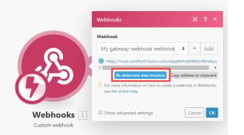

# Webhook

Webhook は、イベントによってトリガーされる HTTP 呼び出しです。 Web フックを使用して、インスタントトリガーモジュールを有効にできます。 インターネットに接続され、HTTP リクエストを許可するアプリケーションは、Adobe Workfront Fusion に Web フックを送信できます。

## アクセス要件

この記事の機能を使用するには、次のアクセス権が必要です。

<table style="table-layout:auto"> 
 <col> 
 <col> 
 <tbody> 
  <tr> 
   <td role="rowheader">[!DNL Adobe Workfront] 計画*</td> 
   <td> <p>[!UICONTROL Pro] 以降</p> </td> 
  </tr> 
  <tr data-mc-conditions=""> 
   <td role="rowheader">[!DNL Adobe Workfront] ライセンス*</td> 
   <td> <p>[!UICONTROL プラン ]、[!UICONTROL Work]</p> </td> 
  </tr> 
  <tr> 
   <td role="rowheader">[!DNL Adobe Workfront Fusion] ライセンス**</td> 
   <td>
   <p>現在のライセンス要件：いいえ [!DNL Workfront Fusion] ライセンス要件。</p>
   <p>または</p>
   <p>従来のライセンス要件：[!UICONTROL [!DNL Workfront Fusion] [ 作業の自動化と統合 ] </p>
   </td> 
  </tr> 
  <tr> 
   <td role="rowheader">製品</td> 
   <td>
   <p>現在の製品要件：[!UICONTROL Select] または [!UICONTROL Prime] がある場合 [!DNL Adobe Workfront] プラン（組織で購入する必要がある） [!DNL Adobe Workfront Fusion] 同様に [!DNL Adobe Workfront] を使用して、この記事で説明する機能を使用できます。 [!DNL Workfront Fusion] は、[!UICONTROL Ultimate] に含まれています [!DNL Workfront] プラン</p>
   <p>または</p>
   <p>従来の製品要件：組織で購入する必要があります [!DNL Adobe Workfront Fusion] 同様に [!DNL Adobe Workfront] を使用して、この記事で説明する機能を使用できます。</p>
   </td> 
  </tr>
 </tbody> 
</table>

&#42;保有しているプラン、ライセンスの種類、アクセス権を確認するには、Workfront管理者に問い合わせてください。

&#42;&#42;詳しくは、 [!DNL Adobe Workfront Fusion] ライセンス， 「 [[!DNL Adobe Workfront Fusion] ライセンス](../../workfront-fusion/get-started/license-automation-vs-integration.md)

## でのウェブフックの使用 [!DNL Workfront Fusion]

>[!NOTE]
>
>サードパーティの Webhook（送信 Webhook）を呼び出すには、いずれかの HTTP モジュールを使用します。 詳しくは、 [HTTP モジュール](../../workfront-fusion/apps-and-their-modules/http-modules/http-modules-1.md).

Webhook を使用してアプリを接続するには [!DNL Workfront Fusion]:

1. を **[!UICONTROL ウェブフック]** >**[!UICONTROL カスタムウェブフック]** インスタントトリガーモジュールをシナリオに追加します。

1. クリック **[!UICONTROL 追加]** 「Webhook」フィールドの横に、新しい Webhook の名前を入力します。
1. （オプション）「 **[!UICONTROL 詳細設定]**.
1. 内 **[!UICONTROL IP 制限]** 「 」フィールドに、モジュールがデータを受け入れる IP アドレスのコンマ区切りリストを入力します。
1. クリック **[!UICONTROL 保存]**

Webhook を作成すると、一意の URL が表示されます。 これは、Webhook がデータを送信するアドレスです。 Workfront Fusion は、このアドレスに送信されたデータを検証し、そのデータをシナリオでの処理に渡します。

>[!NOTE]
>
>Webhook を作成したら、一度に複数のシナリオで使用できます。

### Webhook のデータ構造の設定 {#configure-the-webhook-s-data-structure}

受信ペイロードのデータ構造を認識するには、 [!DNL Workfront Fusion] は、表示されているアドレスに送信したサンプルデータを解析します。 サンプルデータを指定するには、そのサービスまたはアプリが Webhook を呼び出すようにサービスまたはアプリを変更します。 例えば、ファイルを削除できます。

または、次の手順に従って、 [!UICONTROL HTTP] > [!UICONTROL リクエストを実行] モジュール。

1. 新しいシナリオを作成し、 **[!UICONTROL HTTP]** > **[!UICONTROL リクエストを実行]** モジュール

1. 次の値を使用してモジュールを設定します。

   <table style="table-layout:auto"> 
    <col> 
    <col> 
    <tbody> 
     <tr> 
      <td role="rowheader"><p>[!UICONTROL URL] </p></td> 
      <td>Webhook の URL を入力します。 この URL は、Webhook の設定に使用した [!UICONTROL Webhooks] モジュールに含まれています。</td> 
     </tr> 
     <tr> 
      <td role="rowheader">[!UICONTROL メソッド ] </td> 
      <td><p>[!UICONTROLPOST]</p></td> 
     </tr> 
     <tr> 
      <td role="rowheader">[!UICONTROL 本文の種類 ]</td> 
      <td><p> [!UICONTROL Raw]</p></td> 
     </tr> 
     <tr> 
      <td role="rowheader">[!UICONTROL コンテンツタイプ ]</td> 
      <td><p> JSON (application/json)</p></td> 
     </tr> 
     <tr> 
      <td role="rowheader">[!UICONTROL コンテンツをリクエスト ]</td> 
      <td><p>Webhook で想定される生の JSON</p></td> 
     </tr> 
    </tbody> 
   </table>

   

1. でシナリオを開きます。 [!UICONTROL ウェブフック] モジュールを別のブラウザータブまたはウィンドウに追加します。
1. Webhooks モジュールで、 **[!UICONTROL データ構造を再決定]**.

   Webhooks モジュールから他のモジュールのリンクを解除する必要はありません。

1. を使用してシナリオに切り替えます。 [!UICONTROL HTTP] モジュールを開き、実行します。
1. Webhooks モジュールを使用してシナリオに戻ります。

   A &quot;[!UICONTROL 正常に決定されました]「 」というメッセージは、モジュールがデータ構造を正常に決定したことを意味します。

   

1. クリック **[!UICONTROL OK]** をクリックして、データ構造を保存します。

   これで、Webhook の項目がマッピングパネルで使用でき、シナリオの後続モジュールで使用できます。

## キュー

Webhook がデータを受け取り、そのデータを期待しているアクティブなシナリオがない場合、データはキューに格納されます。 シナリオをアクティブ化すると、キューで待機しているすべてのバンドルが順番に処理されます。

>[!IMPORTANT]
>
>Webhook キューは、同じ Webhook を使用するシナリオ間で共有されます。 いずれかのシナリオが無効な場合、すべての受信データはキューに保持されます。

## サポートされる受信データ形式

[!DNL Workfront Fusion] は、次の 3 つの受信データ形式をサポートします。 [!UICONTROL クエリ文字列], [!UICONTROL フォームデータ] および [!UICONTROL JSON].

[!DNL Workfront Fusion] は、選択したデータ構造に対するすべての受信データを検証します。 次に、シナリオの設定に応じて、データは処理用のキューに格納されるか、すぐに処理されます。

データのいずれかの部分が検証に合格しない場合、 [!DNL Workfront Fusion] 400 HTTP ステータスコードを返し、受信データが検証チェックに失敗した理由を HTTP 応答の本文に指定します。 受信データの検証が成功した場合、Workfront Fusion は「[!UICONTROL 200 受理済み]&quot;ステータス。

* [[!UICONTROL クエリ文字列]](#query-string)
* [[!UICONTROL フォームデータ]](#form-data)
* [[!UICONTROL JSON]](#json)

### [!UICONTROL クエリ文字列]

```
GET https://app.workfrontfusion.com/wh/<yourunique32characterslongstring>?name=<yourname>&job=automate
```

### [!UICONTROL フォームデータ]

```
POST https://app.workfrontfusion.com/wh/<yourunique32characterslongstring>

Content-Type: application/x-www-form-urlencoded

name=<yourname>&job=automate
```

#### マルチパートフォームデータ

```
POST https://app.workfrontfusion.com/wh/<yourunique32characterslongstring>


Content-Type: multipart/form-data; boundary=---generatedboundary

---generatedboundary

Content-Disposition: form-data; name="file"; filename="file.txt"


Content-Type: text/plain


Content of file.txt


---generatedboundary

Content-Disposition: form-data; name="name"

Workfront Fusion

---generatedboundary
```

を使用してエンコードされたファイルを受け取るため `multipart/form-data`を使用する場合は、 `collection` 入れ子にされたフィールドを含むタイプフィールド `name`, `mime`、および `data`. フィールド `name` は `text` 「 」と入力し、アップロードしたファイルの名前を格納します。 この `mime` は `text` 「 」と入力し、MIME 形式のファイルを含めます。 フィールド `data` は `buffer` タイプで、転送するファイルのバイナリデータが含まれます。

MIME 形式について詳しくは、 [MIME モジュール](../../workfront-fusion/apps-and-their-modules/mime.md).

### [!UICONTROL JSON]

```
POST https://app.workfrontfusion.com/wh/<yourunique32characterslongstring>

Content-Type: application/json

{"name": "Workfront Fusion", "job": "automate"}
```

>[!TIP]
>
>元の JSON にアクセスする場合は、Webhook の設定時に JSON パススルーを有効にします。
>
>1. クリック **[!UICONTROL 追加]** をクリックして、新しいウェブフックを追加します。
>1. クリック **[!UICONTROL 詳細設定を表示]**.
>1. クリック **[!UICONTROL JSON パススルー]**.
>

## Webhook ヘッダー

Webhook のヘッダーにアクセスするには、Webhook の設定時に「 Get request headers 」を有効にします。

1. クリック **[!UICONTROL 追加]** をクリックして、新しいウェブフックを追加します。
1. クリック **[!UICONTROL 詳細設定を表示]**.
1. クリック **[!UICONTROL リクエストヘッダーの取得]**.

特定のヘッダー値を `map()` および `get()` 関数

>[!INFO]
>
>**例:**
>
>次の例は、 `authorization` ヘッダー `Headers[]` 配列。 この数式は、抽出された値と指定されたテキストを比較し、一致する場合に Web フックのみを渡すフィルターで使用されます。
>
>
>
>特定のキーを使用して配列の要素を取得する方法について詳しくは、 [指定されたキーで配列の要素をマッピングする](../../workfront-fusion/mapping/map-information-between-modules.md#mapping) 記事内 [Adobe Workfront Fusion で、モジュール間の情報のマッピング](../../workfront-fusion/mapping/map-information-between-modules.md).

## Web フックへの応答

Webhook 呼び出しに対するデフォルトの応答は、「許可済み」というテキストです。 応答は、カスタム Webhook モジュールの実行中に Webhook を呼び出したアプリに返されます。

* [Webhook への応答のテスト](#test-the-response-to-a-webhook)
* [HTML応答の例](#html-response-example)
* [リダイレクトの例](#redirect-example)

### Webhook への応答のテスト

1. 次を含める： **[!UICONTROL カスタムウェブフック]** モジュールを設定します。
1. モジュールに新しい Webhook を追加します。
1. Webhook の URL をクリップボードにコピーします。
1. シナリオを実行します。

   電光雷のアイコン [!UICONTROL カスタムウェブフック] モジュールが回転ドットに変わります。 これは、モジュールが Webhook 呼び出しを待機していることを示しています。

1. 新しいブラウザーウィンドウを開き、コピーした URL をアドレスバーに貼り付けて、を押します。 **[!UICONTROL 入力]**.

   この [!UICONTROL カスタムウェブフック] モジュールがトリガーされ、ブラウザーに新しいページが表示されます。

Webhook の応答をカスタマイズする場合は、Webhook の応答モジュールを使用します。

モジュールの設定には、次の 2 つのフィールドが含まれます。 [!UICONTROL ステータス] および [!UICONTROL 本文].

* この [!UICONTROL ステータス] フィールドには、成功の場合は 2xx などの HTTP 応答ステータスコードが含まれます ( 例： `200` （OK の場合）、リダイレクトの場合は 3xx （例： ） `307` 一時的なリダイレクトの場合 )、4xx（クライアントエラーの場合）( 例： `400` （不正なリクエスト）など。

* この [!UICONTROL 本文] フィールドには、webhook の呼び出しで受け入れられるすべてが含まれます。 単純なテキスト、HTML、XML、JSON などを指定できます。

  >[!TIP]
  >
  >この `Content-Type` ヘッダーを対応する MIME タイプに変更します。 `text/plain` テキスト形式の場合 `text/html` HTML `application/json` JSON の場合、 `application/xml` XML などの MIME タイプについて詳しくは、 [MIME モジュール](../../workfront-fusion/apps-and-their-modules/mime.md).

応答の送信のタイムアウトは 40 秒です。 その期間内に応答が利用できない場合、Workfront Fusion は「200 受理」ステータスを返します。

### HTML応答の例

>[!INFO]
>
>**例:**
>
>の設定 [!UICONTROL ウェブフックの応答] モジュールの説明：
>
><table style="table-layout:auto"> 
&gt; <col> 
&gt; <col> 
&gt; <tbody> 
&gt;  <tr> 
&gt;   <td role="rowheader">[!UICONTROL ステータス ] </td> 
&gt;   <td> <p>2xx 成功 HTTP ステータスコード（例： 200）</p> </td> 
&gt;  </tr> 
&gt;  <tr> 
&gt;   <td role="rowheader">[!UICONTROL 本文 ] </td> 
&gt;   <td> <p>HTMLコード</p> </td> 
&gt;  </tr> 
&gt;  <tr> 
&gt;   <td role="rowheader"> <p>[!UICONTROL カスタムヘッダー ]</p> </td> 
&gt;   <td> 
&gt;    <ul> 
&gt;     <li><strong>キー</strong>:Content-type</li> 
&gt;     <li><strong>値</strong>:text/html</li> 
&gt;    </ul> </td> 
&gt;  </tr> 
&gt; </tbody> 
&gt;</table>
>
>
>
>これにより、WebHTMLーに表示されるブラウザー応答が生成されます。
>
>

### リダイレクトの例

>[!INFO]
>
>**例：** の設定 [!UICONTROL ウェブフックの応答] モジュールの説明：
>
><table style="table-layout:auto"> 
&gt; <col> 
&gt; <col> 
&gt; <tbody> 
&gt;  <tr> 
&gt;   <td role="rowheader">[!UICONTROL ステータス ] </td> 
&gt;   <td> <p>3xx リダイレクト HTTP ステータスコード（例： 303）</p> </td> 
&gt;  </tr> 
&gt;  <tr> 
&gt;   <td role="rowheader"> <p>[!UICONTROL カスタムヘッダー ]</p> </td> 
&gt;   <td> 
&gt;    <ul> 
&gt;     <li><strong>[!UICONTROL キー ]</strong>:場所</li> 
&gt;     <li><strong>[!UICONTROL 値 ]</strong>:リダイレクト先の URL。</li> 
&gt;    </ul> </td> 
&gt;  </tr> 
&gt; </tbody> 
&gt;</table>
>
>

## Webhook の無効化

次のいずれかに該当する場合、Webhook は自動的に非アクティブ化されます。

* Webhook は 5 日以上どのシナリオにも接続されていません
* Webhook は、非アクティブなシナリオ（30 日以上非アクティブであったシナリオ）でのみ使用されます。

非アクティブ化された Web フックは、シナリオに接続されておらず、30 日以上非アクティブ状態にある場合、自動的に削除され、登録解除されます。


## トラブルシューティング

### マッピングパネルに項目がありません

次のモジュールの設定で、マッピングパネルに一部の項目が表示されない場合 [!UICONTROL ウェブフック] > [!UICONTROL カスタムウェブフック] モジュール、 **[!UICONTROL ウェブフック] > [!UICONTROL カスタムウェブフック]** モジュールの設定を開き、をクリックします。 **[!UICONTROL データ構造を再決定]**:



次に、「 」セクションで説明されている手順に従います。 [Webhook のデータ構造の設定](#configure-the-webhook-s-data-structure) 」を参照してください。
