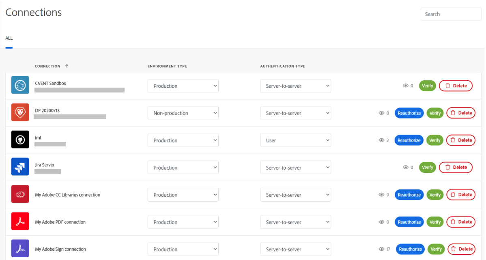

# Adobe Workfront Fusion の接続メタデータ

>[!IMPORTANT]
>
>Adobe Workfront Fusion のドキュメントが新しい場所に移動されました。
>
>この記事の情報は、次の記事に記載されています。
>
>* [接続メタデータ](https://experienceleague.adobe.com/docs/workfront-fusion/using/references/connections/connection-metadata.html)
>
>ブックマークを更新してください。
>
>この記事は現在更新されておらず、近い将来に削除されます。

>[!NOTE]
>
>[!DNL Adobe Workfront Fusion] には [!DNL Adobe Workfront] ライセンスに加えて [!DNL Adobe Workfront Fusion] ライセンスが必要です。

すべての接続が同じとは限りません。接続間の違いを理解することは、ビジネス上の意味を知る上で非常に重要です。Fusion ではメタデータを使用して接続の重要な属性を識別します。

接続メタデータは、新しい接続を作成する際に設定できます。これらの属性は、接続の設定に使用するのと同じダイアログボックスに表示されます。

Fusion ユーザーは、「接続」エリアから接続を表示および編集できます。

## 環境タイプ

Fusion 接続は、実稼動システムと非実稼動システムの両方で使用できます。その違いを知ることは、実稼動環境を保護する上で非常に重要です。環境タイプは、他の接続メタデータと同様に、情報提供の目的でのみ使用されます。ユーザーは、引き続きこの属性を正確に設定する必要があります。

## 認証タイプ

Fusion 接続は、サービスアカウントと個人アカウントの両方に使用できます。Fusion としてシナリオが自動化される場合、サービスアカウントが認証に使用されます。個人アカウントは、特定の人物に基づく認証です。どの認証タイプを使用するかは、シナリオの要件によって異なります。自動化されたユーザーアクションには、個人アカウントを使用する必要があります。たとえば、Fusion シナリオで特定の人物による承認を自動化する場合、その人物の認証タイプを使用する必要があります。それ以外の場合、Fusion は Fusion として振る舞い、そのタイプは「サービスアカウント」にする必要があります。

タイプは、他の接続メタデータと同様に、情報提供の目的でのみ使用されます。ユーザーは、引き続きこの属性を正確に設定する必要があります。

認証タイプについて詳しくは、アドビの認証ガイドの[認証](https://developer.adobe.com/developer-console/docs/guides/authentication/)を参照してください。
