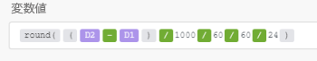

# の日付および時間関数 [!DNL Adobe Workfront Fusion]

## アクセス要件

この記事の機能を使用するには、次のアクセス権が必要です。

<table style="table-layout:auto">
 <col> 
 <col> 
 <tbody> 
  <tr> 
   <td role="rowheader">[!DNL Adobe Workfront] 計画*</td> 
   <td> <p>[!DNL Pro] またはそれ以降</p> </td> 
  </tr> 
  <tr data-mc-conditions=""> 
   <td role="rowheader">[!DNL Adobe Workfront] ライセンス*</td> 
   <td> <p>[!UICONTROL プラン ]、[!UICONTROL Work]</p> </td> 
  </tr> 
  <tr> 
   <td role="rowheader">[!UICONTROL Adobe Workfront Fusion] ライセンス**</td> 
   <td>
   <p>現在のライセンス要件：いいえ [!DNL Workfront Fusion] ライセンス要件。</p>
   <p>または</p>
   <p>従来のライセンス要件：[!UICONTROL [!DNL Workfront Fusion] [ 作業の自動化と統合 ] </p>
   </td> 
  </tr> 
  <tr> 
   <td role="rowheader">製品</td> 
   <td>
   <p>現在の製品要件：[!UICONTROL Select] または [!UICONTROL Prime] がある場合 [!DNL Adobe Workfront] プラン（組織で購入する必要がある） [!DNL Adobe Workfront Fusion] 同様に [!DNL Adobe Workfront] を使用して、この記事で説明する機能を使用できます。 [!DNL Workfront Fusion] は、[!UICONTROL Ultimate] に含まれています [!DNL Workfront] プラン</p>
   <p>または</p>
   <p>従来の製品要件：組織で購入する必要があります [!DNL Adobe Workfront Fusion] 同様に [!DNL Adobe Workfront] を使用して、この記事で説明する機能を使用できます。</p>
   </td> 
  </tr> 
 </tbody> 
</table>

ご利用のプラン、ライセンスの種類、アクセス権を確認するには、 [!DNL Workfront] 管理者。

詳しくは、 [!DNL Adobe Workfront Fusion] ライセンス， 「 [[!DNL Adobe Workfront Fusion] ライセンス](../../workfront-fusion/get-started/license-automation-vs-integration.md).

## [!UICONTROL formatDate (date;形式； [timezone])]

この関数は、次のような Date 値がある場合に使用します。 `12-10-2021 20:30`を指定し、 `Dec 10, 2021 8:30 PM`.

これは、例えば、同じシナリオで、1 つのアプリまたは Web サービスの日付形式を、接続されたアプリまたは Web サービスの日付形式に変更する必要がある場合に便利です。

詳しくは、 [日付](../../workfront-fusion/mapping/item-data-types.md#date) および [テキスト](../../workfront-fusion/mapping/item-data-types.md#text) 記事内 [Adobe Workfront Fusion の項目データ型](../../workfront-fusion/mapping/item-data-types.md).

### パラメーター

<table style="table-layout:auto"> 
 <col> 
 <col> 
 <col> 
 <thead> 
  <tr> 
   <th>パラメーター</th> 
   <th>予期されるデータタイプ* </th> 
   <th>機能</th> 
  </tr> 
 </thead> 
 <tbody> 
  <tr> 
   <td>[!UICONTROL 日付 ] </td> 
   <td>日付 </td> 
   <td> <p>Date 値を Text 値に変換します。 </p> </td> 
  </tr> 
  <tr> 
   <td>[!UICONTROL 形式 ] </td> 
   <td>テキスト </td> 
   <td> <p>日付/時刻の書式設定トークンを使用して形式を指定できます。 詳しくは、 <a href="../../workfront-fusion/functions/tokens-for-date-and-time-formatting.md" class="MCXref xref">の日付と時刻の書式設定のトークン [!DNL Adobe Workfront Fusion]</a>.</p> <p class="example" data-mc-autonum="<b>Example: </b>"><span class="autonumber"><span><b>例: </b></span></span><code>DD.MM.YYYY HH:mm</code> </p> </td> 
  </tr> 
  <tr> 
   <td>[!UICONTROL タイムゾーン ] </td> 
   <td>テキスト </td> 
   <td> <p>（オプション）コンバージョンで使用されるタイムゾーンを指定できます。 </p> <p>認識されるタイムゾーンのリストについては、Wikipedia の「TZ database name」列を参照してください <a href="https://en.wikipedia.org/wiki/List_of_tz_database_time_zones">tz データベースのタイムゾーンのリスト</a>. この列にリストされている値のみが、関数で有効なタイムゾーンとして認識されます。 その他の値は無視され、代わりにプロファイルで指定されたシナリオタイムゾーンが使用されます。 詳しくは、この記事のを参照してください。 <a href="../../workfront-fusion/workfront-fusion-basics/change-profile-settings.md" class="MCXref xref">でのプロファイル設定の変更 [!DNL Adobe Workfront Fusion]</a>.</p> <p>このパラメーターを省略した場合、プロファイル設定で指定された Scenarios タイムゾーンが適用されます。 </p> <p class="example" data-mc-autonum="<b>Example: </b>"><span class="autonumber"><span><b>例: </b></span></span><code>Europe/Prague</code>, <code>UTC</code></p> </td> 
  </tr> 
 </tbody> 
</table>

異なるタイプを指定した場合、型強制が適用されます。 詳しくは、 [強制入力 [!DNL Adobe Workfront Fusion]](../../workfront-fusion/mapping/type-coercion.md).

### 戻り値と型

この `formatDate` 関数は、指定された形式とタイムゾーンに従って、指定された Date 値のテキスト表現を返します。 データタイプは Text です。

>[!INFO]
>
>**例：** シナリオと Web タイムゾーンはどちらもに設定されています `Europe/Prague` を参照してください。
>
>
>
>* `formatDate(1. Date created;MM/DD/YYYY)`
>
>    戻り値10/01/2018
>
>* `formatDate(1. Date created; YYYY-MM-DD hh:mm A)`
>
>   戻り値2018-10-01 09:32 AM
>
>* `formatDate(1. Date created;DD.MM.YYYY HH:mm;UTC)`
>
>    戻り値01.10.2018 07:32
>
>* `formatDate(now;DD.MM.YYYY HH:mm)`
>
>    戻り値19.03.2019 15:30

## [!UICONTROL parseDate (text;形式； [timezone])]

日付 ( `12-10-2019 20:30` または `Aug 18, 2019 10:00 AM`) を読み込み、それを Date 値（バイナリマシンが読み取り可能な表現）に変換（解析）する必要があります。 詳しくは、 [日付](../../workfront-fusion/mapping/item-data-types.md#date) および [テキスト](../../workfront-fusion/mapping/item-data-types.md#text) 記事内 [の項目データタイプ [!UICONTROL Adobe Workfront Fusion]](../../workfront-fusion/mapping/item-data-types.md).

### パラメーター

2 番目の列は、期待されるタイプを示します。 異なるタイプを指定した場合、型強制が適用されます。 詳しくは、 [強制入力 [!DNL Adobe Workfront Fusion]](../../workfront-fusion/mapping/type-coercion.md).

<table style="table-layout:auto"> 
 <col> 
 <col> 
 <col> 
 <thead> 
  <tr> 
   <th>パラメーター</th> 
   <th>予期されるデータタイプ* </th> 
   <th>機能</th> 
  </tr> 
 </thead> 
 <tbody> 
  <tr> 
   <td>[!UICONTROL text] </td> 
   <td>テキスト </td> 
   <td> <p>Date 値を Text 値に変換します。 </p> </td> 
  </tr> 
  <tr> 
   <td>[!UICONTROL 形式 ] </td> 
   <td>テキスト </td> 
   <td> <p>日付/時刻の書式設定トークンを使用して形式を指定できます。 詳しくは、 <a href="../../workfront-fusion/functions/tokens-for-date-and-time-formatting.md" class="MCXref xref">Adobe Workfront Fusion での日付と時刻の形式に関するトークン</a>.</p> <p class="example" data-mc-autonum="<b>Example: </b>"><span class="autonumber"><span><b>例: </b></span></span><code>DD.MM.YYYY HH:mm</code> </p> </td> 
  </tr> 
  <tr> 
   <td>[!UICONTROL タイムゾーン ] </td> 
   <td>テキスト </td> 
   <td> <p>（オプション）コンバージョンで使用されるタイムゾーンを指定できます。 </p> <p>認識されるタイムゾーンのリストについては、Wikipedia の「TZ database name」列を参照してください <a href="https://en.wikipedia.org/wiki/List_of_tz_database_time_zones">tz データベースのタイムゾーンのリスト</a>. この列にリストされている値のみが、関数で有効なタイムゾーンとして認識されます。 その他の値は無視され、代わりにプロファイルで指定されたシナリオタイムゾーンが使用されます。 詳しくは、この記事のを参照してください。 <a href="../../workfront-fusion/workfront-fusion-basics/change-profile-settings.md" class="MCXref xref">Adobe Workfront Fusion でのプロファイル設定の変更</a>.</p> <p>このパラメーターを省略した場合、プロファイル設定で指定された Scenarios タイムゾーンが適用されます。</p> <p class="example" data-mc-autonum="<b>Example: </b>"><span class="autonumber"><span><b>例: </b></span></span><code>Europe/Prague</code>, <code>UTC</code></p> </td> 
  </tr> 
 </tbody> 
</table>

異なるタイプを指定した場合、型強制が適用されます。 詳しくは、 [強制入力 [!DNL Adobe Workfront Fusion]](../../workfront-fusion/mapping/type-coercion.md).

### 戻り値と型

この関数は、指定した形式とタイムゾーンに従って、テキスト文字列を日付に変換します。 値のデータタイプは Date です。

>[!INFO]
>
>**例：** 次の例では、返される Date 値は ISO 8601 に従って表されますが、結果のデータ型は Date です。
>
>* `parseDate(2016-12-28;YYYY-MM-DD)`
>
>    戻り値2016-12-28T00:00:00.000Z
>
>* `parseDate(2016-12-28 16:03;YYYY-MM-DD HH:mm)`
>
>    戻り値2016-12-28T16:03:00.000Z
>
>* `parseDate(2016-12-28 04:03 pm; YYYY-MM-DD hh:mm a)`
>
>    戻り値2016-12-28T16:03:06.000Z
>
>* `parseDate(1482940986;X)`
>
>  戻り値2016-12-28T16:03:06.000Z

## [!UICONTROL addDays (date;数 )] {#adddays-date-number}

指定された日数を日付に追加した結果として新しい日付を返します。 日数を減算するには、負の数を入力します。

>[!INFO]
>
>**例:**
>
>* `addDays(2016-12-08T15:55:57.536Z;2)`
>
>    戻り値2016-12-10T15:55:57.536Z
>
>* `addDays(2016-12-08T15:55:57.536Z;-2)`
>
>    戻り値2016-12-6T15:55:57.536Z

## [!UICONTROL addHours (date;数 )] {#addhours-date-number}

指定された時間数を日付に追加した結果として新しい日付を返します。 時間を減算するには、負の数を入力します。

>[!INFO]
>
>**例:**
>
>* `addHours(2016-12-08T15:55:57.536Z; 2)`
>
>    戻り値2016-12-08T17:55:57.536Z
>
>* `addHours(2016-12-08T15:55:57.536Z;-2)`
>
>    戻り値2016-12-08T13:55:57.536Z

## [!UICONTROL addMinutes (date;数 )] {#addminutes-date-number}

指定された分数を日付に追加した結果として新しい日付を返します。 分を減算するには、負の数を入力します。

>[!INFO]
>
>**例:**
>
>* `addMinutes(2016-12-08T15:55:57.536Z;2)`
>
>    戻り値2016-12-08T15:57:57.536Z
>
>* `addMinutes(2016-12-08T15:55:57.536Z;-2)`
>
>    戻り値2016-12-08T15:53:57.536Z

## [!UICONTROL addMonths (date;数 )] {#addseconds-date-number}

指定された月数を日付に追加した結果として新しい日付を返します。 月を減算するには、負の数を入力します。

>[!INFO]
>
>**例:**
>
>* `addMonths(2016-08-08T15:55:57.536Z;2)`
>
>    戻り値2016-10-08T15:55:57.536Z
>
>* `addMonths(2016-08-08T15:55:57.536Z;-2)`
>
>    戻り値2016-06-08T15:55:57.536Z

## [!UICONTROL addSeconds (date;数 )]

指定された秒数を日付に追加した結果として新しい日付を返します。 秒を減算するには、負の数を入力します。

>[!INFO]
>
>**例:**
>
>* `addSeconds(2016-12-08T15:55:57.536Z;2)`
>
>   戻り値2016-12-08T15:55:59.536Z
>
>* `addSeconds(2016-12-08T15:55:57.536Z;-2)`
>
>   戻り値2016-12-08T15:55:55.536Z

## [!UICONTROL addYears (date;数 )]

指定された年数を日付に追加した結果として新しい日付を返します。 年を減算するには、負の数を入力します。

>[!INFO]
>
>**例:**
>
>* `addYears(2016-08-08T15:55:57.536Z;2)`
>
>    戻り値2018-08-08T15:55:57.536Z
>
>* `addYears(2016-12-08T15:55:57.536Z; -2)`
>
>    戻り値2014-08-08T15:55:57.536Z

## [!UICONTROL setSecond (date;数 )]

この関数は、パラメーターで指定された秒を持つ新しい日付を返します。

0 ～ 59 の数値を指定します。 数値がその範囲外の場合、前の分からの秒（負の数の場合）または後の分（正の数の場合）を返します。

範囲外の数値を指定する必要がある場合は、[!UICONTROL  addSeconds]（前述の節で説明） [addSeconds (date;数 )](#addseconds-date-number).

>[!INFO]
>
>**例:**
>
>* `setSecond(2015-10-07T11:36:39.138Z;10)`
>
>    戻り値2015-10-07T11:36:10.138Z
>
>* `setSecond(2015-10-07T11:36:39.138Z; 6)`
>
>    戻り値2015-10-07T11:37:01.138Z

## [!UICONTROL setMinute (date;数 )]

この関数は、パラメーターで指定された分を持つ新しい日付を返します。

0 ～ 59 の数値を指定します。 数値がその範囲外の場合、前の時間（負の数の場合）または後続の時間（正の数の場合）の分を返します。

範囲外の数値を指定する必要がある場合は、前述のように addMinutes を使用することをお勧めします ( [addMinutes (date;数 )](#addminutes-date-number).

>[!INFO]
>
>**例:**
>
>* `setMinute(2015-10-07T11:36:39.138Z;10)`
>
>    戻り値2015-10-07T11:10:39.138Z
>
>* `setMinute(2015-10-07T11:36:39.138Z;61)`
>
>    戻り値2015-10-07T12:01:39.138Z

## [!UICONTROL setHour (date;数 )]

この関数は、パラメーターで指定された時間を持つ新しい日付を返します。

0 ～ 23 の数値を指定します。 この範囲外の数値の場合、前日（負の数の場合）または後日（正の数の場合）から 1 時間の値を返します。

範囲外の数値を指定する必要がある場合は、前述のように addHours を使用することをお勧めします ( [addHours (date;数 )](#addhours-date-number).

>[!INFO]
>
>**例:**
>
>* `setHour(2015-08-07T11:36:39.138Z;6)`
>
>   戻り値2015-08-07T06:36:39.138Z
>
>* `setHour(2015-08-07T11:36:39.138;-6)`
>
>    戻り値2015-08-06T18:36:39.138Z

## [!UICONTROL setDay (date;日の数/名前（英語）]

この関数は、パラメーターで指定された日付を持つ新しい日付を返します。

この関数を使用して曜日を設定できます。日曜日は 1、土曜日は 7 に設定します。 1 ～ 7 の数値を指定した場合、結果の日付は現在の（日曜日から土曜日）週の範囲になります。 この数値がその範囲外の場合、前の週の日（負の数の場合）または後の週（正の数の場合）を返します。

範囲外の数値を指定する必要がある場合は、前述のように addDays を使用することをお勧めします ( [addDays (date;数 )](#adddays-date-number).

>[!INFO]
>
>**例:**
>
>* `setDay(2018-06-27T11:36:39.138Z;Monday)`
>
>   戻り値2018-06-25T11:36:39.138Z
>
>* `setDay(2018-06-27T11:36:39.138Z;1)`
>
>   戻り値2018-06-24T11:36:39.138Z
>
>* `setDay(2018-06-27T11:36:39.138Z;7)`
>
>   戻り値2018-06-30T11:36:39.138Z

## [!UICONTROL setDate (date;数 )]

この関数は、パラメーターで指定された日付と共に新しい日付を返します。

1 ～ 31 の数値を指定します。 この範囲外の数値の場合、前月の日（負の数の場合）または後月の日（正の数の場合）を返します。

>[!INFO]
>
>**例:**
>
>* `setDate(2015-08-07T11:36:39.138Z;5)`
>
>   戻り値2015-08-05T11:36:39.138Z
>
>* `setDate(2015-08-07T11:36:39.138Z;32)`
>
>   戻り値2015-09-01T11:36:39.138Z

## [!UICONTROL setMonth (date;( 月の数/名前（英語）]

この関数は、パラメーターで指定された月を持つ新しい日付を返します。

1 ～ 12 の数値を指定します。 この範囲外の数値の場合、前年（負の数の場合）または後続年（正の数の場合）の月を返します。

>[!INFO]
>
>**例:**
>
>* `setMonth(2015-08-07T11:36:39.138Z;5)`
>
>   戻り値2015-05-07T11:36:39.138Z
>
>* `setMonth(2015-08-07T11:36:39.138Z;17)`
>
>   戻り値2016-05-07T11:36:39.138Z
>
>* `setMonth(2015-08-07T11:36:39.138Z;january)`
>
>   戻り値2015-01-07T12:36:39.138Z

## [!UICONTROL setYear (date;数 )]

パラメータで指定された年を持つ新しい日付を返します。

>[!INFO]
>
>**例:**
>
>* `setYear(2015-08-07T11:36:39.138Z;2017)`
>
>   戻り値2017-08-07T11:36:39.138Z

## [!UICONTROL dateDifference (Date1;日付 2;単位 )]

2 つの日付の差を表す数値を指定した単位で返します。

Date1 から Date2 が減算されます。

次のいずれかの時間値を `unit` パラメーター：

* ミリ秒
* 秒
* 分
* 時間
* 日
* 週
* 月

単位が指定されていない場合、この関数はミリ秒単位の差を返します。

>[!INFO]
>
>**例:**
>
>* `dateDifference(2021-05-11T18:10:00.000Z;2021-05-11T18:00:00.000Z)`
>
>    戻り値 `600,000`
>
>* `dateDifference(2021-05-11T18:10:00.000Z;2021-05-11T18:00:00.000Z;hours)`
>
>    戻り値 `4`
>
>* `dateDifference2021-06-11T18:10:00.000Z;2021-05-11T18:00:00.000Z;months)`
>
>    戻り値 `1`

## その他の例

### 月の n 番目の曜日の計算方法

この節は [!DNL Workfront Fusion] から [!DNL Exceljet] 月の n 番目の曜日を取得する方法を説明する Web ページです。

月の n 番目の曜日（例：最初の火曜日、3 番目の金曜日など）に対応する日付を計算する必要がある場合、次の数式を使用できます。


```
{{addDays(setDate(1.date; 1); 1.n * 7 - formatDate(addDays(setDate(1.date; 1); "-" + 1.dow); "E"))}}
```

数式には、次の項目が含まれます。

<table style="table-layout:auto"> 
 <col> 
 <col> 
 <tbody> 
  <tr> 
   <td><code>1.n</code> </td> 
   <td> <p> n 日目：</p> 
    <ul> 
     <li><code>1</code> 第 1 火曜日に</li> 
     <li><code>2</code> 第 2 火曜日に</li> 
     <li><code>3</code> 第 3 火曜日など</li> 
    </ul> </td> 
  </tr> 
  <tr> 
   <td><code>2.dow</code> </td> 
   <td> <p> 曜日：</p> 
    <ul> 
     <li><code>1</code> 月曜日</li> 
     <li><code>2</code> 火曜日の</li> 
     <li><code>3</code> 水曜日の</li> 
     <li><code>4</code> 木曜日の</li> 
     <li><code>5</code> 金曜日は</li> 
     <li><code>6</code> 土曜日は</li> 
     <li><code>7</code> （日曜日）</li> 
    </ul> </td> 
  </tr> 
  <tr> 
   <td><code>1.date</code> </td> 
   <td> <p> 日付によって月が決まります。 現在の月の n 番目の曜日を計算するには、 <code>now</code> 変数を使用します。</p> </td> 
  </tr> 
 </tbody> 
</table>

例えば、毎週水曜日に 1 つの特定のケースのみを計算する場合は、アイテムを置き換えることができます `1.n` および `2.dow` を返します。 今月の第 2 水曜日には、次の値を使用します。

* `1.n` = `2`
* `1.dow` = `3`
* `1.date` = `now`


### 説明：

* `setDate(now;1)` 現在の月の最初を返します
* `formatDate(....;E)` 曜日を返します (1、2、... 6)

## 日付間の日数の計算方法

例えば、次の式を使用できます。



```
{{round((2.value - 1.value) / 1000 / 60 / 60 / 24)}}
```

>[!NOTE]
>
>* の値 `D1`および `D2` は日付タイプの値です。 文字列タイプの値 ( 例：20.10.2018) の場合、 `parseDate()` 関数を使用して、日付タイプの値に変換します。
>
>* この `round()` 関数は、いずれかの日付が夏時間に該当し、他の日付が該当しない場合に使用されます。 この場合、時間の差は 1 時間以上です。 整数以外の結果を得るには、24 で割ることができます。 夏時間の夏時間を失う。 丸めると分割・統合され、割合がなくなります

### 月の最終日/ミリ秒の計算方法

日付範囲を指定する場合（例えば、検索モジュールで、範囲が前月の全体にわたる場合）、クローズした間隔（両方の制限ポイントを含む間隔）の場合、月の最終日を計算する必要があります。

2019-09-01 ≤ D ≤ 2019-09-30

次の数式は、前月の最終日の計算方法の 1 つを示しています。


```
{{addDays(setDate(now; 1); -1)}}
```

場合によっては、月の最後の日だけでなく、文字どおり最後のミリ秒も計算する必要があります。

2019-09-01T00:00:00.000Z ≤ D ≤ 2019-09-30T23:59:59.999Z

この数式は、前月の直近ミリ秒を計算する方法の 1 つを示します。


```
{{parseDate(parseDate(formatDate(now; "YYYYMM01"); "YYYYMMDD"; "UTC") - 1; "x")}}
```

結果でタイムゾーン設定を使用する必要がある場合は、UTC 引数を省略します。


`{{parseDate(parseDate(formatDate(now; "YYYYMM01"); "YYYYMMDD") - 1; "x")}}`

ただし、次のように、次の月の最初の日を指定し、「次よりも小さい」演算子を「次よりも小さい」に置き換えて、代わりに半開間隔（その制限ポイントの 1 つを除く間隔）を使用することをお勧めします。

`2019-09-01 ≤ D < 2019-10-01`

`2019-09-01T00:00:00.000Z ≤ D < 2019-10-01T00:00:00.000Z`
