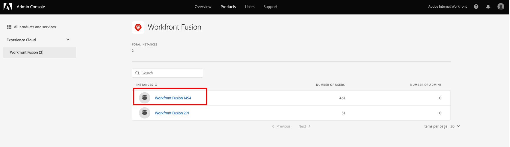

# ユーザーの追加先 [!DNL Adobe Workfront Fusion] から [!DNL Adobe Admin Console]

>[!IMPORTANT]
>
>このページで説明する手順は、 [!DNL Adobe Admin Console].
>
>組織がまだ [!DNL Adobe Admin Console]を参照してください。 [の組織にユーザーを追加する [!DNL Adobe Workfront Fusion]](../organizations/add-user-to-an-organization.md).
>
>組織が [!DNL Adobe Admin Console]を参照してください。 [プラットフォームベースの管理上の違い ([!DNL Adobe Workfront Fusion]/[!DNL Adobe Business Platform])](../fusion-in-admin-console/fusion-adobe-admin-console.md).

ユーザーを [!DNL Adobe Admin Console] を割り当て、 [!DNL Adobe Workfront Fusion]または [!DNL Adobe Admin Console] から [!DNL Workfront Fusion].

説明するビデオの場合 [!DNL Workfront Fusion] 内 [!DNL Adobe Admin Console]（ユーザーの追加方法を含む）を参照してください。 [[!DNL Fusion] Adobe IMS](https://video.tv.adobe.com/v/3412464/){target=_blank}.

## アクセス要件

この記事の機能を使用するには、次のアクセス権が必要です。

<table style="table-layout:auto"> 
 <col> 
 <col> 
 <tbody> 
  <tr> 
   <td role="rowheader">[!DNL Adobe Workfront] 計画*</td> 
   <td> 
[!UICONTROL Pro] 以降
 </td> 
  </tr> 
  <tr data-mc-conditions=""> 
   <td role="rowheader">[!DNL Adobe Workfront] ライセンス*</td> 
   <td> 
[!UICONTROL プラン ]、[!UICONTROL Work]
 </td> 
  </tr> 
  <tr> 
   <td role="rowheader">[!DNL Adobe Workfront Fusion] ライセンス**</td> 
   <td> 
[!UICONTROL Workfront Fusion for Work Automation and Integration] 
 
[!UICONTROL Workfront Fusion for Work Automation] 
  </td> 
  </tr> 
  <tr> 
   <td role="rowheader">製品</td> 
   <td>組織で購入する必要があります [!DNL Adobe Workfront Fusion] 同様に [!DNL Adobe Workfront] を使用して、この記事で説明する機能を使用できます。</td> 
  </tr>
   <tr> 
   <td role="rowheader">[!DNL Adobe] 管理者権限</td> 
   <td>[!UICONTROL 製品設定管理者 ] /である [!DNL Adobe] 組織の製品。</td> 
  </tr>
  </tbody> 
</table>

&#42;ご利用のプラン、ライセンスの種類、アクセス権を確認するには、 [!DNL Workfront] 管理者。

&#42;&#42;詳しくは、 [!DNL Adobe Workfront Fusion] ライセンス， 「 [[!DNL Adobe Workfront Fusion] ライセンス](../../workfront-fusion/get-started/license-automation-vs-integration.md)

## 前提条件

を使用する前に [!DNL Admin Console] 対象 [!DNL Workfront]に設定すると、コンソールに招待する電子メールが届きます。

1. 初めて [!DNL Adobe] 管理権限が与えられたことを知らせる電子メールを受け取りました。 [!DNL Adobe] 組織のソフトウェアとサービスで、電子メールの「 」ボタンをクリックして、 [!DNL Adobe] アカウントを開き、 [!DNL Admin Console].

   または

   既にAdobeアカウントがある場合は、 [[!DNL Adobe Admin Console] ページ](https://adminconsole.adobe.com/).

## 新しいユーザーを [!DNL Adobe Admin Console] および [!DNL Workfront Fusion]

1. 次の [[!DNL Adobe Admin Console] ページ](https://adminconsole.adobe.com/)を選択し、 **[!UICONTROL 製品]** 」タブで、 **[!DNL Workfront Fusion]** 製品タイル。

   

1. 表示されるリストで、ユーザーを追加する組織を選択します。

   

1. 表示されるリストで、 **[!UICONTROL 製品プロファイル]** タブが選択されている場合、 [!DNL Workfront Fusion] [!UICONTROL 製品プロファイル] リンク。

   

   >[!IMPORTANT]
   >
   > 変更を加えない [!UICONTROL 製品プロファイル] それ自体。

1. を使用 **[!UICONTROL ユーザー]** リストの上で選択したタブで、 **[!UICONTROL ユーザーを追加]**.

1. 内 **[!UICONTROL この製品プロファイルにユーザーを追加]** ボックスに、追加するユーザーの電子メールアドレスまたは名前を入力し、表示されるリストからユーザーを選択します。

1. 「**[!UICONTROL 保存]**」をクリックします。

   ユーザーが [!DNL Workfront Fusion].

   <!--
    >[!IMPORTANT]
    >
    > Do not make any changes to the Product Profile itself.
    -->

1. （オプション）続行 [でのユーザーのアクセスレベルの変更 [!DNL Workfront Fusion]](#change-a-users-access-level-in-workfront-fusion)

## Workfront Fusion でのユーザーのアクセスレベルの変更

### ユーザーの役割を管理者に変更する

ユーザーに管理者の役割を割り当てるには、 [!DNL Adobe Admin Console].

1. の [!DNL Workfront Fusion] [!UICONTROL 製品プロファイル] ユーザーを追加したページで、 **[!UICONTROL 管理者]** タブをクリックします。

1. クリック **[!UICONTROL 管理者を追加]**.

1. 内 **[!UICONTROL 製品プロファイル管理者の追加]** ボックスに、追加するユーザーの電子メールアドレスまたは名前を入力し、表示されるリストからユーザーを選択します。

1. 「**[!UICONTROL 保存]**」をクリックします。

   このユーザーは、現在、 [!DNL Workfront Fusion].

### ユーザーの役割をに変更する [!UICONTROL メンバー], [!UICONTROL 会計士]または [!UICONTROL アプリ開発者].

[!UICONTROL メンバー], [!UICONTROL 会計士]、および [!UICONTROL アプリ開発者] の役割は内部で処理されます [!DNL Workfront Fusion].

手順については、 [ユーザーの役割の表示または編集](../organizations/manage-fusion-users.md#view-or-edit-user-roles) 記事内 [管理 [!DNL Adobe Workfront Fusion] 組織内のユーザー](../organizations/manage-fusion-users.md)

## 既存のユーザーを [!DNL Adobe Admin Console] から [!DNL Workfront Fusion]

1. 記事の「ユーザーの詳細を編集」の節の説明に従って、ユーザーの編集を開始します [ユーザーを個別に管理](https://helpx.adobe.com/enterprise/using/manage-users-individually.html) 内 [!DNL Adobe Admin Console] ドキュメント。

1. 追加 **[!DNL Adobe Workfront Fusion]** をユーザーに割り当てた製品に追加します。
