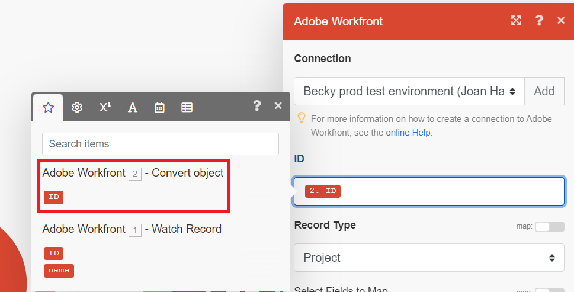

# 関数を使用した [!DNL Adobe Workfront Fusion] の簡単なシナリオでのプロジェクトの更新

Workfront作業項目の更新は、Workfront Fusion の一般的なユースケースです。 この例では、関数を使用して、プロジェクトの名前を大文字に変更します。

Fusion には、データに対して条件付きロジックを変換および実行できる多くのタイプの関数が含まれています。 関数の使用について詳しくは、[Adobe Workfront Fusion でのモジュール間の情報のマッピング ](/help/quicksilver/workfront-fusion/mapping/map-information-between-modules.md) を参照してください。

この例では、[ 基本シナリオの作成 ](/help/quicksilver/workfront-fusion/get-started/build-practice-scenarios/create-simple-scenario.md) で作成したシナリオを変更します。

## 前提条件

この手順を実行する前に、[ 基本シナリオの作成 ](/help/quicksilver/workfront-fusion/get-started/build-practice-scenarios/create-simple-scenario.md) で説明されているシナリオを作成する必要があります。

## 関数を使用したプロジェクトの更新

### シナリオにレコードを更新モジュールを追加します

1. シナリオエディターでシナリオを開きます。
1. モジュールの右側にある部分的な円にポインタを合わせ、「**[!UICONTROL 別のモジュールを追加]**」をクリックします。
1. アプリケーションのリストから「[!DNL Adobe Workfront]」を選択し、モジュール **[!UICONTROL レコードを更新]** を選択します。
1. 「ID」フィールドで、オブジェクトを変換モジュールの下にある ID ブロックを選択します。 これは、そのモジュールによって出力されたプロジェクトの ID です。

   

1. 更新するオブジェクトはプロジェクトなので、「レコードタイプ」フィールドで「プロジェクト」を選択します。
1. マッピングするフィールドを選択エリアで、「名前」を選択します。

   名前フィールドが開きます。

### 名前の更新用に関数をマッピング

このシナリオで要求がプロジェクトに変換されると、プロジェクトの名前は要求と同じになります。 ここでの関数は、その名前を受け取り、その中のすべての文字を大文字にします。

1. 「**名前** フィールドをクリックします。

   マッピングパネルが開きます。
1. マッピングパネルで「**テキスト関数とバイナリ関数** アイコンをクリックします。 
1. 関数 **upper** を選択します。

   関数は、必要な入力の書式を含め、「名前」フィールドに表示されます。

   この例では、プロジェクトの変換元のイシューの名前が入力されます。

1. カーソルを括弧の間に移動します。これは、入力が行われる場所だからです。
1. マッピングパネルで「**module output**」アイコンをクリックします。 
1. 最初のモジュールによって出力された名前ブロックを選択します。

   名前ブロックが関数に表示されます。

   

1. 「OK」をクリックして、モジュール設定を保存します。

### テストしてアクティブ化

1. 画面の左下にある「**1 回実行**」をクリックして、シナリオをテストします。
1. 出力を調べて、シナリオが期待どおりに実行されたことを確認します。
1. シナリオが期待どおりに動作していることを確認したら、画面の左下にある **スケジュール** トグルをクリックして **オン** にします。

   これにより、シナリオがアクティブになります。 アクティブなシナリオは、トリガーモジュールで設定したスケジュールに従って実行されます。
1. [!DNL Workfront Fusion] では、左下隅付近の **[!UICONTROL 保存]** をクリックして、シナリオの進捗を保存します。

   >[!IMPORTANT]
   >
   >シナリオを改良、テストするたびに保存するようにしてください。

## リソース：

* [ [!DNL Adobe Workfront Fusion] の関数を使用して項目をマッピング](/help/quicksilver/workfront-fusion/mapping/map-information-between-modules.md)
