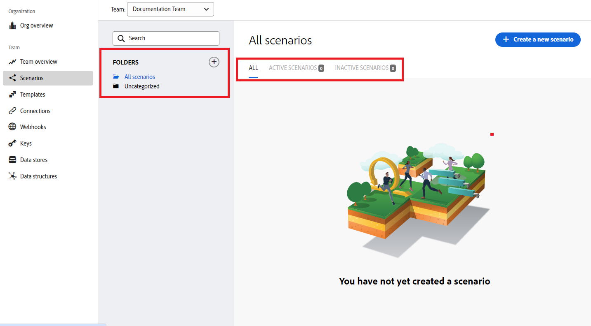

# での自動化のプラクティスシナリオの作成 [!DNL Adobe Workfront Fusion]

この記事では、Adobe Workfront Fusion を使用して自動化シナリオを作成する方法について説明します。 自動化シナリオは、データの操作や変換を含むWorkfrontプロセスを自動化します。 次の例では、シナリオの作成プロセスを実行します。このシナリオでは、プロジェクトを検索し、そのプロジェクトに関連するすべてのタスクを返します。

別々のアプリを接続する統合シナリオの作成手順については、 [Adobe Workfront Fusion でのプラクティス統合シナリオの作成](../../workfront-fusion/get-started/create-a-practice-scenario.md).

各Workfront Fusion ライセンスで利用可能な機能について詳しくは、 [Adobe Workfront Fusion ライセンス](../../workfront-fusion/get-started/license-automation-vs-integration.md).

## アクセス要件

この記事の機能を使用するには、次のアクセス権が必要です。

<table style="table-layout:auto">
 <col> 
 <col> 
 <tbody> 
  <tr> 
   <td role="rowheader">[!DNL Adobe Workfront] 計画*</td> 
   <td> 
[!DNL Pro] またはそれ以降
 </td> 
  </tr> 
  <tr data-mc-conditions=""> 
   <td role="rowheader">[!DNL Adobe Workfront] ライセンス*</td> 
   <td> 
[!UICONTROL プラン ]、[!UICONTROL Work]
 </td> 
  </tr> 
  <tr> 
   <td role="rowheader">[!UICONTROL Adobe Workfront Fusion] ライセンス**</td> 
   <td>
   
現在のライセンス要件：いいえ [!DNL Workfront Fusion] ライセンス要件。

   
または

   
従来のライセンス要件：[!UICONTROL [!DNL Workfront Fusion] [ 作業の自動化と統合 ] 

   </td> 
  </tr> 
  <tr> 
   <td role="rowheader">製品</td> 
   <td>
   
現在の製品要件：[!UICONTROL Select] または [!UICONTROL Prime] がある場合 [!DNL Adobe Workfront] プラン（組織で購入する必要がある） [!DNL Adobe Workfront Fusion] 同様に [!DNL Adobe Workfront] を使用して、この記事で説明する機能を使用できます。 [!DNL Workfront Fusion] は、[!UICONTROL Ultimate] に含まれています [!DNL Workfront] プラン

   
または

   
従来の製品要件：組織で購入する必要があります [!DNL Adobe Workfront Fusion] 同様に [!DNL Adobe Workfront] を使用して、この記事で説明する機能を使用できます。

   </td> 
  </tr> 
 </tbody> 
</table>
ご利用のプラン、ライセンスの種類、アクセス権を確認するには、 [!DNL Workfront] 管理者。

詳しくは、 [!DNL Adobe Workfront Fusion] ライセンス， 「 [[!DNL Adobe Workfront Fusion] ライセンス](../../workfront-fusion/get-started/license-automation-vs-integration.md).

## プラクティスシナリオの作成

の役割 [!DNL Adobe Workfront Fusion] は、同じタスクを何度も繰り返す代わりに、新しいタスクに集中できるように、プロセスを自動化するためのものです。 アプリやサービス内でアクションをリンクして、データを自動的に転送および変換するシナリオを作成できます。 アプリまたはサービスのデータを監視し、そのデータを処理して目的の結果を提供するシナリオです。

シナリオは、アプリ内でのデータの変換方法や、アプリと Web サービスの間での転送方法を示す一連のモジュールで構成されます。
この例では、 [!DNL Workfront] プロジェクト内のタスクを返します。

シナリオの作成は、主なタスクで構成されます。

## アプリを選択し、シナリオに名前を付けます

1. ログイン [!DNL Workfront Fusion] アカウント
1. クリック **[!UICONTROL シナリオ]**  をクリックします。

   >[!NOTE]
   >
   >左側のナビゲーションパネルまたはそのアイコンが表示されない場合は、メニュー  アイコン

   灰色で [!UICONTROL フォルダー] 表示されるパネルを使用して、シナリオをフォルダーに整理できます。

   右側のメイン領域の上部に、 **[!UICONTROL すべて]** 作成したシナリオ、 **[!UICONTROL アクティブなシナリオ]**, **[!UICONTROL 非アクティブなシナリオ]**、および **[!UICONTROL 概念]**. 概念は、以前にさらに作業が必要なシナリオです。 [!DNL Workfront Fusion] は、それらをアクティブまたは非アクティブに分類できます。

<!--
   
-->

1. 内 [!UICONTROL フォルダー] パネル、 **[!UICONTROL フォルダーを追加]** アイコン 次に、最初のフォルダーに「Practice scenarios」などの名前を入力します。

1. フォルダーを開いて、「 **[!UICONTROL 新しいシナリオの作成]** をクリックします。

   表示されるランディングページでは、作成するシナリオで使用するアプリをプリロードできます。

1. この演習では、「 」を検索し、「 」を選択します。 **[!DNL Workfront]** アプリを使用します。
1. クリック **[!UICONTROL 続行]** をクリックします。

   シナリオエディターが表示され、中央に空のモジュールが表示されます。 [!DNL Workfront] アプリケーションがプリロードされ、一部のオプションが下部のツールバーに表示されます。

<!--
   
-->

新しいシナリオの作成を開始する場合は、まずシナリオの名前を作成することをお勧めします。

1. を選択します。 **[!UICONTROL 新しいシナリオ]** プレースホルダー名を左上隅に入力し、「Practice scenario 1」などの名前を入力します。
1. 続行 [最初のモジュールを追加して設定します](#add-and-configure-the-first-module) 下

## 最初のモジュールを追加して設定します

疑問符付きの空のモジュールは、追加する必要のあるトリガーモジュールを表します。 このモジュールは、シナリオが実行されるたびに起動します。 空のモジュールの時計アイコンは、がスケジュール済みモジュールであることを示します。

このモジュールには、シナリオで監視するデータが含まれます。

この例では、モジュールモジュールを使用していません。トリガー 代わりに、このシナリオは検索で始まります。

1. 空のモジュールをクリックして、モジュールを選択するアプリを選択します。

   事前に読み込んだアプリが、空のモジュールの横に表示されます。 を使用して、モジュールを持つ他のアプリを追加できます。 [!UICONTROL 検索] ボックス

   

1. クリック **[!DNL Workfront]**.

   リストがすべての [!DNL Workfront] モジュールモジュールとして使用できるトリガー。

1. 検索モジュールをクリックします。 **[!UICONTROL 検索]**.

   次に、 [!DNL Workfront] アカウント シナリオに追加するモジュールはすべて、アプリに接続する必要があります。

1. 内 **[!DNL Workfront]** ボックス、下 **[!UICONTROL 接続]**&#x200B;をクリックし、 **[!UICONTROL 追加]**&#x200B;次に、「Olivia&#39;s Workfront account」など、接続の名前を入力し、 **[!UICONTROL 続行]**.
1. 表示されるウィンドウで接続を認証します。

   接続を認証するプロセスは、アプリ間で少し異なる場合があります。 次のプロセスは、 [!DNL Workfront]ですが、このプロセスは多くのアプリに似ています。

   1. を入力します。 [!DNL Workfront] ドメインを選択し、「 **[!UICONTROL 続行]**.
   1. ログイン [!DNL Workfront].
   1. アクセス権を確認します。 [!DNL Workfront Fusion] がリクエストされている場合は、「 **[!UICONTROL アクセスを許可]**.

   ヘルプが必要な場合は、 [接続について [!DNL Adobe Workfront Fusion] アプリまたはサービスに](../../workfront-fusion/connections/about-connecting-wf-fusion-to-app-or-service.md).

## 最初のモジュールの設定

接続後 [!DNL Workfront Fusion] を [!DNL Workfront] アカウントを使用する場合は、 [!DNL Workfront] アクセス権のあるリクエストキューと、最初のモジュールで処理するデータ。

1. 内 [!UICONTROL レコードタイプ] ボックス、 **[!UICONTROL プロジェクト]**. これにより、モジュールはプロジェクトのみを検索するように設定されます。

   >[!TIP]
   >
   >以下を見つけることができます。 **[!UICONTROL プロジェクト]** 」という単語を[!UICONTROL プロジェクト].&quot;

1. 内 **[!UICONTROL 結果セット]** ボックス、 **[!UICONTROL 最初の一致レコード]**. これにより、モジュールは、条件を満たす最初のレコードのみを返すように設定します。 この例では、返されるレコードは 1 つだけです。
1. 内 **[!UICONTROL 検索条件]** 「 」領域で、特定のプロジェクトを返すフィルターを設定します。

   1. の下の最初のボックスで [!UICONTROL 検索条件]」で、値を検索するフィールドを選択します。 この例では、「 **[!UICONTROL 名前]**.
   1. 演算子の場合、「 」を選択します。 [!UICONTROL 次を含む（大文字と小文字を区別しない）]. これにより、名前全体を入力しない場合や、名前に大文字と小文字を区別せずに（すべて大文字など）入力した場合でも、モジュールは選択した単語を名前に含むプロジェクトを検索できます。
   1. の下の最後のフィールドで [!UICONTROL 検索条件]をクリックし、検索するプロジェクトの名前にあることがわかっている単語または語句を入力します。

1. 内 **[!UICONTROL 出力]** 「 」リストで、問題を出力するフィールドを選択します。 この例では、 **[!UICONTROL ID]** および **[!UICONTROL 名前]** フィールド。

   >[!TIP]
   >
   >以下を使用できます。 **Cmd+F** ([!DNL Mac] (OS) または **Ctrl + F** ([!DNL Windows] OS) を使用して、すばやくフィールドを検索できます。

1. クリック **[!UICONTROL OK]**.

   >[!NOTE]
   >
   >（情報のみ）これはトリガーモジュールではないので、どこで開始するかは選択しません。 トリガーモジュールを使用する場合、開始場所を選択できるようになりました。
   >
   >
   >詳しくは、 [トリガーモジュールの開始場所を選択 [!DNL Adobe Workfront Fusion]](../../workfront-fusion/modules/choose-where-trigger-module-starts.md).

1. モジュールを右クリックし、 **[!UICONTROL 名前を変更]**&#x200B;次に、モジュールで実行する操作を示す名前（「プロジェクトの検索」など）を入力し、 **[!UICONTROL OK]**.

   名前はモジュールのすぐ下に表示されます。 その下に [!DNL Workfront Fusion] には、モジュールで実行されるアクションのタイプに関する簡単な説明が含まれます。

   

1. 続行 [2 番目のモジュールの追加と設定](#add-and-configure-the-second-module).

## 2 番目のモジュールの追加と設定

1. モジュールの右側の部分円をクリックして、 **[!UICONTROL 別のモジュールを追加]**.
1. 選択 [!DNL Workfront] アプリケーションのリストから、検索モジュールを選択します。 **[!UICONTROL 関連レコードの読み取り]**.
1. 次への接続を既に作成しています： [!DNL Workfront] 以前のモジュール用。 ここで再度作成する必要はありませんが、このモジュールが前のモジュールと同じ接続を使用していることを確認する必要があります。\
   内 **[!UICONTROL 接続]** ボックスで、前のモジュール用に作成した接続を選択します。
1. クリック **[!UICONTROL レコードタイプ]**&#x200B;を選択し、「 **[!UICONTROL プロジェクト]**&#x200B;を読み取る必要があります。

   >[!TIP]
   >
   >以下を見つけることができます。 **[!UICONTROL プロジェクト]** 「project」という単語を入力し始めた場合は、リストに表示されます。

1. 次をクリック： **[!UICONTROL 親レコード ID]** フィールドに入力します。 このフィールドには、タスクを返す元のプロジェクトのWorkfront ID が必要です。

   フィールドをクリックすると、 **[!UICONTROL 親レコード ID]** Workfrontのプロジェクトを識別するためのフィールド。

   

1. 変数をクリックします。 **[!UICONTROL ID]** を **[!UICONTROL 親レコード ID]** フィールドに入力します。 これにより、最初のモジュールから返された ID を、2 番目のモジュールで使用するプロジェクトの識別子として使用でき、返されるタスクはそのプロジェクトに属するようになります。
1. 内 **[!UICONTROL コレクション]** フィールド、選択 **[!UICONTROL タスク]**. これは、モジュールが、選択されたプロジェクトに関連付けられたタスクを返すことを示します。
1. クリック **[!UICONTROL OK]**

   これで、動作するシナリオが作成されました。

1. 2 つ目のモジュールに「プロジェクトに関連付けられたタスクを返す」などの名前を付け、次に、 [シナリオのテスト](#test-the-scenario).

## シナリオのテスト

シナリオをアクティブ化する前に、少なくとも 1 回実行し、結果を表示して、シナリオをテストすることが重要です。 これは、データがシナリオをどのように流れているかを理解し、エラーを見つけるのに役立ちます。

1 つのプロジェクトを返し、そのプロジェクトに関連付けられたタスクを選択しました。 シナリオを実行すると、そのようになります。

1. クリック **[!UICONTROL 1 回実行]** をクリックします。
1. シナリオの実行が終了したら、最初のモジュールの上のバブルをクリックします。

   

   表示されるボックスで、モジュールが返したプロジェクトから取り出された実際のデータなど、モジュールが処理したデータのバンドルに関する情報を表示できます。

   

1. 2 番目のモジュールの上にある実行インスペクターのバブルをクリックして、情報と出力（プロジェクトに含まれるタスクの集まり）の入力を確認します。

   

   シナリオ実行情報の読み取り方法について詳しくは、次の記事を参照してください。

   * 一般情報については、 [のシナリオ実行フロー [!DNL Adobe Workfront Fusion]](../../workfront-fusion/scenarios/scenario-execution-flow.md).
   * 処理されたバンドルについて詳しくは、 [のシナリオの実行、サイクル、フェーズ [!DNL Adobe Workfront Fusion]](../../workfront-fusion/scenarios/scenario-execution-cycles-phases.md).

1. In [!DNL Workfront Fusion]をクリックし、 **[!UICONTROL 保存]**  左下隅付近に表示され、シナリオの進行状況を保存できます。

   >[!IMPORTANT]
   >
   >シナリオの作成時に頻繁に保存し、テストします。

>[!TIP]
>
>各モジュールに関するメモを追加する方法としては、オプションですが便利な方法を推奨します。
>
>1. 右クリック [!DNL Workfront] モジュール、次に **[!UICONTROL メモを追加]**.
>1. 表示されるメモに、モジュールの概要を入力します。
>
>    1 つのモジュールに複数のメモを追加できます。
>
>1. を閉じる **[!UICONTROL メモ]** 領域
>
>     シナリオにメモを追加すると、オレンジ色の点が **[!UICONTROL メモ]** アイコン  をクリックします。
>
>1. 次をクリック： **[!UICONTROL メモ]** アイコン  をクリックしてメモを表示します。
>

## シナリオを有効化

この例のシナリオにはトリガーモジュールがありません。 これが実際のデータに使用するシナリオの場合は、トリガーモジュールから始まり、最後にアクティブ化します。 シナリオをアクティブ化すると、デフォルトでは、15 分ごとに実行されます。 これは、実行するタイミングと頻度を定義することで変更できます。

シナリオの有効化について詳しくは、 [でのシナリオのアクティブ化または非アクティブ化 [!UICONTROL Adobe Workfront Fusion]](../../workfront-fusion/scenarios/activate-or-inactivate-scenario.md).

スケジュールについて詳しくは、 [でのシナリオのスケジュール設定 [!UICONTROL Adobe Workfront Fusion]](../../workfront-fusion/scenarios/schedule-a-scenario.md).
