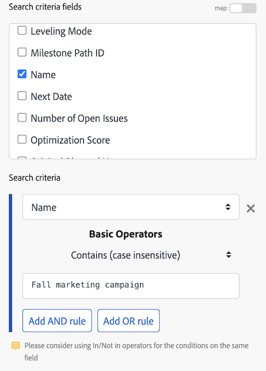

# [!DNL Adobe Workfront Fusion] での練習用自動処理シナリオの作成

自動処理シナリオは、データの操作や変換を含む Workfront プロセスを自動化します。この記事では、プロジェクトを検索してそのプロジェクトに関連付けられたすべてのタスクを返すシナリオを作成するプロセスを説明します。

<!-- not sure why these are here?
For instructions on building an integration scenario that connects separate apps, see [Create a practice integration scenario in Adobe Workfront Fusion](../../workfront-fusion/get-started/create-a-practice-scenario.md).

For more information on functionality available with each Workfront Fusion license, see [Adobe Workfront Fusion licenses](../../workfront-fusion/get-started/license-automation-vs-integration.md).

-->

## アクセス要件

+++ 展開すると、この記事の機能のアクセス要件が表示されます。

この記事で説明している機能を使用するには、次のアクセス権が必要です。

<table style="table-layout:auto"> 
  <tbody>  
    <tr>  
      <td>Adobe Workfront プラン</td>  
      <td>任意</td>  
    </tr>  
    <tr>  
      <td>Adobe Workfront プラン</td>  
      <td>
        新規：標準  
        または  
        現在：仕事以上
      </td>  
    </tr>  
    <tr>  
      <td>Adobe Workfront Fusion ライセンス</td>  
      <td> 
        現在：Workfront Fusion ライセンスは必要ありません。 
        または  
        レガシー：任意
      </td>  
    </tr>  
    <tr>  
      <td>製品</td>  
      <td> 
        新規：Workfront プランを選択または登録：Adobe Workfront Fusion を購入する必要があります。 
        Ultimate Workfront プラン：Workfront Fusion が含まれています。 
        または  
        現在：Adobe Workfront Fusion を購入する必要があります。
      </td>  
    </tr> 
  </tbody>  
</table>

この表の情報について詳しくは、[Workfront ドキュメントのアクセス要件](/help/quicksilver/administration-and-setup/add-users/access-levels-and-object-permissions/access-level-requirements-in-documentation.md)を参照してください。

[!DNL Adobe Workfront Fusion] ライセンスについて詳しくは、[[!DNL Adobe Workfront Fusion] ライセンス](../../workfront-fusion/get-started/license-automation-vs-integration.md)を参照してください。

+++

## 自動処理シナリオの作成

[!DNL Adobe Workfront Fusion] は、繰り返しタスクを自動化することで、重要なタスクに集中するのに役立ちます。 様々なアプリやサービスをまたいでデータを自動的に管理するシナリオを作成します。

各シナリオはモジュールで構成されます。モジュールは、アプリ内でデータを処理する方法や、様々なアプリやサービス間でデータを転送する方法をガイドします。 例えば、Fusion でシナリオを作成して、[!DNL Workfront] プロジェクトを自動的に検索し、そのタスクを一覧表示できます。 これにより、Fusion は日常的なタスクを処理することで時間と労力を節約します。

この練習シナリオでは、[!DNL Workfront] プロジェクトを検索してプロジェクト内のタスクを返すシナリオの作成プロセスを順を追って説明します。

### 始める前に

この演習に使用できる Workfront のタスクでプロジェクトを作成します。 タスクをプロジェクトに追加する以外に、追加の設定を行う必要はありません。

Workfront でのプロジェクトの作成について詳しくは、xxx を参照してください。

### 1. シナリオを作成して名前を付ける

1. [!DNL Workfront Fusion] アカウントにログインします。
1. 左側のパネルで&#x200B;**[!UICONTROL シナリオ]**  をクリックします。

   >[!NOTE]
   >
   >左側のナビゲーションパネルまたはアイコンが表示されない場合は、メニュー  アイコンをクリックします。

1. [!UICONTROL **フォルダー**]&#x200B;パネルで、**[!UICONTROL フォルダーを追加]**&#x200B;アイコン  をクリックし、「練習用シナリオ」など、最初のフォルダーの名前を入力します。

1. フォルダーを開いて、ページの右上隅にある「**[!UICONTROL 新しいシナリオを作成]**」をクリックします。

1. この演習では、**[!DNL Adobe Workfront]** アプリを選択し、下部付近の **検索** をクリックします。

1. 左上隅にある「**[!UICONTROL 新規シナリオ]**」プレースホルダー名を選択し、「練習用シナリオ 1」などの名前を入力します。

   

1. 以下の [ 最初のモジュールを接続 ](#2-connect-the-first-module) に進みます。

### 2.最初のモジュールを接続する

次に、[!DNL Workfront] アカウントへの認証済み接続を確立する必要があります。 シナリオに追加するモジュールはすべて、アプリとの接続を確立する必要があります。

1. **[!DNL Workfront]** ボックスの「**[!UICONTROL 接続]**」の下で、「**[!UICONTROL 追加]**」をクリックし、接続の名前（「オリビアの Workfront アカウント」など）を入力して、「**[!UICONTROL 続行]**」をクリックします。
1. 表示されるウィンドウで接続を認証します。

   接続を認証するプロセスは、アプリ間で少し異なる場合があります。次のプロセスは [!DNL Workfront] に固有ですが、プロセスは多くのアプリに似ています。

   1. [!DNL Workfront] ドメインを入力し、「**[!UICONTROL 続行]**」をクリックします。
   1. [!DNL Workfront] にログインします。
   1. [!DNL Workfront Fusion] がリクエストするアクセス権を確認し、「**[!UICONTROL アクセスを許可]**」をクリックします。

   サポートが必要な場合は、[ 接続の概要 ](../../workfront-fusion/connections/about-connecting-wf-fusion-to-app-or-service.md) を参照してください。

### 3.最初のモジュールを設定する

[!DNL Workfront Fusion] を [!DNL Workfront] アカウントに接続したら、アクセス権のある [!DNL Workfront] プロジェクトと、最初のモジュールで処理するデータを指定できます。

1. [!UICONTROL レコードタイプ]ボックスで、「**[!UICONTROL プロジェクト]**」を選択します。これにより、モジュールはプロジェクトのみを検索するように設定されます。

   >[!TIP]
   >
   >「[!UICONTROL プロジェクト]」と入力すると、リストで&#x200B;**[!UICONTROL プロジェクト]**&#x200B;を検索できます。

1. **[!UICONTROL 結果セット]**&#x200B;ボックスで、「**[!UICONTROL 一致する最初のレコード]**」を選択します。これにより、モジュールは、条件を満たす最初のレコードのみを返すように設定されます。この例では、返されるレコードは 1 つだけです。
1. **[!UICONTROL 検索条件]** エリアで、特定のプロジェクトを返すフィルターを設定します。

   | フィールド | アクション |
   |--------|-------------|
   | 検索条件のフィールド | 値を検索するフィールドを選択します。 この例では、「**[!UICONTROL 名前]**」を選択します。 |
   | 検索条件 | 最初のドロップダウンメニューで、「**[!UICONTROL 名前]**」を選択します。 |
   | 基本演算子 | 2 番目のドロップダウンで、「[!UICONTROL  次を含む（大文字と小文字を区別しない） ]」を選択します。 これにより、名前全体を入力しない場合または名前に大文字と小文字を区別せずに入力した場合でも、モジュールは名前に選択した単語を含むプロジェクトを検索できます（すべて大文字など）。 |
   | テキストボックス | 検索するプロジェクトの名前に含まれていることがわかっている単語または語句を入力します。 |

+++ 展開すると、画面上の例が表示されます。
   
+++

1. **[!UICONTROL 出力]**&#x200B;リストで、モジュールを出力するフィールドを選択します。この例では、「**[!UICONTROL ID]**」フィールドおよび「**[!UICONTROL 名前]**」フィールドを選択します。

   >[!TIP]
   >
   >**Cmd+F**（[!DNL Mac] OS）または **Ctrl+F**（[!DNL Windows] OS）を使用して、すばやくフィールドを検索できます。

1. 「**[!UICONTROL OK]**」をクリックします。

   >[!NOTE]
   >
   >これはトリガーモジュールではないので、どこから始めればよいかは決めていません。 トリガーモジュールを使用する場合、開始場所を選択できるようになりました。
   >
   >
   >詳しくは、[ [!DNL Adobe Workfront Fusion]](../../workfront-fusion/modules/choose-where-trigger-module-starts.md) でのトリガーモジュールの開始場所の選択を参照してください。

1. モジュールを右クリックし、「**[!UICONTROL 名前を変更]**」をクリックして、モジュールで実行する操作を示す名前（「プロジェクトの検索」など）を入力し、「**[!UICONTROL OK]**」をクリックします。

   名前はモジュールのすぐ下に表示されます。その下に [!DNL Workfront Fusion] には、モジュールで実行されるアクションのタイプに関する簡単な説明が含まれます。

   

1. [2 つ目のモジュールを追加して設定](#add-and-configure-the-second-module)に進みます。

### 4. 2 つ目のモジュールを追加して設定する

1. モジュールの右側の半円をクリックして、**[!UICONTROL 別のモジュールを追加]**&#x200B;します。
1. アプリケーションのリストから [!DNL Workfront] を選択し、検索モジュール&#x200B;**[!UICONTROL 関連レコードの読み取り]**&#x200B;を選択します。
1. 「**[!UICONTROL 接続]**」ボックスで、前のモジュール用に作成した接続を選択します。 このモジュールが前のモジュールと同じ接続を使用していることを確認する必要があります。
1. プロジェクトに関連するレコードを読み取るには、「**[!UICONTROL レコードタイプ]**」をクリックして、「**[!UICONTROL プロジェクト]**」を選択します。

   >[!TIP]
   >
   >**[!UICONTROL プロジェクト]**&#x200B;は、「プロジェクト」という単語を入力すると、リストの中に表示されます。

1. 「**[!UICONTROL 親レコード ID]**」フィールドをクリックします。このフィールドには、タスクを返す元のプロジェクトの Workfront ID が必要です。

   このフィールドをクリックすると、「**[!UICONTROL 親レコード ID]**」フィールドで使用できる変数のリストが開き、Workfront でプロジェクトを識別できます。

   

1. 変数 **[!UICONTROL ID]** をクリックして、「**[!UICONTROL 親レコード ID]**」フィールドに追加します。これにより、最初のモジュールから返された ID が、2 番目のモジュールで作業するプロジェクトの識別子として使用されるようになり、返されたタスクは確実にそのプロジェクトに属します。
1. 「**[!UICONTROL コレクション]**」フィールドで、「**[!UICONTROL タスク]**」を選択します。これは、モジュールが、選択されたプロジェクトに関連付けられたタスクを返すことを示します。
1. 「**[!UICONTROL 出力]**」フィールドで、「**[!UICONTROL Id]**」および「**[!UICONTROL Name]**」を選択します。
1. 「**[!UICONTROL OK]**」をクリックします。

   これで、動作するシナリオが作成されました。

1. 2 つ目のモジュールに「プロジェクトに関連付けられたタスクを返す」などの名前を付け、次に、[シナリオのテスト](#test-the-scenario)に進みます。

## シナリオのテスト

シナリオをアクティベートする前にテストすることが重要です。少なくとも 1 回実行して結果を確認します。これは、シナリオにおけるデータの流れを理解し、エラーを見つけるのに役立ちます。

1 つのプロジェクトを返し、そのプロジェクトに関連付けられたタスクを選択しました。シナリオを実行すると、そのようになります。

1. シナリオエディターの左下隅にある「**[!UICONTROL 1 回実行]**」をクリックします。
1. シナリオの実行が終了したら、最初のモジュールの上のバブルをクリックします。

   

   表示されるボックスで、モジュールが返したプロジェクトから取り出された実際のデータなど、モジュールが処理したデータのバンドルに関する情報を表示できます。

   

1. 2 つ目のモジュールの上にある実行インスペクターのバブルをクリックすると、情報の入力と出力（プロジェクトに含まれるタスクのコレクション）を確認できます。

   

   シナリオ実行情報の読み取り方法について詳しくは、次の記事を参照してください。

   * 詳しくは、[ [!DNL Adobe Workfront Fusion]](../../workfront-fusion/scenarios/scenario-execution-flow.md) でのシナリオ実行フローを参照してください。
   * 処理されたバンドルについて詳しくは、[ [!DNL Adobe Workfront Fusion]](../../workfront-fusion/scenarios/scenario-execution-cycles-phases.md) でのシナリオの実行、サイクル、フェーズを参照してください。

1. [!DNL Workfront Fusion] で、左下隅付近ににある「**[!UICONTROL 保存]**」 をクリックして、シナリオの進行状況を保存します。

   >[!IMPORTANT]
   >
   >シナリオを改良、テストするたびに保存するようにしてください。

>[!TIP]
>
>各モジュールに関するメモを追加する方法として、任意ではあるものの便利な方法をお勧めします。
>
>1. [!DNL Workfront] モジュールを右クリックして、「**[!UICONTROL メモを追加]**」をクリックします。
>1. 表示されるメモに、モジュールの概要を入力します。
>
>    1 つのモジュールに複数のノートを追加できます。
>
>1. **[!UICONTROL メモ]**&#x200B;エリアを閉じます。
>
>     シナリオにメモを追加すると、シナリオエディターの下部の&#x200B;**[!UICONTROL メモ]**&#x200B;アイコン  にオレンジ色の点が表示されます。
>
>1. **[!UICONTROL メモ]**&#x200B;アイコン  をクリックして、メモを表示します。
>

## シナリオをアクティベート

この例のシナリオにはトリガーモジュールがありません。これが実際のデータに使用するシナリオの場合は、トリガーモジュールから始まり、最後にアクティブ化します。シナリオをアクティベートすると、デフォルトでは 15 分ごとに実行されます。これは、実行するタイミングと頻度を定義することで変更できます。

シナリオのアクティブ化について詳しくは、[[!UICONTROL Adobe Workfront Fusion]](../../workfront-fusion/scenarios/activate-or-inactivate-scenario.md) でのシナリオのアクティブ化または非アクティブ化を参照してください。

スケジュールについて詳しくは、[[!UICONTROL Adobe Workfront Fusion でのシナリオのスケジュール設定]](../../workfront-fusion/scenarios/schedule-a-scenario.md)を参照してください。
