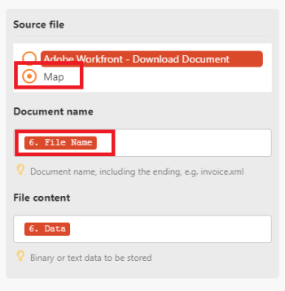

# でのファイルのマッピングについて [!DNL Adobe Workfront Fusion]

一部のモジュールには、ファイルを処理する機能があります。 これらのモジュールは、さらに処理するために送信される出力ファイルを返すか、処理のためにファイルを渡す必要があります。 これらのモジュールを連携させてファイルを処理する前に、互いにマッピングする必要があります。

## アクセス要件

この記事の機能を使用するには、次のアクセス権が必要です。

<table style="table-layout:auto">
 <col> 
 <col> 
 <tbody> 
  <tr> 
    <td role="rowheader">[!DNL Adobe Workfront] 計画*</td> 
   <td> 
[!DNL Pro] またはそれ以降
 </td> 
  </tr> 
  <tr data-mc-conditions=""> 
   <td role="rowheader">[!DNL Adobe Workfront] ライセンス*</td> 
   <td> 
[!UICONTROL プラン ]、[!UICONTROL Work]
 </td> 
  </tr> 
  <tr> 
   <td role="rowheader">[!UICONTROL Adobe Workfront Fusion] ライセンス**</td> 
   <td>
   
現在のライセンス要件：いいえ [!DNL Workfront Fusion] ライセンス要件。

   
または

   
従来のライセンス要件：[!UICONTROL [!DNL Workfront Fusion] [ 作業の自動化と統合 ] 

   </td> 
  </tr> 
  <tr> 
   <td role="rowheader">製品</td> 
   <td>
   
現在の製品要件：[!UICONTROL Select] または [!UICONTROL Prime] がある場合 [!DNL Adobe Workfront] プラン（組織で購入する必要がある） [!DNL Adobe Workfront Fusion] 同様に [!DNL Adobe Workfront] を使用して、この記事で説明する機能を使用できます。 [!DNL Workfront Fusion] は、[!UICONTROL Ultimate] に含まれています [!DNL Workfront] プラン

   
または

   
従来の製品要件：組織で購入する必要があります [!DNL Adobe Workfront Fusion] 同様に [!DNL Adobe Workfront] を使用して、この記事で説明する機能を使用できます。

   </td> 
  </tr>  </tbody> 
</table>

ご利用のプラン、ライセンスの種類、アクセス権を確認するには、 [!DNL Workfront] 管理者。

詳しくは、 [!DNL Adobe Workfront Fusion] ライセンス， 「 [[!DNL Adobe Workfront Fusion] ライセンス](../../workfront-fusion/get-started/license-automation-vs-integration.md).

## ファイルのマッピング

ファイルを操作する機能を持つモジュールには、次の 2 つの情報が必要です。

* ファイル名
* ファイルコンテンツ（データ）

ファイルをマッピングする際に、データを取得するシナリオ内のモジュールを選択します。 ファイル名とファイルコンテンツは、そのまま自動的にマッピングされます。

>[!NOTE]
>
>URL からファイルを処理する必要がある場合、 `HTTP > Get a File` モジュールを使用して、URL からファイルをダウンロードし、 `HTTP > Get a File` モジュールをシナリオの目的のモジュールのフィールドに追加します。

>[!INFO]
>
>**例：** この例では、 [!DNL Adobe Workfront] から [!DNL Google Drive]. この [!DNL Workfront] トリガー [!UICONTROL レコードを監視] は、各ドキュメントに関する詳細な情報（名前や ID など）を返します。
>
>次のモジュールは、 [!UICONTROL ドキュメントをダウンロード]では、実際のデータをダウンロードして、Google Drive にアップロードできるようにします。
>
>この情報を次にマッピングするには： [!DNL Google Drive] アップロードできるように、情報のマッピング元のソースファイルを指定する必要があります。 次を選択した場合、 [!DNL Workfront] > [!UICONTROL ドキュメントをダウンロード] オプションを選択します。 [!DNL Workfront Fusion] はファイル名とファイルの内容を [!DNL Workfront] が指定したGoogleフォルダーにアップロードされます。
>
>
>
>ただし、ファイル名を変更し、データをそのままにしておく場合は、 [!UICONTROL マップ] オプションを使用して、ファイル名とファイルコンテンツを個別にマッピングできます。 拡張子を含む完全なファイル名を入力します。 テキスト形式とバイナリ形式 ( 写真、ビデオ、PDFなど ) がサポートされています。
>
>
