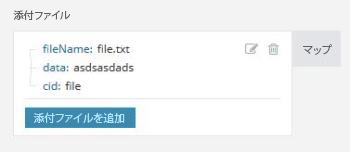

# [!DNL Adobe Workfront Fusion] で配列をマッピング

配列は、以下を含む特別なタイプの項目です。

* 1 つ以上のテキスト値（単純配列）
* 同じタイプの 1 つ以上のコレクション（複合配列）

>[!INFO]
>
>**例：**[!UICONTROL メールの監視]モジュールは、すべてのメールの添付ファイルの配列を返します。すべての添付ファイルは、名前、コンテンツ、サイズなどを含むコレクションを表します。

詳しくは、 [!DNL Adobe Workfront Fusion]](../../workfront-fusion/mapping/item-data-types.md) での [ 項目データタイプを参照してください。

## アクセス要件

この記事で説明している機能を使用するには、次のアクセス権が必要です。

<table style="table-layout:auto">
 <col> 
 <col> 
 <tbody> 
  <tr> 
    <td role="rowheader">[!DNL Adobe Workfront] プラン*</td> 
   <td> 
[!DNL Pro] またはそれ以降
 </td> 
  </tr> 
  <tr data-mc-conditions=""> 
   <td role="rowheader">[!DNL Adobe Workfront] ライセンス*</td> 
   <td> 
[!UICONTROL Plan]、[!UICONTROL Work]
 </td> 
  </tr> 
  <tr> 
   <td role="rowheader">[!UICONTROL Adobe Workfront Fusion] ライセンス**</td> 
   <td>
   
現在のライセンス要件：[!DNL Workfront Fusion]ライセンス要件なし。

   
または

   
従来のライセンス要件：[!UICONTROL [!DNL Workfront Fusion] for Work Automation and Integration] 

   </td> 
  </tr> 
  <tr> 
   <td role="rowheader">製品</td> 
   <td>
   
現在の製品要件：[!UICONTROL Select] または [!UICONTROL Prime] [!DNL Adobe Workfront] プランをご利用の場合、この記事で説明されている機能を使用するには、組織は [!DNL Adobe Workfront] に加えて [!DNL Adobe Workfront Fusion] も購入する必要があります。[!DNL Workfront Fusion] は、[!UICONTROL Ultimate] [!DNL Workfront] プランに含まれています。

   
または

   
従来の製品要件：この記事で説明されている機能を使用するには、組織は [!DNL Adobe Workfront] に加えて [!DNL Adobe Workfront Fusion] も購入する必要があります。

   </td> 
  </tr> 
 </tbody> 
</table>

ご利用のプラン、ライセンスの種類、アクセス権を確認するには、[!DNL Workfront] 管理者にお問い合わせください。

[!DNL Adobe Workfront Fusion] ライセンスについて詳しくは、[[!DNL Adobe Workfront Fusion]  ライセンス](../../workfront-fusion/get-started/license-automation-vs-integration.md)を参照してください。

## 配列のマッピング

1. ターゲットフィールドにあるボタンをクリックします。

   >[!INFO]
   >
   >  **例：**&#x200B;上記の例では、メールの「[!UICONTROL 添付ファイルを追加]」ボタンをクリックします。
   >
   >

1. 表示されるボックスに、項目を入力します。

   パネルを使用すると、他のタイプの項目と同じ方法でフィールドをマッピングできます。各項目に個別に入力しないで、別の配列をターゲットフィールドにマッピングする場合は、「[!UICONTROL マップ]」ボタンを使用します。この場合、両方の配列（ソース配列とターゲット配列）の構造が同じであることを確認します。

   1 つの配列には、任意の数の項目を追加できます。

イテレータを使用して、配列を個々のバンドルに分割できます。詳しくは、 [!DNL Adobe Workfront Fusion]](../../workfront-fusion/modules/iterator-module.md)内の[[!UICONTROL イテレータ]モジュールを参照してください。
