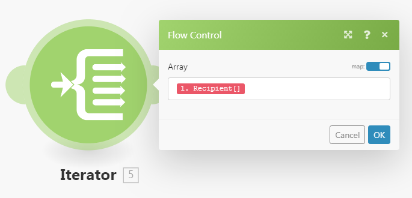

# であるモジュールから別のモジュールに情報をマッピングします。 [!DNL Adobe Workfront Fusion]

マッピングとは、アイテムに構造化されたモジュールの出力を、別のモジュールの入力フィールドに割り当てるプロセスです。

マッピングパネルは、シナリオで前のモジュールから出力された値を挿入するフィールドをクリックすると表示されます。 モジュール内では、マッピングに使用できる任意のフィールドで、入力した静的テキストを含むマッピングパネルから、任意の関数とマッピングされた項目の組み合わせを使用して数式を作成できます。 これらの要素は、互いに内部にネストできます。

## アクセス要件

この記事の機能を使用するには、次のアクセス権が必要です。

<table style="table-layout:auto">
 <col> 
 <col> 
 <tbody> 
  <tr> 
    <td role="rowheader">[!DNL Adobe Workfront] 計画*</td> 
   <td> 
[!DNL Pro] またはそれ以降
 </td> 
  </tr> 
  <tr data-mc-conditions=""> 
   <td role="rowheader">[!DNL Adobe Workfront] ライセンス*</td> 
   <td> 
[!UICONTROL プラン ]、[!UICONTROL Work]
 </td> 
  </tr> 
  <tr> 
   <td role="rowheader">[!UICONTROL Adobe Workfront Fusion] ライセンス**</td> 
   <td>
   
現在のライセンス要件：いいえ [!DNL Workfront Fusion] ライセンス要件。

   
または

   
従来のライセンス要件： [!UICONTROL [!DNL Workfront Fusion] [ 作業の自動化と統合 ] 

   </td> 
  </tr> 
  <tr> 
   <td role="rowheader">製品</td> 
   <td>
   
現在の製品要件： [!UICONTROL Select] または [!UICONTROL Prime] がある場合 [!DNL Adobe Workfront] プラン（組織で購入する必要がある） [!DNL Adobe Workfront Fusion] 同様に [!DNL Adobe Workfront] を使用して、この記事で説明する機能を使用できます。 [!DNL Workfront Fusion] は、[!UICONTROL Ultimate] に含まれています [!DNL Workfront] プラン

   
または

   
従来の製品要件：組織は購入する必要があります [!DNL Adobe Workfront Fusion] 同様に [!DNL Adobe Workfront] を使用して、この記事で説明する機能を使用できます。

   </td> 
  </tr> 
 </tbody> 
</table>

ご利用のプラン、ライセンスの種類、アクセス権を確認するには、 [!DNL Workfront] 管理者。

詳しくは、 [!DNL Adobe Workfront Fusion] ライセンス， 「 [[!DNL Adobe Workfront Fusion] ライセンス](../../workfront-fusion/get-started/license-automation-vs-integration.md).

## バンドルと項目

モジュールの操作により、出力として 0、1、または複数のバンドルが生成されます。 バンドルは、1 つ以上の項目で構成されます。

モジュールの出力を調べるには：

1. クリック **[!UICONTROL 1 回実行]** モジュールを実行します。
1. モジュールの上のバブルをクリックします。

   モジュールのすべてのフェーズを含むログが表示されます。 モジュールの操作フェーズで出力されるバンドルまたはバンドルは、 **[!UICONTROL 出力]** 見出し。 各バンドルには、項目と各項目の値が含まれます。

>[!INFO]
>
>**例：** この例では、モジュールを示しています。 [!UICONTROL 電子メール] > [!UICONTROL メールを見る]. 1 回の操作を実行し、次のような様々な項目を含む単一のバンドルを生成したことがわかります。 `Date`, `Email ID (UID)`, `size`など。
>
>

>[!NOTE]
>
>モジュールの出力は、 [!UICONTROL 反復子] および [!UICONTROL 集約] は、その向こうからはアクセスできません [!UICONTROL 集約] モジュール。

## 項目のマッピング

2 つ以上のモジュールをリンクして一連のモジュールを作成した後、各モジュールは、それより前のモジュールが出力する項目の値を処理できます。

モジュールの入力フィールドに項目を割り当てるには、次の手順に従います。

1. 前のモジュールの出力を処理するモジュールをクリックします。
1. 表示されるモジュール設定パネルで、前のモジュールから出力された項目の値を使用するフィールドをクリックします。

   マッピングパネルが開きます。

1. マッピングパネルで項目をクリックして、フィールドに挿入します。
1. （オプション）マッピングパネルで特定のフィールドを検索するには、マッピングパネルの検索バーをクリックし、検索する語句を入力します。 リストに表示されたら、フィールドをクリックします。

   検索結果には検索語句が含まれ、大文字と小文字は区別されません。

詳しくは、 [でのモジュールの設定 [!DNL Adobe Workfront Fusion]](../../workfront-fusion/modules/configure-a-modules-settings.md).

## 数式

複数の項目を 1 つのフィールドにマッピングし、リテラル（固定値）と組み合わせ、演算子と関数を使用して複雑な数式を作成できます。

関数と演算子は、そのタブの 1 つの下のマッピングパネルにあります。

最初のタブ  （パネルを開く際に表示）他のモジュールからマッピングできる項目を表示します。

その他のタブには、次のような関数が含まれます。

* **一般的な関数**   — 詳しくは、 [の一般的な機能 [!DNL Adobe Workfront Fusion]](../../workfront-fusion/functions/general-functions.md) を参照してください。

* **数学関数**   — 詳しくは、 [の数学関数 [!DNL Adobe Workfront Fusion]](../../workfront-fusion/functions/math-functions.md) を参照してください。

* **テキスト関数とバイナリ関数**   — 詳しくは、 [の文字列関数 [!DNL Adobe Workfront Fusion]](../../workfront-fusion/functions/string-functions.md) を参照してください。

* **日時**   — 詳しくは、 [の日付および時間関数 [!DNL Adobe Workfront Fusion]](../../workfront-fusion/functions/date-and-time-functions.md) 詳しくは、以下の記事を参照してください。

   * [の日付と時刻の書式設定のトークン [!DNL Adobe Workfront Fusion]](../../workfront-fusion/functions/tokens-for-date-and-time-formatting.md)
   * [Adobe Workfront Fusion での日時解析用トークン](../../workfront-fusion/functions/tokens-for-date-and-time-parsing.md)

* **配列操作用の関数**   — 詳しくは、 [の配列関数 [!DNL Adobe Workfront Fusion]](../../workfront-fusion/functions/array-functions.md) を参照してください。

>[!TIP]
>
>別のフィールドで再利用する複雑な数式を作成する場合は、その組み合わせを含むフィールドをクリックし、Command + A キーまたは Ctrl + A キーを使用して選択して、コピーして他のフィールドに貼り付けます。

関数を使用して項目をマッピングする方法について詳しくは、 [で関数を使用して項目をマッピングする [!DNL Adobe Workfront Fusion]](../../workfront-fusion/functions/map-using-functions.md).

## コレクション

一部の項目には、様々なタイプの複数の値を含めることができます。 コレクションタイプの項目です。

次の項目を識別できます。 [!UICONTROL コレクション] 項目のラベルの右側に表示される小さな黒い長方形と、自動的に展開されたサブ項目のリストで項目を入力します。

>[!NOTE]
>
>ほとんどの場合、コレクション全体を表す項目ではなく、コレクションのサブ項目をマッピングします。

コレクションについて詳しくは、 [の項目データタイプ [!UICONTROL Adobe Workfront Fusion]](../../workfront-fusion/mapping/item-data-types.md)

## 配列

一部の項目には、同じタイプの複数の要素を含めることができます。 これらは配列タイプの項目です。

配列タイプの項目は、項目のラベルの最後にある角括弧で識別できます。 項目のラベルの右側にある小さな黒い長方形をクリックして、要素の項目を表示します。

配列の詳細については、 [の項目データタイプ [!DNL Adobe Workfront Fusion]](../../workfront-fusion/mapping/item-data-types.md)

### 配列の最初の要素をマッピングする

配列の `Recipient name` 項目を選択すると、次のようにフィールドに表示されます。

角括弧内の数値は、配列のどの要素を使用するかを決定するインデックスです。 デフォルトでは 1 に設定されています。

### 配列の n 番目の要素をマッピングする

別の要素にアクセスする場合は、角括弧をクリックし、インデックス値を編集します。

### 指定されたキーで配列の要素をマッピングする

一部の配列には、キーと値の項目を持つ複数のコレクションが含まれています。 これらは通常、様々なメタデータや属性などです。

次の例は、 [!DNL Jira] アプリ。

この例では、ID が10108の特定の添付ファイルの添付ファイルの配列からファイル名を取得します。

次の出力： [!DNL Jira] 次のようになります。

一般的な要件は、指定されたキー値で要素を検索し、値項目から対応する値を取得することです。 これは、 `map()` および `get()` 関数

次に、数式の詳細な分類を示します。

1. の最初のパラメーター `map()` 関数は配列項目全体です。
1. 2 つ目のパラメーターは、値項目の生の名前です。 生の名前を取得するには、 [!UICONTROL マッピング] パネル：

   

   >[!NOTE]
   >
   >すべてのパラメーターでは大文字と小文字が区別されます。 この例では、項目のラベルが大文字でのみ生の名前と異なる場合でも、生の名前を使用する必要があります。これは、ラベルの値とは異なり、すべて小文字の値です。

1. 3 番目のパラメーターは、キー項目の生の名前です。

   

1. 4 番目のパラメーターは、指定されたキー値です。

これは、 `map()` 関数は配列を返します（指定されたキー値を持つ他の要素が存在する可能性があるため）。 `get()` 関数の最初の要素を取得します。

* の最初のパラメーター `get()` 関数は `map()` 関数に置き換えます。

* 2 番目のパラメーターは、要素のインデックス (1) です。

詳しくは、 `map()` 関数， 「 [の配列関数 [!DNL Adobe Workfront Fusion]](../../workfront-fusion/functions/array-functions.md).

詳しくは、 `get()` 関数， 「 [の一般的な機能 [!DNL Adobe Workfront Fusion]](../../workfront-fusion/functions/general-functions.md).

## 要素を一連のバンドルに変換する

アレイは、 [!UICONTROL 反復子] モジュール。 詳しくは、 [[!UICONTROL 反復子] モジュール内 [!UICONTROL Adobe Workfront Fusion]](../../workfront-fusion/modules/iterator-module.md).

## トラブルシューティング

### マッピングパネルに項目がありません

各モジュールについて、マッピングパネルにはモジュールの作成者が一覧表示するすべての出力項目が表示されます。 場合によっては、このリストが様々な理由で不完全になったり、一部の項目が欠落したりすることがあります。 [!DNL Workfront Fusion] では、シナリオエディターでモジュールを実行する際に、見つからない出力項目を自動検出できます。 正確な手順は、モジュールのタイプによって少し異なります。

#### インスタントトリガー

1. モジュールを右クリックし、 **[!UICONTROL このモジュールのみを実行]** をクリックします。

   キュー内の Web フックがない場合、モジュールは新しい Webhook が処理するのを待ちます。

1. ウェブフックを生成します。

   例えば、Webhook モジュール **[!DNL Slack]>[!UICONTROL 新しいイベントをリッスンする]** （はチャネル内の新しいチャネルメッセージを監視します）チャネルにメッセージを送信します。

1. モジュールの実行が終了したら、モジュールの上のバブルをクリックして、完全な出力を確認します。

   マッピングパネルには、モジュールの出力で検出されたすべての項目が含まれます。

#### ポーリングトリガー

1. モジュールを右クリックし、 **[!UICONTROL このモジュールのみを実行]** をクリックします。
1. 出力がない場合は、 **[!UICONTROL 開始する場所を選択]** 設定を調整します。
1. 処理されるイベントがない場合は、イベントを作成し、手順 2 に戻ります。

   例えば、Webhook モジュール **[!UICONTROL Gmail] >[!UICONTROL メールを見る]** は、モジュールが監視しているフォルダーに電子メールを送信します。

1. モジュールの実行が終了したら、モジュールの上のバブルをクリックして、完全な出力を確認します。

   マッピングパネルには、モジュールの出力で検出されたすべての項目が含まれるようになりました。

#### その他のモジュール

以下を実行することもできます。

* シナリオ全体（またはモジュールを含む部分のみ）

  シナリオがトリガーで始まる場合は、 [インスタントトリガー](#instant-trigger) または [ポーリングトリガー](#polling-trigger) 」の節を参照してください。

* 単一のモジュールのみ

単一のモジュールのみを実行する場合：

1. モジュールを右クリックし、 **[!UICONTROL このモジュールのみを実行]** 表示されるメニューで…
1. 入力項目のサンプル値を指定し、「 **[!UICONTROL OK]** .
1. モジュールの実行が終了したら、モジュールの上のバブルをクリックして、完全な出力を確認します。

   マッピングパネルには、モジュールの出力で検出されたすべての項目が含まれるようになりました。
