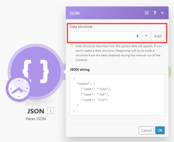

# [!DNL Adobe Workfront Fusion] の[!UICONTROL イテレータ]モジュール

[!UICONTROL イテレータ]は、配列を一連のバンドルに変換する特別なタイプのモジュールです。各配列項目は、別々のバンドルとして出力されます。

詳しくは、[モジュールのタイプ](../../workfront-fusion/modules/module-types.md)および [Adobe Workfront Fusion で配列をマッピング](../../workfront-fusion/mapping/map-an-array.md)を参照してください。

## アクセス要件

この記事で説明している機能を使用するには、次のアクセス権が必要です。

<table style="table-layout:auto">
 <col> 
 <col> 
 <tbody> 
  <tr> 
    <td role="rowheader">[!DNL Adobe Workfront] プラン*</td> 
   <td> 
[!DNL Pro] またはそれ以降
 </td> 
  </tr> 
  <tr data-mc-conditions=""> 
   <td role="rowheader">[!DNL Adobe Workfront] ライセンス*</td> 
   <td> 
[!UICONTROL Plan]、[!UICONTROL Work]
 </td> 
  </tr> 
  <tr> 
   <td role="rowheader">[!UICONTROL Adobe Workfront Fusion] ライセンス**</td> 
   <td>
   
現在のライセンス要件：[!DNL Workfront Fusion] ライセンス要件なし。

   
または

   
従来のライセンス要件： [!UICONTROL [!DNL Workfront Fusion] for Work Automation and Integration] 

   </td> 
  </tr> 
  <tr> 
   <td role="rowheader">製品</td> 
   <td>この記事で説明する機能を使用するには、Adobe Workfront Fusion と Adobe Workfront を購入する必要があります。</td> 
  </tr> 
 </tbody> 
</table>

ご利用のプラン、ライセンスタイプまたはアクセス権を確認するには、Workfront 管理者にお問い合わせください。

[!DNL Adobe Workfront Fusion] ライセンスについて詳しくは、[[!DNL Adobe Workfront Fusion] ライセンス](../../workfront-fusion/get-started/license-automation-vs-integration.md)を参照してください。

## [!UICONTROL イテレータ]モジュールの設定

[!UICONTROL イテレータ]モジュールは、他のモジュールを設定するのと同じように設定します。「[!UICONTROL 配列]」フィールドには、変換されるか個別のバンドルに分割される配列が含まれます。

詳しくは、[Adobe Workfront Fusion でモジュールを設定](../../workfront-fusion/modules/configure-a-modules-settings.md)を参照してください。

>[!INFO]
>
>**例：**
>
>* 以下のシナリオは、添付ファイル付きのメールを取得し、その添付ファイルを選択した [!DNL Dropbox] フォルダーに 1 つのファイルとして保存する方法を示しています。
>
>   メールには、添付ファイルの配列を含めることができます。最初のモジュールの後に挿入された[!UICONTROL イテレータ]モジュールにより、各添付ファイルを個別に処理できるようになります。[!UICONTROL イテレータ]モジュールは、添付ファイルの配列を 1 つのバンドルに分割します。1 つの添付ファイルを含む各バンドルは、選択した [!DNL Dropbox] フォルダーに一度に 1 つずつ保存されます。[!UICONTROL イテレータ]モジュールの設定は、上記のとおりです。「[!UICONTROL 配列]」フィールドには、`Attachments` 配列が含まれている必要があります。
>
>   
>
>* 便宜上、多くの [!DNL Workfront Fusion] アプリは、設定が簡素化された特別な[!UICONTROL イテレータ]モジュールを提供しています。例えば、[!UICONTROL メールアプリ]には、一般的な[!UICONTROL イテレータ]モジュールと同じ結果を生成する特別な[!UICONTROL イテレータ]モジュール[!UICONTROL メール]／[!UICONTROL 添付ファイルを反復]が含まれています。
>
>   

## トラブルシューティング：マッピングパネルでは、[!UICONTROL イテレータ]モジュールの下にマッピング可能な項目が表示されません

[!UICONTROL イテレータ]モジュールに配列の項目の構造に関する情報がない場合、[!UICONTROL イテレータ]モジュールに続くモジュールのマッピングパネルには、[!UICONTROL イテレータ]モジュールの下に `Total number of bundles` と `Bundle order position` の 2 つの項目のみが表示されます。

これは、各モジュールが出力する項目に関する情報を提供し、後続のモジュールのマッピングパネルにそれらの項目を適切に表示できるようにするためです。ただし、いくつかのモジュールでは、この情報を提供できない場合があります。例えば、データ構造が欠落している [!UICONTROL JSON]／[!UICONTROL JSON を解析]または[!UICONTROL  Web フック]／[!UICONTROL カスタム Web フック]モジュールです。

解決策は、シナリオを手動で実行し、出力する項目についてモジュールに学習させ、次のモジュールに情報を提供できるようにすることです。

例えば、以下のようなデータ構造のない [!UICONTROL JSON]／[!UICONTROL JSON を解析]モジュールがある場合：

そして、[!UICONTROL イテレータ]モジュールをそれに接続すると、モジュールの出力を[!UICONTROL イテレータ]モジュールの設定パネルの「配列」フィールドにマッピングすることはできません。

これを解決するには、シナリオエディターでシナリオを手動で開始します。[!UICONTROL JSON]／[!UICONTROL JSON を解析]モジュールの後でモジュールのリンクを解除すると、フローがそれ以上続行しないようにすることができます。または、[!UICONTROL JSON]／[!UICONTROL JSON を解析]モジュールを右クリックし、コンテキストメニューから「**[!UICONTROL このモジュールのみ実行]**」を選択して、[!UICONTROL JSON]／[!UICONTROL JSON を解析]モジュールのみを実行します。

[!UICONTROL JSON]／[!UICONTROL JSON を解析]が実行されると、出力される項目について学習し、この情報をイテレータモジュールを含む後続のすべてのモジュールに提供します。イテレータの設定のマッピングパネルには、次の項目が表示されます。

さらに、[!UICONTROL イテレータ]モジュールの後に接続されているモジュールのマッピングパネルには、配列の項目に含まれる項目が表示されます。

モジュールのマッピングパネルに一部の項目が表示されない場合は、シナリオを 1 回実行して、すべてのモジュールが出力する項目について学習し、次のモジュールにこの情報を提供できるようにします。
