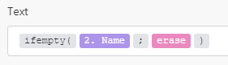

# モジュールのタイプ

A[!UICONTROL Adobe Workfront Fusion] は、次の 5 種類のモジュールを区別します。アクションモジュール、検索モジュール、トリガーモジュール、集約モジュール、イテレータ。 集積とイテレータは、高度なシナリオで使用します。

## アクセス要件

この記事の機能を使用するには、次のアクセス権が必要です。

<table style="table-layout:auto">
 <col> 
 <col> 
 <tbody> 
  <tr> 
    <td role="rowheader">[!DNL Adobe Workfront] 計画*</td> 
   <td> 
[!DNL Pro] またはそれ以降
 </td> 
  </tr> 
  <tr data-mc-conditions=""> 
   <td role="rowheader">[!DNL Adobe Workfront] ライセンス*</td> 
   <td> 
[!UICONTROL プラン ]、[!UICONTROL Work]
 </td> 
  </tr> 
  <tr> 
   <td role="rowheader">[!UICONTROL Adobe Workfront Fusion] ライセンス**</td> 
   <td> 
[!UICONTROL [!DNL Workfront Fusion] [ 作業の自動化と統合 ] 
  </td> 
  </tr> 
  <tr> 
   <td role="rowheader">製品</td> 
   <td>この記事で説明する機能を使用するには、Adobe Workfront Fusion とAdobe Workfrontを購入する必要があります。</td> 
  </tr> 
 </tbody> 
</table>

保有しているプラン、ライセンスの種類、アクセス権を確認するには、Workfront管理者に問い合わせてください。

詳しくは、 [!DNL Adobe Workfront Fusion] ライセンス， 「 [[!DNL Adobe Workfront Fusion] ライセンス](../../workfront-fusion/get-started/license-automation-vs-integration.md).

## アクションモジュール

アクションモジュールは、最も一般的なタイプのモジュールです。 一般的なアクションモジュールは、1 つのバンドルを返し、次のモジュールに渡して処理します。

トリガーモジュールとは異なり、アクションモジュールは、シナリオの最初、中間または最後に配置できます。 シナリオには、アクションモジュールの数に制限はありません。

>[!INFO]
>
>**例:**
>
>* **[!DNL Workfront]> [!UICONTROL ファイルのアップロード]** は次の場所にファイルを送信します。 [!DNL Workfront] を返します。
>* **[!UICONTROL 画像] > [!UICONTROL サイズ変更]** 画像を受け取り、指定したサイズにリサイズし、サイズ変更された画像を次のアクションに渡します。

アクションタイプには、次の 4 つのサブタイプがあります。作成、読み取り、更新、削除。 「更新」サブタイプでは、次の 3 つの操作が有効になります。

* **フィールドの内容を消去**. この操作は、フィールドのコンテンツが erase キーワードによって評価される（と混同しない）と実行されます *空*) をクリックします。

   

* **フィールドの内容を変更しない**. この操作は、フィールドが空のままになっているか、フィールドのコンテンツが空と評価される（JSON の null で表される）場合に実行されます。

   

* **フィールドのコンテンツを置き換える**. この操作は、上記の 2 つ以外のすべての場合に実行されます。

>[!NOTE]
>
>* 次の項目が表示されない場合、 `erase` キーワードがマッピングパネルに表示され、モジュールが更新モジュールでないか、アプリの最新の仕様に更新されていません。
>* &quot;[!UICONTROL 空]「 」はフィールドの内容を変更しません。 フィールドを消去する必要がある場合は、次の数式を使用できます。
>
>
>
>現在、コンテンツが空として評価される場合に、フィールドを変更せずに残すことはできません。

## モジュールを検索

一般的な検索では、0 個、1 個または複数のバンドルが返され、次のモジュールに渡されて処理されます。

シナリオの最初、中間または最後に検索を配置できます。

シナリオには、検索の数に制限はありません。

>[!INFO]
>
>**例:**
>
>**[!DNL Workfront]> [!UICONTROL 関連レコードの読み取り]**  は、指定した検索クエリに一致するレコードを、特定の親オブジェクト内で読み取ります。

## トリガーモジュール

トリガーは、特定のサービスに変更があった場合にバンドルを生成します。 変更には、新しいレコードの作成、レコードの削除、レコードの更新などが含まれます。

各トリガーは、0 個、1 個または複数のバンドルを返し、次のモジュールに渡して処理を行うことができます。

トリガーは、シナリオの先頭にのみ配置できます。

各シナリオには、1 つのトリガーのみを含めます。

[!DNL Workfront Fusion] は、次の 2 種類のトリガーを区別します。ポーリングトリガーとインスタントトリガー。

### ポーリングトリガー

ポーリングトリガーは、前回の実行以降に変更がなかった場合でも、特定のサービスを定期的にポーリングします。 ポーリングトリガーを含むシナリオを、一定の間隔で実行するようにスケジュールすることをお勧めします。 次の項目が存在する場合、 *変更*&#x200B;の場合、トリガーは変更に関する情報を含むバンドルを返します。 次がない場合： *変更*&#x200B;の場合、トリガーはバンドルを出力しません。 シナリオのスケジュールについては、 [でのシナリオのスケジュール設定 [!DNL Adobe Workfront Fusion]](../../workfront-fusion/scenarios/schedule-a-scenario.md).

ポーリングトリガーでは、エポックパネルを介して出力する最初のバンドルを選択できます。 パネルは、トリガーを保存した後、または設定を変更した後、自動的にトリガーされます。 詳しくは、 [トリガーモジュールの開始場所を選択 [!UICONTROL Adobe Workfront Fusion]](../../workfront-fusion/modules/choose-where-trigger-module-starts.md).

>[!NOTE]
>
>エポックパネルでの設定は、モジュールの最初の実行にのみ影響します。 モジュールが実行されると、最後に出力されたバンドルが記憶され、エポックパネルを介して行われた設定が無効になります。

>[!INFO]
>
>**例:**
>
>* **[!DNL Workfront]> [!UICONTROL レコードを監視]** 前回のシナリオ実行以降に新しく追加されたファイルを返します
>
>* **[!DNL Google Sheets]> [!UICONTROL 監視行]** 前回のシナリオ実行以降にユーザーが追加した新しい行を返します

### インスタントトリガー

インスタントトリガーは、サービスが通知を受け取ることを有効にします [!DNL Workfront Fusion] について *変更* すぐに 即座に実行するインスタントトリガーを含むシナリオをスケジュールすることをお勧めします。 手順については、 [Adobe Workfront Fusion でのシナリオのスケジュール](../../workfront-fusion/scenarios/schedule-a-scenario.md). 関連トピック [のインスタントトリガー（Web フック） [!DNL Adobe Workfront Fusion]](../../workfront-fusion/webhooks/instant-triggers-webhooks.md) を参照してください。

>[!INFO]
>
>**例:**
>
>* **[!DNL Workfront]> [!UICONTROL イベントを見る]** タスクの作成など、Workfrontで特定のタイプのイベントが発生した場合に情報を返します。
>* **[!DNL Google Sheets]> [!UICONTROL 変更を監視]** は、セルが更新されるたびに情報を返します。

## 集約

集約とは、複数のバンドルを 1 つのバンドルに蓄積するモジュールの一種です。

各集約は 1 つのバンドルのみを返し、次のモジュールに渡してさらに処理を行います。

集約は、シナリオの途中にのみ配置できます。

シナリオに含めることができる集約の数に制限はありません。

>[!INFO]
>
>**例:**
>
>* **[!UICONTROL アーカイブ] > [!UICONTROL アーカイブの作成]** 受信したファイルを zip アーカイブに圧縮
>* **[!UICONTROL CSV] > [!UICONTROL CSV に集計]** CSV ファイルから複数の文字列を 1 行に結合します。
>* **[!UICONTROL ツール] > [!UICONTROL テキスト集約]** 複数の文字列を 1 つの文字列に組み合わせます。

詳しくは、 [の集約モジュール [!DNL Adobe Workfront Fusion]](../../workfront-fusion/modules/aggregator-module.md).

## イテレータ

Iterator は、配列を複数の個別のバンドルに分割するモジュールの一種です。

各反復子は 1 つ以上のバンドルを返し、次のモジュールに渡して処理します。

イテレータは、シナリオの途中にのみ配置できます。

シナリオには、無制限の数のイテレーターを含めることができます。

>[!INFO]
>
>**例:**
>
>**[!UICONTROL 電子メール] > [!UICONTROL 添付ファイルの取得]** は、添付ファイルの配列を別々のバンドルに分割します

詳しくは、 [の Iterator モジュール [!DNL Adobe Workfront Fusion]](../../workfront-fusion/modules/iterator-module.md) および [で配列をマッピングする [!DNL Adobe Workfront Fusion]](../../workfront-fusion/mapping/map-an-array.md).
