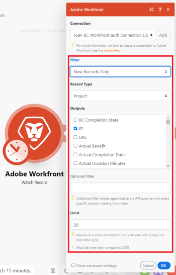

# [!DNL Adobe Workfront Fusion] でシナリオを作成

次のタスクでは、[!DNL Adobe Workfront Fusion] シナリオの作成方法について説明します。

自動化シナリオの作成手順を説明する演習については、[実践的な自動化シナリオを作成 [!DNL Adobe Workfront Fusion]](../../workfront-fusion/get-started/create-a-practice-automation-scenario.md)を参照してください。

提供するデータを使用して統合シナリオを作成する手順を説明する演習については、[Adobe Workfront Fusion 練習用の統合シナリオを作成](../../workfront-fusion/get-started/create-a-practice-scenario.md)を参照してください。

>[!NOTE]
>
>テンプレートからシナリオを作成するには、[テンプレートからシナリオを作成 [!DNL Adobe Workfront Fusion] ](../../workfront-fusion/scenarios/templates/create-scenarios-with-fusion-templates.md)を参照してください。

## アクセス要件

この記事で説明している機能を使用するには、次のアクセス権が必要です。

<table style="table-layout:auto"> 
 <col> 
 <col> 
 <tbody> 
  <tr> 
    <td role="rowheader">[!DNL Adobe Workfront] プラン*</td> 
   <td> 
[!DNL Pro] またはそれ以降
 </td> 
  </tr> 
  <tr data-mc-conditions=""> 
   <td role="rowheader">[!DNL Adobe Workfront] ライセンス*</td> 
   <td> 
[!UICONTROL Plan]、[!UICONTROL Work]
 </td> 
  </tr> 
  <tr> 
   <td role="rowheader">[!UICONTROL Adobe Workfront Fusion] ライセンス**</td> 
   <td> 
[!UICONTROL [!DNL Workfront Fusion] for Work Automation and Integration] 

[!UICONTROL [!DNL Workfront Fusion] for Work Automation]

[!UICONTROL [!DNL Workfront Fusion] for Work Automation]
    </td> 
  </tr> 
  <tr> 
   <td role="rowheader">製品</td> 
   <td>
   
現在の製品要件：[!UICONTROL Select] または [!UICONTROL Prime] [!DNL Adobe Workfront] プランをご利用の場合、この記事で説明されている機能を使用するには、組織が [!DNL Adobe Workfront] に加えて [!DNL Adobe Workfront Fusion] も購入する必要があります。[!DNL Workfront Fusion] は [!UICONTROL Ultimate] [!DNL Workfront] プランに含まれています。

   
または

   
従来の製品要件：この記事で説明されている機能を使用するには、組織が [!DNL Adobe Workfront] に加えて [!DNL Adobe Workfront Fusion] も購入する必要があります。

   </td> 
  </tr> 
 </tbody> 
</table>

ご利用のプラン、ライセンスタイプまたはアクセス権を確認するには、[!DNL Workfront] 管理者にお問い合わせください。

[!DNL Adobe Workfront Fusion] ライセンスについては、[[!DNL Adobe Workfront Fusion] ライセンス](../../workfront-fusion/get-started/license-automation-vs-integration.md)を参照してください。

## シナリオの作成を開始

1. 左側のパネルで&#x200B;**[!UICONTROL シナリオ]**  をクリックします。

1. ページの右上隅にある&#x200B;**[!UICONTROL 新規シナリオを作成]**&#x200B;をクリックします。
1. 表示される画面（シナリオエディター）で、新しいシナリオを作成する場合は、左上隅の&#x200B;**[!UICONTROL 新規シナリオ]**&#x200B;をクリックし、シナリオの名前を入力します。
1. [シナリオをモジュールに追加](#add-a-module-in-a-scenario)に進みます。

## シナリオにモジュールを追加

1. 最初のモジュールをシナリオに追加するには、疑問符アイコン  をクリックします。

   または

   シナリオに追加のモジュールを追加するには、追従させたいモジュールの右側にあるハンドルをクリックします。

1. 表示されるボックスで、開始するアプリまたはサービスを見つけてクリックします。

   以前に選択したアプリは、簡単にアクセスできるようにボックスと、画面下部の&#x200B;**[!UICONTROL お気に入り]**&#x200B;セクションに表示されます。

   「**[!UICONTROL 別のモジュールを追加]**」をクリックすると、表示されるモジュールは、シナリオ内のモジュールを追加する場所によって異なります。一部のモジュールは他のモジュールの間にのみ配置でき、その他のモジュールはシナリオの開始時にのみ配置できます。

   >[!TIP]
   >
   >最も一般的な 2 つのタイプのモジュールは、アクションとトリガーです。詳しくは、[モジュールの種類](../../workfront-fusion/modules/module-types.md)を参照してください。

1. 表示されるモジュールのリストで、シナリオに追加する最初のモジュールをクリックします。

   表示されるモジュールは、シナリオ内のどこにモジュールを追加するかによって異なります。一部のモジュールは他のモジュールの間にのみ配置でき、その他のモジュールはシナリオの開始時にのみ配置できます。

   最も一般的な 2 つのタイプのモジュールは、アクションとトリガーです。詳しくは、[モジュールの種類](../../workfront-fusion/modules/module-types.md)を参照してください。

1. [モジュールのアプリまたは web上 サービスを  [!DNL Workfront Fusion]](#connect-the-modules-app-or-web-service-to-workfront-fusion) に接続に進みます。

## モジュールのアプリまたは web サービスを [!DNL Workfront Fusion] に接続 {#connect-the-modules-app-or-web-service-to-workfront-fusion}

アプリに接続する Workfront Fusion モジュール（[!DNL Workfront]、[!DNL Salesforce]、または [!DNL Jira)] など）には、「[!UICONTROL 接続]」フィールドがあります。ここで、このモジュールがアプリに接続するために使用する接続を指定できます。ドロップダウンから既存の接続を選択するか、新しい接続を作成できます。

シナリオでアプリの接続を選択または作成すると、後のモジュールを設定するときに別の接続を選択しない限り、そのアプリの他のモジュールは自動的に同じ接続を使用します。

詳しくは、[アプリまたはサービスへの接続について [!DNL Adobe Workfront Fusion] ](../../workfront-fusion/connections/about-connecting-wf-fusion-to-app-or-service.md)を参照してください。

[!DNL Workfront Fusion] モジュール内で接続を作成するには、以下を実行します。

1. 「**[!UICONTROL 追加]**」をクリックして、**[!UICONTROL 接続を作成]**&#x200B;ボックスを開きます。
1. （オプション）デフォルトの&#x200B;**[!UICONTROL 接続名]**&#x200B;を変更
1. （条件付き）アプリで ID、キー、[!UICONTROL シークレット]などの詳細な接続設定が必要な場合は、その情報を入力します。

   この種の情報を入力できるフィールドを表示するには、**[!UICONTROL 詳細設定を表示]**&#x200B;をクリックする必要がある場合があります。

1. 「**[!UICONTROL 続行]**」をクリックします。
1. 表示されるログインウィンドウで、アプリにログインするための資格情報を入力します（まだ入力していない場合）。
1. （条件付き）「**[!UICONTROL 許可]**」ボタンが表示された場合、コネクタが実行できるアクションを調べてから、ボタンをクリックしてアプリを [!DNL Workfront Fusion] に接続します。
1. [モジュールの設定](#configure-the-module)に進みます。

## モジュールを設定

1. 「接続」フィールドの下のフィールドでモジュールの設定を構成し、［**[!UICONTROL OK]**］をクリックします。

   

   これらの設定はモジュールごとに異なります。太字のタイトルは必要な設定を示します。

   >[!TIP]
   >
   >シナリオの作業中に、いつでもモジュールをクリックして、この設定ボックスを表示できます。
   >
   >
   >モジュールに黒い丸が表示されている場合は、その設定の構成が完了していません。モジュールをクリックして開き、設定を続行します。
   >
   >
   >

1. シナリオに最初のモジュールを追加する場合は、シナリオを実行するたびに開始する場所を示すオプションを選択します。

   

1. 「[シナリオにモジュールを追加](#add-a-module-in-a-scenario)」と「[モジュールを設定](#configure-the-module)」のセクションの手順を繰り返して、他のモジュールをシナリオに追加します。

1. （オプション）モジュールまたはモジュールのグループをコピーして貼り付けます。

   詳しくは、[Adobe Workfront Fusion でモジュールまたはシナリオをコピー](../../workfront-fusion/scenarios/copy-modules-or-scenarios.md)を参照してください。

1. [シナリオの設定と操作](#configure-and-work-with-your-scenario)に進みます。

## シナリオの設定と操作

1. 次のいずれかの操作を行って、シナリオを設定します。

   <table style="table-layout:auto"> 
    <col> 
    <col> 
    <tbody> 
     <tr> 
      <td role="rowheader">シナリオを実行するタイミングと頻度を指定</td> 
      <td> 
時計アイコンをクリックします。 
 
  
 
詳しくは、<a href="../../workfront-fusion/scenarios/schedule-a-scenario.md" class="MCXref xref">[!DNL Adobe Workfront Fusion]</a> でシナリオをスケジュールを参照してください。
 </td> 
     </tr> 
     <tr> 
      <td role="rowheader">ルートを設定</td> 
      <td> 
2 つのモジュールの間にあるレンチアイコン  をクリックし、次のオプションのいずれかを使用します。詳しくは、<a href="../../workfront-fusion/scenarios/add-a-filter-to-a-scenario.md" class="MCXref xref">[!DNL Adobe Workfront Fusion]</a> のシナリオにフィルターを追加を参照してください。
 
       <ul> 
        <li><strong>[!UICONTROL Set up a filter]</strong>：シナリオの特定の時点で使用されるバンドルを制御します。</li> 
        <li><strong>[!UICONTROL Unlink]</strong>：ルートを削除します。</li> 
        <li><strong>[!UICONTROL Add a router]</strong>：モジュール間にルーターを追加します。 </li> 
        <li><strong>[!UICONTROL Add a module]</strong>：モジュール間に新規モジュールを追加します。</li> 
        <li><strong>[!UICONTROL Add a note]</strong>：ルートにメモを追加します。</li> 
       </ul> </td> 
     </tr> 
     <tr> 
      <td role="rowheader">シナリオ設定を行います。</td> 
      <td>[!UICONTROL Scenario settings] アイコンをクリックします。これらの設定は主に上級ユーザー向けです。詳しくは、<a href="../../workfront-fusion/scenarios/scenario-settings-panel.md" class="MCXref xref">[!DNL Adobe Workfront Fusion]</a> のシナリオ設定パネルを参照してください。</td> 
     </tr> 
     <tr> 
      <td role="rowheader">フロー制御設定の指定</td> 
      <td> 
[!UICONTROL Flow Control] アイコンをクリックします。タスクを所定の回数繰り返すように設定したり、配列を一連のバンドルに変換したり、複数のバンドルを 1 つのバンドルに結合したりすることができます。詳しくは、<a href="../../workfront-fusion/apps-and-their-modules/flow-control.md" class="MCXref xref">[!DNL Adobe Workfront Fusion]</a> でのフロー制御を参照してください。
 </td> 
     </tr> 
     <tr> 
      <td role="rowheader">高度なツールを使用してシナリオを拡張する</td> 
      <td>[!DNL Tools] アイコンをクリックします。トリガー、アクション、集約、変換サービスを作成できます。詳しくは、<a href="../../workfront-fusion/apps-and-their-modules/tools-modules.md" class="MCXref xref">ツール</a>を参照してください。</td> 
     </tr> 
     <tr> 
      <td role="rowheader">ユーザーテキスト解析ツール</td> 
      <td>[!DNL Text parser] アイコン  をクリックします。HTML コードから要素の取得、検索パターンに一致する文字列要素の検索および抽出、テキストの検索および置換、web サイトからデータの「スクレイピング」を行うことができます。詳しくは、<a href="../../workfront-fusion/apps-and-their-modules/tools-modules.md" class="MCXref xref">ツール</a>を参照してください。</td> 
     </tr> 
    </tbody> 
   </table>

1. シナリオを操作するには、次のいずれかを行います。

   <table style="table-layout:auto"> 
    <col> 
    <col> 
    <tbody> 
     <tr> 
      <td role="rowheader">シナリオの実行時に発生するイベントのログを表示</td> 
      <td> 
シナリオエディターで [!UICONTROL Exit editing]矢印  をクリックして、シナリオの詳細ページを表示します。ログはウィンドウの下部または右下隅に表示されます。このログには、各フェーズに関する情報と、シナリオの実行中に発生したエラーが含まれています。
 
[!DNL scenario editor] でのシナリオの操作に戻るには、シナリオの詳細ページの任意の場所をクリックします。
 
シナリオの詳細ページについて詳しくは、<a href="../../workfront-fusion/scenarios/scenario-detail.md" class="MCXref xref">[!DNL Adobe Workfront Fusion]</a> のシナリオの詳細を参照してください。
 </td> 
     </tr> 
     <tr> 
      <td role="rowheader">最もよく使用するアプリやサービスにアクセス</td> 
      <td> 画面下部の「<strong>[!UICONTROL Favorites]</strong>」セクションにあるアイコンをクリックします。アプリやサービスをシナリオに追加すると、このセクションにアイコンが自動的に表示されます。[!UICONTROL Add]アイコン  をクリックして、このエリアにアプリやサービスを手動で追加することもできます。</td> 
     </tr> 
     <tr> 
      <td role="rowheader">シナリオ内のデータの流れを示すアニメーションを表示</td> 
      <td>[!UICONTROL Explain flow]アイコン  をクリックします。</td> 
     </tr> 
     <tr> 
      <td role="rowheader">モジュールのレイアウトを自動整列 </td> 
      <td>[!UICONTROL Auto-align]アイコン  をクリックします。</td> 
     </tr> 
     <tr> 
      <td role="rowheader">シナリオに関するメモを入力または表示</td> 
      <td>[!UICONTROL Notes]アイコン  をクリックします。</td> 
     </tr> 
     <tr> 
      <td role="rowheader">モジュールを削除</td> 
      <td>モジュールを右クリックして、「<strong>[!UICONTROL Delete module]</strong>」をクリックします。</td> 
     </tr> 
    </tbody> 
   </table>

1. シナリオをテスト実行するには、「**[!UICONTROL 1 回実行]**」をクリックします。

   シナリオをアクティブ化する前に、シナリオが期待どおりに実行されることを確認することが重要です。アクティブ化すると、シナリオはスケジュールに従って実行されます。すべてが期待どおりに実行されない場合は、[ [!DNL Adobe Workfront Fusion]](../../workfront-fusion/errors/error-handling.md) でのエラー処理を参照してください。

1. シナリオの編集が終了したら（または編集中にいつでも）、ウィンドウ下部の[!UICONTROL 保存]アイコン  をクリックします。

シナリオのアクティブ化については、[ [!DNL Adobe Workfront Fusion]](../../workfront-fusion/scenarios/activate-or-inactivate-scenario.md) でのシナリオのアクティブ化または非アクティブ化を参照してください。

## Workfront Fusion のシナリオのキーボードショートカット

シナリオの作成または編集時に、以下のキーボードショートカットを使用できます。

<table style="table-layout:auto"> 
 <col data-mc-conditions=""> 
 <col data-mc-conditions=""> 
 <col data-mc-conditions=""> 
 <thead> 
  <tr> 
   <th> 
アクション
 </th> 
   <th>[!DNL Windows]</th> 
   <th> 
[!DNL MacOS]
 </th> 
  </tr> 
 </thead> 
 <tbody> 
  <tr> 
   <td role="rowheader">[!UICONTROL Save] </td> 
   <td>Ctrl + Shift + S</td> 
   <td>Command + Shift + S </td> 
  </tr> 
  <tr> 
   <td role="rowheader">[!UICONTROL Run Once]</td> 
   <td>Ctrl + Shift + Enter</td> 
   <td>Command + Shift + Enter </td> 
  </tr> 
 </tbody> 
</table>
