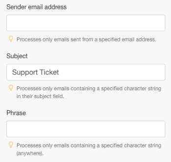
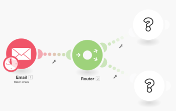
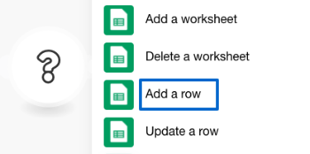
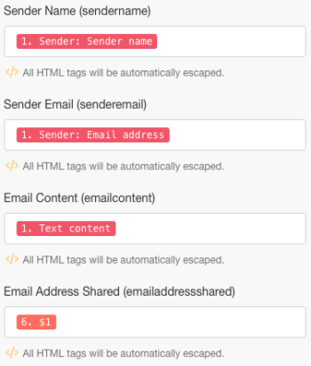

# [!DNL Adobe Workfront Fusion] シナリオの例：電子メールの接続、 [!UICONTROL テキストパーサー]、および [!DNL Google Sheets]

このシナリオでは、すべての電子メールメッセージのログを作成し、スプレッドシートでさらにアクションをおこなうためにタグ付けします。 スプレッドシート内の 2 つの異なるテーブルに、検索パターンとして正規表現 (Regex) を使用して電子メールの本文を取り込みます。 第 1 のパターンは、あるフレーズを検索し、第 2 のパターンは、同じフレーズと E メールアドレスを検索します。

## アクセス要件

この記事の機能を使用するには、次のアクセス権が必要です。

<table style="table-layout:auto"> 
 <col> 
 <col> 
 <tbody> 
  <tr> 
    <td role="rowheader">[!DNL Adobe Workfront] 計画*</td> 
   <td> 
[!DNL Pro] またはそれ以降
 </td> 
  </tr> 
  <tr data-mc-conditions=""> 
   <td role="rowheader">[!DNL Adobe Workfront] ライセンス*</td> 
   <td> 
[!UICONTROL プラン ]、[!UICONTROL Work]
 </td> 
  </tr> 
  <tr> 
   <td role="rowheader">[!UICONTROL Adobe Workfront Fusion] ライセンス**</td> 
   <td>
   
現在のライセンス要件：いいえ [!DNL Workfront Fusion] ライセンス要件。

   
または

   
従来のライセンス要件：[!UICONTROL [!DNL Workfront Fusion] [ 作業の自動化と統合 ] 

   </td> 
  </tr> 
  <tr> 
   <td role="rowheader">製品</td> 
   <td>
   
現在の製品要件：[!UICONTROL Select] または [!UICONTROL Prime] がある場合 [!DNL Adobe Workfront] プラン（組織で購入する必要がある） [!DNL Adobe Workfront Fusion] 同様に [!DNL Adobe Workfront] を使用して、この記事で説明する機能を使用できます。 [!DNL Workfront Fusion] は、[!UICONTROL Ultimate] に含まれています [!DNL Workfront] プラン

   
または

   
従来の製品要件：組織で購入する必要があります [!DNL Adobe Workfront Fusion] 同様に [!DNL Adobe Workfront] を使用して、この記事で説明する機能を使用できます。

   </td> 
  </tr> 
 </tbody> 
</table>

ご利用のプラン、ライセンスの種類、アクセス権を確認するには、 [!DNL Workfront] 管理者。

詳しくは、 [!DNL Adobe Workfront Fusion] ライセンス， 「 [[!DNL Adobe Workfront Fusion] ライセンス](../../workfront-fusion/get-started/license-automation-vs-integration.md).

## 前提条件

このチュートリアルでは、正規表現に関する基本的な知識が必要です。 正規表現については、 [https://regexone.com](https://regexone.com/).

最初のモジュールを追加し、設定します。

1. 電子メールを検索して選択 **[!UICONTROL メールを見る]** トリガー

   >[!NOTE]
   >
   >次の場合、 [!DNL Google] E を使用するアカウントメールモジュールでは、 [!DNL Gmail] モジュール。

1. 次のいずれかを接続： [!DNL Google] アカウントまたはその他の IMAP ベースの電子メールクライアント ( [!DNL Outlook]) をクリックします。
1. 接続したら、次のような受信メールを監視するフォルダを選択します。 [!UICONTROL インボックス].
1. の下 [!UICONTROL 条件]選択 **[!UICONTROL すべての電子メール]** （または、メールを読むか未読にする）。

   取得した電子メールを既読または未読としてマークすることも選択できます。

1. を [!UICONTROL 結果の最大数] を 1 に設定します。

   

   これは、受信するメッセージの量に応じて変更できます。 ただし、低い値を設定し、シナリオを実行する頻度を増やすことをお勧めします。

1. クリック **[!UICONTROL 詳細設定を表示]** 下に

   

1. 次の項目で E メールをフィルター [!UICONTROL 送信者のアドレス], [!UICONTROL 件名] および [!UICONTROL フレーズ].

   これにより、関連する E メールのみを視聴できます。 この例では、件名フィルターのみを追加し、残りの 2 つは空白のままにします。

   >[!NOTE]
   >
   >E メール内のフレーズを探すために、 [!UICONTROL 一致パターン] iterator および検索パターンとしての正規表現（正規表現）。 これにより、マルチユーティリティシナリオを構築することもできます。

1. 設定が完了し、電子メールの視聴を開始する場所を指定するよう求められたら、「 **[!DNL From now on]**.

   

1. 続行 [を検索 [!UICONTROL フロー制御] をクリックし、 [!UICONTROL 発送担当]](#search-for-flow-control-and-add-a-router)

## を検索 [!UICONTROL フロー制御] をクリックし、 [!UICONTROL 発送担当]

1. ルータを任意のモジュールの後に追加して、データを分割または複製してから次のモジュールに送信します。

   ここでは、 [!UICONTROL 発送担当] 「 E メール本文」テキストを [!DNL Google Sheet].

   

## 以下を使用： [!UICONTROL テキストパーサー] モジュール

1. を追加します。 [!UICONTROL 一致パターン] 変換サービスを使用して、E メール内のフレーズを検索できます。

   「[!UICONTROL テキストパーサーモジュール]&quot;すべての受信メールで、このフレーズに一致する本文と送信者名を取り込みます。

   1. パターンを正規表現として記述します。

      text\sparser\smodule

   1. （オプション）その他の「パターン」オプションを使用します。

      

      複数行のテキストが複数行に分かれ、各行でパターンを検索する必要がある場合に便利です。 このチュートリアルでは、E メール本文テキスト全体のパターンを検索する必要があるので、このチュートリアルをオフのままにします。

   1. 内 [!UICONTROL テキスト] フィールドで、属性 **テキストコンテンツ** を選択します。

      

      これは、パターンを検索する E メール本文のテキストを保存する属性です。

1. 別の [!UICONTROL 一致パターン] 同じフレーズと電子メールアドレスを検索します。

   これは、複数のユーザーを持つ顧客アカウントがある場合に特に便利です。 時間を節約するために、 [!UICONTROL テキストパーサー] モジュールを作成し、ルータにリンクします。

   

1. パターンを次のように編集します。

   text\sparser\smodule.+\s([\w.-]+@[\w.-]+)

   

   このパターンでは、「[!UICONTROL テキストパーサーモジュール]」と入力すると、john.doe@gmail.comのような電子メールアドレスが返され、電子メールアドレスのみが返されます。

   >[!NOTE]
   >
   >受け入れる E メールアドレスの仕様に従って正規表現を記述することが重要ですが、上記の正規表現は、ほとんどの標準的な E メールアドレスを処理します。

   * 電子メールアドレスのみを検索する場合は、次の正規表現を使用できます。

     ([\w.-]+@[\w.-]+)

   * また、次の正規表現を使用して、電話番号のみを検索することもできます。

     ^[+]?\(?(\d{1,3})\)?[\s-]?\(?(\d{3})\)?[\s-]?\d{3}[\s-]?\d{3,4}
上記のパターンは、電話番号が書き込まれる一般的な形式をカバーしています。

   パターンをテストするには、 [[!DNL https://regex101.com]](https://regex101.com/) と [!DNL javascript] 味と同じように

   残りの設定は、以前の設定と同じです。

## を [!DNL Google Sheets] モジュール

の場合 [!DNL Sheets]の場合、最初に必要なヘッダーを含むスプレッドシートを作成する必要があります。

1. ユーザーデータを取り込む列を持つスプレッドシートを作成します。 （既存のファイルも自由に使用できます）。

   例えば、「電子メールデータ」という名前のデータを作成します。「サポートチケット」と、送信者名、送信者の E メール、E メールの内容を列で指定します。 ワークシートに「次を含む」という名前を付けます。テキストパーサモジュール。&quot;

1. を [!UICONTROL Google Sheets] モジュール **[!UICONTROL 行を追加]** を選択します。

   

1. 接続 [!DNL Google] アカウントを使用します（まだの場合）。 先ほど作成したファイルを選択し、データを取り込むワークシートを選択します。

   設定は次のようになります。

   

1. 関連するフィールド（列）の属性をマッピングして、モジュールの設定を完了します。

   

1. 先ほど作成したモジュールを複製し、2 番目のモジュールにリンクします。 [!UICONTROL テキストパーサー] モジュール。

   1. スプレッドシートに移動し、前の手順で作成したワークシートを複製して、名前を付けます。

      例えば、次を含むという名前を付けます。テキストパーサモジュールとメール。

   1. E メール本文に含まれる E メールアドレスを保存する別の列を追加します。

      例えば、「Email Address Shared」という名前を付けます。

   1. 複製した [!DNL Google Sheets] モジュールを使用して設定を行います。
   1. ワークシートを、作成した新しいワークシートに変更します。
   1. 出力を [!UICONTROL 一致パターン] モジュール ($1) を追加します。

      

      

   1. クリック **[!UICONTROL OK]**&#x200B;をクリックし、シナリオを保存して、テストの実行に使用します。

      次のように、2 通の別々の E メールを、接続された E メールアドレスに送信する必要があります。

      * 「[!UICONTROL テキストパーサーモジュール]&quot; （電子メールアドレスは含まれません）

        

      * 上記のフレーズと E メールアドレスを含む

        

        設定にエラーがない場合は、最初のワークシートが「[!UICONTROL テキストパーサーモジュール]」を含め、2 番目のワークシートでは「[!UICONTROL テキストパーサーモジュール]&quot;とメールアドレス。 以下のスクリーンショットを参照してください。

        ワークシート 1:

        

        ワークシート 2:

        

## リソース

* [無料演習](https://regexone.com/) 正規表現について学ぶには
* [電話番号の照合について](https://regexone.com/problem/matching_phone_numbers) 正規表現の使用
* [メールのマッチングの詳細](https://regexone.com/problem/matching_emails) 正規表現の使用
* [正規表現のテスト](https://regex101.com/)
