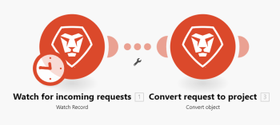

# [!DNL Adobe Workfront Fusion] でのシナリオ実行フロー

この記事では、シナリオの実行方法とシナリオ内のデータのフローを説明します。また、処理されたデータとその読み取り方法に関する情報の所在についても説明します。

## アクセス要件

この記事で説明している機能を使用するには、次のアクセス権が必要です。

<table style="table-layout:auto"> 
 <col> 
 <col> 
 <tbody> 
  <tr> 
    <td role="rowheader">[!DNL Adobe Workfront] プラン*</td> 
   <td> 
[!DNL Pro] またはそれ以降
 </td> 
  </tr> 
  <tr data-mc-conditions=""> 
   <td role="rowheader">[!DNL Adobe Workfront] ライセンス*</td> 
   <td> 
[!UICONTROL Plan]、[!UICONTROL Work]
 </td> 
  </tr> 
  <tr> 
   <td role="rowheader">[!UICONTROL Adobe Workfront Fusion] ライセンス**</td> 
   <td>
   
現在のライセンス要件：[!DNL Workfront Fusion] ライセンスは必要ありません。

   
または

   
従来のライセンス要件：[!UICONTROL [!DNL Workfront Fusion] for Work Automation and Integration]、[!UICONTROL [!DNL Workfront Fusion] for Work Automation]

   </td> 
  </tr> 
  <tr> 
   <td role="rowheader">製品</td> 
   <td>
   
現在の製品要件：[!UICONTROL Select] または [!UICONTROL Prime] [!DNL Adobe Workfront] プランがある場合、この記事で説明する機能を使用するには、組織は [!DNL Adobe Workfront Fusion] と [!DNL Adobe Workfront] を購入する必要があります。[!DNL Workfront Fusion] は、[!UICONTROL Ultimate] [!DNL Workfront] プランに含まれています。

   
または

   
従来の製品要件：この記事で説明する機能を使用するには、組織は [!DNL Adobe Workfront Fusion] と [!DNL Adobe Workfront] を購入する必要があります。

   </td> 
  </tr> 
 </tbody> 
</table>

ご利用のプラン、ライセンスタイプまたはアクセス権を確認するには、[!DNL Workfront] 管理者にお問い合わせください。

[!DNL Adobe Workfront Fusion] のライセンスについて詳しくは、[[!DNL Adobe Workfront Fusion]  のライセンス](../../workfront-fusion/get-started/license-automation-vs-integration.md)を参照してください。

## シナリオ実行フロー

シナリオは、正しく設定されてアクティブ化されると、定義されたスケジュールに従って実行されます。

シナリオが開始すると、最初のモジュールが、監視対象として設定されたイベントに応答します。バンドル（データ）が返された場合、それらは次のモジュールに渡されてシナリオが続行され、後続の各モジュールにバンドルが 1 つずつ渡されていきます。

すべてのモジュールでバンドルが正しく処理された場合、シナリオの詳細エリアでシナリオが成功とマークされます（[ [!DNL Adobe Workfront Fusion]](../../workfront-fusion/scenarios/scenario-detail.md) でのシナリオの詳細を参照）。

* シナリオの設定について詳しくは、[ [!DNL Adobe Workfront Fusion]](../../workfront-fusion/scenarios/basic-scenario-settings.md) での基本的なシナリオ設定を参照してください。
* シナリオのアクティブ化について詳しくは、[ [!DNL Adobe Workfront Fusion]](../../workfront-fusion/scenarios/activate-or-inactivate-scenario.md) でのシナリオのアクティブ化または非アクティブ化を参照してください。
* シナリオのスケジュールについて詳しくは、[ [!DNL Adobe Workfront Fusion]](../../workfront-fusion/scenarios/schedule-a-scenario.md) でのシナリオのスケジュールを参照してください。
* モジュールについて詳しくは、[モジュールのタイプ](../../workfront-fusion/modules/module-types.md)を参照してください。

### 例：[!UICONTROL [!DNL Workfront Fusion] for Work Automation]

>[!INFO]
>
>**例：**[!DNL Workfront] で着信リクエストを監視し、それらを [!DNL Workfront] プロジェクトに変換するシナリオでは、データは次のように流れます。
>
>最初のモジュールで実行される、シナリオの最初のステップは、リクエストを監視することです。着信する各リクエストは、1 つのバンドルと見なされます。モジュールが実行されてもバンドルが見つからない場合、シナリオは最初のモジュールの後で終了します。
>
>最初のモジュールがバンドルを返した場合、そのバンドルは残りのシナリオに渡されていきます。この例では、残りのシナリオは 2 番目と最後のモジュールで構成されており、最後のモジュールがリクエストをプロジェクトに変換します。
>
>

### 例：[!UICONTROL [!DNL Workfront Fusion] for Work Automation and Integration]

>[!INFO]
>
>**例：**[!DNL Adobe Workfront] からドキュメントをダウンロードして [!DNL Dropbox] のフォルダーに送信するシナリオでは、データは次のように流れます。
>
>最初のモジュールで実行される、シナリオの最初のステップは、バンドル（ドキュメント）を監視することです。この例では、モジュールは [!DNL Workfront] 内のバンドルを監視します。バンドルが返されない場合、シナリオは最初のモジュールの後で終了します。
>
>バンドルが返されると、そのバンドルは残りのシナリオに渡されていきます。この例では、残りのシナリオは 2 番目と最後のモジュールで構成されており、最後のモジュールがバンドルを [!DNL Dropbox] フォルダーにアップロードします。
>
>
>
>最初のモジュールが複数のバンドルを返した場合、最初のバンドルが [!DNL Dropbox] にアップロードされてから、2 番目のバンドルがアップロードされます。次に、2 番目のバンドルがアップロードされたあと、3 番目のバンドルがアップロードされ、以下同様の処理が繰り返されます。

## 処理されたバンドルに関する情報

バンドルは各モジュールで、4 段階のプロセスを経てから次のモジュールに進むか、最後の宛先に到達します。この 4 段階のプロセスとは、初期化、操作、コミット／ロールバック、確定です。これはトランザクション処理と呼ばれ、モジュールでのデータの処理方法を理解するのに役立ちます。

シナリオの実行が完了すると、実行された操作の数を示すアイコンが各モジュールに表示されます。このアイコンをクリックすると、処理されたバンドルに関する詳細情報が上記の形式で表示され、。使用されたモジュール設定と、モジュールから返されたバンドルを確認できます。

モジュールは、次のような入力情報を受け取りました。

* 変換された画像
* 画像のアップロード先となる選択済みのフォルダー
* [!DNL Facebook] 画像の元の名前

処理の後、モジュールは次の出力情報を返しました。

* [!DNL Dropbox] に割り当てられた画像 ID
* [!DNL Dropbox] [!DNL Workfront Fusion] がファイルをアップロードした場所のフルパス

画像内の「[!UICONTROL 操作 1]」および「[!UICONTROL 操作 2]」ドロップダウンボックスで示されているように、上記の情報は各バンドルに対して個別に取り込まれます。

トランザクション処理について詳しくは、[ [!DNL Adobe Workfront Fusion]](../../workfront-fusion/scenarios/scenario-execution-cycles-phases.md) でのシナリオの実行、サイクル、フェーズを参照してください。

## シナリオ実行中のエラーの発生

シナリオの実行中にエラーが発生する場合があります。例えば、モジュール設定でターゲットフォルダーとして設定した [!DNL Dropbox] フォルダーを削除すると、エラーメッセージが表示されてシナリオが終了します。エラーの処理方法の詳細については、[ [!DNL Adobe Workfront Fusion]](../../workfront-fusion/errors/error-processing.md) でのエラー処理を参照してください。
