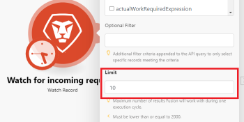

# のシナリオ設定パネル [!DNL Adobe Workfront Fusion]

## アクセス要件

この記事の機能を使用するには、次のアクセス権が必要です。

<table style="table-layout:auto"> 
 <col> 
 <col> 
 <tbody> 
  <tr> 
    <td role="rowheader">[!DNL Adobe Workfront] 計画*</td> 
   <td> 
[!DNL Pro] またはそれ以降
 </td> 
  </tr> 
  <tr data-mc-conditions=""> 
   <td role="rowheader">[!DNL Adobe Workfront] ライセンス*</td> 
   <td> 
[!UICONTROL プラン ]、[!UICONTROL Work]
 </td> 
  </tr> 
  <tr> 
   <td role="rowheader">[!UICONTROL Adobe Workfront Fusion] ライセンス**</td> 
   <td>
   
現在のライセンス要件：いいえ [!DNL Workfront Fusion] ライセンス要件。

   
または

   
従来のライセンス要件：[!UICONTROL [!DNL Workfront Fusion] [!UICONTROL] の [!UICONTROL] [!DNL Workfront Fusion] 自動化 (WA)

   </td> 
  </tr> 
  <tr> 
   <td role="rowheader">製品</td> 
   <td>
   
現在の製品要件：[!UICONTROL Select] または [!UICONTROL Prime] がある場合 [!DNL Adobe Workfront] プラン（組織で購入する必要がある） [!DNL Adobe Workfront Fusion] 同様に [!DNL Adobe Workfront] を使用して、この記事で説明する機能を使用できます。 [!DNL Workfront Fusion] は、[!UICONTROL Ultimate] に含まれています [!DNL Workfront] プラン

   
または

   
従来の製品要件：組織で購入する必要があります [!DNL Adobe Workfront Fusion] 同様に [!DNL Adobe Workfront] を使用して、この記事で説明する機能を使用できます。

   </td> 
  </tr> 
 </tbody> 
</table>

ご利用のプラン、ライセンスの種類、アクセス権を確認するには、 [!DNL Workfront] 管理者。

詳しくは、 [!DNL Adobe Workfront Fusion] ライセンス， 「 [[!DNL Adobe Workfront Fusion] ライセンス](../../workfront-fusion/get-started/license-automation-vs-integration.md).

## シナリオ設定を開く

1. シナリオエディターを開きます。詳しくは、 [のシナリオエディター [!DNL Adobe Workfront Fusion]](../../workfront-fusion/scenarios/scenario-editor.md).
1. ページの左下隅付近にある歯車アイコンをクリックします。

   

   内 [!UICONTROL シナリオ設定] 表示されるパネルで、シナリオの様々な詳細設定を設定できます。

## [!UICONTROL 不完全な実行の保存を許可]

このオプションは、 [!DNL Adobe Workfront Fusion] シナリオの実行中にエラーが発生した場合に続行します。 このオプションを有効にすると、シナリオは一時停止され、次の場所に移動します。 [での不完全な実行の表示と解決 [!DNL Adobe Workfront Fusion]](../../workfront-fusion/scenarios/view-and-resolve-incomplete-executions.md). これにより、問題を修正し、シナリオが停止した場所から実行を続行できます。 このオプションを無効にした場合、シナリオの実行が停止し、ロールバックフェーズが開始します。

## [!UICONTROL 順次処理]

このオプションは、 [!DNL Workfront Fusion] エラーが発生し、シナリオの実行が [での不完全な実行の表示と解決 [!DNL Adobe Workfront Fusion]](../../workfront-fusion/scenarios/view-and-resolve-incomplete-executions.md). この [!UICONTROL 順次処理] このオプションを有効にすると、不完全な実行がすべて解決されるまで、Workfront Fusion はタスクシーケンスの処理を完全に停止します。 この [!UICONTROL 順次処理] オプションが無効の場合、未完了の実行を繰り返し再実行すると同時に、シナリオはスケジュールに従って引き続き実行されます。

スケジュールについて詳しくは、 [でのシナリオのスケジュール設定 [!DNL Adobe Workfront Fusion]](../../workfront-fusion/scenarios/schedule-a-scenario.md).

## データは機密情報

シナリオを実行すると、シナリオ内のモジュールで処理されたデータに関する情報をデフォルトで表示できます。 この情報を保存しない場合は、 [!UICONTROL データは機密情報] オプション。

情報の表示について詳しくは、 [のシナリオ実行フロー [!DNL Adobe Workfront Fusion]](../../workfront-fusion/scenarios/scenario-execution-flow.md).

>[!IMPORTANT]
>
>このオプションを有効にすると、シナリオの実行中に発生する可能性のあるエラーを解決するのが困難になる場合があります。

## データ損失を有効にする

このオプションは、次の場合にデータの損失を有効にする場合に使用します。 [!DNL Workfront Fusion] のキューにバンドルを保存できませんでした [での不完全な実行の表示と解決 [!DNL Adobe Workfront Fusion]](../../workfront-fusion/scenarios/view-and-resolve-incomplete-executions.md) （例えば、空き領域が不足しているため）。 このオプションを有効にすると、シナリオの実行全体で中断が発生しないように、データが失われます。 これは、最も優先度が高い実行が継続的で、入力時の誤りのあるデータがそれほど重要でない場合に役立ちます。

それ以降、シナリオを実行する際に、許容される最大サイズを超えるファイルがモジュールに遭遇することがあります。 この場合、 [!DNL Workfront Fusion] の設定に従って進行する [!UICONTROL データ損失を有効にする] 」オプションと警告メッセージが表示されます。

最大ファイルサイズについて詳しくは、 [でのファイルのマッピングについて [!DNL Adobe Workfront Fusion]](../../workfront-fusion/mapping/about-mapping-files.md).

警告について詳しくは、 [でのエラー処理 [!DNL Adobe Workfront Fusion]](../../workfront-fusion/errors/error-processing.md).

## [!UICONTROL 自動コミット]

この [!UICONTROL 自動コミット] 設定はトランザクションに適用され、シナリオの処理方法を定義します。 「自動コミット」オプションがオンの場合、各モジュールのコミットフェーズは、操作フェーズが完了した直後に開始します。 「自動コミット」オプションを無効にした場合、すべてのモジュールに対して操作が実行されるまでコミットは行われません（これはデフォルトのモードです）。

トランザクションの詳細については、 [のシナリオの実行、サイクル、フェーズ [!DNL Adobe Workfront Fusion]](../../workfront-fusion/scenarios/scenario-execution-cycles-phases.md).

## 最大サイクル数

サードパーティのサービスへの接続が中断されるのを防ぎ、1 回のシナリオ実行内にすべてのレコードが確実に処理されるようにする場合は、より多くのサイクルを設定すると便利です。

* ポーリングトリガーで始まるシナリオの場合、設定は、シナリオの実行中に許可されるサイクルの最大数を定義します。

  ポーリングトリガーについて詳しくは、 [ポーリングトリガー](../../workfront-fusion/modules/module-types.md#polling) in [モジュールのタイプ](../../workfront-fusion/modules/module-types.md).

* シナリオがインスタントトリガーで開始する場合、設定は無視され、1 回のシナリオの実行中（1 サイクルにつき 1 回のイベント）にすべての保留中イベントが処理されます。

  インスタントトリガーの詳細については、 [インスタントトリガー](../../workfront-fusion/modules/module-types.md#instant) in [モジュールのタイプ](../../workfront-fusion/modules/module-types.md).

* シナリオがトリガー（インスタント/ポーリング）で始まらない場合は、指定された最大サイクル数が常に実行されます。

>[!INFO]
>
>**例：**  [!DNL Workfront] > [!UICONTROL 監視レコード] 新しい問題が生じるのを見守り、 [!DNL Workfront] >[!UICONTROL オブジェクトを変換] 新しいリクエストをプロジェクトに変換し、適切なテンプレートを割り当てます。
>
>
>
>A [!UICONTROL より多くのサイクル] 設定は、シナリオの実行をスケジュールする場合にのみ適用されます。 を使用する場合、 [!UICONTROL 1 回実行] ボタン、サイクル設定が考慮されます。
>
>### サイクルの最大数は 1 に設定されています（デフォルト）
>
>
>
>この [!UICONTROL 返されるファイルの最大数] 内 [!UICONTROL Dropbox] >[!UICONTROL 監視ファイル] モジュールが `10`.
>
>
>
>100 件のリクエストが [!DNL Workfront]、および [!UICONTROL 制限] フィールドが 10 に設定されている場合、1 回のシナリオ実行後、90 個のファイルが未処理のまま残ります。 次の 10 個のファイルは、スケジュールされた次のシナリオの実行で処理されます。
>
>### サイクルの最大数は 10 に設定されています
>
>この [!UICONTROL 返されるファイルの最大数] 内 [!UICONTROL Dropbox] >[!UICONTROL 監視ファイル] モジュールが `10`.
>
>100 個のファイルがDropboxフォルダーと [!UICONTROL 返されるファイルの最大数] オプションを 10 に設定すると、最初のサイクルで 10 個のファイルが処理され、2 番目のサイクルで 10 個のファイルが処理され、3 番目のサイクルで 10 個のファイルが処理されるまで、その後 10 個のファイルが処理されます。
>
>すべてのファイルは、1 回のシナリオ実行の間に処理されます。
>
>シナリオの詳細には、既に実行されているサイクルが表示されます。
>
>
>
>このページについて詳しくは、 [シナリオの詳細 ( [!DNL Adobe Workfront Fusion]](../../workfront-fusion/scenarios/scenario-detail.md).

## 連続エラー数

シナリオの実行が非アクティブ化されるまでの連続した実行試行の最大回数を定義します ( [!UICONTROL DataError], [!UICONTROL DuplicateDataError] および [!UICONTROL ConnectionError]) をクリックします。

エラーについて詳しくは、 [でのエラー処理 [!DNL Adobe Workfront Fusion]](../../workfront-fusion/errors/error-processing.md).

>[!NOTE]
>
>シナリオがインスタントトリガーで開始する場合、設定は無視され、最初のエラーが発生すると、直ちにシナリオが非アクティブ化されます。
