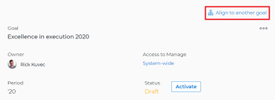
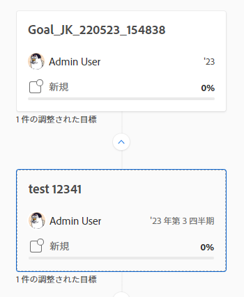

# 目標を Adobe Workfront Goals で相互に関連付けて整合させる方法

<!--Audited P&P only: 10/2025-->

個人的な目標を持つ個人コントリビューターの場合は、その目標をチームの目標に整合させて、組織の戦略の大きなコンテキストで自身の目標の進捗を効果的に表示することができます。

組織の全員が目標を組織の目標に合わせていれば、個人の貢献やチームの取り組みが、より大きな企業レベルの優先度に基づいてプロジェクトを推進するうえでどのように役立っているかを明確に確認できます。目標の整合に関するベストプラクティスについて詳しくは、[Adobe Workfront Goals における目標の整合の概要](../../workfront-goals/goal-alignment/goal-alignment-overview.md)を参照してください。

Adobe Workfront Goals で目標を相互に関連付けるには、次の 2 つのアプローチがあります。

* 目標を相互に関連付けることで、目標間の整合性を実現できます。

* 2 つの目標を手動で整合させたり、既存の目標の結果やアクティビティを別の目標に変換したりできます。変換された結果やアクティビティは、元の目標の子目標になります。

>[!IMPORTANT]
>
>目標には、合計 1000 個の進捗状況インジケーターを設定できます。

この記事では、目標を相互に関連付けることで、目標を整合させる方法について説明します。結果とアクティビティを目標に変換して目標を整合させる方法について詳しくは、[結果とアクティビティを目標に変換して目標を整合させる方法](../../workfront-goals/goal-alignment/align-goals-by-converting-results-activities.md)を参照してください。

## アクセス要件

>[!NOTE]
>
>過去にこのパッケージを購入したことがある会社は、Adobe Workfront Goals を引き続き使用する場合があります。 詳細については、アカウント担当者にお問い合わせください。
>
>Adobe Workfront Goals は購入できなくなりました。

+++展開すると、この記事の機能のアクセス要件が表示されます。 

<table style="table-layout:auto"> 
 <col> 
 <col> 
 <tbody>

<td> 
Adobe Workfront パッケージ
 </td> 
   <td> 
   
Adobe WorkfrontUltimate

   </td> 
  </tr> 
  <tr> 
   <td> 
Adobe Workfront プラン
 </td> 
   <td> 
投稿者以上
 
     
要求者以上
 </td> 
  </tr>

<td>
アクセスレベル設定
 </td> 
   <td> 
Goals への編集アクセス権
 </td> 
  </tr> 
  <tr> 
   <td> 
オブジェクト権限 
 </td> 
   <td> 
目標に対する権限の管理
  </td> 
  </tr> 
  <tr>
   <td role="rowheader">
レイアウトテンプレート
</td>
   <td> 
システム管理者を含むすべてのユーザーには、メインメニューの目標エリアを含むレイアウトテンプレートを割り当てる必要があります。 
  
</td>
  </tr>
 </tbody> 
</table>

詳しくは、[Workfrontへのアクセス要件ドキュメント &#x200B;](/help/quicksilver/administration-and-setup/add-users/access-levels-and-object-permissions/access-level-requirements-in-documentation.md) を参照してください。

+++

<!--Old:
<table style="table-layout:auto">
<col>
</col>
<col>
</col>
<tbody>
 <tr>
 <td role="rowheader">Adobe Workfront plan*</td>
 <td> 
   
For the new plan and license structure:
  <ul><li>An Ultimate plan </li></ul>
   

For the current plan and license structure: 
<ul><li> A Pro or higher </li>
  <li>An Adobe Workfront Goals license in addition to a Workfront license.</li></ul>

   </td> 
 </tr>
 <tr>
 <td role="rowheader">Adobe Workfront license*</td>
 <td>
 
New license: Contributor or higher

 Or
 
Current license: Request or higher
 </td>
 </tr>
 <tr>
 <td role="rowheader">Product*</td>
 <td>
  
 New product requirement: Workfront

  Or
  
Current product requirement: In addition to a Workfront license, you must purchase a license for Adobe Workfront Goals. 
 
For information, see <a href="../../workfront-goals/goal-management/access-needed-for-wf-goals.md" class="MCXref xref">Requirements to use Workfront Goals</a>. 
 </td>
 </tr>
 <tr>
 <td role="rowheader">Access level</td>
 <td> 
Edit access to Goals
 </td>
 </tr>
 <tr>
 <td role="rowheader">Object permissions</td>
 <td>
  
  
View or higher permissions to the goal to view it

  
Manage permissions to the goal to edit it

  
For information about sharing goals, see <a href="../../workfront-goals/workfront-goals-settings/share-a-goal.md" class="MCXref xref">Share a goal in Workfront Goals</a>. 

   </td>
 </tr>
<tr>
   <td role="rowheader">
Layout template
</td>
   <td> 
All users, including Workfront administrators,  must be assigned a layout template that includes the Goals area in the Main Menu. 
  
</td>
  </tr>
</tbody>
</table>-->

## 目標を相互に関連付けて整合させる方法

<!--
Aligning goals by connecting them differs depending on what environment you use. 

### Align goals by connecting them in the Production environment

1. Create two goals that you want to align. For information about creating goals, see [Create goals in Adobe Workfront Goals](../../workfront-goals/goal-management/create-goals.md).
1. (Optional) Activate the goals that you want to align. You can align goals that have a Draft, Active, or Inactive status. For information about activating goals, see [Activate goals in Adobe Workfront Goals](../../workfront-goals/goal-management/activate-goals.md).
1. Go to the goal that you want to align (child goal) to another goal (parent goal) and click its name to open the **Goal Details** panel.

   For example, if you want Goal 2 to influence the progress of Goal 1, you must go to Goal 2. 

1. Click **Align to another goal** in the upper-right corner of the right panel.

   

1. Start typing the name of an existing goal or the name of an owner in the **Align to another goal** field, then select it when it appears in the list. Only goals that are from the same or future periods display in the list. 
1. Click **Save**.

   The goal you started with (Goal 2) is now the child goal of the goal you aligned it with (Goal 1).   
   The aligned goals display connected in the Goal Alignment section with Goal 2 as secondary to Goal 1.

   

1. (Optional) To view the goals in the Goal Alignment section, do one of the following:

   * Click the Goal Alignment section in the left panel and find the goals by applying the correct filter. For information about filtering information in Workfront Goals, see [Filter information in Adobe Workfront Goals](../../workfront-goals/goal-management/filter-information-wf-goals.md).
   * Click the Goal List, Check-in, or Pulse sections in the left panel and find one of the goals, then click the **Alignment icon**  next to the goal name to go directly to the goal in the Goal Alignment section.

   For information about the Goal Alignment section, see [Navigate the Goal Alignment section in Adobe Workfront Goals](../../workfront-goals/goal-alignment/navigate-goal-alignment-chart.md). 

1. (Optional) Add activities and results to either goal to indicate their progress. For information about adding activities and results, see the following articles:

   * [Add activities to goals in Adobe Workfront Goals](../../workfront-goals/results-and-activities/add-activities-to-goals.md) 
   * [Add results to goals in Adobe Workfront Goals](../../workfront-goals/results-and-activities/add-results-to-goals.md)

1. (Optional) Remove the alignment between two goals, when you consider that no longer is relevant to your organization's overall strategy For information about removing alignment between goals, see [Remove goal alignment in Adobe Workfront Goals](../../workfront-goals/goal-alignment/remove-goal-alignment.md).

-->
1. 整合させる 2 つの目標を作成します。目標の作成について詳しくは、[Adobe Workfront Goals での目標の作成](../../workfront-goals/goal-management/create-goals.md)を参照してください。
1. （オプション）整合させる目標をアクティブ化します。ステータスがドラフト、アクティブまたは非アクティブの目標を整合させることができます。目標のアクティブ化については、[Adobe Workfront Goals での目標のアクティブ化](../../workfront-goals/goal-management/activate-goals.md)を参照してください。
1. 別の目標（親目標）と整合させる目標（子目標）に移動し、その名前をクリックして目標ページを開きます。

   >[!INFO]
   >
   >例えば、目標 2 が目標 1 の進捗状況に影響を与えるようにする場合は、目標 2 に進む必要があります。

1. 左パネルの「**目標の詳細**」をクリックします。

1. **親目標の情報**&#x200B;領域で、親目標がない場合は「**親目標**」フィールドで「**追加**」をクリックします。

   または

   親目標の名前をクリックして、別の目標を選択します。

1. 既存の目標の名前を「**親目標**」フィールドに入力し始めて、リストに表示されたらそれを選択します。同じ期間または将来の期間に属する目標のみがリストに表示されます。

1. 「**変更を保存**」をクリックします。

   （目標 2）から始めた目標は、（目標 1）と整合させた親目標の子目標になります。\
   「目標の整合性」セクションで目標 2 を目標 1 のサブとして関連付けた調整された目標が表示されます。
子目標は、その進捗状況により親目標の進捗状況が更新されると、親目標の「進捗状況インジケーター」セクションに表示されます。

   

1. （オプション）「目標の整合性」セクションで目標を確認するには、Workfront の Goals 領域に移動したあと、左パネルの「**目標の整合性**」セクションをクリックします。「目標の整合性」セクションについては、[Adobe Workfront Goals の「目標の整合性」セクションのナビゲーション](../../workfront-goals/goal-alignment/navigate-goal-alignment-chart.md)を参照してください。

1. （オプション）いずれかの目標にアクティビティと結果を追加して、進捗状況を示します。アクティビティと結果の追加については、次の記事を参照してください。

   * [Adobe Workfront Goals で目標にアクティビティを追加する方法](../../workfront-goals/results-and-activities/add-activities-to-goals.md)
   * [Adobe Workfront Goals で目標に結果を追加する方法](../../workfront-goals/results-and-activities/add-results-to-goals.md)

1. （オプション）組織の全体的な戦略とは関係なくなったと見なされる場合は、2 つの目標の整合性を解除します。目標間の整合性の解除については、[Adobe Workfront Goals で目標の整合性を解除する方法](../../workfront-goals/goal-alignment/remove-goal-alignment.md)を参照してください。

