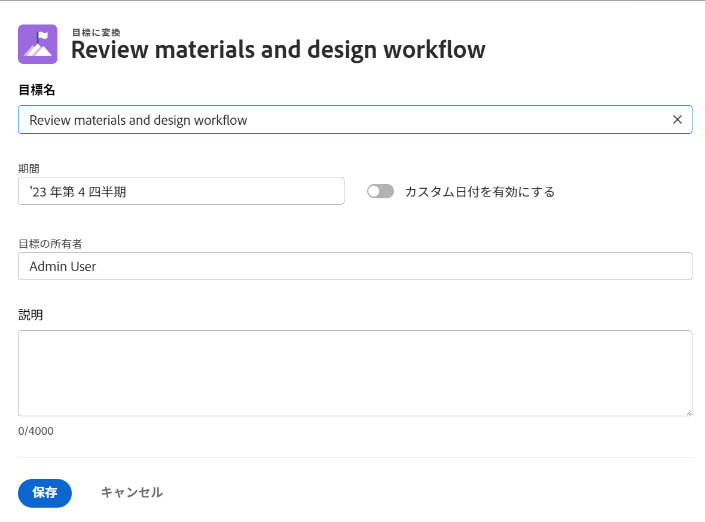

# 結果とアクティビティを目標に変換して目標を連携

2 つの目標を手動で連携させたり、既存の目標の結果やアクティビティを別の目標に変換したりできます。変換された結果やアクティビティは、元の目標の子目標になります。
2 つの目標を手動で連携させる方法について詳しくは、[目標を Adobe Workfront Goals に結び付けて連携](../../workfront-goals/goal-alignment/align-goals-by-connecting-them.md)を参照してください。

## アクセス要件

<!--drafted for P&P release: 

<table style="table-layout:auto">
 <col>
 </col>
 <col>
 </col>
 <tbody>
  <tr>
   <td role="rowheader">Adobe Workfront plan*</td>
   <td>
   
Current plan: Select or higher

   Or
   
Legacy plan: Pro or higher

   
   </td>
  </tr>
  <tr>
   <td role="rowheader">Adobe Workfront license*</td>
   <td>
   
Current license: Contributor or higher

   Or
   
Legacy license: Request or higher
 
For more information, see <a href="../../administration-and-setup/add-users/access-levels-and-object-permissions/wf-licenses.md" class="MCXref xref">Adobe Workfront licenses overview</a>.
 </td>
  </tr>
  <tr>
   <td role="rowheader">Product</td>
   <td>
   
 Current product requirement: If you have the Select or Prime Adobe Workfront plan, you must also buy an additional Adobe Workfront Goals license.  Workfront Goals are included in the Ultimate Workfront Plan.

   Or
   
Legacy product requirement: You must purchase an additional license for the Adobe Workfront Goals to access functionality described in this article. 
 
For information, see <a href="../../workfront-goals/goal-management/access-needed-for-wf-goals.md" class="MCXref xref">Requirements to use Workfront Goals</a>. 
 </td>
  </tr>
  <tr>
   <td role="rowheader">Access level*</td>
   <td> 
Edit access to Goals
 
<b>NOTE</b>
If you still don't have access, ask your Workfront administrator if they set additional restrictions in your access level. For information on how a Workfront administrator can change your access level, see:

     <ul>
      <li> 
<a href="../../administration-and-setup/add-users/configure-and-grant-access/create-modify-access-levels.md" class="MCXref xref">Create or modify custom access levels</a> 
 </li>
      <li> 
<a href="../../administration-and-setup/add-users/configure-and-grant-access/grant-access-goals.md" class="MCXref xref">Grant access to Adobe Workfront Goals</a> 
 </li>
     </ul> 
 </td>
  </tr>
  <tr data-mc-conditions="">
   <td role="rowheader">Object permissions</td>
   <td>
    

     
View or higher permissions to the goal to view it

     
Manage permissions to the goal to edit it

     
For information about sharing goals, see <a href="../../workfront-goals/workfront-goals-settings/share-a-goal.md" class="MCXref xref">Share a goal in Workfront Goals</a>. 

    
 </td>
  </tr>
 </tbody>
</table>

-->

以下が必要です。

<table style="table-layout:auto"> 
 <col> 
 <col> 
 <tbody> 
  <tr> 
   <td role="rowheader">Adobe Workfront プラン*</td> 
   <td> 
Pro 以上
 </td> 
  </tr> 
  <tr> 
   <td role="rowheader">Adobe Workfront ライセンス*</td> 
   <td> 
リクエスト以上
 
詳しくは、<a href="../../administration-and-setup/add-users/access-levels-and-object-permissions/wf-licenses.md" class="MCXref xref">Adobe Workfront ライセンスの概要</a>を参照してください。
 </td> 
  </tr> 
  <tr> 
   <td role="rowheader">製品</td> 
   <td> 
この記事で説明する機能にアクセスするには、Adobe Workfront Goals の追加ライセンスを購入する必要があります。 
 
詳しくは、<a href="../../workfront-goals/goal-management/access-needed-for-wf-goals.md" class="MCXref xref">Workfront Goals の使用要件</a>を参照してください。 
 </td> 
  </tr> 
  <tr> 
   <td role="rowheader">アクセスレベル設定*</td> 
   <td> 
Goals 以上への編集アクセス権
 
<b>メモ</b> 
   
まだアクセス権がない場合は、Workfront 管理者に問い合わせて、アクセスレベルに追加の制限が設定されているかどうかを確認してください。Workfront 管理者がユーザーのアクセスレベルを変更する方法について詳しくは、以下を参照してください。
 
     <ul> 
      <li> 
<a href="../../administration-and-setup/add-users/configure-and-grant-access/create-modify-access-levels.md" class="MCXref xref">カスタムアクセスレベルの作成または変更</a> 
 </li> 
      <li> 
<a href="../../administration-and-setup/add-users/configure-and-grant-access/grant-access-goals.md" class="MCXref xref">Adobe Workfront Goals へのアクセス権の付与</a> 
 </li> 
     </ul> 
 </td> 
  </tr> 
  <tr data-mc-conditions=""> 
   <td role="rowheader">オブジェクト権限</td> 
   <td> 
    
 
     
目標に対する権限の管理
 
     
目標の共有については、<a href="../../workfront-goals/workfront-goals-settings/share-a-goal.md" class="MCXref xref">Workfront Goals での目標の共有</a>を参照してください。 
 
    
 </td> 
  </tr> 
 </tbody> 
</table>

*保有するプラン、ライセンスタイプまたはアクセス権を確認するには、Workfront 管理者にお問い合わせください。

## 前提条件

開始するには、まず以下が必要です。

* メインメニューの Workfront Goals 領域を含んだレイアウトテンプレート。
* 既存の結果とアクティビティを含む既存の目標。

  目標の作成について詳しくは、[Adobe Workfront Goals での目標の作成](../../workfront-goals/goal-management/create-goals.md)を参照してください。

>[!IMPORTANT]
>
>目標には、最大 1000 個の進捗インジケーターを設定できます。

<!--drafted for goal redesign: At PRODUCTION: update the sentence above to remove Production/ Preview references-->

## 結果やアクティビティを目標に変換する際の考慮事項

結果やアクティビティの範囲が予想よりも大きくなって、目標となる方が理にかなっている場合があります。既存の目標の結果やアクティビティを新しい目標に変換できます。これは、目標を連携させるためのボトムアップアプローチです。

結果やアクティビティを目標に変換する際は、次の点を考慮してください。

* 変換された結果またはアクティビティが元の目標の子目標になり、2 つの目標が連携します。
* 元の目標に関する追加の結果やアクティビティがない場合、新しく作成された目標は、元の目標の単一の進捗インジケーターになります。子の目標に対する進捗をトラックするには、結果とアクティビティを追加する必要があります。
* 結果またはアクティビティを目標に変換すると、元に戻せなくなります。変換すると、新しい子目標を再び親目標の結果やアクティビティにすることはできなくなります。

## 結果またはアクティビティを目標に変換

<!--
Converting results and activities differs depending on what environment you use. 

### Convert a result or activity to a goal in the Production environment

1. Go to a goal that has a result or an activity that you want to convert to a goal.
1. Click the name of the goal to open the **Goal Details** panel.
1. Expand the **Results** or **Activities** right-pointing arrows to see a list of results or activities for the goal. 

1. Click the **gear icon**  to the right of the result or activity name that you want to convert, then click **Convert into a Goal**.

   

1. (Optional) Remove the name of the original activity or result owner from the **Goal Owner** field and replace it with another user, team, group, or your organization's name. By default, Workfront selects the owner of the result or the activity as the goal owner. 
1. Click **Convert**. The activity or result displays as an aligned goal in the Goal Details panel of the original goal and the original activity or result is removed from the original goal and transferred to the second goal. By default, the new goal has the same name as the original converted result or activity. 
1. (Optional) Click the name of the new goal to open the **Goal Details** panel and edit the name of the goal. For information about editing any information for an existing goal, see [Edit goals in Adobe Workfront Goals](../../workfront-goals/goal-management/edit-goals.md).
-->

1. 目標に変換する結果またはアクティビティがある目標に移動します。
1. 目標のページで、左側のパネルの「**進捗インジケーター**」をクリックします。
1. 進捗インジケーターのリストで結果またはアクティビティを選択し、**目標に変換**&#x200B;アイコン  をクリックします。「目標に変換」ボックスが開きます。

   
1. 次の情報を更新します。
   * **目標名**：デフォルトでは、新しい目標は、元の結果やアクティビティと同じ名前になります。
   * **期間**：デフォルトでは、新しい目標の期間は現在の四半期になります。「**カスタム日付を有効にする**」設定を選択して、新しい目標のカスタム期間を定義します。
   * **目標の所有者**：デフォルトでは、目標の新しい所有者は、元の結果またはアクティビティの所有者になります。
   * **説明**：新しい目標に関する詳細情報を追加します。
1. 「**保存**」をクリックします。

   これで、結果またはアクティビティが、元の目標の子目標に変換されます。その後、元の目標の進捗状況インジケーターリストに目標として表示されます。

