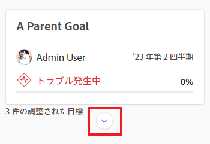
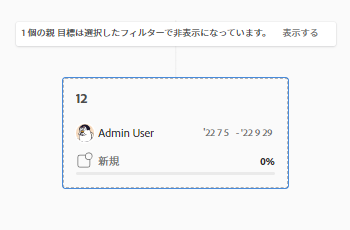
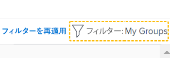
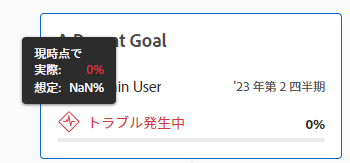

# Adobe Workfront目標の目標の目標揃えセクションに移動

「目標の整列」セクションを使用して、組織全体の目標の整列の全体像をフローチャートに表示します。 整列した目標は、階層ツリー内で相互接続するカードに表示されます。

目標の整合とその達成方法については、次の記事も参照してください。

* [Adobe Workfront目標の目標揃えの概要](../../workfront-goals/goal-alignment/goal-alignment-overview.md)
* [目標をAdobe Workfront目標に結び付けて整列させる](../../workfront-goals/goal-alignment/align-goals-by-connecting-them.md)

## アクセス要件

<!-- drafted for P&P release: 

You must have the following to perform the activities described in this article:

<table style="table-layout:auto">
 <col>
 </col>
 <col>
 </col>
 <tbody>
  <tr>
   <td role="rowheader">Adobe Workfront plan*</td>
   <td>
   
Current plan: Select or higher

   Or
   
Legacy plan: Pro or higher

   
   </td>
  </tr>
  <tr>
   <td role="rowheader">Adobe Workfront license*</td>
   <td>
   
Current license: Contributor or higher

   Or
   
Legacy license: Request or higher
 
For more information, see <a href="../../administration-and-setup/add-users/access-levels-and-object-permissions/wf-licenses.md" class="MCXref xref">Adobe Workfront licenses overview</a>.
 </td>
  </tr>
  <tr>
   <td role="rowheader">Product</td>
   <td>
   
 Current product requirement: If you have the Select or Prime Adobe Workfront plan, you must also buy an additional Adobe Workfront Goals license.  Workfront Goals are included in the Ultimate Workfront Plan.

   Or
   
Legacy product requirement: You must purchase an additional license for the Adobe Workfront Goals to access functionality described in this article. 
 
For information, see <a href="../../workfront-goals/goal-management/access-needed-for-wf-goals.md" class="MCXref xref">Requirements to use Workfront Goals</a>. 
 </td>
  </tr>
  <tr>
   <td role="rowheader">Access level*</td>
   <td> 
Edit access to Goals
 
<b>NOTE</b>
If you still don't have access, ask your Workfront administrator if they set additional restrictions in your access level. For information on how a Workfront administrator can change your access level, see:

     <ul>
      <li> 
<a href="../../administration-and-setup/add-users/configure-and-grant-access/create-modify-access-levels.md" class="MCXref xref">Create or modify custom access levels</a> 
 </li>
      <li> 
<a href="../../administration-and-setup/add-users/configure-and-grant-access/grant-access-goals.md" class="MCXref xref">Grant access to Adobe Workfront Goals</a> 
 </li>
     </ul> 
 </td>
  </tr>
  <tr data-mc-conditions="">
   <td role="rowheader">Object permissions</td>
   <td>
    

     
View or higher permissions to the goal to view it

     
Manage permissions to the goal to edit it

     
For information about sharing goals, see <a href="../../workfront-goals/workfront-goals-settings/share-a-goal.md" class="MCXref xref">Share a goal in Workfront Goals</a>. 

    
 </td>
  </tr>
 </tbody>
</table>

-->

この記事で説明するアクティビティを実行するには、次の操作が必要です。

<table style="table-layout:auto"> 
 <col> 
 <col> 
 <tbody> 
  <tr> 
   <td role="rowheader">Adobe Workfront plan*</td> 
   <td> 
Pro 以上
 </td> 
  </tr> 
  <tr> 
   <td role="rowheader">AdobeWorkfrontlicense*</td> 
   <td> 
リクエスト以上
 
詳しくは、 <a href="../../administration-and-setup/add-users/access-levels-and-object-permissions/wf-licenses.md" class="MCXref xref">Adobe Workfrontライセンスの概要</a>.
 </td> 
  </tr> 
  <tr> 
   <td role="rowheader">製品</td> 
   <td> 
この記事で説明する機能にアクセスするには、 Adobe Workfront Goals の追加ライセンスを購入する必要があります。 
 
詳しくは、 <a href="../../workfront-goals/goal-management/access-needed-for-wf-goals.md" class="MCXref xref">Workfront目標の使用要件</a>. 
 </td> 
  </tr> 
  <tr> 
   <td role="rowheader">アクセスレベル*</td> 
   <td> 
目標へのアクセスを編集
 
<b>メモ</b>
まだアクセス権がない場合は、Workfront管理者に、アクセスレベルに追加の制限を設定しているかどうかを問い合わせてください。 Workfront管理者がアクセスレベルを変更する方法について詳しくは、以下を参照してください。
 
     <ul> 
      <li> 
<a href="../../administration-and-setup/add-users/configure-and-grant-access/create-modify-access-levels.md" class="MCXref xref">カスタムアクセスレベルの作成または変更</a> 
 </li> 
      <li> 
<a href="../../administration-and-setup/add-users/configure-and-grant-access/grant-access-goals.md" class="MCXref xref">Adobe Workfront目標へのアクセス権の付与</a> 
 </li> 
     </ul> 
 </td> 
  </tr> 
  <tr data-mc-conditions=""> 
   <td role="rowheader">オブジェクト権限</td> 
   <td> 
    
 
     
目標に対する権限を表示またはそれ以上設定します
 
     
目標の共有について詳しくは、 <a href="../../workfront-goals/workfront-goals-settings/share-a-goal.md" class="MCXref xref">Workfront目標での目標の共有</a>. 
 
    
 </td> 
  </tr> 
 </tbody> 
</table>

*保有するプラン、ライセンスの種類、アクセス権を確認するには、Workfront管理者にお問い合わせください。

## 前提条件

を起動する前に、次の条件を満たす必要があります。

* メインメニューの目標領域を含むレイアウトテンプレート。

## 「 Goal Alignment 」セクションに移動します。

1. 次をクリック： **メインメニュー** アイコン  画面の右上隅にある「 **目標**.

   <!-- Add this when Shell is available to all: or (if available), click the **Main Menu** icon  in the upper-left corner)
   -->
1. クリック **目標の整列** をクリックします。
1. 整列グラフの右上隅にあるフィルタを使用して、重要な目標のみを選択します。 Workfront目標でのフィルターの使用について詳しくは、 [Adobe Workfront目標での情報のフィルター](../../workfront-goals/goal-management/filter-information-wf-goals.md).

   フィルターに一致する目標は、カードの配置チャートに表示されます。

   次の情報が目標カードに表示されます。

   <table style="table-layout:auto"> 
    <col> 
    <col> 
    <tbody> 
     <tr> 
      <td role="rowheader">期間の日付 </td> 
      <td> 
これは、目標を開く期間です。 目標は、期間の終了日までに達成する必要があります。 Workfront目標は、目標の期間と現在の日付に基づいて目標の進捗を計算します。
 </td> 
     </tr> 
     <tr> 
      <td role="rowheader">進捗状況インジケーター</td> 
      <td>目標の進行状況インジケーターの数。 進行状況インジケーターは、目標、結果またはアクティビティと一致させることができます。 </td> 
     </tr> 
     <tr> 
      <td role="rowheader">所有者名</td> 
      <td>目標の所有者として指定されたユーザー、チーム、グループまたは組織の名前。 </td> 
     </tr> 
     <tr> 
      <td role="rowheader">目標名</td> 
      <td>目標の名前。 </td> 
     </tr> 
     <tr> 
      <td role="rowheader">目標プログレスバー および進行状況</td> 
      <td> 
目標の進捗状況は、現在達成されている目標の量を示します。 これは、目標の期間の開始以降の経過時間に基づいて、目標に関連するすべての目標、結果およびアクティビティの進行状況の平均を自動計算します。 目標の進捗の計算について詳しくは、 <a href="../../workfront-goals/goal-management/calculate-goal-progress.md" class="MCXref xref">Adobe Workfront目標の目標の達成状況と条件の概要</a>. 
 
       
 
        
現在の日付による目標の実際の進捗状況。 次の進行状況の値と色は、目標が時間通りに達成される可能性を示します。 
 
        <ul> 
         <li>ターゲット時 （緑のインジケータ）:目標は時間通りで、時間通りに達成されます。</li> 
         <li> リスク （黄色のインジケーター）：目標は遅れて実行され、時間通りに達成されない可能性があります。</li> 
         <li> トラブル状態 （赤いインジケータ）:目標は、時間通りに達成されない危険性にある。 </li> 
        </ul> 
       
 </td> 
     </tr> <!--
      <tr data-mc-conditions="QuicksilverOrClassic.Draft mode"> 
       <td role="rowheader">Updated on date </td> 
       <td> 
The date when the goal was last updated
 
(NOTE: drafted because I think this was removed with the alignment chart redesign - 21.1) 
 </td> 
      </tr>
     --> 
     <tr> 
      <td role="rowheader">ステータス</td> 
      <td>すべてのステータスの目標は、「目標の整列」セクションに表示されます。 </td> 
     </tr> 
    </tbody> 
   </table>

   他の目標に合わせた目標は、目標カードの下に合わせた目標の数を表示します。

   

1. 次をクリック： **下向き矢印** アイコンをクリックして、子の目標をさらに展開し表示します。

   

   >[!TIP]
   >
   >子の目標を揃えた目標は、それぞれのカードの下に整列した目標の数を表示します。

1. （条件付き）現在のフィルターで線形に関与する一部の目標が除外されている場合は、すべての目標が表示されていないことを示す警告メッセージが表示されます。

   

1. クリック **表示** ：現在フィルターによって削除されている目標を表示します。

   次のように線形グラフが変更されます。

   * 以前にフィルターで削除された連結目標が、整列グラフに表示されるようになりました。
   * 右上隅のフィルターは、現在適用されていないことを示す黄色で囲まれます。

      

      フィルター名の左側に「フィルターを再適用」リンクが表示されます。

1. （オプション）「 **フィルターを再適用** をクリックして元の結果に戻り、目標階層を表示します。
1. （オプション）進行状況のインジケーターの上にマウスポインターを置いて、現在の日の目標の進行状況を把握します。

   

   次の情報が表示されます。

   <table style="table-layout:auto"> 
    <col> 
    <col> 
    <tbody> 
     <tr> 
      <td role="rowheader">本日時点</td> 
      <td>進捗状況のステータスは常に最新です。 </td> 
     </tr> 
     <tr> 
      <td role="rowheader">実際 </td> 
      <td>目標に関するすべての進捗状況指標を考慮して計算された、現在の日付による目標の実際の進捗状況（パーセンテージ）。 目標の進捗状況インジケーターは、目標、アクティビティおよび結果と一致します。 </td> 
     </tr> 
     <tr> 
      <td role="rowheader">予測</td> 
      <td> 
目標を時間通りに達成すると仮定した、現在の日付までの目標の予想される進行状況（パーセント）。
 </td> 
     </tr> 
    </tbody> 
   </table>

1. 目標カードをクリックして、目標ページを開きます。 既存の目標の編集について詳しくは、 [Adobe Workfront目標で目標を編集](../../workfront-goals/goal-management/edit-goals.md). 目標の進捗状況の更新について詳しくは、 [Adobe Workfront目標での目標の進捗状況の更新](../../workfront-goals/goal-review-and-workfront-goals-sections/check-in-goals.md).

1. 現在のレベルの目標の上向き矢印をクリックして、グラフの階層の前のレベルに戻ります。

   または

   （オプション）「 **出口目標階層** 現在のフィルターに一致するすべてのゴールのカードを、互いの接続を表示せずに表示する。

