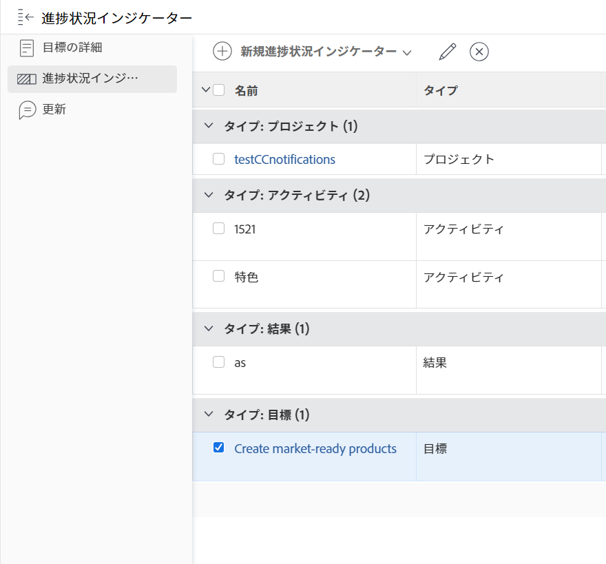

# Adobe Workfront Goals での目標の整合性の削除

2 つの目標を接続しても意味がない場合は、それらの目標間の整合性を削除できます。

目標の整合について詳しくは、次の記事を参照してください。

* [目標を Adobe Workfront 目標に結び付けて整合させる](../../workfront-goals/goal-alignment/align-goals-by-connecting-them.md)
* [結果とアクティビティを目標に変換して目標を連携](../../workfront-goals/goal-alignment/align-goals-by-converting-results-activities.md)

## アクセス要件

<!--drafted - replace the table below with this one when P&P releases: 

<table style="table-layout:auto">
 <col>
 </col>
 <col>
 </col>
 <tbody>
  <tr>
   <td role="rowheader">Adobe Workfront plan*</td>
   <td>
   
Current plan: Select or higher

   Or
   
Legacy plan: Pro or higher

   
   </td>
  </tr>
  <tr>
   <td role="rowheader">Adobe Workfront license*</td>
   <td>
   
Current license: Contributor or higher

   Or
   
Legacy license: Request or higher
 
For more information, see <a href="../../administration-and-setup/add-users/access-levels-and-object-permissions/wf-licenses.md" class="MCXref xref">Adobe Workfront licenses overview</a>.
 </td>
  </tr>
  <tr>
   <td role="rowheader">Product</td>
   <td>
   
 Current product requirement: If you have the Select or Prime Adobe Workfront plan, you must also buy an additional Adobe Workfront Goals license.  Workfront Goals are included in the Ultimate Workfront Plan.

   Or
   
Legacy product requirement: You must purchase an additional license for the Adobe Workfront Goals to access functionality described in this article. 
 
For information, see <a href="../../workfront-goals/goal-management/access-needed-for-wf-goals.md" class="MCXref xref">Requirements to use Workfront Goals</a>. 
 </td>
  </tr>
  <tr>
   <td role="rowheader">Access level*</td>
   <td> 
Edit access to Goals
 
<b>NOTE</b>
If you still don't have access, ask your Workfront administrator if they set additional restrictions in your access level. For information on how a Workfront administrator can change your access level, see:

     <ul>
      <li> 
<a href="../../administration-and-setup/add-users/configure-and-grant-access/create-modify-access-levels.md" class="MCXref xref">Create or modify custom access levels</a> 
 </li>
      <li> 
<a href="../../administration-and-setup/add-users/configure-and-grant-access/grant-access-goals.md" class="MCXref xref">Grant access to Adobe Workfront Goals</a> 
 </li>
     </ul> 
 </td>
  </tr>
  <tr data-mc-conditions="">
   <td role="rowheader">Object permissions</td>
   <td>
    

     
View or higher permissions to the goal to view it

     
Manage permissions to the goal to edit it

     
For information about sharing goals, see <a href="../../workfront-goals/workfront-goals-settings/share-a-goal.md" class="MCXref xref">Share a goal in Workfront Goals</a>. 

    
 </td>
  </tr>
 </tbody>
</table>
-->

以下が必要です。

<table style="table-layout:auto"> 
 <col> 
 <col> 
 <tbody> 
  <tr> 
   <td role="rowheader">Adobe Workfront プラン*</td> 
   <td> 
Pro 以上
 </td> 
  </tr> 
  <tr> 
   <td role="rowheader">Adobe Workfront ライセンス*</td> 
   <td> 
リクエスト以上
 
詳しくは、<a href="../../administration-and-setup/add-users/access-levels-and-object-permissions/wf-licenses.md" class="MCXref xref">Adobe Workfront ライセンスの概要</a>を参照してください。
 </td> 
  </tr> 
  <tr> 
   <td role="rowheader">製品</td> 
   <td> 
この記事で説明する機能にアクセスするには、Adobe Workfront Goals の追加ライセンスを購入する必要があります。 
 
詳しくは、<a href="../../workfront-goals/goal-management/access-needed-for-wf-goals.md" class="MCXref xref">Workfront Goals の使用要件</a>を参照してください。 
 </td> 
  </tr> 
  <tr> 
   <td role="rowheader">アクセスレベル設定*</td> 
   <td> 
Goals 以上への編集アクセス権
 
<b>メモ</b>

まだアクセス権がない場合は、Workfront 管理者に問い合わせて、アクセスレベルに追加の制限が設定されているかどうかを確認してください。Workfront 管理者がユーザーのアクセスレベルを変更する方法について詳しくは、以下を参照してください。
 
     <ul> 
      <li> 
<a href="../../administration-and-setup/add-users/configure-and-grant-access/create-modify-access-levels.md" class="MCXref xref">カスタムアクセスレベルの作成または変更</a> 
 </li> 
      <li> 
<a href="../../administration-and-setup/add-users/configure-and-grant-access/grant-access-goals.md" class="MCXref xref">Adobe Workfront Goals へのアクセス権の付与</a> 
 </li> 
     </ul> 
 </td> 
  </tr> 
  <tr data-mc-conditions=""> 
   <td role="rowheader">オブジェクト権限</td> 
   <td> 
    
 
     
目標に対する権限の管理
 
     
目標の共有について詳しくは、<a href="../../workfront-goals/workfront-goals-settings/share-a-goal.md" class="MCXref xref">Workfront Goals での目標の共有</a>を参照してください。 
 
    
 </td> 
  </tr> 
 </tbody> 
</table>

*保有するプラン、ライセンスタイプまたはアクセス権を確認するには、Workfront 管理者にお問い合わせください。

## 前提条件

開始するには、まず以下が必要です。

* メインメニューの Workfront Goals 領域を含んだレイアウトテンプレート。
* 親目標に、1 つ以上の子目標が関連付けられている。子の目標は、目標の進捗状況インジケーターです。

## 目標の整合性の削除に関する考慮事項

2 つの目標間の整合性を削除する際は、次の点を考慮してください。

* 親目標をアクティブに保つには、別の目標、アクティビティ、または結果が関連付けられている必要があります。
* 関連付けられた子目標が、親目標の唯一の進捗インジケーターである場合、関連付けられた子目標は削除できません。
* 子目標は、親目標との整合を外すと、スタンドアロンの目標になります。

## 目標の整合性の削除

<!--
Removing goal alignment differs depending on which environment you use.

### Remove goal alignment in the Production environment

1. Go to a child goal aligned to a parent goal. 
1. Click the goal name to open the **Goal Details** panel. 
1. Click the **gear icon**  next to the parent goal, then click **Remove alignment**.

   

   The goal becomes a standalone goal and its progress no longer influences the progress of the original parent goal. 

1. (Optional) Click **Undo** in the lower-left corner of the screen if you want to revert this change and keep the goals aligned. 
1. (Optional) Add activities and results to either goals to indicate their progress. For information about adding activities and results, see the following articles:

   * [Add activities to goals in Adobe Workfront Goals](../../workfront-goals/results-and-activities/add-activities-to-goals.md) 
   * [Add results to goals in Adobe Workfront Goals](../../workfront-goals/results-and-activities/add-results-to-goals.md)
-->

1. Workfront の&#x200B;**目標**&#x200B;エリアにアクセスし、目標の名前をクリックして、目標のページを開きます。
1. 親目標の目標ページで、左パネルの&#x200B;**進行状況インジケーター**&#x200B;をクリックします。

   

1. **タイプ：目標**&#x200B;グループ化を選択し、目標を選択して、リストの上の&#x200B;**連携解除**&#x200B;アイコンをクリックします。

   連携解除ボックスが表示されます。

1. 「**連携解除**」をクリックし、選択した目標を親から切断します。

   目標はスタンドアロンの目標になり、元の目標の進捗状況インジケーターとして表示されなくなります。接続解除された目標の進行状況は、元の目標の進行状況に影響を与えなくなりました。

   成功メッセージがページの右上隅に表示され、目標が連携解除されたことを確認できます。