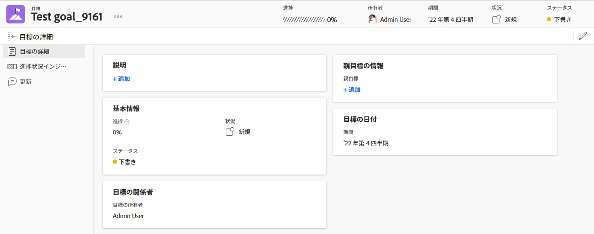

# Adobe Workfront Goals で目標にアクセスして開く

この記事では、Adobe Workfront で戦略目標を検索し、管理する方法について説明します。

## アクセス要件

<!--drafted for P&P: replace the requirements table and the asterisk below it with the following: 

You must have the following to perform the activities described in this article:

<table style="table-layout:auto"> 
 <col> 
 </col> 
 <col> 
 </col> 
 <tbody> 
  <tr> 
   <td role="rowheader">Adobe Workfront plan*</td> 
   <td> 
   
Current plan: Select or higher

   Or
   
Legacy plan: Pro or higher

    
   </td> 
  </tr> 
  <tr> 
   <td role="rowheader">Adobe Workfront license*</td> 
   <td> 
   
Current license: Contributor or higher

   Or
   
Legacy license: Request or higher
 
For more information, see <a href="../../administration-and-setup/add-users/access-levels-and-object-permissions/wf-licenses.md" class="MCXref xref">Adobe Workfront licenses overview</a>.
 </td> 
  </tr> 
  <tr> 
   <td role="rowheader">Product</td> 
   <td> 
   
 Current product requirement: If you have the Select or Prime Adobe Workfront plan, you must also buy an additional Adobe Workfront Goals license.  Workfront Goals are included in the Ultimate Workfront Plan.

   Or
   
Legacy product requirement: You must purchase an additional license for the Adobe Workfront Goals to access functionality described in this article. 
 
For information, see <a href="../../workfront-goals/goal-management/access-needed-for-wf-goals.md" class="MCXref xref">Requirements to use Workfront Goals</a>. 
 </td> 
  </tr> 
  <tr> 
   <td role="rowheader">Access level*</td> 
   <td> 
Edit access to Goals
 
<b>NOTE</b>
If you still don't have access, ask your Workfront administrator if they set additional restrictions in your access level. For information on how a Workfront administrator can change your access level, see:
 
     <ul> 
      <li> 
<a href="../../administration-and-setup/add-users/configure-and-grant-access/create-modify-access-levels.md" class="MCXref xref">Create or modify custom access levels</a> 
 </li> 
      <li> 
<a href="../../administration-and-setup/add-users/configure-and-grant-access/grant-access-goals.md" class="MCXref xref">Grant access to Adobe Workfront Goals</a> 
 </li> 
     </ul> 
 </td> 
  </tr> 
  <tr data-mc-conditions=""> 
   <td role="rowheader">Object permissions</td> 
   <td> 
    
 
     
View or higher permissions to the goal to view it
 
     
Manage permissions to the goal to edit it
 
     
For information about sharing goals, see <a href="../../workfront-goals/workfront-goals-settings/share-a-goal.md" class="MCXref xref">Share a goal in Workfront Goals</a>. 
 
    
 </td> 
  </tr> 
  <tr> 
   <td role="rowheader">
Layout template
</td> 
   <td> 
    
 
     
All users, including Workfront administrators,  must be assigned to a layout template that includes the Goals area in the Main Menu. 
 
    
 </td> 
  </tr> 
 </tbody> 
</table>
-->

<table style="table-layout:auto"> 
 <col> 
 </col> 
 <col> 
 </col> 
 <tbody> 
  <tr> 
   <td role="rowheader">Adobe Workfront プラン*</td> 
   <td> 
Pro 以上
 </td> 
  </tr> 
  <tr> 
   <td role="rowheader">Adobe Workfront ライセンス*</td> 
   <td> 
リクエスト以上
 
詳しくは、<a href="../../administration-and-setup/add-users/access-levels-and-object-permissions/wf-licenses.md" class="MCXref xref">Adobe Workfront ライセンスの概要</a>を参照してください。
 </td> 
  </tr> 
  <tr> 
   <td role="rowheader">製品</td> 
   <td> 
この記事で説明する機能にアクセスするには、Adobe Workfront Goals の追加ライセンスを購入する必要があります。 
 
詳しくは、<a href="../../workfront-goals/goal-management/access-needed-for-wf-goals.md" class="MCXref xref">Workfront Goals の使用要件</a>を参照してください。 
 </td> 
  </tr> 
  <tr> 
   <td role="rowheader">アクセスレベル*</td> 
   <td> 
Goals への編集アクセス権
 
<b>メモ</b>
まだアクセス権がない場合は、Workfront 管理者に問い合わせて、アクセスレベルに追加の制限が設定されているかどうかを確認してください。Workfront 管理者がユーザーのアクセスレベルを変更する方法について詳しくは、以下を参照してください。
 
     <ul> 
      <li> 
<a href="../../administration-and-setup/add-users/configure-and-grant-access/create-modify-access-levels.md" class="MCXref xref">カスタムアクセスレベルの作成または変更</a> 
 </li> 
      <li> 
<a href="../../administration-and-setup/add-users/configure-and-grant-access/grant-access-goals.md" class="MCXref xref">Adobe Workfront Goals へのアクセス権の付与</a> 
 </li> 
     </ul> 
 </td> 
  </tr> 
  <tr data-mc-conditions=""> 
   <td role="rowheader">オブジェクト権限</td> 
   <td> 
    
 
     
目標の表示には表示権限以上が必要
 
     
目標に対する編集権限を管理
 
     
目標の共有について詳しくは、<a href="../../workfront-goals/workfront-goals-settings/share-a-goal.md" class="MCXref xref">Workfront Goals での目標の共有</a>を参照してください。 
 
    
 </td> 
  </tr>

<tr> 
   <td role="rowheader">
レイアウトテンプレート
</td> 
   <td> 
    
 
     
Workfront管理者を含むすべてのユーザーに、メインメニューの目標領域を含むレイアウトテンプレートを割り当てる必要があります。 
 
    
 </td> 
  </tr>

</tbody> 
</table>

*保有するプラン、ライセンスタイプまたはアクセス権を確認するには、Workfront 管理者にお問い合わせください。

## Workfront Goals へのアクセス

1. 右上隅の&#x200B;**メインメニュー**&#x200B;アイコン  をクリックし、「**目標**」をクリックします。

   <!-- drafted for Shell release: Add this when Shell is available to all: or (if available), click the **Main Menu** icon  in the upper-left corner)
   -->

   目標リストが表示されます。

   >[!IMPORTANT]
   >
   >   Workfront Goals に正しくアクセスできたら、デフォルトでは、目標リストに自分または他のユーザーが作成した目標を表示できます。

   <!--   
   (NOTE: This might change when sharing is in place; right now, with sharing in place, they can VIEW all goals in the system but they cannot EDIT the ones others created!)
   -->

1. （オプション）目標の名前をクリックして、目標を開いたり編集したりします。

   または

   「**新規目標**」をクリックして、新しい目標を追加します。

   目標の作成について詳しくは、[Adobe Workfront Goals での目標の作成](../../workfront-goals/goal-management/create-goals.md)を参照してください。

## 個々の目標を開いて管理

目標を管理するには、個々の目標にアクセスして次の操作を実行する必要があります。

* 編集
* 結果またはアクティビティを追加
* 結果および関連付けられたアクティビティを編集
* アクティブ化
* 非アクティブ化
* 削除
* 別の目標と整合性をとる
* 結果またはアクティビティを他の目標に変換
* 更新
<!--
Accessing goals differs depending on what environment you use.

To access an individual goal in the Production environment:

1. Click the **Main Menu** icon  in the upper-right corner of Workfront, then click **Goals** .

     (!--drafted for Shell release: Add this when Shell is available to all: or (if available), click the **Main Menu** icon  in the upper-left corner)
   --)

   The Goal List displays by default. 

1. Click the name of a goal in the list 

   Or

   Click one of the options below in the left panel, then click the name of a goal to access it:

   * Goal Alignment
   * Check-in 
   * Pulse 

   >[!NOTE]
   >
   >Depending on what action you want to perform on the individual goal, you might choose to select different sections every time. For information about the differences between the Workfront Goals sections, see [Overview of the Adobe Workfront Goals sections](../../workfront-goals/goal-review-and-workfront-goals-sections/overview-of-wf-goals-sections.md).

   The Goal Details panel displays on the right. You can update the goal, its results, and activities in the Goal Details panel when you have access to manage it. For information about updating goals using the Goal Details panel, see [Update goals in the Goal details section in Adobe Workfront Goals](../../workfront-goals/goal-management/update-goals-in-goal-details-panel.md).
-->

個々の目標にアクセスするには次の手順に従います。

1. Workfront の右上隅にある&#x200B;**メインメニュー**&#x200B;アイコンをクリックし、「**目標**」をクリックします。
デフォルトでは、目標リストが表示されます。
   
1. リストで目標の名前をクリックします。
目標のページが表示されます。
   
1. 目標名の右側にある&#x200B;**その他**&#x200B;メニュー  をクリックして、目標を編集したり共有したりします。
1. 左側のパネルにある「**目標の詳細**」をクリックして、目標に関する情報を編集します。詳しくは、[Adobe Workfront Goals の目標の詳細セクションで目標を更新](../goal-management/update-goals-in-goal-details-panel.md)を参照してください。

