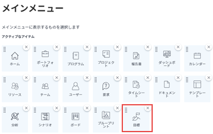

# Workfront目標の使用要件

Adobe Workfront目標にアクセスするには、Adobe Workfrontの管理者が、次の条件がすべて満たされていることを確認する必要があります。

<!--drafted for P&P - replace the first bullet with this one when licensing changes: 
* Your company must purchase the correct Adobe Worfront plan or Adobe Workfront Goal license. For information, see the section [Obtain Workfront Goals organization access](#obtain-workfront-goals-organization-access)in this article.-->

* お客様の組織は、Workfront Goals の正しいライセンスを購入する必要があります。 詳しくは、 [Workfront Goals 組織のアクセス権の取得](#obtain-workfront-goals-organization-access)」を参照してください。

* 適切なタイプのWorkfrontライセンスを割り当てます。 ライセンスの種類とアクセスレベルの割り当てについては、「 [ライセンスの種類とアクセスレベルの設定を更新する](#update-license-types-and-access-level-settings) 」を参照してください。

>[!NOTE]
>
>「外部」ライセンスタイプのユーザーは、Workfront Goals にアクセスできません。

* アクセスレベルで目標にアクセスできます。 詳しくは、 [Adobe Workfront目標へのアクセス権の付与](../../administration-and-setup/add-users/configure-and-grant-access/grant-access-goals.md)

* メインメニューの目標領域を含むレイアウトテンプレートを割り当てます。

   詳しくは、 [Workfront目標をレイアウトテンプレートに追加](#add-workfront-goals-to-a-layout-template) 」を参照してください。

* 自分で作成していない目標を変更する必要がある場合は、目標の作成者が目標を自分と共有し、目標の管理権限を付与する必要があります。

   詳しくは、 [他のユーザーと個人の目標を共有する](#share-individual-goals-with-other-users) 」を参照してください。

## Workfront Goals 組織のアクセス権の取得 {#obtain-workfront-goals-organization-access}

<!--drafted for P&P release: 

If your company has a current Workfront plan, you must have one of the following:

* An Ultimate Workfront plan. Workfront Goals are included in this plan. 
* A Select or higher Workfront plan and a separate Workfront Goals license. -->

<!-- drafted for P&P - add this to the sentence below at release: 

If your company has a legacy Workfront plan, -->

ユーザーがWorkfront Goals にアクセスできるようにするには、Workfrontライセンスに加えて、追加のライセンスを購入する必要があります。 組織が追加のライセンスを購入すると、Workfrontはお客様のアカウントでWorkfront目標を有効にします。 Workfront Goals のライセンスの購入について詳しくは、Workfrontのアカウントマネージャーにお問い合わせください。

## ライセンスの種類とアクセスレベルの設定を更新する  {#update-license-types-and-access-level-settings}

<!--drafted for P&P release: 
If your company has the current access level model, your Workfront administrator must grant you one of the following Workfront license types to access Workfront Goals: 

* Contributor
* Light
* Standard-->

<!--drafted for P&P release: add this to the first sentence: 
If your company has the legacy access level model, -->

Workfrontの管理者が、Workfront目標にアクセスするために、次のいずれかのWorkfrontライセンスタイプを付与する必要があります。

* 計画
* 作業
* 確認
* リクエスト

Workfront管理者がこれらのライセンスタイプの 1 つを許可したら、アクセスレベルで目標に対するアクセス権も付与する必要があります。 目標へのアクセスについて詳しくは、 [Adobe Workfront目標へのアクセス権の付与](../../administration-and-setup/add-users/configure-and-grant-access/grant-access-goals.md).

Workfront管理者は、システム内のWorkfront Goals ライセンスの数を確認し、現在有効になっている数を把握できます。 詳しくは、 [システムで使用可能なライセンスを管理](../../administration-and-setup/get-started-wf-administration/manage-available-licenses-in-your-system.md).

>[!NOTE]
>
>Workfrontでは、購入したWorkfront Goals ライセンスをさらに割り当てることができます。 ただし、Workfront Goals 契約で許可されている数を超えるライセンスを割り当てると、Workfrontのアカウントマネージャーから連絡があり、契約上の数を超えたことが通知されます。

## Workfront目標をレイアウトテンプレートに追加 {#add-workfront-goals-to-a-layout-template}

Workfrontまたはグループ管理者が、Workfront目標にアクセスできるよう、メインメニューの目標領域を含むレイアウトテンプレートを割り当てる必要があります。

Workfrontの管理者またはグループ管理者は、レイアウトテンプレートに以下を追加して、Workfront目標に簡単にアクセスできるようにすることもできます。

* 固定されたタブ
* 目標領域をランディングページにする

レイアウトテンプレートの更新について詳しくは、次の記事を参照してください。

* [レイアウトテンプレートの作成と管理](../../administration-and-setup/customize-workfront/use-layout-templates/create-and-manage-layout-templates.md)
* [レイアウトテンプレートを使用したメインメニューのカスタマイズ](../../administration-and-setup/customize-workfront/use-layout-templates/customize-main-menu.md)
* [レイアウトテンプレートを使用して固定されたページをカスタマイズする](../../administration-and-setup/customize-workfront/use-layout-templates/customize-pinned-pages.md)
* [レイアウトテンプレートを使用したランディングページのカスタマイズ](../../administration-and-setup/customize-workfront/use-layout-templates/customize-landing-page.md)
* [レイアウトテンプレートにユーザーを割り当てる](../../administration-and-setup/customize-workfront/use-layout-templates/assign-users-to-layout-template.md)

## 他のユーザーと個人の目標を共有する {#share-individual-goals-with-other-users}

デフォルトでは、アクセスレベルで目標に対する表示アクセス権を持つすべてのユーザーが、Workfrontですべての目標を表示できます。

目標の編集アクセス権を持つユーザーは誰でも目標を作成でき、自動的に目標の管理アクセス権を取得します。 他のユーザーの目標を編集する必要がある場合は、それらの目標の管理権限を持つユーザーが、作成しなかった目標を共有する必要があります。

ユーザーとの目標の共有と権限の付与について詳しくは、 [Workfront目標での目標の共有](../../workfront-goals/workfront-goals-settings/share-a-goal.md).
