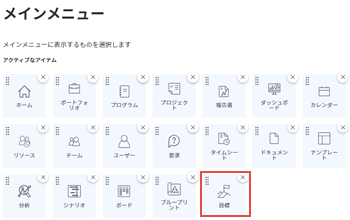

# Workfront Goals の使用要件

<!--Audited P&P only: 04/2025-->

Adobe Workfront Goals にアクセスする前に、Adobe Workfront の管理者が、次の条件がすべて満たされていることを確認する必要があります。

* お客様の組織には、Workfront Ultimate パッケージが必要です。

  Workfront Goalsは、Workfront ワークフローパッケージでは使用できません。

  現在Workfrontを更新中で、Workfront Goalsを維持したい場合は、Workfront アカウント担当者にお問い合わせください。

  新規のお客様は、Workfront Goalsを購入できなくなります。

  詳しくは、この記事の「[Workfront Goals組織へのアクセスの取得](#obtain-workfront-goals-organization-access)」の節を参照してください。

* 適切なタイプの Workfront ライセンスが割り当てられます。ライセンスタイプとアクセスレベルの割り当てについては、[ライセンスタイプとアクセスレベルの設定を更新](#update-license-types-and-access-level-settings)の節を参照してください。

  >[!NOTE]
  >
  >外部ライセンスタイプを所有のユーザーは、Workfront Goals にアクセスできません。

* ご自身のアクセスレベルで Goals にアクセスできます。詳しくは、[Adobe Workfront Goals へのアクセス権の付与](../../administration-and-setup/add-users/configure-and-grant-access/grant-access-goals.md)を参照してください。

  >[!NOTE]
  >
  >デフォルトでは、ユーザーはアクセスレベルの目標にアクセスできません。

* メインメニューの「目標」領域を含むレイアウトテンプレートを割り当てます。

  >[!NOTE]
  >
  >システム管理者を含むすべてのユーザーには、メインメニューの「目標」領域を含むレイアウトテンプレートを割り当てる必要があります。

  詳しくは、この記事の [Workfron Goals レイアウトテンプレートに追加](#add-workfront-goals-to-a-layout-template)の節を参照してください。

* 自分で作成していない目標を変更する必要がある場合は、目標の作成者が目標を自分と共有し、目標の管理権限を作成者から付与される必要があります。

  詳しくは、この記事の[他のユーザーと個人の目標を共有](#share-individual-goals-with-other-users)の節を参照してください。

## Workfront Goals への組織のアクセス権の取得 {#obtain-workfront-goals-organization-access}

Workfront Goalsを含む最後のAdobe Workfront パッケージは、Adobe Workfront Ultimateでした。

Workfront Goalsは、新しいパッケージでは購入できなくなりました。

Workfront Goalsについてお問い合わせは、担当者までご連絡ください。

<!--
Old: >
Depending on which Workfront plan your company is currently on, the following scenarios exist: 

* **A new Workfront plan**: You must have an Ultimate Workfront plan. Workfront Goals are included only in this plan. 

* **A current Workfront plan**: Your organization must purchase an additional license, in addition to the Workfront license.

  After your organization purchases the additional license, Workfront enables Workfront Goals for your account. For information about purchasing a license for Workfront Goals contact your Workfront account manager.

For information about Workfront access requirements, see [Access requirements in Workfront documentation](/help/quicksilver/administration-and-setup/add-users/access-levels-and-object-permissions/access-level-requirements-in-documentation.md).
-->

## ライセンスタイプとアクセスレベルの設定の更新  {#update-license-types-and-access-level-settings}

お客様の会社が以前の購入時からWorkfront Goalsにアクセスできる場合は、Workfront管理者がWorkfront Goalsにアクセスするための次の権限を付与する必要があります。

1. 次のいずれかのライセンス：

   * コントリビューター以上
   * リクエスト以上

<!--
Old: 
* **The new access level model**: Your Workfront administrator must grant you one of the following Workfront license types to access Workfront Goals: 

  * Contributor
  * Light
  * Standard

* **The current access level model**: Your Workfront administrator must grant you one of the following Workfront license types to access Workfront Goals:

  * Plan
  * Work 
  * Review
  * Request
-->

1. 次のアクセスレベル：

   * 目標へのアクセス権をアクセスレベルで表示または上位に表示します。

   Goals へのアクセスについて詳しくは、[Adobe Workfront Goals へのアクセス権の付与](../../administration-and-setup/add-users/configure-and-grant-access/grant-access-goals.md)を参照してください。

Workfront 管理者は、システム内の Workfront Goals ライセンスの数を確認し、現在有効になっている数を把握できます。詳しくは、[システムで使用可能なライセンスの管理](../../administration-and-setup/get-started-wf-administration/manage-available-licenses-in-your-system.md)を参照してください。

>[!NOTE]
>
>Workfront では、購入した Workfront Goals ライセンス以上を割り当てることができます。ただし、Workfront Goals の契約で許可されている数を超えるライセンスを割り当てると、Workfront のアカウントマネージャーから連絡があり、契約上の数を超えたことが通知されます。

## Workfront Goals をレイアウトテンプレートに追加 {#add-workfront-goals-to-a-layout-template}

Workfront Goals にアクセスできるようにするため、Workfront 管理者またはグループ管理者が、メインメニューの Goals エリアを含むレイアウトテンプレートを割り当てる必要があります。

Workfront 管理者またはグループ管理者は、Workfront Goals に簡単にアクセスできるようにするために、レイアウトテンプレートに以下のものを追加することもできます。

* 固定タブ
* Goals エリアをランディングページにする

レイアウトテンプレートの更新について詳しくは、次の記事を参照してください。

* [レイアウトテンプレートの作成と管理](../../administration-and-setup/customize-workfront/use-layout-templates/create-and-manage-layout-templates.md)
* [レイアウトテンプレートを使用したメインメニューのカスタマイズ](../../administration-and-setup/customize-workfront/use-layout-templates/customize-main-menu.md)
* [レイアウトテンプレートを使用した固定ページのカスタマイズ](../../administration-and-setup/customize-workfront/use-layout-templates/customize-pinned-pages.md)
* [レイアウトテンプレートを使用したランディングページのカスタマイズ](../../administration-and-setup/customize-workfront/use-layout-templates/customize-landing-page.md)
* [レイアウトテンプレートにユーザーを割り当て](../../administration-and-setup/customize-workfront/use-layout-templates/assign-users-to-layout-template.md)

## 他のユーザーとの個人の目標の共有 {#share-individual-goals-with-other-users}

デフォルトでは、アクセスレベルで Goals への表示アクセス権を持つすべてのユーザーが、Workfront ですべての目標を表示できます。

Goals への編集アクセス権を持つユーザーは誰でも目標を作成でき、自分が作成した目標の管理アクセス権を自動的に取得します。他のユーザーの目標を編集する必要がある場合は、それらの目標の管理権限を持つユーザーが、他のユーザーが作成しなかった目標を共有する必要があります。

ユーザーとの目標の共有と管理権限の付与について詳しくは、[Workfront Goals での目標の共有](../../workfront-goals/workfront-goals-settings/share-a-goal.md)を参照してください。
