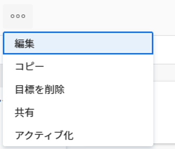

# Adobe Workfront Goals で目標をアクティブ化

目標を作成すると、Adobe Workfront Goals はそれをドラフトのステータスで保存します。下書きの目標は目標管理には含まれません。

進捗状況を更新して目標達成にどれだけ近づいているかを追跡するには、それをアクティブ化する必要があります。これにより、ステータスがアクティブに変わります。

目標の作成については、[Adobe Workfront Goals での目標の作成](../../workfront-goals/goal-management/create-goals.md)を参照してください。

>[!IMPORTANT]
>
>結果とアクティビティの進行状況を更新するには、その前に目標をアクティブ化する必要があります。

## アクセス要件

<!--drafted for P&P release: 

<table style="table-layout:auto">
 <col>
 </col>
 <col>
 </col>
 <tbody>
  <tr>
   <td role="rowheader">Adobe Workfront plan*</td>
   <td>
   
Current plan: Select or higher

   Or
   
Legacy plan: Pro or higher

   
   </td>
  </tr>
  <tr>
   <td role="rowheader">Adobe Workfront license*</td>
   <td>
   
Current license: Contributor or higher

   Or
   
Legacy license: Request or higher
 
For more information, see <a href="../../administration-and-setup/add-users/access-levels-and-object-permissions/wf-licenses.md" class="MCXref xref">Adobe Workfront licenses overview</a>.
 </td>
  </tr>
  <tr>
   <td role="rowheader">Product</td>
   <td>
   
 Current product requirement: If you have the Select or Prime Adobe Workfront plan, you must also buy an additional Adobe Workfront Goals license.  Workfront Goals are included in the Ultimate Workfront Plan.

   Or
   
Legacy product requirement: You must purchase an additional license for the Adobe Workfront Goals to access functionality described in this article. 
 
For information, see <a href="../../workfront-goals/goal-management/access-needed-for-wf-goals.md" class="MCXref xref">Requirements to use Workfront Goals</a>. 
 </td>
  </tr>
  <tr>
   <td role="rowheader">Access level*</td>
   <td> 
Edit access to Goals
 
<b>NOTE</b>
If you still don't have access, ask your Workfront administrator if they set additional restrictions in your access level. For information on how a Workfront administrator can change your access level, see:

     <ul>
      <li> 
<a href="../../administration-and-setup/add-users/configure-and-grant-access/create-modify-access-levels.md" class="MCXref xref">Create or modify custom access levels</a> 
 </li>
      <li> 
<a href="../../administration-and-setup/add-users/configure-and-grant-access/grant-access-goals.md" class="MCXref xref">Grant access to Adobe Workfront Goals</a> 
 </li>
     </ul> 
 </td>
  </tr>
  <tr data-mc-conditions="">
   <td role="rowheader">Object permissions</td>
   <td>
    

     
View or higher permissions to the goal to view it

     
Manage permissions to the goal to edit it

     
For information about sharing goals, see <a href="../../workfront-goals/workfront-goals-settings/share-a-goal.md" class="MCXref xref">Share a goal in Workfront Goals</a>. 

    
 </td>
  </tr>
 </tbody>
</table>

-->

以下が必要です。

<table style="table-layout:auto"> 
 <col> 
 <col> 
 <tbody> 
  <tr> 
   <td role="rowheader">Adobe Workfront プラン*</td> 
   <td> 
Pro 以上
 </td> 
  </tr> 
  <tr> 
   <td role="rowheader">Adobe Workfront ライセンス*</td> 
   <td> 
リクエスト以上
 
詳しくは、<a href="../../administration-and-setup/add-users/access-levels-and-object-permissions/wf-licenses.md" class="MCXref xref">Adobe Workfront ライセンスの概要</a>を参照してください。
 </td> 
  </tr> 
  <tr> 
   <td role="rowheader">製品</td> 
   <td> 
この記事で説明する機能にアクセスするには、Adobe Workfront Goals の追加ライセンスを購入する必要があります。 
 
詳しくは、<a href="../../workfront-goals/goal-management/access-needed-for-wf-goals.md" class="MCXref xref">Workfront Goals の使用要件</a>を参照してください。 
 </td> 
  </tr> 
  <tr> 
   <td role="rowheader">アクセスレベル設定*</td> 
   <td> 
Goals 以上への編集アクセス権
 
<b>メモ</b>

まだアクセス権がない場合は、Workfront 管理者に問い合わせて、アクセスレベルに追加の制限が設定されているかどうかを確認してください。Workfront 管理者がユーザーのアクセスレベルを変更する方法について詳しくは、以下を参照してください。
 
    <ul> 
     <li> 
<a href="../../administration-and-setup/add-users/configure-and-grant-access/create-modify-access-levels.md" class="MCXref xref">カスタムアクセスレベルの作成または変更</a> 
 </li> 
    <li> 
<a href="../../administration-and-setup/add-users/configure-and-grant-access/grant-access-goals.md" class="MCXref xref">Adobe Workfront Goals へのアクセス権の付与</a> 
 </li> 
     </ul> 
 </td> 
  </tr> 
  <tr data-mc-conditions=""> 
   <td role="rowheader">オブジェクト権限</td> 
   <td> 
    
 
     
目標に対する権限の管理
 
     
目標の共有について詳しくは、<a href="../../workfront-goals/workfront-goals-settings/share-a-goal.md" class="MCXref xref">Workfront Goals での目標の共有</a>を参照してください。 
 
    
 </td> 
  </tr> 
 </tbody> 
</table>

*保有するプラン、ライセンスタイプまたはアクセス権を確認するには、Workfront 管理者にお問い合わせください。

## 前提条件

開始するには、まず以下が必要です。

* メインメニューの Workfront Goals 領域を含んだレイアウトテンプレート。

目標をアクティブ化するには、その目標がアクティビティ、結果、プロジェクトなどの進行状況インジケーターに関連付けられているか、別のアクティブな目標と連携している必要があります。

目標をアクティブ化するには、次のうち 1 つ以上を実行します。

* 目標への結果の追加

  詳しくは、[Adobe Workfront Goals の目標に結果を追加](../../workfront-goals/results-and-activities/add-results-to-goals.md)を参照してください。

* 目標へのアクティビティの追加

  詳しくは、[Adobe Workfront Goals の目標へのアクティビティの追加](../../workfront-goals/results-and-activities/add-activities-to-goals.md)を参照してください。

* プロジェクトを目標に結びつける

  詳しくは、[Adobe Workfront Goals の目標にプロジェクトを追加](../results-and-activities/connect-projects-to-goals-overview.md)を参照してください。

* アクティブ化する目標に別の目標を整合させる

  詳しくは、[Adobe Workfront Goals で目標を結び付けて整合させる](../../workfront-goals/goal-alignment/align-goals-by-connecting-them.md)を参照してください。

## 目標のアクティブ化

作成した目標、または管理権限を持つ目標をアクティブ化できます。

1. アクティブ化する目標に移動します。目標ページが開きます。

1. 目標名の右側で&#x200B;**その他**&#x200B;メニュー  をクリックし、「**アクティブ化**」を選択します。

   

   目標のステータスがアクティブに変わります。目標の進捗状況をトラックできるようになり、目標はチェックインセクションに表示されるほか、Workfront 目標のグラフセクションでも考慮されるようになりました。
