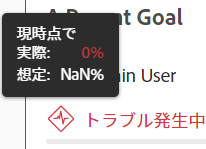
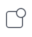
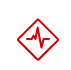

# Adobe Workfront目標の目標の達成状況と条件の概要

<!--drafted for P&P release: the note at the top will need to be replaced with this:

Your organization must have the following to use the functionality described in this article:

* For the legacy plan and license structure: 

  * A Pro or higher [Adobe Workfront plan](https://www.workfront.com/plans). 
  * An Adobe Workfront Goals license in addition to a Workfront license.

* For the current plan and license structure:

  * An Ultimate plan 
    
    Or
    
    An additional license for Adobe Workfront Goals for the Prime or Select Adobe Workfront plans. <is there a link we can add here for the plans and what they contain?!>

Contact your Workfront account manager to learn about a Workfront Goals license.

For additional information about access to Workfront Goals, see [Requirements to use Workfront Goals](../../workfront-goals/goal-management/access-needed-for-wf-goals.md).
-->

>[!NOTE]
>
>この記事で説明する機能を使用するには、以下が必要です。
>
>* プロ以上 [Adobe Workfrontプラン](https://www.workfront.com/plans).
>* Workfrontライセンスに加えて、Adobe Workfront Goals ライセンスが必要です。
>
>Workfront Goals ライセンスについて詳しくは、Workfrontのアカウントマネージャーにお問い合わせください。
>Workfront Goals へのアクセスについて詳しくは、 [Workfront目標の使用要件](../../workfront-goals/goal-management/access-needed-for-wf-goals.md).

Adobe Workfrontは、進行状況インジケーターの進捗状況に基づいて、目標の進捗を自動的に計算します。

## 前提条件

を起動する前に、次の条件を満たす必要があります。

* メインメニューの目標領域を含むレイアウトテンプレート。

## 目標の進捗状況としきい値の概要

目標をアクティブ化すると、Workfront目標は、進行状況と条件の計算を開始し、「進行状況」フィールドにカーソルを置くと、次の指標を表示します。

| 指標 | 指標の説明 |
|---|---|
| 実際の完了率 | 目標の実際の達成率。 Workfront目標は、目標に関連付けられているすべての進捗状況インジケーターの達成率を平均化して、この値を計算します。 |
| 予想完了率 | 目標が時間通りに完了するために、これまでに完了する必要がある目標の量。 Workfront目標は、目標の期間と現在の時刻を調べることで、この値を計算します。 目標は、この値が時間通りに完了する場合、現在の時刻に表示される必要があります。 |
| 進捗状況 | 目標が時間通りに完了するターゲット上にあるか、または目標が危険にさらされているか、または完了できない問題が発生しているかを示すラベル。 |



<!--drafted for the redesign: replace the screen shot above with the redesigned one which is white, not black-->

* [実際の完了率](#actual-percent-complete)
* [予想完了率](#expected-percent-complete)
* [進行状況と条件](#progress)

### 実際の完了率 {#actual-percent-complete}

Workfront目標は、目標の進捗状況インジケーターの達成率の平均に基づいて、目標の実際の達成率を自動的に計算します。

次の項目は、目標の進捗状況インジケーターと見なされます。

* 件の結果

   目標に結果を追加する方法について詳しくは、 [Adobe Workfront目標の目標に結果を追加](../../workfront-goals/results-and-activities/add-results-to-goals.md).

* アクティビティ

   目標にプロジェクトを含むアクティビティを追加する方法について詳しくは、 [Adobe Workfront目標での目標へのアクティビティの追加](../../workfront-goals/results-and-activities/add-activities-to-goals.md).

* 整列した子の目標

   親と子の目標について詳しくは、 [目標をAdobe Workfront目標に結び付けて整列させる](../../workfront-goals/goal-alignment/align-goals-by-connecting-them.md).

   Workfront目標は、次の式を使用して実際の完了率を計算します。

   ```
   Actual percent complete of goal = SUM(Percent complete of goal progress indicators)* 100 / Number of progress indicators
   ```

   例えば、目標の結果が 20%完了し、手動プログレスバーが 30%完了し、10%完了し、40%完了した子目標を持つ場合、目標達成率は 25%になります。

### 予想完了率 {#expected-percent-complete}

Workfront目標では、目標の期間の合計日数と、目標の開始日から経過した日数に基づいて、目標の予想完了率が自動的に計算されます。

Workfront目標は、次の式を使用して、予想される完了率を計算します。

```
Expected percent complete of goal = Number of days since the goal start date * 100/ Number of days in the goal duration
```

例えば、目標が 90 日で完了する予定で、今日がその期間の 45 日目の場合、「完了予測」の割合は 50%になります。

### 進行状況と条件 {#progress}

Workfront目標は、現在の時点で達成された「予想完了率」からの割合に基づいて、進行率を計算し、目標に進行状況ラベルを割り当てます。 目標達成率のバーの色は、目標の進行状況を示すように変更されます。

また、目標の条件も更新され、目標が時間通りに完了するか、遅れているかが示されます。

Workfront目標は、次の式を使用して目標の進捗状況の割合を計算します。

```
Goal progress percentage = Actual percent complete * 100 / Expected percent complete
```

例えば、「達成率の予測」が現在の時刻の 53%で、「達成率」が 30%の場合、「達成率の目標」の達成率は 56%になります。 Workfront目標は、この目標に「問題あり」という条件を付けます。

次のグラフは、条件ラベルと進行状況の割合の関係を示しています。


次の表に、各ラベルに関連付けられた目標条件ラベルと目標進捗状況の割合を示します。

>[!TIP]
>
>目標条件ラベルは、Workfrontプロジェクトの条件名と色に一致します。

<table style="table-layout:auto"> 
 <col> 
 <col> 
 <col> 
 <col> 
 <tbody> 
  <tr> 
   <td><b>目標の進行状況名</b></td> 
   <td><b>目標進捗状況の定義</b></td> 
   <td><b>目標進捗率</b></td> 
   <td><b>完全なバーの割合の色</b></td> 
   <td><b>条件インジケーターアイコン</b></td> 
  </tr> 
  <tr> 
   <td>新規</td> 
   <td> <p>目標は新しく作成され、まだ進行状況を記録していません。 目標の進行状況は、誰かが初めて進行状況を更新するまで、「新規」として表示されます。 </p> <p>目標の進行状況の更新について詳しくは、 <a href="../../workfront-goals/goal-review-and-workfront-goals-sections/check-in-goals.md" class="MCXref xref">Adobe Workfront目標での目標の進捗状況の更新</a>.</p> </td> 
   <td>割合なし</td> 
   <td>棒なし</td> 
   <td></td>
  </tr> 
  <tr> 
   <td> <p><span>目標どおり</span> </p> </td> 
   <td>目標は予想どおりに実行され、時間通りに完了する可能性が高くなります。 </td> 
   <td>90-100%</td> 
   <td>緑</td> 
    <td></td>
  </tr> 
  <tr> 
   <td> <p><span>リスクあり</span> </p> </td> 
   <td>目標は遅れていますが、時間通りに完了できる可能性があります。 </td> 
   <td>70-89.99%</td> 
   <td>黄</td>
   <td></td> 
  </tr> 
  <tr> 
   <td> <p><span>トラブル発生中</span> </p> </td> 
   <td> <p>目標が時間通りに完了しない可能性が非常に高い。 </p> </td> 
   <td>0-69.99%</td> 
   <td>赤</td> 
   <td></td> 
  </tr> 
 </tbody> 
</table>