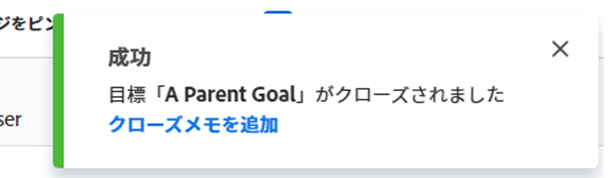

# Adobe Workfront Goals での目標のクローズと再オープン

以下を示す必要がある場合は、目標をクローズすることができます。

* 目標が、達成されたか期間が経過したので完了している。
* もう作業を行っておらず、近い将来に作業を行う予定もない。

関わりを持つようになったときに、クローズした目標を再度開くことができます。

## アクセス要件

<!--drafted for P&P release: 

<table style="table-layout:auto">
 <col>
 </col>
 <col>
 </col>
 <tbody>
  <tr>
   <td role="rowheader">Adobe Workfront plan*</td>
   <td>
   
Current plan: Select or higher

   Or
   
Legacy plan: Pro or higher

   
   </td>
  </tr>
  <tr>
   <td role="rowheader">Adobe Workfront license*</td>
   <td>
   
Current license: Contributor or higher

   Or
   
Legacy license: Request or higher
 
For more information, see <a href="../../administration-and-setup/add-users/access-levels-and-object-permissions/wf-licenses.md" class="MCXref xref">Adobe Workfront licenses overview</a>.
 </td>
  </tr>
  <tr>
   <td role="rowheader">Product</td>
   <td>
   
 Current product requirement: If you have the Select or Prime Adobe Workfront plan, you must also buy an additional Adobe Workfront Goals license.  Workfront Goals are included in the Ultimate Workfront Plan.

   Or
   
Legacy product requirement: You must purchase an additional license for the Adobe Workfront Goals to access functionality described in this article. 
 
For information, see <a href="../../workfront-goals/goal-management/access-needed-for-wf-goals.md" class="MCXref xref">Requirements to use Workfront Goals</a>. 
 </td>
  </tr>
  <tr>
   <td role="rowheader">Access level*</td>
   <td> 
Edit access to Goals
 
<b>NOTE</b>
If you still don't have access, ask your Workfront administrator if they set additional restrictions in your access level. For information on how a Workfront administrator can change your access level, see:

     <ul>
      <li> 
<a href="../../administration-and-setup/add-users/configure-and-grant-access/create-modify-access-levels.md" class="MCXref xref">Create or modify custom access levels</a> 
 </li>
      <li> 
<a href="../../administration-and-setup/add-users/configure-and-grant-access/grant-access-goals.md" class="MCXref xref">Grant access to Adobe Workfront Goals</a> 
 </li>
     </ul> 
 </td>
  </tr>
  <tr data-mc-conditions="">
   <td role="rowheader">Object permissions</td>
   <td>
    

     
View or higher permissions to the goal to view it

     
Manage permissions to the goal to edit it

     
For information about sharing goals, see <a href="../../workfront-goals/workfront-goals-settings/share-a-goal.md" class="MCXref xref">Share a goal in Workfront Goals</a>. 

    
 </td>
  </tr>
 </tbody>
</table>

-->

以下が必要です。

<table style="table-layout:auto"> 
 <col> 
 <col> 
 <tbody> 
  <tr> 
   <td role="rowheader">Adobe Workfront プラン*</td> 
   <td> 
Pro 以上
 </td> 
  </tr> 
  <tr> 
   <td role="rowheader">Adobe Workfront ライセンス*</td> 
   <td> 
リクエスト以上
 
詳しくは、<a href="../../administration-and-setup/add-users/access-levels-and-object-permissions/wf-licenses.md" class="MCXref xref">Adobe Workfront ライセンスの概要</a>を参照してください。
 </td> 
  </tr> 
  <tr> 
   <td role="rowheader">製品</td> 
   <td> 
この記事で説明する機能にアクセスするには、Adobe Workfront Goals の追加ライセンスを購入する必要があります。 
 
詳しくは、<a href="../../workfront-goals/goal-management/access-needed-for-wf-goals.md" class="MCXref xref">Workfront Goals の使用要件</a>を参照してください。 
 </td> 
  </tr> 
  <tr> 
   <td role="rowheader">アクセスレベル設定*</td> 
   <td> 
Goals 以上への編集アクセス権
 
<b>メモ</b>
まだアクセス権がない場合は、Workfront 管理者に問い合わせて、アクセスレベルに追加の制限が設定されているかどうかを確認してください。Workfront 管理者がユーザーのアクセスレベルを変更する方法について詳しくは、以下を参照してください。
 
     <ul> 
      <li> 
<a href="../../administration-and-setup/add-users/configure-and-grant-access/create-modify-access-levels.md" class="MCXref xref">カスタムアクセスレベルの作成または変更</a> 
 </li> 
      <li> 
<a href="../../administration-and-setup/add-users/configure-and-grant-access/grant-access-goals.md" class="MCXref xref">Adobe Workfront Goals へのアクセス権の付与</a> 
 </li> 
     </ul> 
 </td> 
  </tr> 
  <tr data-mc-conditions=""> 
   <td role="rowheader">オブジェクト権限</td> 
   <td> 
    
 
     
目標に対する権限の管理
 
     
目標の共有について詳しくは、<a href="../../workfront-goals/workfront-goals-settings/share-a-goal.md" class="MCXref xref">Workfront Goals での目標の共有</a>を参照してください。 
 
    
 </td> 
  </tr> 
 </tbody> 
</table>

&#42;保有するプラン、ライセンスタイプ、アクセス権を確認するには、Workfront 管理者にお問い合わせください。

## 前提条件

開始するには、まず以下が必要です。

* メインメニューの Workfront Goals 領域を含んだレイアウトテンプレート。

## 目標をクローズまたは再度開く際の考慮事項

* 目標をクローズして再度開くには、目標の編集アクセス権がアクセスレベルで必要です。目標へのアクセス権の付与については、[Adobe Workfront Goals へのアクセス権の付与](../../administration-and-setup/add-users/configure-and-grant-access/grant-access-goals.md)を参照してください。
* アクティブな目標のみをクローズすることができます。ドラフトステータスの目標をクローズすることはできません。

  目標ステータスについては、[Adobe Workfront Goals の目標ステータスの概要](../../workfront-goals/goal-management/goal-status-overview.md)を参照してください。

* 目標をクローズすると、その進捗がロックされ、目標の達成度を評価できます。

  >[!CAUTION]
  >
  >貢献するアクティブな目標を持つ目標をクローズすると、クローズした後に進捗状況が変化して、貢献するアクティブな目標の進捗状況が示されます。目標の整合については、[Adobe Workfront Goals での目標の接続による目標の整合](../../workfront-goals/goal-alignment/align-goals-by-connecting-them.md)を参照してください。

* 目標をクローズする前に目標の進捗状況インジケーターを更新して、必ず正確な進捗状況で目標をクローズするようにします。すべての進捗状況インジケーターを達成した場合、目標の完了率は 100％になり、目標は達成されました。目標の更新については、[Adobe Workfront Goals での目標の進捗状況の更新](../../workfront-goals/goal-review-and-workfront-goals-sections/check-in-goals.md)を参照してください。
* 最後のコメントがあれば、クローズする目標の更新として残します。目標へのコメントの追加については、[Adobe Workfront Goals での目標コメントの管理](../../workfront-goals/goal-management/manage-goal-comments.md)を参照してください。
* クローズした目標に関する結果やアクティビティの進捗状況は更新できなくなります。
* クローズした目標に引き続き取り組む場合は、その目標を再度開くことができます。
* 目標を達成していない場合は、情報のほとんどを次の期間（四半期または年）にコピーすることを検討してください。これは、ある期間から次の期間にかけて目標が同じ場合や、目標を達成するための作業が次の期間でもまだ必要な場合に有効な選択肢です。目標のコピーについては、[Adobe Workfront Goals での目標のコピー](../../workfront-goals/goal-management/copy-goals.md)を参照してください。別の期間にコピーする代わりに、目標の期間を更新することもできます。
* 閉じた目標を再度開くと、その目標のコメントは削除されます。コメントを保持する必要がある場合は、閉じた目標を再び開くのではなく、その目標に関連付けられた結果も含めてコピーすることをお勧めします。

## 目標を閉じる

<!--
Closing goals differs depending on what environment you use. 

### Close goals in the Production environment

1. Click the **Main Menu** icon  > **Goals** in the upper-right corner.

   (!-- Add this when Shell is available to all: or (if available), click the **Main Menu** icon  in the upper-left corner)
   --)

   The Goal List opens. 

1. (Optional) Modify your filters to display only goals that are active.

   For information about filtering information in Workfront Goals, see [Filter information in Adobe Workfront Goals](../../workfront-goals/goal-management/filter-information-wf-goals.md). 

1. Click an active goal.

   The Goal Details panel displays on the right. 

1. (Optional and recommended) Click the **Updates** tab and add an update in the **Comment here** field about the reason you are closing the goal, then click **Post**. 

1. Click the **More icon**  to the right of the goal name, then click **Close** > **Close Goal**.

   This closes the goal and saves the current progress on the goal and its results and activities.

   >[!IMPORTANT]
   >
   >If the goal has contributing goals that are still active, the progress of the goal continues to update based on the progress of the aligned goals.
   >
   >
   >   >
   >

1. (Optional) Modify your filters again to display only closed goals. The goals you closed display on the screen.
-->

1. 右上隅にある&#x200B;**メインメニュー**&#x200B;アイコン ／**目標**&#x200B;をクリックします。

   目標リストが開きます。

   <!-- Add this when Shell is available to all: or (if available), click the **Main Menu** icon  in the upper-left corner)
   -->

1. （オプション）フィルターを変更して、アクティブな目標のみを表示します。

   Workfront Goals での情報のフィルタリングについて詳しくは、[Adobe Workfront Goals での情報のフィルタリング](../goal-management/filter-information-wf-goals.md)を参照してください。
1. アクティブな目標をクリックします。

   目標ページが開きます。

   
1. 目標名の右側にある&#x200B;**その他**&#x200B;メニュー  をクリックして、「**閉じる**」を選択します。

   目標が閉じ、画面の右上隅に確認メッセージが表示されます。

   

1. （オプション）確認ボックスで、「**クローズメモを追加**」をクリックして、この目標についてと、なぜ閉じる必要があるかについてのコメントを追加します。
1. クローズメモを追加し、「**メモを追加**」をクリックします。

   

   コメントは、目標のページの「目標の詳細」セクションにあるクローズメモエリアに表示されます。

   >[!NOTE]
   >
   >クローズした目標を後で再度開くと、クローズメモが削除されます。

## 目標を再度開く

クローズした目標に再び関連性が生じ、進捗を更新し続ける必要があると判断した場合は、クローズした目標を再度開くことができます。

<!--
Reopening goals differs depending on what environment you use.

### Reopen goals in the Production environment

1. Click the **Main Menu** icon  > **Goals** in the upper-right corner.

   (!-- Add this when Shell is available to all: or (if available), click the **Main Menu** icon  in the upper-left corner)
   --)

   The Goal List opens. 

1. (Optional) Modify your filters to display only goals that are closed.

   For information about filtering information in Workfront Goals, see [Filter information in Adobe Workfront Goals](../../workfront-goals/goal-management/filter-information-wf-goals.md).

1. Click a closed goal.

   This opens the Goal Details panel on the right. 

1. Click the **More icon**  to the right of the goal name, then click **Reopen** > **Reopen**.

   This reopens the goal and places it in a status of Active. The progress of the goal is recalculated starting with the current date. 

1. (Optional) Modify your filters again to display only active goals. The goals you opened display on the screen.

-->

1. 右上隅にある&#x200B;**メインメニュー**&#x200B;アイコン  ／**目標**&#x200B;をクリックします。

   目標リストが開きます。

   <!-- Add this when Shell is available to all: or (if available), click the **Main Menu** icon  in the upper-left corner)
   -->

1. （オプション）クローズした目標のみを表示するようにフィルターを変更します。

   Workfront Goals での情報のフィルタリングについて詳しくは、[Adobe Workfront Goals での情報のフィルタリング](../goal-management/filter-information-wf-goals.md)を参照してください。
1. クローズした目標の名前をクリックします。

   目標ページが開きます。
1. 目標名の右側にある&#x200B;**その他**&#x200B;メニュー  をクリックして、**再開**／**再開**&#x200B;をクリックします。

   次のことが発生します。
   * 目標が開き、ステータスが「アクティブ」になります。
   * 目標の進捗が現在の日付から再計算されます。
   * すべてのクローズメモが目標の詳細ページから削除されます。削除されたクローズメモは復元できません。

1. （オプション）アクティブな目標のみを表示するようにフィルターを再度変更します。

   開いた目標が画面に表示されます。

