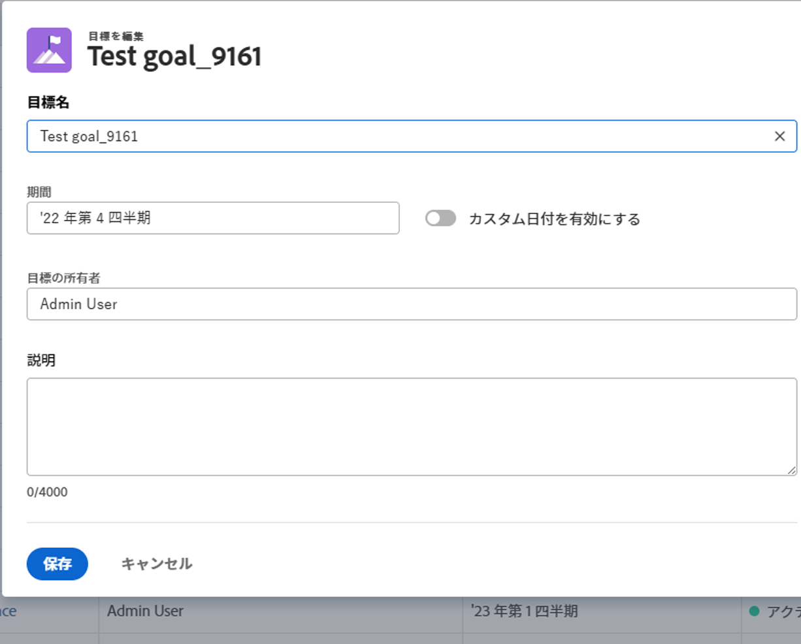

# Adobe Workfront目標のコピー

目標をコピーしてAdobe Workfront目標を作成できます。 元の目標情報の一部は新しい目標に転送されます。

## アクセス要件

<!--drafted for P&P release: 

You must have the following:

<table style="table-layout:auto">
 <col>
 </col>
 <col>
 </col>
 <tbody>
  <tr>
   <td role="rowheader">Adobe Workfront plan*</td>
   <td>
   
Current plan: Select or higher

   Or
   
Legacy plan: Pro or higher

   
   </td>
  </tr>
  <tr>
   <td role="rowheader">Adobe Workfront license*</td>
   <td>
   
Current license: Contributor or higher

   Or
   
Legacy license: Request or higher
 
For more information, see <a href="../../administration-and-setup/add-users/access-levels-and-object-permissions/wf-licenses.md" class="MCXref xref">Adobe Workfront licenses overview</a>.
 </td>
  </tr>
  <tr>
   <td role="rowheader">Product</td>
   <td>
   
 Current product requirement: If you have the Select or Prime Adobe Workfront plan, you must also buy an additional Adobe Workfront Goals license.  Workfront Goals are included in the Ultimate Workfront Plan.

   Or
   
Legacy product requirement: You must purchase an additional license for the Adobe Workfront Goals to access functionality described in this article. 
 
For information, see <a href="../../workfront-goals/goal-management/access-needed-for-wf-goals.md" class="MCXref xref">Requirements to use Workfront Goals</a>. 
 </td>
  </tr>
  <tr>
   <td role="rowheader">Access level*</td>
   <td> 
Edit access to Goals
 
<b>NOTE</b>
If you still don't have access, ask your Workfront administrator if they set additional restrictions in your access level. For information on how a Workfront administrator can change your access level, see:

     <ul>
      <li> 
<a href="../../administration-and-setup/add-users/configure-and-grant-access/create-modify-access-levels.md" class="MCXref xref">Create or modify custom access levels</a> 
 </li>
      <li> 
<a href="../../administration-and-setup/add-users/configure-and-grant-access/grant-access-goals.md" class="MCXref xref">Grant access to Adobe Workfront Goals</a> 
 </li>
     </ul> 
 </td>
  </tr>
  <tr data-mc-conditions="">
   <td role="rowheader">Object permissions</td>
   <td>
    

     
View or higher permissions to the goal to view it

     
Manage permissions to the goal to edit it

     
For information about sharing goals, see <a href="../../workfront-goals/workfront-goals-settings/share-a-goal.md" class="MCXref xref">Share a goal in Workfront Goals</a>. 

    
 </td>
  </tr>
 </tbody>
</table>

-->

以下が必要です。

<table style="table-layout:auto"> 
 <col> 
 <col> 
 <tbody> 
  <tr> 
   <td role="rowheader">Adobe Workfront plan*</td> 
   <td> 
Pro 以上
 </td> 
  </tr> 
  <tr> 
   <td role="rowheader">Adobe Workfront license*</td> 
   <td> 
リクエスト以上
 
詳しくは、 <a href="../../administration-and-setup/add-users/access-levels-and-object-permissions/wf-licenses.md" class="MCXref xref">Adobe Workfrontライセンスの概要</a>.
 </td> 
  </tr> 
  <tr> 
   <td role="rowheader">製品</td> 
   <td> 
この記事で説明する機能にアクセスするには、 Adobe Workfront Goals の追加ライセンスを購入する必要があります。 
 
詳しくは、 <a href="../../workfront-goals/goal-management/access-needed-for-wf-goals.md" class="MCXref xref">Workfront目標の使用要件</a>. 
 </td> 
  </tr> 
  <tr> 
   <td role="rowheader">アクセスレベル設定*</td> 
   <td> 
目標以降へのアクセスを編集
 
<b>メモ</b>

まだアクセス権がない場合は、Workfront管理者に、アクセスレベルに追加の制限を設定しているかどうかを問い合わせてください。 Workfront管理者がアクセスレベルを変更する方法について詳しくは、以下を参照してください。
 
     <ul> 
      <li> 
<a href="../../administration-and-setup/add-users/configure-and-grant-access/create-modify-access-levels.md" class="MCXref xref">カスタムアクセスレベルの作成または変更</a> 
 </li> 
      <li> 
<a href="../../administration-and-setup/add-users/configure-and-grant-access/grant-access-goals.md" class="MCXref xref">Adobe Workfront目標へのアクセス権の付与</a> 
 </li> 
     </ul> 
 </td> 
  </tr> 
  <tr data-mc-conditions=""> 
   <td role="rowheader">オブジェクト権限</td> 
   <td> 
    
 
     
目標に対する権限の管理
 
     
目標の共有について詳しくは、 <a href="../../workfront-goals/workfront-goals-settings/share-a-goal.md" class="MCXref xref">Workfront目標での目標の共有</a>. 
 
    
 </td> 
  </tr> 
 </tbody> 
</table>

*保有するプラン、ライセンスの種類、アクセス権を確認するには、Workfront管理者にお問い合わせください。

## 前提条件

を起動する前に、次の条件を満たす必要があります。

* メインメニューの目標領域を含むレイアウトテンプレート。

## 目標のコピーに関する考慮事項

目標をコピーする前に、アクセスレベルで目標を編集する権限が必要です。 目標へのアクセス権の付与について詳しくは、 [Adobe Workfront目標へのアクセス権の付与](../../administration-and-setup/add-users/configure-and-grant-access/grant-access-goals.md).

既存の目標をコピーする理由の一部を次に示します。

* ある期間（四半期または年）の終わりに、次の期間と同じ目標を再作成する場合。
* 目標を完了できず、別の期間でその目標に取り組む場合は、指定した期間の終わり。
* 複数のチームメンバーが同じ目標を持ち、それぞれに対して 1 つを作成する必要が生じる場合があります。

>[!TIP]
>
>目標は任意のステータスでコピーできます。 目標ステータスについて詳しくは、 [Adobe Workfront目標の目標ステータスの概要](../../workfront-goals/goal-management/goal-status-overview.md).

目標をコピーする際は、次の点を考慮してください。

* 目標に関する情報もすべて新しい目標にコピーされます。
* 既存の目標の結果をコピーするように選択できます。 結果の名前は新しい目標に転送されますが、既存の目標に関する結果の現在の進行状況は新しい目標にコピーされません。 コピーした結果は、デフォルトで同じ所有者に割り当てられます。

   >[!NOTE]
   >
   >元の所有者がWorkfrontから削除または非アクティブ化された場合、新しい結果がログインユーザーに割り当てられます。

* 目標をコピーする際に、目標のアクティビティをコピーすることはできません。

## 目標をコピー

<!--
Copying goals differs depending on what environment you use. 

To copy goals in the Production environment:

1. Go to a goal and click it to open the Goal Details panel.

   For information about accessing an individual goal, see the "Access individual goals" section in [Access and open goals in Adobe Workfront Goals](../../workfront-goals/goal-management/access-goals-in-wf-goals.md).

   This opens the Goal Details panel.

1. Click the **More icon** , then click **Copy**. 

1. Update any of the following information for the copied goal:

   | Field |Description  |
   |---|---|
   | New Goal |The name of the new goal. The default is the name of the original goal.  |
   | Period |The time period during which you want to achieve the goal. Select a time period from the drop-down menu or click **Define custom dates** to indicate a custom time period. By default, the Period is always the current quarter. |
   | Owner |The owner of the goal. It can be a user, team, group, or a company. The default is the owner of the original goal.  |
   | Description |Additional information about the goal.  |

1. (Conditional) Select **Copy results** if the original goal had results added to it and you want to copy them to the new goal. This duplicates the original results to the new goal. The results of the copied goal have the same owner, names and measured values as the results of the original goal.

   >[!TIP]
   >
   >* The progress of the original result does not transfer to the copied goal. 
   >* If the original owner was deleted or deactivated from Workfront, the new result is assigned to the logged in user.

1. Click **Save**.

   The copied goal is saved with a status of Draft and displays in the Goal Details panel.

   >[!IMPORTANT]
   >
   >If you have not copied the results from the original goal, you must first associate the new goal with a progress indicator before you can activate it and start working towards achieving it. 
   >
   >Do at least one of the following to be able to activate a goal: 
   >   
   >* Add a Result
   >   
   >  For information about adding results, see [Add results to goals in Adobe Workfront Goals](../../workfront-goals/results-and-activities/add-results-to-goals.md).
   >   
   >* Add an Activity
   >   
   >  For information about adding activities, see [Add activities to goals in Adobe Workfront Goals](../../workfront-goals/results-and-activities/add-activities-to-goals.md). 
   >   
   >* Align another goal to it
   >   
   >  For information about aligning goals, see [Align goals by connecting them in Adobe Workfront Goals](../../workfront-goals/goal-alignment/align-goals-by-connecting-them.md).
   >
   > For information about activating a goal, see [Activate goals in Adobe Workfront Goals](../goal-management/activate-goals.md). 

1. Click the **X** icon in the upper-right of the Goal Details panel to close it.

   The copied goal displays in the following sections:

   * Goal List 
   * Check-in (after it is activated)
   * Goal Alignment section (after it is activated) 
   * Pulse
(!--drafted - this was important when we could not update the goal timeframe in the past but we can do that now - not needed
1. (Optional and conditional) If you have copied a goal that was not achieved in a previous time period to continue working on it in the following time period, do the following:

   1. Go to the original goal in the Goal List, Check-in page, or Pulse section and comment on the goal, to indicate that this goal was copied to another, more current goal. For information about commenting on a goal, see [Manage goal comments in Adobe Workfront Goals](../../workfront-goals/goal-management/manage-goal-comments.md).
   1. Close the original goal, to preserve the progress in its original time period. For information about closing goals, see [Close and reopen goals in Adobe Workfront Goals](../../workfront-goals/goal-management/close-and-reopen-goals.md). 
   1. Update the the **Initial** value of the new Result to match the **End At** value of the previous result, so that your new goal progress will start calculating from the point you achieved in the previous period.
   
-->

1. 目標に移動し、 **詳細** メニュー を選択し、「 **目標をコピー**.

   

1. コピーした目標に関する次の情報を更新します。
   * **目標名**:新しい目標の名前。 コピーされたゴールのデフォルト名は、「コピー」です。 &lt;original goal=&quot;&quot;>&quot;.
   * **期間**:目標を達成する期間。 ドロップダウンメニューから期間を選択します。

      または

      選択 **カスタム日付を有効にする** 目標のカスタム日付を指定するには **開始** および **終了日**. 「カスタム日付を有効にする」設定は、デフォルトでは無効になっています。

      >[!TIP]
      >
      >   「カスタム日付を有効にする」をオフにすると、元の目標の期間に戻ります。

      * **目標所有者**:目標の所有者。 ユーザー、チーム、グループまたは会社を指定できます。 デフォルトは、元の目標の所有者です。
      * **説明**:目標に関する追加情報。
      * **結果をコピー**:現在の目標の結果をコピーした目標に転送する場合は、このオプションを選択します。 これにより、元の結果が複製され、コピーしたゴールに添付されます。 コピーしたゴールの結果には、元のゴールの結果と同じ所有者、名前、測定値が含まれます。

         >[!NOTE]
         >
         >* 元の結果の進行状況は、コピーされた目標には転送されません。
         >* 元の所有者がWorkfrontから削除または非アクティブ化された場合、新しい結果がログインユーザーに割り当てられます。

1. クリック **目標をコピー**.

   元の目標と同様の目標が作成され、ステータスは「ドラフト」になります。

   >[!NOTE]
   >
   >元の目標から結果をコピーしていない場合は、まず新しい目標を進捗状況インジケーターに関連付けてから、目標をアクティブ化して達成に向けて作業を開始する必要があります。
   >目標と進捗インジケーターの関連付けについて詳しくは、次の記事を参照してください。
   >* [Adobe Workfront目標の目標に結果を追加](../results-and-activities/add-results-to-goals.md)
   >* [Adobe Workfront目標での目標へのアクティビティの追加](../results-and-activities/add-activities-to-goals.md)
   >* [目標をAdobe Workfront目標に結び付けて整列させる](../goal-alignment/align-goals-by-connecting-them.md)

   >
   >目標のアクティブ化について詳しくは、 [目標を有効化](../goal-management/activate-goals.md).

