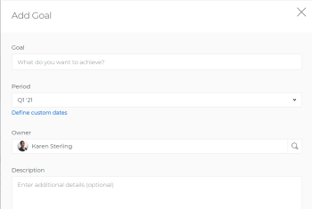

# Adobe Workfront目標での目標の作成

CEO、マネージャー、個人のどちらの投稿者でも、Adobe Workfront目標で目標を作成して、目標と組織の戦略を示す目標に合わせることができます。

## アクセス要件

<!--drafted for P&P release: 

You must have the following:

<table style="table-layout:auto">
 <col>
 </col>
 <col>
 </col>
 <tbody>
  <tr>
   <td role="rowheader">Adobe Workfront plan*</td>
   <td>
   
Current plan: Select or higher

   Or
   
Legacy plan: Pro or higher

   
   </td>
  </tr>
  <tr>
   <td role="rowheader">Adobe Workfront license*</td>
   <td>
   
Current license: Contributor or higher

   Or
   
Legacy license: Request or higher
 
For more information, see <a href="../../administration-and-setup/add-users/access-levels-and-object-permissions/wf-licenses.md" class="MCXref xref">Adobe Workfront licenses overview</a>.
 </td>
  </tr>
  <tr>
   <td role="rowheader">Product</td>
   <td>
   
 Current product requirement: If you have the Select or Prime Adobe Workfront plan, you must also buy an additional Adobe Workfront Goals license.  Workfront Goals are included in the Ultimate Workfront Plan.

   Or
   
Legacy product requirement: You must purchase an additional license for the Adobe Workfront Goals to access functionality described in this article. 
 
For information, see <a href="../../workfront-goals/goal-management/access-needed-for-wf-goals.md" class="MCXref xref">Requirements to use Workfront Goals</a>. 
 </td>
  </tr>
  <tr>
   <td role="rowheader">Access level*</td>
   <td> 
Edit access to Goals
 
<b>NOTE</b>
If you still don't have access, ask your Workfront administrator if they set additional restrictions in your access level. For information on how a Workfront administrator can change your access level, see:

     <ul>
      <li> 
<a href="../../administration-and-setup/add-users/configure-and-grant-access/create-modify-access-levels.md" class="MCXref xref">Create or modify custom access levels</a> 
 </li>
      <li> 
<a href="../../administration-and-setup/add-users/configure-and-grant-access/grant-access-goals.md" class="MCXref xref">Grant access to Adobe Workfront Goals</a> 
 </li>
     </ul> 
 </td>
  </tr>
  <tr data-mc-conditions="">
   <td role="rowheader">Object permissions</td>
   <td>
    

     
View or higher permissions to the goal to view it

     
Manage permissions to the goal to edit it

     
For information about sharing goals, see <a href="../../workfront-goals/workfront-goals-settings/share-a-goal.md" class="MCXref xref">Share a goal in Workfront Goals</a>. 

    
 </td>
  </tr>
 </tbody>
</table>

-->

以下が必要です。

<table style="table-layout:auto"> 
 <col> 
 <col> 
 <tbody> 
  <tr> 
   <td role="rowheader">Adobe Workfront plan*</td> 
   <td> 
Pro 以上
 </td> 
  </tr> 
  <tr> 
   <td role="rowheader">Adobe Workfront license*</td> 
   <td> 
リクエスト以上
 
詳しくは、 <a href="../../administration-and-setup/add-users/access-levels-and-object-permissions/wf-licenses.md" class="MCXref xref">Adobe Workfrontライセンスの概要</a>.
 </td> 
  </tr> 
  <tr> 
   <td role="rowheader">製品</td> 
   <td> 
この記事で説明する機能にアクセスするには、 Adobe Workfront Goals の追加ライセンスを購入する必要があります。 
 
詳しくは、 <a href="../../workfront-goals/goal-management/access-needed-for-wf-goals.md" class="MCXref xref">Workfront目標の使用要件</a>. 
 </td> 
  </tr> 
  <tr> 
   <td role="rowheader">アクセスレベル設定*</td> 
   <td> 
目標以降へのアクセスを編集
 
<b>メモ</b>
まだアクセス権がない場合は、Workfront管理者に、アクセスレベルに追加の制限を設定しているかどうかを問い合わせてください。 Workfront管理者がアクセスレベルを変更する方法について詳しくは、以下を参照してください。
 
     <ul> 
      <li> 
<a href="../../administration-and-setup/add-users/configure-and-grant-access/create-modify-access-levels.md" class="MCXref xref">カスタムアクセスレベルの作成または変更</a> 
 </li> 
      <li> 
<a href="../../administration-and-setup/add-users/configure-and-grant-access/grant-access-goals.md" class="MCXref xref">Adobe Workfront目標へのアクセス権の付与</a> 
 </li> 
     </ul> 
 </td> 
  </tr> 
  <tr data-mc-conditions=""> 
   <td role="rowheader">オブジェクト権限</td> 
   <td> 
    
 
     
目標に対する権限の管理
 
     
目標の共有について詳しくは、 <a href="../../workfront-goals/workfront-goals-settings/share-a-goal.md" class="MCXref xref">Workfront目標での目標の共有</a>. 
 
    
 </td> 
  </tr> 
 </tbody> 
</table>

*保有するプラン、ライセンスの種類、アクセス権を確認するには、Workfront管理者にお問い合わせください。

## 前提条件

を起動する前に、次の条件を満たす必要があります。

* メインメニューの目標領域を含むレイアウトテンプレート。

## 目標作成のガイドライン

Workfront Goals を開始する前に、ベストプラクティスに関する推奨事項と、目標を効果的に管理するためのガイドラインをお読みになることをお勧めします。 目標の作成と管理に関するガイドラインについて詳しくは、 [Adobe Workfront目標の概要](../../workfront-goals/goal-management/wf-goals-overview.md).

## 目標の作成

この記事では、Workfront目標で戦略目標を作成する方法について説明します。 ビジネスケースの目標の作成について詳しくは、 [ビジネスケース目標の作成](../../manage-work/projects/define-a-business-case/create-business-case-goals.md).

次のいずれかの方法で戦略目標を作成できます。

* [ゼロから目標を作成](#create-a-goal-from-scratch)
* [既存の目標のコピー](#copy-an-existing-goal)
* [結果またはアクティビティを目標に変換する](#convert-a-result-or-activity-to-a-goal)

### ゼロから目標を作成 {#create-a-goal-from-scratch}

<!--
Creating goals differs depending on what environment you use.

#### Create a goal from scratch in the Production environment 

1. Click the **Main Menu** icon  in the upper right corner, then click **Goals**.

   (!-- Add this when Shell is available to all: or (if available), click the **Main Menu** icon  in the upper-left corner)
   -)

   The Goal List displays.

1. (Conditional) Click **Goal List**, **Graphs**, **Pulse**, or **Check-in** in the left pane, then click **Add Goal** in the upper-right corner of the page. The Add Goal box displays.

   

   >[!TIP]
   >
   >You can add a goal from any section in Workfront Goals. The process for creating a goal is identical regardless of the section you choose to add the goal from.

1. Start typing what you want to achieve in the **Goal** field. This is the name of the goal and a required field. 
1. Select a time period when the goal should be executed in the **Period** drop-down menu. This is a pre-filled field. The default is the current quarter.

   Select from the following predefined options:

   * The current year
   * The quarters of the current year
   * The next two years
   * The quarters of the next two years

   Or

   Click **Define custom dates** to select a custom time frame. 

1. (Conditional) Select a **Start date** and an **End date** for your goal, if you clicked **Define custom dates**.

   >[!TIP]
   >
   >* You can create a goal with dates in any time period, including up to 2 years in the past. 
   >* When defining custom dates, they are constrained by the initial date you selected. So if you select quarter and then custom dates, you can't go beyond that quarter.

1. (Optional) Click **Reset custom dates** to return to the predefined options.

   >[!TIP]
   >
   >We recommend that everyone in your organization selects the same timeframes for similar goals or goals that are aligned. This provides better alignment between goals and ensures that everyone's work supports your over-arching strategy.

1. (Optional) Click your name in the **Owner** field, if you want to indicate someone else as the owner of the goal. By default, you are the owner of goals you create. 
1. Start typing the name of a user, team, group, or the name of your organization in the **Owner** field, then select it when it displays in the list. You can have only one owner for a goal. 
1. (Optional) Enter a **Description** for the goal. This field is optional. 
1. Click **Save**.

   The status of the new goal is Draft.

   >[!IMPORTANT]
   >
   >You must associate a goal with a progress indicator to activate it and start working on it. 
   >
   >Do at least one of the following to be able to activate a goal: 
   >
   >* Add a Result
   >
   >  For information about adding results, see [Add results to goals in Adobe Workfront Goals](../../workfront-goals/results-and-activities/add-results-to-goals.md).
   >   
   >* Add an Activity
   >   
   >  For information about adding activities, see [Add activities to goals in Adobe Workfront Goals](../../workfront-goals/results-and-activities/add-activities-to-goals.md). 
   >   
   >* Align another goal to it
   >   
   >  For information about aligning goals, see [Align goals by connecting them in Adobe Workfront Goals](../../workfront-goals/goal-alignment/align-goals-by-connecting-them.md).

1. Click the **X** icon in the upper-right of the Goal Details panel to close it.

-->

1. 次をクリック： **メインメニュー** アイコン  右上隅で、「 **目標**.

   <!-- Add this when Shell is available to all: or (if available), click the **Main Menu** icon  in the upper-left corner)
   -->

   目標リストが表示されます。
1. クリック **新しい目標**.

   [ 新しい目標 ] ボックスが表示されます。

   

1. 次のフィールドに情報を入力します。
   * **目標名**:目標の名前を入力します。 必須フィールドです。
   * **期間**:次の日から事前に定義された四半期または年を選択 **期間** ドロップダウンフィールド

      または

      を選択します。 **カスタム日付を有効にする** オプションを選択し、 **開始** および **終了日** を設定します。

      前年、現在および後年の各四半期は、「期間」ドロップダウン・フィールドに事前定義済みのオプションとしてリストされます。

      目標の期間は、目標が完了すると予想される期間を示します。

   * **目標所有者**:ユーザー、チーム、グループまたは組織の名前を入力し、目標の所有者を示します。 デフォルトでは、目標の所有者として選択されています。
   * **説明**:目標に関する追加情報を入力します。
1. クリック **目標を作成**.

   新しい目標は目標リストに表示され、ステータスは **ドラフト**.

   目標をアクティブ化し、作業を開始するには、目標を進行状況インジケーターに関連付ける必要があります。

   アクティブ化する目標を準備するには、次の少なくとも 1 つを実行します。
   * 結果を追加

      結果の追加について詳しくは、 [Adobe Workfront目標の目標に結果を追加](../results-and-activities/add-results-to-goals.md).
   * アクティビティを追加

      アクティビティの追加について詳しくは、 [Adobe Workfront目標での目標へのアクティビティの追加](../results-and-activities/add-activities-to-goals.md).
   * 別の目標をそれに合わせる

      目標の調整について詳しくは、 [目標をAdobe Workfront目標に結び付けて整列させる](../goal-alignment/align-goals-by-connecting-them.md).

### 既存の目標のコピー {#copy-an-existing-goal}

既存の目標をコピーして、目標を作成できます。

目標のコピーについて詳しくは、 [Adobe Workfront目標のコピー](../../workfront-goals/goal-management/copy-goals.md).

### 結果またはアクティビティを目標に変換する {#convert-a-result-or-activity-to-a-goal}

既存の目標の結果やアクティビティを目標に変換することで、目標を作成できます。 新しい目標は、元の目標に合わせて調整されます。

結果およびアクティビティを目標に変換する方法について詳しくは、 [結果とアクティビティを目標に変換して目標を揃える](../../workfront-goals/goal-alignment/align-goals-by-converting-results-activities.md).

