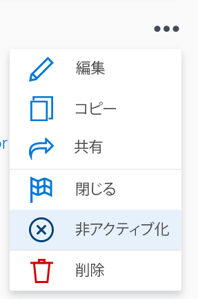
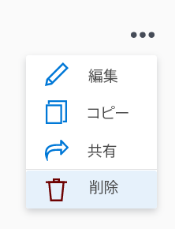

# Adobe Workfront目標の目標の削除と無効化

目標の作業を開始し、組織内で無関係になった場合は、目標を削除する代わりに、非アクティブ化することをお勧めします。 目標を非アクティブ化すると、履歴情報が保持され、後で再アクティブ化することができます。 ただし、目標を削除する場合、目標リストを正確に保つために、目標を削除すると意味がないことがあります。

## アクセス要件

<!--drafted for P&P release: 

You must have the following:

<table style="table-layout:auto">
 <col>
 </col>
 <col>
 </col>
 <tbody>
  <tr>
   <td role="rowheader">Adobe Workfront plan*</td>
   <td>
   
Current plan: Select or higher

   Or
   
Legacy plan: Pro or higher

   
   </td>
  </tr>
  <tr>
   <td role="rowheader">Adobe Workfront license*</td>
   <td>
   
Current license: Contributor or higher

   Or
   
Legacy license: Request or higher
 
For more information, see <a href="../../administration-and-setup/add-users/access-levels-and-object-permissions/wf-licenses.md" class="MCXref xref">Adobe Workfront licenses overview</a>.
 </td>
  </tr>
  <tr>
   <td role="rowheader">Product</td>
   <td>
   
 Current product requirement: If you have the Select or Prime Adobe Workfront plan, you must also buy an additional Adobe Workfront Goals license.  Workfront Goals are included in the Ultimate Workfront Plan.

   Or
   
Legacy product requirement: You must purchase an additional license for the Adobe Workfront Goals to access functionality described in this article. 
 
For information, see <a href="../../workfront-goals/goal-management/access-needed-for-wf-goals.md" class="MCXref xref">Requirements to use Workfront Goals</a>. 
 </td>
  </tr>
  <tr>
   <td role="rowheader">Access level*</td>
   <td> 
Edit access to Goals
 
<b>NOTE</b>
If you still don't have access, ask your Workfront administrator if they set additional restrictions in your access level. For information on how a Workfront administrator can change your access level, see:

     <ul>
      <li> 
<a href="../../administration-and-setup/add-users/configure-and-grant-access/create-modify-access-levels.md" class="MCXref xref">Create or modify custom access levels</a> 
 </li>
      <li> 
<a href="../../administration-and-setup/add-users/configure-and-grant-access/grant-access-goals.md" class="MCXref xref">Grant access to Adobe Workfront Goals</a> 
 </li>
     </ul> 
 </td>
  </tr>
  <tr data-mc-conditions="">
   <td role="rowheader">Object permissions</td>
   <td>
    

     
View or higher permissions to the goal to view it

     
Manage permissions to the goal to edit it

     
For information about sharing goals, see <a href="../../workfront-goals/workfront-goals-settings/share-a-goal.md" class="MCXref xref">Share a goal in Workfront Goals</a>. 

    
 </td>
  </tr>
 </tbody>
</table>

-->

以下が必要です。

<table style="table-layout:auto"> 
 <col> 
 <col> 
 <tbody> 
  <tr> 
   <td role="rowheader">Adobe Workfront plan*</td> 
   <td> 
Pro 以上
 </td> 
  </tr> 
  <tr> 
   <td role="rowheader">Adobe Workfront license*</td> 
   <td> 
リクエスト以上
 
詳しくは、 <a href="../../administration-and-setup/add-users/access-levels-and-object-permissions/wf-licenses.md" class="MCXref xref">Adobe Workfrontライセンスの概要</a>.
 </td> 
  </tr> 
  <tr> 
   <td role="rowheader">製品</td> 
   <td> 
この記事で説明する機能にアクセスするには、 Adobe Workfront Goals の追加ライセンスを購入する必要があります。 
 
詳しくは、 <a href="../../workfront-goals/goal-management/access-needed-for-wf-goals.md" class="MCXref xref">Workfront目標の使用要件</a>. 
 </td> 
  </tr> 
  <tr> 
   <td role="rowheader">アクセスレベル設定*</td> 
   <td> 
目標以降へのアクセスを編集
 
<b>メモ</b>

まだアクセス権がない場合は、Workfront管理者に、アクセスレベルに追加の制限を設定しているかどうかを問い合わせてください。 Workfront管理者がアクセスレベルを変更する方法について詳しくは、以下を参照してください。
 
     <ul> 
      <li> 
<a href="../../administration-and-setup/add-users/configure-and-grant-access/create-modify-access-levels.md" class="MCXref xref">カスタムアクセスレベルの作成または変更</a> 
 </li> 
      <li> 
<a href="../../administration-and-setup/add-users/configure-and-grant-access/grant-access-goals.md" class="MCXref xref">Adobe Workfront目標へのアクセス権の付与</a> 
 </li> 
     </ul> 
 </td> 
  </tr> 
  <tr data-mc-conditions=""> 
   <td role="rowheader">オブジェクト権限</td> 
   <td> 
    
 
     
目標に対する権限の管理
 
     
目標の共有について詳しくは、 <a href="../../workfront-goals/workfront-goals-settings/share-a-goal.md" class="MCXref xref">Workfront目標での目標の共有</a>. 
 
    
 </td> 
  </tr> 
 </tbody> 
</table>

&#42;保有しているプラン、ライセンスの種類、アクセス権を確認するには、Workfront管理者に問い合わせてください。

## 前提条件

を起動する前に、次の条件を満たす必要があります。

* メインメニューの目標領域を含むレイアウトテンプレート。

## 目標を非アクティブ化

関連性がなくなった目標を非アクティブ化し、後で再アクティブ化することができます。

* [目標を非アクティブ化する際の考慮事項](#considerations-when-deactivating-goals)
* [目標を非アクティブ化](#deactivate-goals)

### 目標を非アクティブ化する際の考慮事項

目標を無効にする際は、以下の点に注意してください。

* 「アクティブ」ステータスの目標のみ非アクティブ化できます。 目標のアクティブ化について詳しくは、 [Adobe Workfront目標で目標を有効化](../../workfront-goals/goal-management/activate-goals.md).

   >[!TIP]
   >
   >ドラフトステータスでは目標を非アクティブ化できません。

* Workfrontは、無効化された目標の進行状況の計算を停止します。
* 「Workfront目標」の「グラフ」セクションに、非アクティブな目標が表示されなくなったか、考慮されなくなりました。 Workfront目標のグラフについて詳しくは、 [グラフを確認してAdobe Workfront目標の目標の進行状況の傾向を理解する](../../workfront-goals/goal-review-and-workfront-goals-sections/review-goal-graphs.md).

   <!--* The Check-in section. For information about the Check-in page, see [Update goal progress in Adobe Workfront Goals](../../workfront-goals/goal-review-and-workfront-goals-sections/check-in-goals.md). -->

* 非アクティブ化された目標を更新できなくなりました。
* 目標とその配置に関する情報を編集できます。
* 以前に無効化された目標を再アクティブ化できます。

### 目標を非アクティブ化

<!--
Deactivating goals differs depending on which environment you use.

### Deactivate goals in the Production environment

1. Go to the goal that you want to deactivate.

   For example, go to the Goal List and click the name of a goal.

   The Goal Details panel opens on the right.

   >[!TIP]
   >
   >You can open goals from any sections of Workfront Goals.

1. Click the **More icon** , then click **Deactivate**.

   

   The goal status changes to Inactive. 

1. Click the **X** icon in the upper-right to close Goal Details.
-->

1. 次をクリック： **メインメニュー** アイコン  右上隅で、「 **目標**.

   目標リストが表示されます。

   <!-- Add this when Shell is available to all: or (if available), click the **Main Menu** icon  in the upper-left corner)
   -->

1. （オプション）アクティブな目標のみを表示するようにフィルターを変更します。

   Workfront目標での情報のフィルターについて詳しくは、 [Adobe Workfront目標での情報のフィルター](../goal-management/filter-information-wf-goals.md).

1. アクティブな目標をクリックします。

   目標ページが開きます。

   

1. 次をクリック： **詳細** メニュー  目標名の右に移動し、 **無効化**.

1. 目標が非アクティブになり、そのステータスが非アクティブになります。

## 目標を削除

関連性がなくなった目標や関連性のない目標は削除できます。

* [目標を削除する際の考慮事項](#considerations-when-deleting-goals)
* [目標を削除](#delete-goals)

### 目標を削除する際の考慮事項 {#considerations-when-deleting-goals}

* 終了した目標を含め、任意のステータスで目標を削除できます。
* 削除した目標は復元できません。
* 結果と、目標に関連付けられている手動のプログレスバーアクティビティも削除されます。
* 目標に関連付けられたプロジェクトは削除されませんが、目標との関連付けは削除されます。

### 目標を削除

<!--
Deleting  goals differs depending on which environment you use.

#### Delete goals in the Production environment

1. Go to the goal that you want to delete.

   For example, go to the Goal List and click a goal.

   The Goal Details panel opens on the right. 

1. Click the **More icon** , then click **Delete**.

   

1. Click **Yes, delete**.

   The goal is removed from the Goal List and cannot be recovered.
-->

1. メインメニューアイコンをクリックします。  右上隅で、「 **目標**.

   目標リストが表示されます。

   <!-- Add this when Shell is available to all: or (if available), click the **Main Menu** icon  in the upper-left corner)
   -->
1. 目標の名前をクリックします。 これにより、目標ページが開きます。
1. 次をクリック： **詳細** メニュー  目標名の右に移動し、 **目標を削除**&#x200B;を、 **削除**.

   また、目標とそのアクティビティと結果も削除され、復元できません。 目標または子目標に関連付けられたプロジェクトは削除されません。

