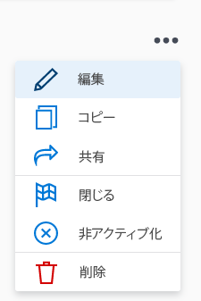

# Adobe Workfront目標で目標を編集

既存の目標は、任意の期間およびステータスから編集できます。

## アクセス要件

<!--drafted - for P&P releases: 

<table style="table-layout:auto">
 <col>
 </col>
 <col>
 </col>
 <tbody>
  <tr>
   <td role="rowheader">Adobe Workfront plan*</td>
   <td>
   
Current plan: Select or higher

   Or
   
Legacy plan: Pro or higher

   
   </td>
  </tr>
  <tr>
   <td role="rowheader">Adobe Workfront license*</td>
   <td>
   
Current license: Contributor or higher

   Or
   
Legacy license: Request or higher
 
For more information, see <a href="../../administration-and-setup/add-users/access-levels-and-object-permissions/wf-licenses.md" class="MCXref xref">Adobe Workfront licenses overview</a>.
 </td>
  </tr>
  <tr>
   <td role="rowheader">Product</td>
   <td>
   
 Current product requirement: If you have the Select or Prime Adobe Workfront plan, you must also buy an additional Adobe Workfront Goals license.  Workfront Goals are included in the Ultimate Workfront Plan.

   Or
   
Legacy product requirement: You must purchase an additional license for the Adobe Workfront Goals to access functionality described in this article. 
 
For information, see <a href="../../workfront-goals/goal-management/access-needed-for-wf-goals.md" class="MCXref xref">Requirements to use Workfront Goals</a>. 
 </td>
  </tr>
  <tr>
   <td role="rowheader">Access level*</td>
   <td> 
Edit access to Goals
 
<b>NOTE</b>
If you still don't have access, ask your Workfront administrator if they set additional restrictions in your access level. For information on how a Workfront administrator can change your access level, see:

     <ul>
      <li> 
<a href="../../administration-and-setup/add-users/configure-and-grant-access/create-modify-access-levels.md" class="MCXref xref">Create or modify custom access levels</a> 
 </li>
      <li> 
<a href="../../administration-and-setup/add-users/configure-and-grant-access/grant-access-goals.md" class="MCXref xref">Grant access to Adobe Workfront Goals</a> 
 </li>
     </ul> 
 </td>
  </tr>
  <tr data-mc-conditions="">
   <td role="rowheader">Object permissions</td>
   <td>
    

     
View or higher permissions to the goal to view it

     
Manage permissions to the goal to edit it

     
For information about sharing goals, see <a href="../../workfront-goals/workfront-goals-settings/share-a-goal.md" class="MCXref xref">Share a goal in Workfront Goals</a>. 

    
 </td>
  </tr>
 </tbody>
</table>
-->

以下が必要です。

<table style="table-layout:auto"> 
 <col> 
 <col> 
 <tbody> 
  <tr> 
   <td role="rowheader">Adobe Workfront plan*</td> 
   <td> 
Pro 以上
 </td> 
  </tr> 
  <tr> 
   <td role="rowheader">Adobe Workfront license*</td> 
   <td> 
リクエスト以上
 
詳しくは、 <a href="../../administration-and-setup/add-users/access-levels-and-object-permissions/wf-licenses.md" class="MCXref xref">Adobe Workfrontライセンスの概要</a>.
 </td> 
  </tr> 
  <tr> 
   <td role="rowheader">製品</td> 
   <td> 
この記事で説明する機能にアクセスするには、 Adobe Workfront Goals の追加ライセンスを購入する必要があります。 
 
詳しくは、 <a href="../../workfront-goals/goal-management/access-needed-for-wf-goals.md" class="MCXref xref">Workfront目標の使用要件</a>. 
 </td> 
  </tr> 
  <tr> 
   <td role="rowheader">アクセスレベル設定*</td> 
   <td> 
目標以降へのアクセスを編集
 
<b>メモ</b>

まだアクセス権がない場合は、Workfront管理者に、アクセスレベルに追加の制限を設定しているかどうかを問い合わせてください。 Workfront管理者がアクセスレベルを変更する方法について詳しくは、以下を参照してください。
 
     <ul> 
      <li> 
<a href="../../administration-and-setup/add-users/configure-and-grant-access/create-modify-access-levels.md" class="MCXref xref">カスタムアクセスレベルの作成または変更</a> 
 </li> 
      <li> 
<a href="../../administration-and-setup/add-users/configure-and-grant-access/grant-access-goals.md" class="MCXref xref">Adobe Workfront目標へのアクセス権の付与</a> 
 </li> 
     </ul> 
 </td> 
  </tr> 
  <tr data-mc-conditions=""> 
   <td role="rowheader">オブジェクト権限</td> 
   <td> 
    
 
     
目標に対する権限の管理
 
     
目標の共有について詳しくは、 <a href="../../workfront-goals/workfront-goals-settings/share-a-goal.md" class="MCXref xref">Workfront目標での目標の共有</a>. 
 
    
 </td> 
  </tr> 
 </tbody> 
</table>

*保有するプラン、ライセンスの種類、アクセス権を確認するには、Workfront管理者にお問い合わせください。

## 前提条件

を起動する前に、次の条件を満たす必要があります。

* メインメニューの目標領域を含むレイアウトテンプレート。
* 編集する目標を作成したか、目標に対する管理権限を持っています。

## 目標の編集に関する考慮事項

* ステータスが「クローズ」の目標は編集できません。
* 任意の期間から目標を編集できます。

   過去の目標に関する次の情報を編集できます。

   * 名前
   * 期間
   * ステータス

      >[!TIP]
      >
      >目標が「クローズ」の場合は、再度開くと「進捗状況」の割合が再計算されます。 終了した目標は編集できません。

   * 説明
   * 結果とアクティビティ

## 目標を編集

<!--
Editing goals differs depending on what environment you use.

### Edit goals in the Production environment

1. Go to a goal that you want to edit and click the goal name to open the **Goal Details** panel. 
1. Click the **More icon** , then click **Edit**.

   

1. Update the name of the goal in the **Goal** field. 
1. Select a time period when the goal should be completed.

   Select from the following predefined options:

   * The current year
   * The quarters of the current year
   * The next two years
   * The quarters of the next two years

   Or

   Click **Define custom dates** to select a custom time frame. 

1. (Conditional) Select a start and an end date for your goal, if you clicked **Define custom dates**.

   
   
(NOTE: these fields don't yet have a name) 

   

   >[!CAUTION]
   >
   >You cannot create a goal with custom dates in the past.

1. (Optional) Click **Reset custom dates** to return to the predefined options.

   >[!TIP]
   >
   >We recommend that everyone in your organization selects the same time frames for similar goals or goals that are aligned. This provides better alignment between goals and ensures that everyone's work supports your larger organization-wide strategy.

1. Click the **Owner** field and select a new owner for the goal, if you want to indicate someone else as the owner of the goal. 
1. (Conditional) Start typing the name of a user, team, group, or the name of your organization in the **Owner** field, then select it when it displays in the list. You can have only one owner for a goal. 
1. Update the **Description** of the goal, then click **Save**.

-->

1. 次をクリック： **メインメニュー** アイコン を選択し、「 **目標**.\
   目標のリストが表示されます。
1. 目標をクリックします。\
   目標ページが表示されます。

   

1. 目標の情報を編集するには、次のいずれかの操作を行います。
   * 目標ヘッダーに表示されるフィールドをクリックして、更新します。 ヘッダー内のすべてのフィールドが編集可能とは限りません。
   * 次をクリック： **その他のアイコン**  目標名の右に移動し、 **編集**.
   * クリック **目標の詳細** をクリックし、 **編集アイコン**  右上隅で、「 **すべてを編集**. 「目標の詳細」セクションのフィールドの更新を開始します。

      >[!IMPORTANT]
      >
      >上記の領域に表示されるすべてのフィールドを編集できるわけではありません。 Workfrontは一部のフィールドを計算し、読み取り専用です。

1. （条件付き）前の手順で選択した内容に応じて、目標に関する次の情報を更新します。

   * 目標ヘッダーの次の情報を更新し、 Enter キーを押して変更を保存します。
      * **目標名**:目標の名前をクリックし、新しい名前を入力します。
      * **所有者**:所有者の名前をクリックし、ユーザー、チーム、グループまたは会社の名前を入力し、リストに表示されたら選択します。 1 つの目標に対して所有者を 1 つだけ指定できます。
   * 「目標の編集」ボックスで次の情報を更新し、 **保存**:
      * **目標名**
      * **期間**:クリックして目標の期間を更新\
         または\
         選択 **カスタム日付を有効にする** 目標の日付を指定するには **開始** および **終了日**.

         >[!TIP]
         >
         >選択を解除 **カスタム日付を有効にする** をクリックして、目標の元の期間に戻します。

      * **目標の所有者**
      * **説明**:目標に関する情報を追加または更新します。
   * 「目標の詳細」セクションの情報を更新または確認します。 詳しくは、 [Adobe Workfront目標の「目標の詳細」節の目標を更新します](../goal-management/update-goals-in-goal-details-panel.md).

   <!-- (should you update the title here after changing it at production??? - change it to Update goals in the goal Details section)-->

1. （オプション）「 **進行状況インジケーター** をクリックして、ゴールに結果、アクティビティまたはプロジェクトを追加します。 進行状況インジケーターを追加することで、目標の進行状況を確実に追跡できます。
詳しくは、次の記事を参照してください。
   * [Adobe Workfront目標での目標へのアクティビティの追加](../results-and-activities/add-activities-to-goals.md)
   * [Adobe Workfront目標の目標に結果を追加](../results-and-activities/add-results-to-goals.md).
   * [Adobe Workfront目標の目標へのプロジェクトの追加](../results-and-activities/connect-projects-to-goals-overview.md).

