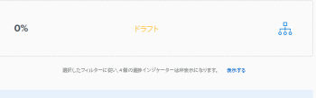
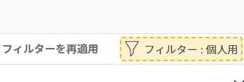

# Adobe Workfront目標での情報のフィルター

自分またはAdobe Workfront目標に追加した他のユーザーの目標を表示できます。 目標の作成について詳しくは、 [Adobe Workfront目標での目標の作成](../../workfront-goals/goal-management/create-goals.md). 目標を表示する際に、Workfront目標の情報をフィルタリングして、重要な目標のみを表示できます。

## アクセス要件

<!--drafted - replace the table below with this one when P&P releases: 

<table style="table-layout:auto">
 <col>
 </col>
 <col>
 </col>
 <tbody>
  <tr>
   <td role="rowheader">Adobe Workfront plan*</td>
   <td>
   
Current plan: Select or higher

   Or
   
Legacy plan: Pro or higher

   
   </td>
  </tr>
  <tr>
   <td role="rowheader">Adobe Workfront license*</td>
   <td>
   
Current license: Contributor or higher

   Or
   
Legacy license: Request or higher
 
For more information, see <a href="../../administration-and-setup/add-users/access-levels-and-object-permissions/wf-licenses.md" class="MCXref xref">Adobe Workfront licenses overview</a>.
 </td>
  </tr>
  <tr>
   <td role="rowheader">Product</td>
   <td>
   
 Current product requirement: If you have the Select or Prime Adobe Workfront plan, you must also buy an additional Adobe Workfront Goals license.  Workfront Goals are included in the Ultimate Workfront Plan.

   Or
   
Legacy product requirement: You must purchase an additional license for the Adobe Workfront Goals to access functionality described in this article. 
 
For information, see <a href="../../workfront-goals/goal-management/access-needed-for-wf-goals.md" class="MCXref xref">Requirements to use Workfront Goals</a>. 
 </td>
  </tr>
  <tr>
   <td role="rowheader">Access level*</td>
   <td> 
Edit access to Goals
 
<b>NOTE</b>
If you still don't have access, ask your Workfront administrator if they set additional restrictions in your access level. For information on how a Workfront administrator can change your access level, see:

     <ul>
      <li> 
<a href="../../administration-and-setup/add-users/configure-and-grant-access/create-modify-access-levels.md" class="MCXref xref">Create or modify custom access levels</a> 
 </li>
      <li> 
<a href="../../administration-and-setup/add-users/configure-and-grant-access/grant-access-goals.md" class="MCXref xref">Grant access to Adobe Workfront Goals</a> 
 </li>
     </ul> 
 </td>
  </tr>
  <tr data-mc-conditions="">
   <td role="rowheader">Object permissions</td>
   <td>
    

     
View or higher permissions to the goal to view it

     
Manage permissions to the goal to edit it

     
For information about sharing goals, see <a href="../../workfront-goals/workfront-goals-settings/share-a-goal.md" class="MCXref xref">Share a goal in Workfront Goals</a>. 

    
 </td>
  </tr>
 </tbody>
</table>
-->

この記事で説明する操作を実行するには、次のアクセス権が必要です。

<table style="table-layout:auto"> 
 <col> 
 <col> 
 <tbody> 
  <tr> 
   <td role="rowheader">Adobe Workfront plan*</td> 
   <td> 
Pro 以上
 </td> 
  </tr> 
  <tr> 
   <td role="rowheader">Adobe Workfront license*</td> 
   <td> 
リクエスト以上
 
詳しくは、 <a href="../../administration-and-setup/add-users/access-levels-and-object-permissions/wf-licenses.md" class="MCXref xref">Adobe Workfrontライセンスの概要</a>.
 </td> 
  </tr> 
  <tr> 
   <td role="rowheader">製品</td> 
   <td> 
この記事で説明する機能にアクセスするには、 Adobe Workfront Goals の追加ライセンスを購入する必要があります。 
 
詳しくは、 <a href="../../workfront-goals/goal-management/access-needed-for-wf-goals.md" class="MCXref xref">Workfront目標の使用要件</a>. 
 </td> 
  </tr> 
  <tr> 
   <td role="rowheader">アクセスレベル*</td> 
   <td> 
目標へのアクセス権を表示またはそれ以上に設定
 
<b>メモ</b>

まだアクセス権がない場合は、Workfront管理者に、アクセスレベルに追加の制限を設定しているかどうかを問い合わせてください。 Workfront管理者がアクセスレベルを変更する方法について詳しくは、以下を参照してください。
 
     <ul> 
      <li> 
<a href="../../administration-and-setup/add-users/configure-and-grant-access/create-modify-access-levels.md" class="MCXref xref">カスタムアクセスレベルの作成または変更</a> 
 </li> 
      <li> 
<a href="../../administration-and-setup/add-users/configure-and-grant-access/grant-access-goals.md" class="MCXref xref">Adobe Workfront目標へのアクセス権の付与</a> 
 </li> 
     </ul> 
 </td> 
  </tr> 
  <tr data-mc-conditions=""> 
   <td role="rowheader">オブジェクト権限</td> 
   <td> 
    
 
     
目標に対する権限の表示以上
 
     
目標の共有について詳しくは、 <a href="../../workfront-goals/workfront-goals-settings/share-a-goal.md" class="MCXref xref">Workfront目標での目標の共有</a>. 
 
    
 </td> 
  </tr> 
 </tbody> 
</table>

*保有するプラン、ライセンスの種類、アクセス権を確認するには、Workfront管理者にお問い合わせください。

## 前提条件

を起動する前に、次の条件を満たす必要があります。

* メインメニューの目標領域を含むレイアウトテンプレート。

## Workfront目標のフィルターの概要

>[!NOTE]
>
>適切な目標を効率的に見つけて焦点を当てるには、「Workfront目標」でフィルターを使用することをお勧めします。 これにより、重要な目標の管理を開始する前に、正しい情報を表示できます。 デフォルトでは、Workfront目標にはシステム内のすべての目標が表示されます。

Workfrontの目標領域の以下の節で、目標の場所を特定し、目標をフィルタリングできます。

* 目標リスト
* グラフ
* 目標の整合性

目標領域について詳しくは、 [「Adobe Workfront目標」セクションの概要](../../workfront-goals/goal-review-and-workfront-goals-sections/overview-of-wf-goals-sections.md).

>[!IMPORTANT]
>
>あるセクションに対してフィルターを設定し、Workfront目標の別のセクションに移動してもフィルターは保持されます。

Workfront目標でフィルターを使用する際は、次の点を考慮してください。

* フィルターは、保存せずに作成して適用することも、保存して後で再利用することもできます。

   次のシナリオが存在します。

   * フィルターを保存すると、Workfront Goals にログインするたびにデフォルトのフィルターになります。
   * 保存せずにフィルターを適用した場合は、ページを更新して元のリストに戻すことができます。

* 作成したフィルターの表示と適用のみ可能です。 他のユーザーが作成したフィルターは、そのユーザーのみに表示されます。
* 作成したフィルターを他のユーザーと共有することはできません。

## Workfront目標でのクイックフィルターの適用

目標のリストでクイックフィルタを使用すると、重要な項目だけを見つけることができます。 クイックフィルターは保存できず、永続的でもありません。 ページを更新すると、Workfrontはクイックフィルターの結果をクリアします。

詳しくは、 [クイックフィルターをリストに適用する](../../workfront-basics/navigate-workfront/use-lists/apply-quick-filter-list.md).

## Workfront目標でのフィルターの作成と適用

フィルターの作成手順は、Workfront目標のどのセクションでも同じです。

一からフィルターを作成したり、組み込みのフィルターの 1 つを編集したりできます。

1. Workfront目標に移動します。

   Workfront Goals へのアクセスについて詳しくは、 [Adobe Workfront目標のアクセスとオープン目標](../../workfront-goals/goal-management/access-goals-in-wf-goals.md)

   デフォルトでは、「目標リスト」セクションが表示されます。

1. クリック **フィルター** をクリックします。

   

   デフォルトでは、Workfrontは **すべて** システム内のすべての目標を表示するフィルター。

   >[!TIP]
   >
   >すべてのフィルターを編集または削除することはできません。

1. 次のいずれかの操作を行います。

   * 次のいずれかの定義済みフィルターをクリックして、次の所有者の目標のみを表示します。

      <table style="table-layout:auto"> 
      <col> 
      <col> 
      <tbody> 
       <tr> 
        <td>すべて</td> 
        <td> 
誰が作成したか、どの期間であるか、または所有者が誰であるかに関係なく、システム内のすべての目標。 これはデフォルトのフィルターで、編集できません。 
 <!--
          
(NOTE: what the ALL filter displays might change; right now, it displays all, regardless of status, period, owner, etc)

         --> </td> 
       </tr> 
       <tr> 
        <td>個人用</td> 
        <td>所有者になる目標。</td> 
       </tr> 
       <tr> 
        <td>マイチーム</td> 
        <td> 
任意のチームを所有者として選択する目標。 
 
<b>ヒント</b>

      どのチームにも割り当てられていない場合は、目標は表示されません。 
 </td>
      </tr> 
       <tr> 
        <td>マイグループ</td> 
        <td>グループのいずれかを所有者として選択する目標。 </td> 
       </tr> 
       <tr> 
        <td>会社</td> 
        <td> 
組織に関連付けられた目標。 
 
<b>ヒント</b>
        
「Adobe Workfront目標」では、「会社」フィルターに、組織が所有者として選択された目標が表示されます。 
 
このフィールドを使用して会社を検索することはできません。 デフォルトでは、Workfrontインスタンスの所有者である組織のみが選択されています。 
 
 </td> 
       </tr> 
      </tbody> 
     </table>

   * フィルターの名前の上にマウスポインターを置いて、 **編集** アイコン  名前の横に表示されるリストから選択して、名前をカスタマイズし、ユーザー、チーム、グループまたは組織の名前の特定の名前を追加します。

   * クリック **新しいフィルター** 新しいフィルターを作成するには、次のオプションから選択して、新しいフィルターをカスタマイズします。

      <table style="table-layout:auto"> 
      <col> 
      <col> 
      <tbody> 
       <tr> 
        <td role="rowheader">期間</td> 
        <td>ドロップダウンメニューで期間を選択します。 複数の期間を選択できます。 </td> 
       </tr> 
       <tr> 
        <td role="rowheader">ステータス</td> 
        <td> 
次のオプションから、ドロップダウンメニューでステータスを選択します。
 
         <ul> 
          <li> 
アクティブ
 </li> 
          <li> 
下書き
 </li> 
          <li> 
非アクティブ
 </li> 
          <li> 
クローズ
 </li> 
         </ul> </td> 
       </tr> 
       <tr> 
        <td role="rowheader">進捗状況</td> 
        <td> 
次のオプションから、ドロップダウンメニューで進行状況を選択します。 
 
         <ul> 
          <li> 
トラブル発生中
 </li> 
          <li> 
リスクあり
 </li> 
          <li> 
目標どおり
 </li> 
         </ul> </td> 
       </tr> 
       <tr> 
        <td role="rowheader">所有者</td> 
        <td> 
所有者の名前を入力し、リストに表示されたら選択します。 
 
ユーザー名、チーム名、グループ名、組織名を入力するか、事前定義済みのオプションから選択できます。 
 
次の定義済みフィルターオプションは、常に、現在ログインしているユーザーを指します。 
 
         <ul> 
          <li> 
<strong>自分</strong>:所有者の目標を表示します。
 </li> 
          <li> 
<strong>ホームチーム</strong> および <strong>すべてのマイチーム</strong>:ホームチームまたはチームのいずれかが所有者に指定された目標を表示します。 
 
ヒント：どのチームにも割り当てられていない場合は、目標は表示されません。 
 </li> 
          <li> 
<strong>マイホームグループ</strong> および <strong>すべてのマイグループ</strong>:自分のホームグループまたは任意のグループが所有者として指定されている目標を表示します。
 </li> 
         </ul> </td> 
       </tr> 
      </tbody> 
     </table>

1. （オプション）「 **リセット** をクリックして、選択したすべてのフィールドを消去し、最初からフィルタの作成を開始します。
1. （オプション）「 **適用** をクリックして、保存せずにフィルターを適用します。

   フィルターが **未保存** フィルタービルダーの領域 **新しいフィルター**.

   未保存のフィルターの名前は変更できません。

   未保存のフィルターは、次回Workfrontからログアウトして再度ログインすると、目標領域から削除されます。

   >[!TIP]
   >
   >一度に 1 つの未保存の新しいフィルターのみを使用できます。

1. クリック **保存** 後で使用するためにフィルターを保存するには、 **フィルター名を追加** フィールドとクリック **完了**.

   これにより、フィルターが **保存済み** 」セクションに表示されます。 このフィルターは将来使用できます。

   最後に保存および適用したフィルターは、次回Workfrontにログインするとデフォルトで表示されます

1. （オプション） **左向き矢印** 次の **新しいフィルター** をクリックして、フィルタービルダーを終了し、フィルターのリストに戻ります。
1. （オプション）カスタムフィルターの名前の上にマウスポインターを置いて、 **詳細** メニュー、次に「 **削除**&#x200B;を、 **削除**. これにより、フィルターが削除され、復元できなくなります。

   >[!TIP]
   >
   >定義済みフィルターは削除できません。

1. 次をクリック： **X アイコン** （フィルタービルダーの右上隅）をクリックして、フィルタービルダーを閉じます。

   現在適用されているフィルターの名前が、フィルターアイコンの右側の目標リストの右上隅に表示されます。

   目標のリストは、フィルター条件でフィルターされます。

1. （オプションおよび条件付き）「目標の整列」セクションで目標を表示して、 **表示** を選択します。

   

   フィルター名の概要は、無視されていることを示すために黄色で表示されます。

   

1. （オプションおよび条件付き）「 **フィルターを再適用** ：前の手順で表示した項目を除外し、フィルタを適用します。

