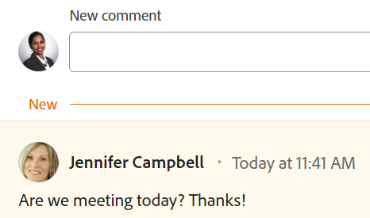

# Adobe Workfront Goals での目標コメントの管理

<!--Audited: 01/2024-->

<!--consider retiring this article when goals and all objects are in parity and we remove the legacy commenting from the system. From then on, there is just ONE way to comment and that will be documented in the Update Work article-->

<!--take "legacy" and "new commenting" references out when we remove the legacy - April 2024???-->

<!--The highlighted information on this page refers to functionality not yet generally available. It is available only in the Preview environment for all customers. 

For information about the current release schedule, see [First Quarter 2024 release overview](../../product-announcements/product-releases/24-q1-release-activity/24-q1-release-overview.md).-->

<!--
After the monthly releases to Production, the same features are also available in the Production environment for customers who enabled fast releases.   
For information about fast releases, see [Enable or disable fast releases for your organization](../../administration-and-setup/set-up-workfront/configure-system-defaults/enable-fast-release-process.md)  
-->

Adobe Workfront Goals で表示できるすべての目標にコメントを追加できます。

## アクセス要件

この記事で説明する操作を実行するには、次のアクセス権が必要です。

<table style="table-layout:auto">
<col>
</col>
<col>
</col>
<tbody>
 <tr> 
   <td role="rowheader">Adobe Workfront プラン*</td> 
   <td> 
   
新しいプランとライセンス構造の場合：
  <ul><li>究極の計画 </li>
  または
  <li>Prime プランまたは Select Adobe Workfront プランのAdobe Workfront Goals の追加ライセンス。 </li></ul> 

現在のプランおよびライセンス構造の場合： 
<ul><li> プロまたはそれ以上 </li>
  <li>Workfront ライセンスに加えて、Adobe Workfront Goals ライセンス。</li></ul>

   </td> 
  </tr>
 <tr>
 <td role="rowheader">Adobe Workfront プラン</td>
 <td>
 
任意</td>
 </tr>
 <tr>
 <td role="rowheader">製品*</td>
 <td>
 
 新規製品の要件：Adobe Workfront の Select または Prime のプランをお持ちの場合は、Adobe Workfront Goals ライセンスも追加で購入する必要があります。Workfront Goals は、Ultimate Workfront プランに含まれています。

 または
 
現在の製品の要件：この記事で説明する機能にアクセスするには、Adobe Workfront Goals の追加ライセンスを購入する必要があります。 
 
詳しくは、<a href="../../workfront-goals/goal-management/access-needed-for-wf-goals.md" class="MCXref xref">Workfront Goals の使用要件</a>を参照してください。 
 </td>
 </tr>
 <tr>
 <td role="rowheader">アクセスレベル設定</td>
 <td> 
Goals に対する表示以上のアクセス権
 </td>
 </tr>
 <tr data-mc-conditions="">
 <td role="rowheader">オブジェクト権限</td>
 <td>
  

  
目標の表示権限またはそれ以上

  
デフォルトでは、ユーザーは目標にアクセスできません。 

 
目標の共有について詳しくは、<a href="../../workfront-goals/workfront-goals-settings/share-a-goal.md" class="MCXref xref">Workfront Goals での目標の共有</a>を参照してください。 

  
 </td>
 </tr>
 <tr>
   <td role="rowheader">
レイアウトテンプレート
</td>
   <td> 
Workfront 管理者を含むすべてのユーザーには、メインメニューに「目標」エリアが含まれるレイアウトテンプレートを割り当てる必要があります。 
  
</td>
  </tr>
</tbody>
</table>

*詳しくは、[Workfront ドキュメントのアクセス要件](/help/quicksilver/administration-and-setup/add-users/access-levels-and-object-permissions/access-level-requirements-in-documentation.md)を参照してください。

## 前提条件

開始するには、まず以下が必要です。

* メインメニューの Workfront Goals 領域を含んだレイアウトテンプレート。

## 目標コメントの管理

目標に対するコメントは、目標のページの「更新」セクションで追加できます。

このエリアに追加したコメントに対して、自分または他のユーザーが返信したり、「いいね！」をしたりできます。

1. 右上隅の&#x200B;**メインメニュー**&#x200B;アイコン 、または可能であれば左上隅の&#x200B;**メインメニュー**&#x200B;アイコン  をクリックし、「**目標**」をクリックします。
これにより、目標リストが開きます。
1. コメントを追加する目標を探し、その名前をクリックして目標ページを開きます。
1. 左側のパネルの「**更新**」をクリックします。
1. （オプション）既存のコメントを見つけるには、「**コメント**」タブの右上隅にある「**検索**」ボックスにキーワード <!--or a user's name--> を入力し始めます。

   

   検索したキーワード <!--or user--> がハイライト表示され、それを含むコメントが「更新」セクションの上部に表示されます。

   <!--change the NOTE below when functionality changes-->

   >[!NOTE]
   >
   >コメントまたは返信に含まれる単語を検索する必要があります。タグ付けされたユーザーやチームは検索できません。

   詳しくは、[作業の更新](../../workfront-basics/updating-work-items-and-viewing-updates/update-work.md)を参照してください。

1. 検索フィールドの **x** アイコンをクリックすると、検索結果がクリアされ、完全な更新に戻ります。
1. 更新エリアの左上隅にある「**コメント**」タブをクリックします。
1. 「**新規コメント**」ボックスにコメントを入力し始めます。

   

   >[!TIP]
   >
   >コメント入力を完了して送信する前に更新セクションから移動すると、ログオフしてログオンし直した後でも、ページ上のコメントがドラフトモードのままになっています。ドラフトは 7 日間保存され、その後は破棄され、復元できません。下書きのコメントは、入力したユーザーのみに表示されます。

1. （オプション）変更の取り消しまたはやり直しを行うには、以下のショートカットキーを使用します。
   * Ctrl + Z（Mac の場合は ⌘+z）で、変更を元に戻します
   * Ctrl + Y（Mac の場合は ⌘+y）で、変更をやり直します
1. （オプション）更新、ハイパーリンク、絵文字にリッチテキスト形式を追加するには、リッチテキストツールバーまたはその横にあるアイコンのオプションを使用します。 詳しくは、[作業の更新](../../workfront-basics/updating-work-items-and-viewing-updates/update-work.md)を参照してください。
1. （オプション）**担当者またはチームのタグ付け**&#x200B;エリアで、このコメントに含めるユーザーまたはチームの名前やメールを入力して、リストに表示されたら選択します。
1. コメントが社内の担当者にのみ表示されるようにするには、「**社外秘**」切り替えスイッチを選択します。

   >[!TIP]
   >
   >このオプションを更新エリアで使用するには、プロファイルで「会社」を指定する必要があります。

1. 「**送信**」をクリックします。

   >[!TIP]
   >
   >あなたが更新している同じ項目に別のユーザーがコメントを送信すると、新しいコメントを知らせる「新規」指標が付いた赤い線が表示され、画面の下部に 新しいコメントの数を示す青い通知が表示されます。
   >
   >指標は、コメントが項目に送信された後にのみ表示され、コメントの構成中には表示されません。
   >

1. （オプション）コメントを編集するには、「いいね！」アイコンの右側にある&#x200B;**その他**&#x200B;メニュー  、「**編集**」の順にクリックします。
1. コメント内の情報を編集するか、タグ付けされたユーザーを削除します。
コメントは送信後 15 分間は編集できます。コメントが更新された際に表示される日付スタンプの左側に、「編集済み」のインジケーターが追加されます。

   

   >[!TIP]
   >
   > * 元の更新を送信した場合にのみ、ユーザーに更新を通知するメールが生成されます。更新を編集した後は、メールは生成されません。
   >
   > * 日付スタンプは、最新の更新日ではなく、元のコメントの日付です。

1. （オプション）**その他**&#x200B;メニューをクリックして、次のオプションのいずれかをクリックして、コメントからクリップボードまたは新規返信に情報をコピーします。

   * **リンクをコピー**：返信を含めずに、更新のリンクをコピーします。
   * **本文をコピー**：更新のテキストをコピーします。
   * **引用返信**：新規コメントボックスを開くと、元のコメントが新規返信で引用され、ブロック引用としてマークされます。

     詳しくは、[作業の更新](../../workfront-basics/updating-work-items-and-viewing-updates/update-work.md)を参照してください。

1. コメントの右側にある&#x200B;**その他**&#x200B;メニュー 、「**削除**」の順にクリックして追加したコメントを削除します。詳しくは、[作業の更新](../../workfront-basics/updating-work-items-and-viewing-updates/update-work.md)を参照してください。
1. （オプション）「**返信**」をクリックして既存のコメントに返信し、上記の手順 5～9 に従います。更新情報の返信について詳しくは、[更新情報に返信する](../../workfront-basics/updating-work-items-and-viewing-updates/reply-to-updates.md)を参照してください。<!--insure this stays accurate-->
1. （条件付きおよびオプション）「更新」セクションの表示エリアの外側に表示されるコメントを他のユーザーが追加した場合は、画面下部の青い「**新しいコメントバナー**」内の「**表示**」をクリックして、これらのコメントを表示します。

   

   追加のコメントが画面の下部に表示されます。
1. （オプション）**次に類似**&#x200B;アイコン  をクリックして、他のユーザー追加したコメントに「いいね！」します。アイコンは「いいね！」の数に応じて更新されます。

1. （オプション）「**システムアクティビティ**」タブをクリックして、システムによって記録された更新を表示します。目標が更新されると、Workfront はその更新に関するメモを生成し、「システムアクティビティ」タブに表示します。Workfront は、結果、アクティビティ、またはプロジェクトが目標に追加されたときや、結果が更新されたときに、システムアップデートも記録します。<!--ensure the casing on the tab has not changed-->

