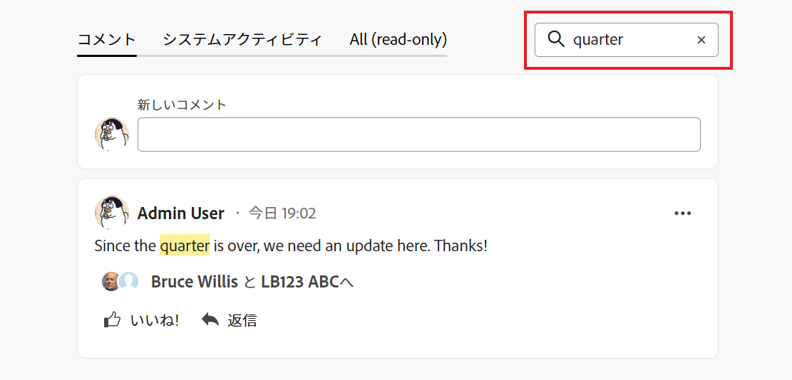

# Adobe Workfront目標で目標コメントを管理

<!--Audited: 01/2024-->

<!--consider retiring this article when goals and all objects are in parity and we remove the legacy commenting from the system. From then on, there is just ONE way to comment and that will be documented in the Update Work article-->

<!--take "legacy" and "new commenting" references out when we remove the legacy - April 2024???-->

<!--The highlighted information on this page refers to functionality not yet generally available. It is available only in the Preview environment for all customers. 

For information about the current release schedule, see [First Quarter 2024 release overview](../../product-announcements/product-releases/24-q1-release-activity/24-q1-release-overview.md).-->

<!--
After the monthly releases to Production, the same features are also available in the Production environment for customers who enabled fast releases.   
For information about fast releases, see [Enable or disable fast releases for your organization](../../administration-and-setup/set-up-workfront/configure-system-defaults/enable-fast-release-process.md)  
-->

Adobe Workfront目標で表示できるすべての目標にコメントを追加できます。

## アクセス要件

この記事で説明する操作を実行するには、次のアクセス権が必要です。

<table style="table-layout:auto">
<col>
</col>
<col>
</col>
<tbody>
 <tr>
 <td role="rowheader">Adobe Workfrontプラン</td>
 <td>
 
任意

</td>
 </tr>
 <tr>
 <td role="rowheader">Adobe Workfront license*</td>
 <td>
 
新しいライセンス：寄稿者以上

 または
 
現在のライセンス：リクエスト以上
 </td>
 </tr>
 <tr>
 <td role="rowheader">製品*</td>
 <td>
 
 新しい製品要件： Adobe Workfront Select または Prime のプランをお持ちの場合は、Adobe Workfront Goals ライセンスも追加で購入する必要があります。 Workfront目標は、Ultimate Workfrontプランに含まれます。

 または
 
現在の製品要件：この記事で説明する機能にアクセスするには、 Adobe Workfront Goals の追加ライセンスを購入する必要があります。 
 
詳しくは、 <a href="../../workfront-goals/goal-management/access-needed-for-wf-goals.md" class="MCXref xref">Workfront目標の使用要件</a>. 
 </td>
 </tr>
 <tr>
 <td role="rowheader">アクセスレベルの設定</td>
 <td> 
目標へのアクセス権を表示またはそれ以上に設定する
 
<b>メモ</b>
アクセス権がない場合は、Workfront管理者に、アクセスレベルに追加の制限を設定しているかどうかを問い合わせてください。 詳しくは、 <a href="../../administration-and-setup/add-users/configure-and-grant-access/grant-access-goals.md" class="MCXref xref">Adobe Workfront目標へのアクセス権の付与</a></td>
 </tr>
 <tr data-mc-conditions="">
 <td role="rowheader">オブジェクトの権限</td>
 <td>
  

  
目標に対する権限を表示またはそれ以上設定します

  
デフォルトでは、ユーザーは目標にアクセスできません 

 
目標の共有について詳しくは、 <a href="../../workfront-goals/workfront-goals-settings/share-a-goal.md" class="MCXref xref">Workfront目標での目標の共有</a>. 

  
 </td>
 </tr>
</tbody>
</table>

*保有するプラン、ライセンスの種類、アクセス権を確認するには、Workfront管理者にお問い合わせください。 詳しくは、 [Workfrontドキュメントのアクセス要件](/help/quicksilver/administration-and-setup/add-users/access-levels-and-object-permissions/access-level-requirements-in-documentation.md).

## 前提条件

を起動する前に、次の条件を満たす必要があります。

* メインメニューの目標領域を含むレイアウトテンプレート。

## 目標のコメントを管理

目標に対するコメントは、目標のページの「更新」セクションで追加できます。

この領域に追加したコメントに対して、自分または他のユーザーが返信したり、「いいね！」をしたりできます。

1. 次をクリック： **メインメニュー** アイコン  を右上に配置するか、 **メインメニュー** アイコン  左上隅にある場合は、「 **目標**.
これにより、目標リストが開きます。
1. コメントを追加する目標を探し、その名前をクリックして目標ページを開きます。
1. クリック  **更新** をクリックします。
1. （オプション）既存のコメントを検索するには、キーワードの入力を開始します <!--or a user's name--> （内） **検索** ボックス **コメント** タブをクリックします。

   

   キーワード <!--or user--> 検索した項目がハイライト表示され、それを含むコメントが「更新」セクションの上部に表示されます。

   <!--change the NOTE below when functionality changes-->

   >[!NOTE]
   >
   >   コメントまたは返信に含まれる単語を検索する必要があります。 タグ付きユーザーまたはチームは検索できません。

   詳しくは、 [作業を更新](../../workfront-basics/updating-work-items-and-viewing-updates/update-work.md)

1. 次をクリック： **x** アイコンを使用して検索結果を消去し、完了時に戻ることができます。
1. 次をクリック： **コメント** タブをクリックします。
1. でコメントの入力を開始 **新しいコメント** ボックス。

   

   >[!TIP]
   >
   >コメントを入力して送信する前に「更新」セクションから移動すると、ログオフしてログオンし直した後でも、ページ上のコメントがドラフトモードのままになります。 コメントに追加された画像も下書きに保存されます。 ドラフトは 7 日間保存され、その後は破棄され、復元できません。 下書きのコメントは、ユーザーが入力した場合にのみ表示されます。

1. （オプション）変更の取り消しまたはやり直しをおこなうには、次のショートカットキーを使用します。
   * Ctrl + Z( Macの場合は⌘+z)：変更を元に戻します。
   * Ctrl + Y( Macの場合は⌘+y)：変更をやり直します。
1. （オプション）更新、ハイパーリンク、画像にリッチテキスト書式を追加するには、リッチテキストツールバーまたはその横にあるアイコンの任意のオプションを使用します。 詳しくは、 [作業を更新](../../workfront-basics/updating-work-items-and-viewing-updates/update-work.md).
1. （オプション） **担当者またはチームのタグ付け** 領域に入力し、このコメントに含めるユーザーまたはチームの名前やメールを入力して、リストに表示されたら選択します。
1. を選択します。 **私の会社に対してプライベート** コメントを社内の担当者にのみ表示するように切り替えます。

   >[!TIP]
   >
   >このオプションを「更新」領域で使用するには、プロファイルで指定された会社が必要です。

1. クリック **送信**.

   >[!TIP]
   >
   >別のユーザーが、更新しようとしている同じ項目にコメントを送信すると、新しいコメントを示す赤い線と、新しいコメントの数を示す青い通知が画面の下部に表示されます。
   >
   >インジケーターは、コメントがアイテムに送信された後にのみ表示され、コメントがまだ構成されている場合は表示されません。
   >

1. （オプション）コメントを編集するには、 **その他** メニュー  「いいね！」アイコンの右側にあるをクリックし、 **編集**.
1. コメント内の情報の編集、画像の追加や削除、タグ付きユーザーの削除を行います。
コメントは送信後 15 分以内に編集できます。 コメントが更新された際に表示される日付スタンプの左側に、「編集済み」のインジケーターが追加されます。

   

   >[!TIP]
   >
   > * 元の更新を送信した場合にのみ、ユーザーに更新を通知する電子メールが生成されます。 更新を編集した後は、電子メールは生成されません。
   >
   > * 日付スタンプは、最新の更新日ではなく、元のコメントの日付です。

1. （オプション） **その他** メニュー 次に、次のいずれかのオプションをクリックして、コメントからクリップボードに情報をコピーするか、新しい返信に情報をコピーします。

   * **リンクをコピー** ：返信を含めずに、更新のリンクをコピーします。
   * **本文をコピー** をクリックして、更新のテキストをコピーします。
   * **見積もりの返信** ：新しいコメントボックスを開き、元のコメントが新しい返信で引用され、ブロック引用符としてマークされます。

     詳しくは、 [作業を更新](../../workfront-basics/updating-work-items-and-viewing-updates/update-work.md).

1. （オプション） **その他** メニュー  コメントの右側に移動し、「 **削除** 追加したコメントを削除します。 詳しくは、 [作業を更新](../../workfront-basics/updating-work-items-and-viewing-updates/update-work.md).
1. （オプション）「 **返信** 既存のコメントに返信するには、上記の手順 5～9 に従います。 更新情報の返信について詳しくは、 [更新情報に返信](../../workfront-basics/updating-work-items-and-viewing-updates/reply-to-updates.md). <!--insure this stays accurate-->
1. （条件付きおよびオプション）「更新」セクションの表示領域の外側に表示されるコメントを他のユーザーが追加した場合は、 **表示** 青の中に **新しいコメントバナー** をクリックして、これらのコメントを表示します。

   

   追加のコメントが画面の下部に表示されます。
1. （オプション） **次に類似** アイコン 他の誰かが追加したコメントが気に入った。 アイコンは「いいね！」の数に応じて更新されます。

1. （オプション） **システムアクティビティ** タブをクリックして、システムによって記録された更新を表示します。 目標が更新されると、Workfrontはその更新に関するメモを生成し、「システムアクティビティ」タブに表示します。 Workfrontは、結果、アクティビティ、またはプロジェクトが目標に追加されたときや、結果が更新されたときに、システムの更新も記録します。 <!--ensure the casing on the tab has not changed-->

