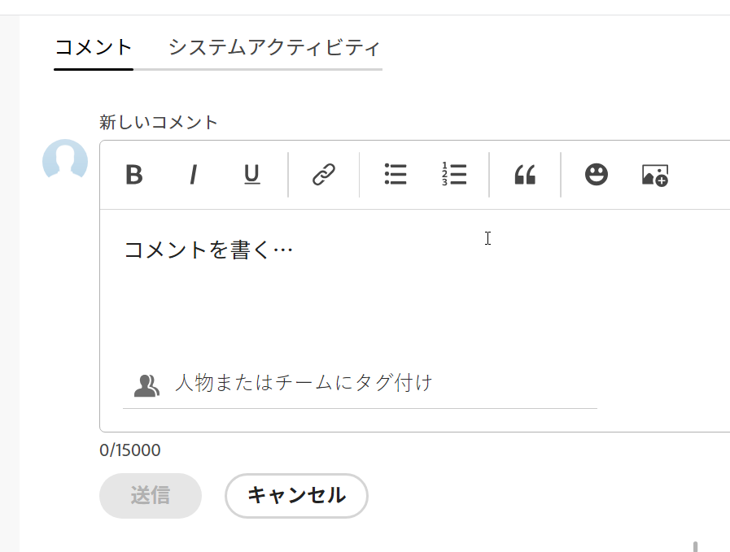
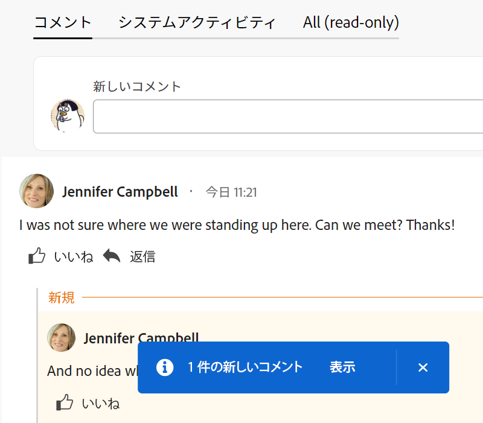
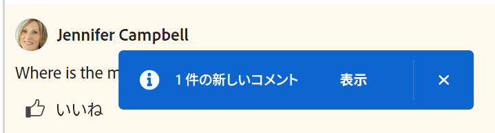

# Adobe Workfront目標で目標コメントを管理

<!--consider retiring this article when goals and all objects are in parity - after the new commenting experience goes to production GA-->

<!--The highlighted information on this page refers to functionality not yet generally available. It is available only in the Preview environment.-->

Adobe Workfront目標で表示できるすべての目標にコメントを追加できます。

<!--drafted for P&P:

<table style="table-layout:auto">
 <col>
 </col>
 <col>
 </col>
 <tbody>
  <tr>
   <td role="rowheader">Adobe Workfront plan*</td>
   <td>
   
Current plan: Select or higher

   Or
   
Legacy plan: Pro or higher

   
   </td>
  </tr>
  <tr>
   <td role="rowheader">Adobe Workfront license*</td>
   <td>
   
Current license: Contributor or higher

   Or
   
Legacy license: Request or higher
 
For more information, see <a href="../../administration-and-setup/add-users/access-levels-and-object-permissions/wf-licenses.md" class="MCXref xref">Adobe Workfront licenses overview</a>.
 </td>
  </tr>
  <tr>
   <td role="rowheader">Product</td>
   <td>
   
 Current product requirement: If you have the Select or Prime Adobe Workfront plan, you must also buy an additional Adobe Workfront Goals license.  Workfront Goals are included in the Ultimate Workfront Plan.

   Or
   
Legacy product requirement: You must purchase an additional license for the Adobe Workfront Goals to access functionality described in this article. 
 
For information, see <a href="../../workfront-goals/goal-management/access-needed-for-wf-goals.md" class="MCXref xref">Requirements to use Workfront Goals</a>. 
 </td>
  </tr>
  <tr>
   <td role="rowheader">Access level*</td>
   <td> 
Edit access to Goals
 
<b>NOTE</b>
If you still don't have access, ask your Workfront administrator if they set additional restrictions in your access level. For information on how a Workfront administrator can change your access level, see:

     <ul>
      <li> 
<a href="../../administration-and-setup/add-users/configure-and-grant-access/create-modify-access-levels.md" class="MCXref xref">Create or modify custom access levels</a> 
 </li>
      <li> 
<a href="../../administration-and-setup/add-users/configure-and-grant-access/grant-access-goals.md" class="MCXref xref">Grant access to Adobe Workfront Goals</a> 
 </li>
     </ul> 
 </td>
  </tr>
  <tr data-mc-conditions="">
   <td role="rowheader">Object permissions</td>
   <td>
    

     
View or higher permissions to the goal to view it

     
Manage permissions to the goal to edit it

     
For information about sharing goals, see <a href="../../workfront-goals/workfront-goals-settings/share-a-goal.md" class="MCXref xref">Share a goal in Workfront Goals</a>. 

    
 </td>
  </tr>
 </tbody>
</table>
-->

## アクセス要件

この記事で説明する操作を実行するには、次のアクセス権が必要です。

<table style="table-layout:auto"> 
 <col> 
 <col> 
 <tbody> 
  <tr> 
   <td role="rowheader">Adobe Workfront plan*</td> 
   <td> 
Pro 以上
 </td> 
  </tr> 
  <tr> 
   <td role="rowheader">Adobe Workfront license*</td> 
   <td> 
リクエスト以上
 
詳しくは、 <a href="../../administration-and-setup/add-users/access-levels-and-object-permissions/wf-licenses.md" class="MCXref xref">Adobe Workfrontライセンスの概要</a>.
 </td> 
  </tr> 
  <tr> 
   <td role="rowheader">製品</td> 
   <td> 
この記事で説明する機能にアクセスするには、 Adobe Workfront Goals の追加ライセンスを購入する必要があります。 
 
詳しくは、 <a href="../../workfront-goals/goal-management/access-needed-for-wf-goals.md" class="MCXref xref">Workfront目標の使用要件</a>. 
 </td> 
  </tr> 
  <tr> 
   <td role="rowheader">アクセスレベル*</td> 
   <td> 
目標へのアクセス権を表示またはそれ以上に設定
 
<b>メモ</b>
まだアクセス権がない場合は、Workfront管理者に、アクセスレベルに追加の制限を設定しているかどうかを問い合わせてください。 Workfront管理者がアクセスレベルを変更する方法について詳しくは、以下を参照してください。
 
     <ul> 
      <li> 
<a href="../../administration-and-setup/add-users/configure-and-grant-access/create-modify-access-levels.md" class="MCXref xref">カスタムアクセスレベルの作成または変更</a> 
 </li> 
      <li> 
<a href="../../administration-and-setup/add-users/configure-and-grant-access/grant-access-goals.md" class="MCXref xref">Adobe Workfront目標へのアクセス権の付与</a> 
 </li> 
     </ul> 
 </td> 
  </tr> 
  <tr data-mc-conditions=""> 
   <td role="rowheader">オブジェクト権限</td> 
   <td> 
    
 
     
目標に対する権限の表示以上
 
     
目標の共有について詳しくは、 <a href="../../workfront-goals/workfront-goals-settings/share-a-goal.md" class="MCXref xref">Workfront目標での目標の共有</a>. 
 
    
 </td> 
  </tr> 
 </tbody> 
</table>

*保有するプラン、ライセンスの種類、アクセス権を確認するには、Workfront管理者にお問い合わせください。

## 前提条件

を起動する前に、次の条件を満たす必要があります。

* メインメニューの目標領域を含むレイアウトテンプレート。

## 更新セクションを見つけます。

目標に対するコメントは、目標のページの「更新」セクションで追加できます。

この領域に追加したコメントに対して、自分または他のユーザーが返信したり、「いいね！」をしたりできます。

1. 次をクリック： **メインメニュー** アイコン  > **目標** をクリックします。
目標リストが開きます。
1. コメントを追加する目標を探し、その名前をクリックして目標ページを開きます。
1. クリック  **更新** をクリックします。
1. 次をクリック： **コメント** タブをクリックします。
1. でコメントの入力を開始 **新しいコメント** ボックス

   

   >[!TIP]
   >
   >コメントを入力して送信する前に「更新」セクションから移動すると、ログオフしてログオンし直した後でも、ページ上のコメントがドラフトモードのままになります。 コメントに追加された画像も下書きに保存されます。 ドラフトは 7 日間保存され、その後は破棄され、復元できません。 下書きのコメントは、ユーザーが入力した場合にのみ表示されます。

1. （オプション）更新、ハイパーリンク、画像にリッチテキスト書式を追加するには、リッチテキストツールバーまたはその横のアイコンの任意のオプションを使用します。 詳しくは、 [作業を更新](../../workfront-basics/updating-work-items-and-viewing-updates/update-work.md).
1. （オプション） **担当者またはチームのタグ付け** 領域に入力し、このコメントに含めるユーザーまたはチームの名前やメールを入力して、リストに表示されたら選択します。
1. を選択します。 **私の会社に対してプライベート** コメントを社内の担当者にのみ表示するように切り替えます。

   >[!TIP]
   >
   >このオプションを「更新」領域で使用するには、プロファイルで指定された会社が必要です。

1. クリック **送信**.

   >[!TIP]
   >
   >別のユーザーが、更新しようとしている同じ項目にコメントを送信すると、赤い線に「新規」インジケータが表示され、新しいコメントが通知されます。
   >
   >インジケーターは、コメントがアイテムに送信された後にのみ表示され、コメントがまだ構成されている場合は表示されません。
   >
   >「新規」インジケーターは、新しい更新を入力したユーザーと、現在更新を入力しているユーザーの両方が新しいコメント付けエクスペリエンスを使用している場合にのみ表示されます。
   >

1. （オプション）コメントを編集するには、 **詳細** メニュー  「いいね！」アイコンの右側にあるをクリックし、 **編集**.
1. コメント内の情報を編集するか、タグ付きユーザーを削除します。
コメントは、送信後 15 件以内に編集できます。 コメントが更新された際に表示される日付スタンプの左側に、「編集済み」のインジケーターが追加されます。

   

   >[!TIP]
   >
   > 元の更新を送信した場合にのみ、ユーザーに更新を通知する電子メールが生成されます。 更新を編集した後は、電子メールは生成されません。

   1. （オプション） **詳細** メニュー 次に、次のいずれかのオプションをクリックして、コメントからクリップボードに情報をコピーします。

      * **リンクをコピー** ：返信なしで更新のリンクをコピーします。
      * **本文をコピー** をクリックして、更新のテキストをコピーします。

         詳しくは、 [作業を更新](../../workfront-basics/updating-work-items-and-viewing-updates/update-work.md).

1. （オプション） **詳細** メニュー  コメントの右側に移動し、「 **削除** 追加したコメントを削除します。 詳しくは、 [作業を更新](../../workfront-basics/updating-work-items-and-viewing-updates/update-work.md).
1. （オプション）「 **返信** 既存のコメントに返信するには、上記の手順 5～9 に従います。 <!--insure this stays accurate-->
1. （条件付きおよびオプション）「更新」セクションの表示領域の外側に表示されるコメントを他のユーザーが追加した場合は、 **表示** 青の中に **新しいコメントバナー** をクリックして、これらのコメントを表示します。

   

   追加のコメントが画面の下部に表示されます。
1. （オプション） **次に類似** アイコン 他の誰かが追加したコメントが気に入った。 アイコンは「いいね！」の数に応じて更新されます。

1. （オプション） **システムアクティビティ** タブをクリックして、システムによって記録された更新を表示します。 目標が更新されると、Workfrontはその更新に関するメモを生成し、「システムアクティビティ」タブに表示します。 Workfrontは、結果、アクティビティ、またはプロジェクトが目標に追加されたときや、結果が更新されたときに、システムの更新も記録します。 <!--ensure the casing on the tab has not changed-->

<!--BELOW IS OLD, ATIIM/ WORKFRONT GOALS INFORMATION ABOUT COMMENTS: 

## Add comments to goals in the Check-in section

The Check-in section has been removed from the Preview environment. You can update goals by accessing the goal page. For information, see 
[Update goals in the Goal details section in Adobe Workfront Goals](../goal-management/update-goals-in-goal-details-panel.md). 

>[!TIP]
>
>You must have access to Edit Goals in your access level to view the Check-in section.

You can add comments to goals in the Check-in section of Workfront Goals, as part of updating your list of goals. For information about updating goals, see [Update goal progress in Adobe Workfront Goals](../../workfront-goals/goal-review-and-workfront-goals-sections/check-in-goals.md).

You can also like goal comments that other users have added to mark your approval of them in the Check-in section.

1. Click the **Main Menu** icon  > **Goals** in the upper-right corner.

   ( Add this when Shell is available to all: or (if available), click the **Main Menu** icon  in the upper-left corner))

   This opens the Workfront Goals area. 

1. Click the **Check-in** section in the left panel.

   

   Goals assigned to you or that have results and activities that are assigned to you display in this area. 

1. (Optional) Click the right-pointing arrow to the left of the goal name to expand the goal, if the goal is not already expanded. 
1. Type your comment in the **Add a comment to this goal (optional)** field, then click **Post**.

   Two most recent comments display by default under each goal.

1. Click **Show all comments** to display all comments on a goal. A number of total comments for the goal also displays. Comments display in the order they were entered, with the most recent first. 
1. (Optional) Click the **Like icon**  to like a comment. The icon updates with the number of likes. 

1. (Optional) Click the number of likes next to a comment and a list with the names of the users who liked the comment displays in the right panel.

   

1. (Conditional) Click **Back to Updates** to return to the Updates tab of the Goal Details panel, or click the **X icon** in the upper-right corner to close the right panel.

## Add comments to goals in the Pulse section

The Pulse section has been removed from the Preview environment. You can update goals by accessing the goal page. For information, see 
[Update goals in the Goal details section in Adobe Workfront Goals](../goal-management/update-goals-in-goal-details-panel.md). 

You can add comments to goals in the Pulse section of Workfront Goals, as part of reviewing goals that might affect yours. For information about reviewing goals in the Pulse section, see [Review goals in the Adobe Workfront Goals Pulse section](../../workfront-goals/goal-review-and-workfront-goals-sections/review-goals-in-pulse.md).

You can also like goal comments that other users have added to mark your approval of them in the Pulse section.

1. Click the **Main Menu** icon  > **Goals** in the upper-right corner.

   (Add this when Shell is available to all: or (if available), click the **Main Menu** icon  in the upper-left corner))

   This opens the Workfront Goals area. 

1. Click the Pulse section in the left panel.

   

   All current goals display in this section, regardless of their status.

1. Click **Add a comment**, then type your comment in the **Add a comment to this goal (optional)** field.
1. Click **Post**.

   Three comments display by default under each goal.

1. Click **Show all updates** to display all comments on a goal. A number of total comments for the goal also displays. Comments display in the order they were entered, with the most recent first. 
1. (Optional) Click the **Like icon**  to like a comment. The icon updates with the number of likes. 

1. (Optional) Click the number of likes next to a comment and a list with the names of the users who liked the comment displays in the right panel.

   

1. (Conditional) Click **Back to Updates** to return to the Updates tab of the Goal Details panel, or click the **X icon** in the upper-right corner to close the right panel.

-->

<!--
Locating goal comments differs depending on what environment you use. 

### Locate goal comments in the Production environment

You can add comments to goals in the following areas of Workfront Goals:

* The Goal Details panel
* The Check-in section 
* The Pulse section

Although the process for adding comments to goals is similar in these areas, there are differences in being able to edit, delete, or react to a comment when using one area versus another. When you enter a comment in any of these areas, the comment is visible in all areas where goal comments display.

>[!NOTE]
>
>You cannot add comments to results and activities.

-->

<!--
## Add comments to goals in the Goal Details panel

Adding comments to goals differs depending on what environment you use.

### Add comments to goals in the Production environment

You can add comments to goals in the Goal Details panel, as part of updating an individual goal.

You can edit or delete a comment that you entered in this area, or you can like comments.

1. Click the **Main Menu** icon  > **Goals** in the upper-right corner.

   (Add this when Shell is available to all: or (if available), click the **Main Menu** icon  in the upper-left corner))
   

   This opens the Workfront Goals area. 

1. Locate the goal you want to add comments to, then click its name to open the Goal Details panel to the right. 
1. Click the **Updates** tab.
1. Type your comment in the **Comment here** field, then click **Post**. 
1. (Optional and conditional) Select the **Comments** option at the top of the list to view your comment at the top of the list. It is enabled by default and comments display here with the most recent comment first. 
1. (Optional) Click **Edit** to edit your comment, then click **Save** to save your changes, or **Cancel** to revert to the original update.

   >[!TIP]
   >
   >* You can only edit comments you entered. 
   >* There is no time limit for how long after you enter a comment you are allowed to edit it.

1. (Optional) Click **Delete** to delete your comment, then click **Yes, Delete** to confirm.

   >[!TIP]
   >
   >* You can only delete comments you entered. 
   >* There is no time limit for how long after you enter a comment you are allowed to delete it.

1. (Optional) Click the **Like icon**  to like a comment that someone else added. The icon updates with the number of likes. 

1. (Optional) Click the number of likes next to a comment and a list with the names of the users who liked the comment displays in the right panel.

   <!--
   
(NOTE: this functionality might change)

   

   

1. (Conditional) Click **Back to Updates** to return to the Updates tab of the Goal Details panel, or click the **X icon** in the upper-right corner to close the right panel.

-->