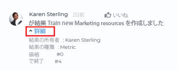

# Adobe Workfront Goals の目標の詳細セクションで、目標を更新

<!--Audited for P&P only: 10/2025-->

目標の詳細パネルにアクセスして、個別の目標の情報を更新できます。

>[!NOTE]
>
>ステータスがクローズ済みの目標は更新できません。

## アクセス要件

>[!NOTE]
>
>過去にこのパッケージを購入したことがある会社は、Adobe Workfront Goals を引き続き使用する場合があります。 詳細については、アカウント担当者にお問い合わせください。
>
>Adobe Workfront Goals は購入できなくなりました。

+++ 展開すると、この記事の機能のアクセス要件が表示されます。 

<table style="table-layout:auto">
<col>
</col>
<col>
</col>
<tbody>
 <tr>
  <td> 
Adobe Workfront パッケージ
 </td> 
   <td> 
   
Adobe WorkfrontUltimate

   </td> 
  </tr>
 <tr>
 <td role="rowheader">Adobe Workfront プラン</td>
 <td>
 
投稿者以上

リクエスト以上
</td>
 </tr>
  <tr>
 <td role="rowheader">アクセスレベル設定</td>
 <td> 
Goals への編集アクセス権
 </td>
 </tr>
 <tr data-mc-conditions="">
 <td role="rowheader">オブジェクト権限</td>
 <td>
  

  
目標の表示には表示権限以上が必要

  
目標に対する編集権限を管理

  
 </td>
 </tr>
<tr>
   <td role="rowheader">
レイアウトテンプレート
</td>
   <td> 
システム管理者を含むすべてのユーザーには、メインメニューの目標エリアを含むレイアウトテンプレートを割り当てる必要があります。 
  
</td>
  </tr>
</tbody>
</table>

詳しくは、[Workfront ドキュメントのアクセス要件](/help/quicksilver/administration-and-setup/add-users/access-levels-and-object-permissions/access-level-requirements-in-documentation.md)を参照してください。

+++

<!--Old:
<table style="table-layout:auto">
<col>
</col>
<col>
</col>
<tbody>
 <tr> 
   <td role="rowheader">Adobe Workfront plan*</td> 
   <td> 
   
For the new plan and license structure:
  <ul><li>An Ultimate plan </li></ul>
   

For the current plan and license structure: 
<ul><li> A Pro or higher </li>
  <li>An Adobe Workfront Goals license in addition to a Workfront license.</li></ul>

   </td> 
  </tr>
 <tr>
 <td role="rowheader">Adobe Workfront license*</td>
 <td>
 
New license: Contributor or higher

 Or
 
Current license: Request or higher
 
For more information, see <a href="../../administration-and-setup/add-users/access-levels-and-object-permissions/wf-licenses.md" class="MCXref xref">Adobe Workfront licenses overview</a>.
 </td>
 </tr>
 <tr>
 <td role="rowheader">Product*</td>
 <td>
  
 New product requirement: Workfront

  Or
  
Current product requirement: In addition to a Workfront license, you must purchase a license for Adobe Workfront Goals. 
 
For information, see <a href="../../workfront-goals/goal-management/access-needed-for-wf-goals.md" class="MCXref xref">Requirements to use Workfront Goals</a>. 
 </td>
 </tr>
 <tr>
 <td role="rowheader">Access level*</td>
 <td> 
Edit access to Goals
 </td>
 </tr>
 <tr data-mc-conditions="">
 <td role="rowheader">Object permissions</td>
 <td>
  

  
View or higher permissions to the goal to view it

  
Manage permissions to the goal to edit it

  
For information about sharing goals, see <a href="../../workfront-goals/workfront-goals-settings/share-a-goal.md" class="MCXref xref">Share a goal in Workfront Goals</a>. 

  
 </td>
 </tr>
 <tr>
   <td role="rowheader">
Layout template
</td>
   <td> 
All users, including Workfront administrators,  must be assigned a layout template that includes the Goals area in the Main Menu. 
  
</td>
  </tr>
</tbody>
</table>-->

## 目標の詳細セクションで、目標を更新

目標のリストから、個別の目標にアクセスできます。

<!--

Updating goals in the Goal Details panel differs depending on where you access the goal from. 

### Update goals in the Goal Details panel in the Production environment

1. Click the **Main Menu** icon  > **Goals** in the upper-right corner.

   (!-- Add this when Shell is available to all: or (if available), click the **Main Menu** icon  in the upper-left corner)
   --)

   This opens the Goals area in Workfront. 

1. Click the name of a goal in the Goal List, then click the name of a goal.

   This opens the Goal Details panel on the right.
   

   >[!TIP]
   >
   >You can also click the name of a goal in the Goal Alignment, Check-in, or Pulse sections. 
   >
   ><!-- drafted for goal redesign:
   >Add this to the TIP above with goal redesign: 
   >
   >The Check-in and Pulse sections have been removed from the Preview environment.
   >

1. On the Summary tab, click the **More icon** , then click any of the following options:

   1. **Edit**. For information about editing goals, see [Edit goals in Adobe Workfront Goals](../../workfront-goals/goal-management/edit-goals.md).
   1. **Copy**. For information about copying goals, see [Copy goals in Adobe Workfront Goals](../../workfront-goals/goal-management/copy-goals.md).
   1. **Activate**. This option is available only for drafted and inactive goals.

      For information about activating goals, see [Access and open goals in Adobe Workfront Goals](../../workfront-goals/goal-management/access-goals-in-wf-goals.md). 
   
   1. **Close**, then click**Close Goal**. This option is available only for active goals.

      For information about closing goals, see [Close and reopen goals in Adobe Workfront Goals](../../workfront-goals/goal-management/close-and-reopen-goals.md). 
   
   1. **Deactivate**. This option is available only for active goals. This deactivates the goal immediately.

      For information about deactivating goals, see [Delete and deactivate goals in Adobe Workfront Goals](../../workfront-goals/goal-management/delete-and-deactivate-goals.md).
   
   1. **Delete**, then click **Yes, Delete**.

      For information about deleting goals, see [Delete and deactivate goals in Adobe Workfront Goals](../../workfront-goals/goal-management/delete-and-deactivate-goals.md).

      >[!NOTE]
      >
      >Deleted goals cannot be recovered.

   1. **Reopen**, then click **Reopen**. This option is available only for closed goals that are from a current time period.

      For information about reopening goals, see [Close and reopen goals in Adobe Workfront Goals](../../workfront-goals/goal-management/close-and-reopen-goals.md). 
   
   1. (Conditional) If you clicked any of the options between steps a-i above except Delete or Reopen, click **Save**.    
   
      (!--ensure this is accurate)--)

1. Click **Align to another goal** in the upper-right of the Summary tab, then specify the name of a goal in the **Align to** **another goal** field that you want to align the current goal to. The current goal becomes the child of the goal you align it to. For information about child and parent goals, see [Align goals by connecting them in Adobe Workfront Goals](../../workfront-goals/goal-alignment/align-goals-by-connecting-them.md). 
1. Click **Add results**. Results drive the progress of your goal. For information about adding results, see [Add results to goals in Adobe Workfront Goals](../../workfront-goals/results-and-activities/add-results-to-goals.md).

1. Click **Add activities**. Activities drive the progress of your goal. For information about adding activities, see [Add activities to goals in Adobe Workfront Goals](../../workfront-goals/results-and-activities/add-activities-to-goals.md). 

1. Click the **Updates** tab. Here, you can view goal comments and review the entire editing history of the goal, activities, and results, to understand who changed what and when.

   

1. (Optional) Deselect any of the following options if you want to not display them in the Updates tab. They are selected by default: 

   | Option |Description  |
   |---|---|
   | Progress Updates |Displays information about the history of progress updates on results and activities.  |
   | Comments |Displays comments made by users on the goal.  |
   | Editing History |Displays information about creating and updating the goal, results, and activities.  |

1. (Optional) Click **Details** under a progress or an editing history update to display additional information about the update.

   

-->

1. 目標リストで目標の名前をクリックし、目標の名前をクリックします。

   これにより、左側に&#x200B;**目標の詳細**&#x200B;セクションが開きます。

   

1. 右上隅の **編集アイコン** をクリックし、「**すべて編集**」または「**概要** をクリックします

   または

   目標の詳細セクションの編集可能なフィールドのうちの 1 つに情報を入力します。セクションが編集可能になります。

   >[!IMPORTANT]
   >
   >目標の詳細セクションに表示されるすべてのフィールドが、編集可能なわけではありません。Workfront は一部のフィールドを計算しますが、このようなフィールドは読み取り専用です。

1. 以下のフィールドを更新または確認します。

   * **説明**：目標に関する情報を追加または更新します。
   * **進行状況**：これまでに完了した目標の割合を示します。目標の進行状況を手動で更新することはできません。目標の進行状況は、すべての進捗状況インジケーターの計算です。
   * **状況**：目標が新規で、まだ更新されていないか、ターゲットが予定通りに完了しそうか、それとも遅れているかを示します。目標の状況は更新できません。目標の状況は、Workfront によって自動的に計算されます。\
     目標の条件と進行状況に関して詳しくは、
     [Adobe Workfront Goals の目標の進捗と状況の概要](../goal-management/calculate-goal-progress.md)を参照してください。
   * **ステータス**：目標のステータスを手動で更新することはできません。詳しくは、[Adobe Workfront Goals の目標ステータスの概要](../goal-management/goal-status-overview.md)を参照してください。
   * **目標所有者**：をクリックして、目標の所有者の名前を更新します。ユーザー、チーム、グループまたは組織の名前を入力し、リストに表示されたら選択します。1 つの目標に対して所有者を 1 名だけ指定できます。
   * **親目標**：選択した目標の親として設定する目標の名前を入力します。選択した目標の進行状況は、親目標の進行状況を自動的に更新します。

     >[!TIP]
     >
     >親目標に関する以下の情報は更新できません。
     >    * 親目標の期間
     >    * 親目標の進捗状況
     >    * 親目標の所有者.
     >      
     >親目標自体に関するこの情報を、自分で更新する必要があります。

   * **期間**：クリックして目標の期間を更新\
     または\
     「**カスタム日付を使用**」を選択して、目標の&#x200B;**開始**&#x200B;および&#x200B;**終了日**&#x200B;の日付を指定します。
   * **クローズメモ**：このフィールドは、ステータスがクローズの目標に対してのみ表示されます。クローズした目標は編集できません。クローズした目標を再度開くと、クローズメモが完全に削除されます。

